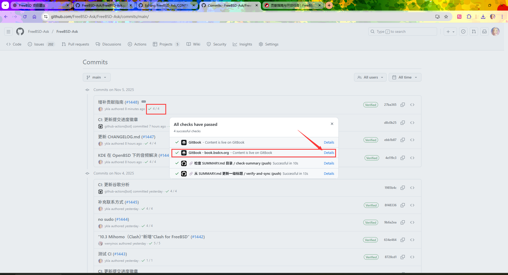
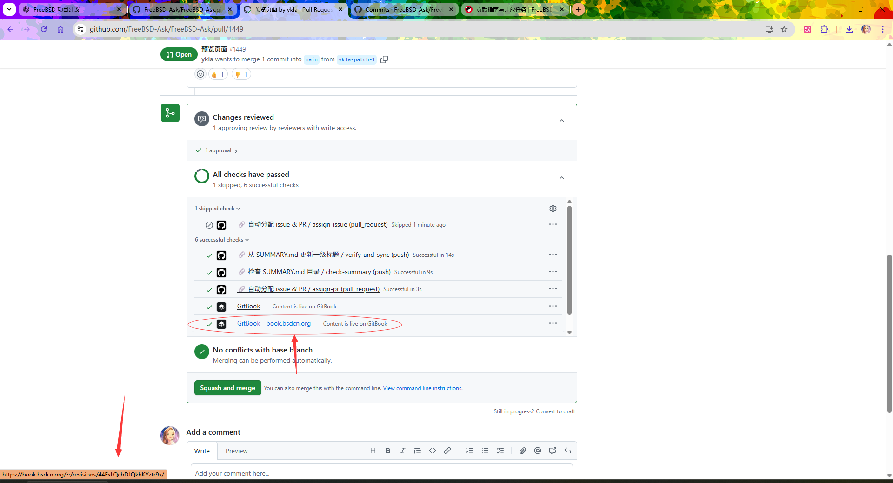

# Contributing Guide and Open Tasks

## Why Not Contribute to the FreeBSD Handbook Instead

The FreeBSD project has long left substantive PRs (other than quarterly reports) in limbo. Judging from commit data, the activity level of the freebsd-doc project has been steadily declining over the past decade or more:

Using statistical analysis of git projects[EB/OL]. [2026-03-26]. <https://gist.github.com/ykla/6c3df44c371d37fc3196ddf5fa87ce5f>. For the results of analyzing freebsd-doc, see: freebsd-doc-2025 analysis report[EB/OL]. [2026-03-26]. <https://gist.github.com/ykla/363bf922d0785d0b02dd43f8289368db>.

- 2005–2006: First significant decline
- 2015–2016: Second major decline

The project structure is complex and disorganized. For example, during the translation process, it is difficult to determine the reusability of certain data references, even for maintainers.

Additionally, its security report filenames contain English colons `:`, which are illegal characters on Windows systems, making it impossible to properly check out the entire project in a Windows environment:

```powershell
PS C:\Users\ykla> git clone https://github.com/freebsd/freebsd-doc
Cloning into 'freebsd-doc'...
remote: Enumerating objects: 617155, done.
remote: Counting objects: 100% (294/294), done.
remote: Compressing objects: 100% (120/120), done.
remote: Total 617155 (delta 217), reused 219 (delta 174), pack-reused 616861 (from 4)
Receiving objects: 100% (617155/617155), 483.71 MiB | 786.00 KiB/s, done.
Resolving deltas: 100% (358420/358420), done.
error: invalid path 'website/static/security/advisories/FreeBSD-EN-04:01.twe.asc' # Note FreeBSD-EN-04:01.twe.asc, this filename is illegal on Windows
fatal: unable to checkout working tree
warning: Clone succeeded, but checkout failed.
You can inspect what was checked out with 'git status'
and retry with 'git restore --source=HEAD :/'
```

## Contributing Guide Overview

If you would like to include your tutorial in this book, you can submit it in the following ways:

- If you are familiar with GitHub operations, you can click the "Edit this page" button on the right side of the desktop webpage to edit the project. This project uses Markdown syntax with the GitBook platform, making it easy to get started (see the project Wiki for specific instructions).
- If the above method is difficult, you can also send documents in PDF, Word, or TXT format to the email address `yklaxds@gmail.com` (we will reply within 3 business days. If you do not receive a reply, please try sending from a different email address or submit an issue). If you have video tutorials, it is recommended to upload them to cloud storage services and provide sharing links.

This book currently accepts the following types of content:

- All tutorials related to BSD (including but not limited to FreeBSD, OpenBSD, NetBSD) across various architectures. You can either expand existing tutorials or create new chapters.
- Tasks from the ToDo list below or from the GitHub Project.
- You can also share your stories and personal insights about BSD in the literary stories chapter.

### Basic Principles and Methodology

#### Basic Principles

- Content should be as detailed and foundational as possible; do not assume readers have any prior background
- When introducing large software (such as IDEs, Java), please include the software version number
- **References should emphasize authority, timeliness, and accuracy. Prioritize primary sources, then secondary sources, and avoid tertiary sources**
- When citing content from other websites, verify that the content is authentic and credible; try to consult primary sources rather than directly citing website content
- Please submit to the main branch
- Please avoid academic misconduct, see: Measures for Prevention and Handling of Academic Misconduct in Higher Education Institutions[EB/OL]. [2026-03-26]. <https://www.gov.cn/zhengce/2016-07/19/content_5713390.htm> (except for AIGC-related regulations)
- Please follow the [Chinese FreeBSD Community (CFC) Code of Conduct](https://docs.bsdcn.org/CODE_OF_CONDUCT)
- All AIGC (AI-Generated Content) must be manually verified, confirming the reliability of its original sources and provenance, and must not be submitted directly. However, pure translation may be exempted from this rule. Each contributor is personally responsible for the content they submit, regardless of whether it was generated by AIGC

#### Making It "a Book," Not Just a Dictionary or Manual

- If a certain technology has been removed in the latest version, its corresponding content in this book should be removed in a timely manner
- Maintain a tone throughout the book that is gentle yet firm
- Minimize direct quotations; rewrite the content of each chapter and remove redundant parts
- Modernize and simplify the BSD Chinese documentation collaboration process:
  - Automation (CI checks, previews, HTML/PDF generation)
  - Use only the most basic Markdown syntax, avoiding complex extensions and cumbersome workflows
  - Technology and topic selection should keep pace with the times, ensuring content modernization
- Strictly verify every part of the content:
  - References: Not only should sources be traceable, but they must also be credible
  - Conceptual content:
    - Trace back to specific FreeBSD source code files, commit records, or functions
    - Clearly cite relevant standards, specifications, or legal documents
    - Analyze its design philosophy and development approach
  - Operational content: Should be personally tested in a FreeBSD environment to ensure reproducibility
- Examine the original author's development philosophy and ideas, evaluate their soundness, and try to participate in related projects in a simple way
- Identify and correct errors or outdated content in the upstream official handbook
- Generate an English version

#### Detailed Rules

- A space should be added between non-Latin characters and Latin characters (a half-width space between Chinese and English/numbers); many Markdown formatting tools can handle this automatically
- Do not use `sudo`; use `#` instead, except in special cases (such as explaining how to use `sudo` itself); use `$` to indicate regular user privileges
- When installing software, please provide both pkg (FreeBSD's binary package manager, used for installing, updating, and managing pre-compiled software packages, providing dependency resolution and version management) and Ports methods, unless using pkg is strongly discouraged (such as for specific kernel modules, etc.)
- Please be mindful of copyright issues. When citing content or being inspired by it, note the source article link; if necessary, use Internet Archive snapshots for preservation
- When editing, please base your work on the latest FreeBSD RELEASE (FreeBSD's official release version, which has been thoroughly tested and stabilized, suitable for production environments, with each RELEASE version having a long-term support cycle), and absolutely avoid outdated content such as `pkg_add`. If necessary, the relevant version must be noted
- Writing work will continue to be iteratively updated with each major FreeBSD version
- If the correctness of the written content cannot be immediately verified for various reasons, the editor should add a warning label: "Warning: The following content is theoretical and has not been practically tested; it is for reference only. If it is usable, please submit an issue to remove this label."
- In the literary stories chapter, content should not be deleted except for typos and formatting
- Do not use platforms such as Gitee that cannot ensure information security and data stability within mainland China (such platforms cannot guarantee long-term accessibility of files, are not suitable for storing content requiring long-term archiving, and carry significant risk of files becoming inaccessible in the future)
- When correcting typos, please make sure they are indeed typos; you can refer to resources such as the 7th edition of the "Contemporary Chinese Dictionary" for verification

## Practical Appendix

### How to Clone This Project Using Git

> **Tip**
>
> You can complete all submissions entirely online through GitHub.


This project is large in size, and cloning with Git may cause buffer overflow. You can expand the buffer by modifying the Git configuration file.

Below is an example of a usable `~/.gitconfig` file (on Windows systems, the location is `C:\Users\YourUsername\.gitconfig`):

```ini
[filter "lfs"]
	required = true
	clean = git-lfs clean -- %f
	smudge = git-lfs smudge -- %f
	process = git-lfs filter-process
[user]
	name = # Your username
	email = # Your email
	signingkey = # Your key ID, required when signing with a key
[commit]
	gpgsign = true # Required when signing with a key
[core]
	autocrlf = true # Automatically adjust carriage returns and line feeds
[http]
	proxy = http://localhost:7890 # Set to use http proxy
	postBuffer = 1048576000 # Expand buffer, approximately 1 GB
	maxRequestBuffer = 1048576000 # Expand buffer, approximately 1 GB
```

Glossary:

- `autocrlf`: Configures Git's default behavior for automatically handling (converting) line endings. See: Configuring Git to handle line endings - GitHub Docs[EB/OL]. [2026-03-26]. <https://docs.github.com/zh/get-started/git-basics/configuring-git-to-handle-line-endings>.
- `signingkey`: Refers to the default signing key used for signed commits. signingkey can refer to either a GPG Key or an SSH Key. Since Git 2.34, Git has supported SSH signature verification. See: About commit signature verification - GitHub Docs[EB/OL]. [2026-03-26]. <https://docs.github.com/zh/authentication/managing-commit-signature-verification/about-commit-signature-verification>.

Clone command:

```sh
$ git clone https://github.com/FreeBSD-Ask/FreeBSD-Ask
```

#### Appendix: Windows Git Configuration Example

```ini
[filter "lfs"]
	required = true
	clean = git-lfs clean -- %f
	smudge = git-lfs smudge -- %f
	process = git-lfs filter-process
[user]
	name = ykla
	email = yklaxds@gmail.com
	signingkey = 11B44C23A0A0B986
[commit]
  gpgsign = true
[core]
	autocrlf = true
	longpaths = true
	editor = 'C:/Program Files/Notepad++/notepad++.exe' -multiInst -nosession
[difftool "sourcetree"]
	cmd = "'' "
[mergetool "sourcetree"]
	cmd = "'' "
	trustExitCode = true
[http]
	proxy = http://localhost:7890
	postBuffer = 1048576000
	maxRequestBuffer = 1048576000

[gpg]
	program = C:/Program Files/GnuPG/bin/gpg.exe
[safe]
	directory = C:/Users/ykla/Documents/hub/unix-haters
```

#### Troubleshooting

- `fatal: unable to access 'https://github.com/FreeBSD-Ask/FreeBSD-Ask/': Recv failure: Connection was reset by peer`

Please try cloning the project `https://github.com/FreeBSD-Ask/LDWG`.

If a similar error occurs, it indicates a network issue on your end; please use a proxy.

### Project Introduction

This project is primarily hosted on GitBook (i.e., `https://book.bsdcn.org`);

`https://docs.bsdcn.org` is built independently by the community. For the contribution guide of the docs website itself, see: FreeBSD from Novice to Professional VitePress Mirror Project[EB/OL]. [2026-03-26]. <https://github.com/FreeBSD-Ask/FreeBSD-Ask.github.io/blob/main/README.md>.

> **Tip**
>
> If you only want to contribute content itself and have no intention of improving the docs website browsing experience or build optimization, you only need to read this document.

### Project Structure Overview

```sh
> FreeBSD-Ask-main
│  .gitattributes  # Used to let GitHub correctly recognize markdown, for correct highlighting on GitHub, and to correctly display programming language (Languages) statistics
│  .gitignore # Some rules used to prevent git from uploading specific types of files or directories, such as node_modules
│  CHANGELOG-ARCHIVE.md # Regular file, recording all past important changes
│  CHANGELOG.md # Regular file, recording important changes for the current quarter. When you have a new subsection submission or complete rewrite, please record it here
│  CODE_OF_CONDUCT.md # For compliance, code of conduct
│  CONTRIBUTING.md # Contributing guide (this document itself)
│  LICENSE # License
│  mu-lu.md # Automatically synced by GitHub Action mulu.yml
│  README.md # Homepage
│  SECURITY.md # For compliance, security reporting policy
│  SUMMARY.md # Table of contents file, also used to generate the vitepress left sidebar
│
├─.gitbook # Image directory
│  └─assets # Images
│          1-install.png
│          1.png
│          1011.png
│          Other images omitted
│
├─.github  # GitHub Action related
│  │  .autocorrectrc # Called by AutoCorrect.yml
│  │  .markdownlint.json # Called by markdown-lint2.yml
│  │  auto_assign.yml # Called by Auto-Assign.yml
│  │  dependabot.yml # Checks if Actions called by GitHub Actions have updates, and submits PRs
│  │  lychee.toml # Called by links.yml
│  │
│  ├─ISSUE_TEMPLATE  # GitHub issue and PR templates
│  │      bug_report.md  # GitHub issue template
│  │      feature_request.md  # GitHub PR template
│  │
│  ├─scripts # GitHub Action related, called by yml scripts
│  │      check_images.py # Called by check-images.yml
│  │      update_ga4_readme.py # Called by update-ga4.yml
│  │      update_progress.sh # Called by Update-commit-progress.yml
│  │
│  └─workflows # GitHub Actions, used to automate some simple tasks
│          Auto-Assign.yml # Automatically assign personnel to handle issues and PRs
│          AutoCorrect.yml # Markdown format correction, will automatically submit PRs
│          check-images.yml # Check image references, whether images are correctly referenced; if not, an issue will be generated
│          create-pdf.yml # Used to generate ebook PDF and EPUB in GitHub release
│          file-name-check.yml # Check if file references in SUMMARY.md table of contents are correct; if not, an issue will be generated
│          links.yml # Link check, check if URLs referenced in the text are accessible
│          markdown-lint2.yml # Markdown format check
│          md-padding.yml # Markdown spacing check and fix
│          mulu.yml # Mirror file generated from SUMMARY.md
│          sync-headers.yml # Update first-level headings of all markdown files from SUMMARY.md. If you want to modify the # heading, you must modify it here, otherwise it will be overwritten
│          Update-commit-progress.yml # Progress check tool, every 3533 commits is a version, used to insert into README.md
│          update-ga4.yml # Google Analytics data, used to insert into README.md
│
├─.vitepress # VitePress related, see FreeBSD-Ask/FreeBSD-Ask.github.io
│  │  config.mts
│  │
│  └─theme # VitePress related, see FreeBSD-Ask/FreeBSD-Ask.github.io
│          custom.css
│          index.js
│          Layout.vue
│
├─di-1-zhang-zou-jin-freebsd # Chapter 1 section directory
│      di-1.1-unix.md # Chapter 1 files
│      di-1.2-dao-lun.md
│      di-1.3-jie-freebsd-jian-shi.md
│      di-1.4-Fiat-Lux.md
│
├─di-10-zhang-vpn-yu-dai-li # Chapter 10 section directory
│      di-10.1-jie-http-dai-li.md # Chapter 10 files
│      di-10.2-jie-v2ray.md
│      di-10.3-jie-clash.md
│      di-10.4-jie-openvpn.md
│
└─Other directories and files omitted
│
├─public # VitePress related, see FreeBSD-Ask/FreeBSD-Ask.github.io
│      favicon.ico
│      logo.svg
│
└─Other directories and files omitted
```

### How to Create a New Chapter

For self-operation, refer to the operation example Commit 6023cc8[EB/OL]. [2026-03-26]. <https://github.com/FreeBSD-Ask/FreeBSD-Ask/commit/6023cc8d58f3a1b9849ff11fa63bf3980177c370> and the `SUMMARY.md` structure description below.

If you have difficulties, you can email ykla for assistance.

#### `SUMMARY.md` Directory Structure

```md
# Table of contents

* [FreeBSD from Novice to Professional](README.md)
* [Editor's Log](CHANGELOG.md)
* [Contributing Guide and Open Tasks](CONTRIBUTING.md)
* [Table of Contents](mu-lu.md)

## Preface

* [Preface](qian-yan/qian-yan.md)
* [To the Reader](qian-yan/zhi-du-zhe.md)
* [Acknowledgments](qian-yan/zhi-xie.md)
* [Introduction](qian-yan/xu-lun.md)

## Chapter 1 First Encounter with FreeBSD

* [1.1 The History of Operating Systems: UNIX, BSD, and Linux](di-1-zhang-zou-jin-freebsd/di-1.1-unix.md)
* [1.2 Introduction to FreeBSD](di-1-zhang-zou-jin-freebsd/di-1.2-dao-lun.md)
* [1.3 George Berkeley and the Cultural Background of BSD Naming](di-1-zhang-zou-jin-freebsd/di-1.3-jie-freebsd-jian-shi.md)
* [1.4 University of California, Berkeley and "Fiat Lux" (Let There Be Light)](di-1-zhang-zou-jin-freebsd/di-1.4-Fiat-Lux.md)

## Chapter 2 Installing FreeBSD

* [2.1 Pre-installation Preparation](di-2-zhang-an-zhuang-freebsd/di-2.1-install-pre.md)
* [2.2 Starting Installation with bsdinstall](di-2-zhang-an-zhuang-freebsd/di-2.2-jie-start-install.md)
* [2.3 Keyboard Layout and Hostname](di-2-zhang-an-zhuang-freebsd/di-2.3-jie-use-bsdinstall.md)
* [2.4 Selecting Installation Components](di-2-zhang-an-zhuang-freebsd/di-2.4-jie-select.md)
* [2.5 Allocating Disk Space](di-2-zhang-an-zhuang-freebsd/di-2.5-jie-fen-pei-disk.md)
* [2.6 Setting the root Password](di-2-zhang-an-zhuang-freebsd/di-2.6-root-jie.md)
* [2.7 Network Configuration](di-2-zhang-an-zhuang-freebsd/di-2.7-jie-net.md)
* [2.8 Time Zone, Services, Security, Firmware, and Accounts](di-2-zhang-an-zhuang-freebsd/di-2.8-jie-more.md)
* [2.9 Completing the Installation](di-2-zhang-an-zhuang-freebsd/di-2.9-end-jie.md)
* [2.10 Troubleshooting](di-2-zhang-an-zhuang-freebsd/di-2.10-jie-eol.md)
* [2.11 Restoring a USB Boot Drive to a Normal USB Drive (Windows-based)](di-2-zhang-an-zhuang-freebsd/di-2.11-jie-usb.md)

Others omitted
```

As you can see, `SUMMARY.md` is essentially a regular Markdown document in form, with no special support.

However, there are some important notes:

- The first line `# Table of contents` must never be changed, otherwise GitBook will not be able to recognize it, resulting in loss of synchronization.
- The format should be `* [2.2 Starting Installation with bsdinstall](di-2-zhang-an-zhuang-freebsd/di-2.2-jie-start-install.md)`, and `* [2.2 Starting Installation with bsdinstall](di-3-zhang-ni-hao/di-2.2-jie-start-install.md)` is not allowed, meaning the directory structure must be consistent with the file placement (inconsistency will not cause an error, but this project requires consistency).
- Through `sync-headers.yml`, chapter titles in `SUMMARY.md` are automatically synced to the specific Markdown files. Therefore, if you need to modify the first-level heading `# 2.2 Starting Installation with bsdinstall` in `di-2.2-jie-start-install.md`, you must only modify `2.2 Starting Installation with bsdinstall` in `SUMMARY.md`, otherwise it will be overwritten by `sync-headers.yml`. When the two are inconsistent, if the script build is not triggered upon submission, GitBook will use the table of contents in `SUMMARY.md` as the authoritative source.

### Preview Pages

When you submit a PR, the system will automatically generate a preview website.

In fact, all submissions have a corresponding website version:



You can access the actual display style of the current PR through this link:




And each push will automatically update:


## Open Tasks

All tasks are listed in random order with no priority; you can choose any task that interests you.

### Open Source Community

#### Maintain Baidu Baike and Wikipedia Related Entries

Such as supplementing and revising various BSD entries in Chinese.

#### Help Revise USTC Mirror Scripts

- <https://github.com/ustclug/ustcmirror-images/blob/master/freebsd-pkg/sync.sh>
- <https://github.com/ustclug/ustcmirror-images/blob/master/freebsd-ports/sync-ports.sh>

### FreeBSD ToDo

Content that is **no longer needed** (please **do not** write the following items):

- [ ] 9.6. Image Scanners (Who has one? And who supports FreeBSD?)
- [ ] 18.7. Running Nagios in a MAC Jail (Outdated, do not write. Please use other cases instead)
- [ ] Chapter 11 Printing (This section is meaningless for both Chinese and English, do not include)
- [ ] 24.8. Xen™ Virtual Machines on FreeBSD (Outdated, poor support. Does it really support Windows 11? Windows 10 would also work. Xen is really hard to use, and PV support has been removed)
- [ ] 31.4. Sendmail (Outdated, use Postfix etc. instead)
- [ ] 32.2. inetd Super Server (Outdated. Who still uses it?)
- [ ] 32.4. Network Information System (NIS) (Outdated, use SSSD-LDAP instead)
- [ ] 30.5. Using PPP over ATM (PPPoA) (Outdated)
- [ ] 29.4. Dial-in Service (Outdated)
- [ ] gbde-related encryption (Removed from [source code](https://github.com/freebsd/freebsd-src/commit/8d2d1d651678178aa7f24f0530347f860423fd9e))
- [ ] 29.5. Dial-out Service (Outdated)
- [ ] 30.2. Configuring PPP (Outdated)
- [ ] 31.3. DragonFly Mail Agent (DMA) (Outdated, use Postfix etc. instead)
- [ ] 20.10. File System Snapshots (UFS) (UFS snapshots???)
- [ ] 21.8. UFS Journaling through GEOM (Meaningless)

**Just for fun** (optional)

- [ ] 20.7. Creating and Using Floppy Disks (Who still has these? In 2024, the Japanese government decided to completely phase out floppy disks) (Meaningless, but barely writable if you have a floppy drive and disks *Just for fun*)
- [ ] 20.6. Creating and Using DVDs (Meaningless, but barely writable if you have an optical drive and discs *Just for fun*)
- [ ] 20.5. Creating and Using CDs (Meaningless, but barely writable if you have an optical drive and discs *Just for fun*)
- [ ] 16.9. Kerberos (Who uses it?)

Content that **needs rewriting** (please write these):

See: Projects[EB/OL]. [2026-03-26]. <https://github.com/FreeBSD-Ask/FreeBSD-Ask/projects>.
