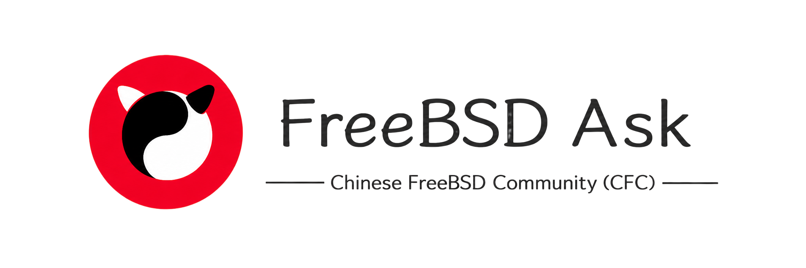
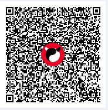

# FreeBSD Ask

🎉 Welcome to the world of BSD!

FreeBSD is a truly free (Liberty) **operating system** that, in this unpredictable world, still upholds the BSD UNIX philosophy — **abiding by ancient principles, pursuing true freedom**.

## Summary

> **Note**
>
> Approximately 6% of the chapters in this book are not yet complete. Although the existing chapters have been reviewed and revised, they are still not the final version.

This book is an open-source research work about the FreeBSD operating system.

[~~The FreeBSD project is about to be Archived~~ — to protect our beloved operating system... what we can do is, write a book!](https://www.bilibili.com/bangumi/media/md3068) (Adapted from the iconic slogan in Love Live! School Idol Project[Z]. Japan: SUNRISE, 2013-01-06)

## About the Authors

This book is co-authored by multiple members of the Chinese FreeBSD Community (CFC).

WeChat Official Account: bsdcn2018

- The primary contact for the Chinese FreeBSD Community (CFC) is the QQ group: [787969044](https://qm.qq.com/q/cX5mpJ36gg)

- WeChat group: Due to WeChat platform restrictions, you must first join the QQ group, then contact the group owner to obtain the latest group QR code.
- Discord: <https://discord.gg/j7VhWrhp3e> (Requires a proxy; accessible via the web client)
- Telegram group: [https://t.me/oh_my_BSD](https://t.me/oh_my_BSD) (Requires a proxy)

## Electronic Documents

This book provides electronic documents in both PDF and EPUB formats:

- PDF (suitable for printing and offline desktop reading) download link: <https://docs.bsdcn.org/bsdbook.pdf> 

- EPUB (suitable for offline mobile reading) download link: <https://docs.bsdcn.org/bsdbook.epub> 

The electronic documents are synchronized in real time with the web version, updated with each Git commit, and filenames remain unchanged.

For mobile reading, we recommend using [WeChat Reading](https://play.google.com/store/apps/details?id=com.tencent.weread&hl=zh) for EPUB documents; for desktop reading, we recommend [CAJViewer 9](https://cajviewer.cnki.net/download.html).

The e-books are powered by the [GitBook PDF/EPUB Export Tool](https://github.com/FreeBSD-Ask/gitbook-pdf-export) developed by [safreya](https://github.com/safreya), which converts GitBook projects into PDF and EPUB format documents.

## Deployment Addresses

This book is accessible through three subdomains, each using a different website architecture:

- <https://book.bsdcn.org>
- <https://docs.bsdcn.org>
- <https://doc.bsdcn.org> (Better access speed within mainland China)

The Chinese FreeBSD Community (CFC) does not deploy this book through any other domains. The sole official domain is `bsdcn.org`.

## Feedback

Due to the limitations of the editors, errors and omissions are inevitable in this book.

If you encounter content issues or website technical issues, please email ykla [yklaxds@gmail.com](mailto:yklaxds@gmail.com). For content issues, you can also submit a PR via GitHub — the entry point is located at the bottom right or bottom left of the current page on the desktop website.

For community-related issues, please join the QQ group and contact the group owner.

Please follow the [Chinese FreeBSD Community (CFC) Code of Conduct (CoC)](https://docs.bsdcn.org/CODE_OF_CONDUCT).

The comment feature requires a GitHub account login. Comments will be published to the Discussions section of the GitHub repository [Handbook-giscus-discussions](https://github.com/FreeBSD-Ask/Handbook-giscus-discussions), where you can manage your past comments.

## Goals and Direction

See [Contributing Guide and Open Tasks](CONTRIBUTING.md).

## Donations

Please consider donating to the FreeBSD Foundation first.

[Donate to the FreeBSD Foundation](https://freebsdfoundation.org/donate-to-freebsd-foundation/)

Supported payment methods: Mastercard-branded debit cards, VISA credit cards (via Amazon Pay or Google Pay).

Microsoft Rewards is a points program offered by Microsoft Bing Search. You can donate to the [FreeBSD Foundation](https://rewards.bing.com/redeem/000999036000?causeId=840-841545163&&PC=EMMX01) through Microsoft Rewards points. The same method can also be used to [donate to the NetBSD Foundation](https://rewards.bing.com/redeem/000999036000?causeId=840-134134071&PC=EMMX01).

## Contributors

## License and Legal Notice

Unless otherwise noted, the text, figures, and other content in this book are published under the [CC BY 4.0](https://creativecommons.org/licenses/by/4.0/) license.

All code examples in this book are released under the [BSD 2-Clause License](https://opensource.org/license/bsd-2-clause).

Third-party trademarks, service marks, trade dress, and copyrighted materials referenced in this work are the property of their respective rights holders. Such references are made for purposes of illustration, commentary, or education only.

If you believe this work infringes on your rights, please contact ykla via email at [yklaxds@gmail.com](mailto:yklaxds@gmail.com).

## Project History

"FreeBSD Ask" began on March 14, 2021. Its prototype can be traced back to the article "An Introduction to the Art, Science, and Philosophy of FreeBSD" published by ykla on December 31, 2020.

<!-- GA_STATS:START -->

## Statistics

Since June 1, 2022, the visit statistics for this book are as follows:

| Metric | Statistics |
| ------ | ---------- |
| Total users | 54,611 |
| Sessions | 103,765 |
| Pageviews | 664,202 |
| Average session duration | 8 min 14 sec |

<!-- GA_STATS:END -->

<!-- GA_BADGES:START -->

<!-- GA_BADGES:END -->

The above statistics are provided by [Google Analytics](https://analytics.google.com/).

---

The above chart is provided by [Repobeats analytics image](https://repobeats.axiom.co/).

---

<!-- CHINESE_CHAR_COUNT_START -->
Total word count: 948,900 characters;

Statistics generated at: 2026-06-13 19:17:34 (Beijing Time)

Compared to last week: +53,700 characters (+6.00%)

Compared to last month: +107,800 characters (+12.82%)

<!-- CHINESE_CHAR_COUNT_END -->

## ⭐ History

If this book has been helpful to you, feel free to star ⭐ the [GitHub repository](https://github.com/FreeBSD-Ask/FreeBSD-Ask).
