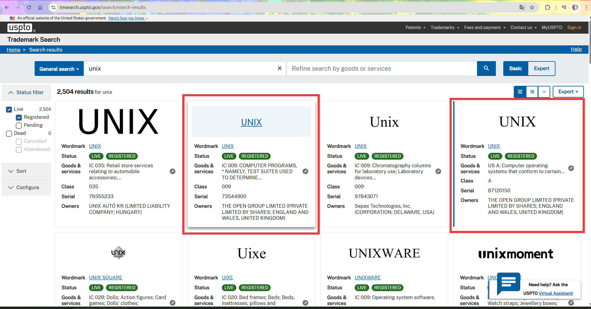

# 1.1 What is UNIX?

FreeBSD originates from BSD, the version of UNIX® developed at the University of California, Berkeley.

## What Is UNIX?

The meaning of UNIX has evolved from a specific technical implementation into a cultural symbol. The UNIX system originated at Bell Laboratories of the American Telephone & Telegraph Company (AT&T).

From the late 1960s to the early 1970s, UNIX was initially written in assembly language and later largely rewritten in C.

After the 1980s, UNIX gradually became a **[standard specification](https://www.opengroup.org/openbrand/register/xym0.htm)**.

In the contemporary context, UNIX is not only a legal **[trademark](https://www.opengroup.org/openbrand/register/index2.html)** but also a **philosophical concept** and a set of **software engineering principles**.

According to the current UNIX trademark holder, The Open Group, on their [UNIX® Certification](https://www.opengroup.org/openbrand/register/) page: "Only systems that are fully compliant and certified according to the Single UNIX Specification are qualified to use the UNIX® trademark."

---

The UNIX trademark registration information from the United States Patent and Trademark Office is as follows:

---

The UNIX operating system certification query URL: [The Open Group official register of UNIX Certified Products](https://www.opengroup.org/openbrand/register).

According to The Open Group's requirements, certified UNIX must satisfy the following two core conditions:

1. Technical standard requirements: Conformance to the [Single UNIX Specification](https://www.opengroup.org/openbrand/register/xym0.htm) (SUS), which defines the interfaces, commands, utilities, and library functions that a UNIX system must implement, ensuring interoperability across different UNIX operating systems.
2. Legal and fee requirements: Payment of the applicable [certification fees](https://www.opengroup.org/openbrand/Brandfees.htm).

Currently certified UNIX operating systems include Apple's macOS. From a trademark perspective, macOS is a standards-compliant UNIX operating system. ~~Therefore, those who wish to install UNIX may consider macOS.~~

On the surface, it appears to be a competition between mobile platforms Android and iOS; in essence, it is a contest between Linux and BSD. ~~This may also be a contest between the cathedral and the bazaar.~~

## The Traditional UNIX Philosophy (Centered on *The Art of UNIX Programming*)

The UNIX philosophy is a set of design principles that gradually emerged from the long-term development practice of the UNIX operating system, shaped by early core developers such as Ken Thompson and Dennis Ritchie. Its core tenets can be summarized as the following principles:

| Principle | Description |
| --------- | ----------- |
| **Small is beautiful** | Programs should be designed to be concise and compact, with a single, clearly defined function, making them easy to understand and maintain. |
| **One program does one thing** | Each tool focuses on a single function; complex tasks are accomplished by combining multiple tools. |
| **Prototype first** | Build a working prototype quickly, then refine it incrementally, avoiding over-engineering. |
| **Portability over efficiency** | Prioritize ensuring code runs across different platforms; performance optimization is secondary. |
| **Avoid unnecessary binary formats or complex representations** | Use simple text formats that are easy for humans to read and process. |
| **Silence is golden** | Programs should not produce redundant output during normal execution; only provide prompts on errors. Successful operations produce no output, nor should they display progress. |
| **Avoid exclusive user interfaces** | Command-line interfaces should be provided to ensure automation can be achieved through scripting. |

These principles complemented each other in the software design of that era, helping developers build simple, efficient, and maintainable systems. FreeBSD's development practices are deeply influenced by the UNIX philosophy. Its goals of advanced networking, performance, security, and compatibility are consistent with the UNIX philosophy principles of "portability over efficiency" and "small is beautiful."

FreeBSD's manual page system is a typical embodiment of the UNIX philosophy: each command, system call, and configuration file has its own manual page with concise content, making it easy for users to consult at any time via the man command.

> **Discussion Questions**
>
>> 1. The UNIX philosophy in a nutshell: keep it simple. "Keep it simple, stupid."
>
>> 2. Brooks F P Jr. The Mythical Man-Month[M]. UMLChina, trans. Commemorative edition. Beijing: Tsinghua University Press, 2023. ISBN: 978-7-302-63538-3
>
> After reading the above text and references, how do you understand the limitations of the UNIX philosophy and its historical context?

> **Discussion Questions**
>
>> Those who do not understand UNIX are condemned to reinvent it, poorly.
>>
>
> Henry Spencer did not explicitly criticize any particular operating system. To which mainstream operating system does this assertion currently apply more? And why?

## A History of UNIX

The birth of UNIX has a specific historical background, which must be traced back to its predecessor, Multics.

### The Multics Project

Multics was an important project that profoundly influenced UNIX. In 1961, the Massachusetts Institute of Technology (MIT) demonstrated the **Compatible Time-Sharing System** (CTSS)—one of the most innovative operating systems of its time. Building on this foundation, researchers decided in 1964 to design a more advanced version, the **Multiplexed** Information and Computing Service (Multics) system.

Multics aimed to create powerful new software and new hardware that could rival the IBM 7094 with even richer functionality. In August 1964, General Electric (GE) was selected as the hardware supplier and signed a contract; in November of the same year, Bell Laboratories joined the project, forming a three-party collaboration. GE was responsible for designing and manufacturing a computer with entirely new hardware features to better support time-sharing and multi-user architectures; Bell Laboratories had developed its own operating systems in the early days of computing and possessed relevant experience.

The development of Multics eventually fell into difficulties. The system was designed with a large number of programs and features, and frequently introduced contradictory components, making the system overly complex. In 1969, Bell Laboratories concluded that Multics, as an information processing tool, could no longer provide computing services for the laboratory, and its design costs were too high. In April of that year, Bell Laboratories withdrew from the Multics project; only MIT and GE continued development.

### The Birth of UNICS

The UNIX system was originally named UNICS, and its birth originated from a game project. After Bell Laboratories withdrew from the Multics development project, team member Kenneth Lane Thompson found an idle Digital Equipment Corporation (DEC) PDP-7 computer in the laboratory. This computer had limited performance, with only 8K words (approximately 18 KB) of memory, but it had relatively complete graphics display capabilities. Thompson had previously written the game Space Travel on the Multics system, and later rewrote it in Fortran to run on the GE 635 computer's GECOS operating system. However, due to high operating costs and poor display quality, Thompson and Ritchie ported the game to the PDP-7. The PDP-7 was equipped with a large-capacity single-platter disk drive, and Thompson wrote a disk scheduling algorithm to maximize disk throughput.

> **Tip**
>
> Space Travel has been ported and can now be experienced via the web ([Space Travel](https://akr.am/st/)). The ported project's source code is available at [C port of Ken Thompson's Space Travel](https://github.com/mohd-akram/st).
>
> ~~Although the controls are simple, I still can't figure out how to play.~~

To verify the algorithm, data needed to be written to the disk, so Thompson wrote a program for batch writing data.

At a pace of one program per week, he successively completed three tasks: an editor for writing code, an assembler for converting code into PDP-7 executable machine language, and "the outer layer of the kernel, that is, the operating system," ultimately building a preliminary operating system.

After Thompson completed the initial development of the new operating system on the PDP-7, the system had no official name during discussions with several colleagues. It was not until 1970 that Brian Kernighan suggested naming it **UNICS** (**Uniplexed** Information and Computing Service), as a pun on **Multics** (**Multiplexed** Information and Computing Service). The name later evolved into **UNIX**.

## References

- Raymond E S. The Art of UNIX Programming[M]. Jiang Hong, He Yuan, Cai Xiaojun, trans. Beijing: Publishing House of Electronics Industry, 2012. ISBN: 978-7-121-17665-4. Expounds the UNIX philosophy and software engineering practice principles.
- Gancarz M. Linux/Unix Design Philosophy[M]. Qi Ben, trans. Beijing: People's Posts and Telecommunications Press, 2012. ISBN: 978-7-115-26692-7. (Out of print) Distills the core design philosophy and practical methods of UNIX systems.
- The Open Group. The Open Group Standards Process[EB/OL]. [2026-03-25]. <https://www.opengroup.org/standardsprocess/certification.html>. Standardizes the UNIX certification process and technical standards framework.
- National Academy of Engineering. Dr. Fernando J. Corbato[EB/OL]. [2026-04-16]. <https://www.nae.edu/29551/Dr-Fernando-J-Corbato>. Corbato led the development of CTSS; according to this article, CTSS was first demonstrated on an IBM 709 in November 1961.
- Ritchie D M. The Development of the C Language[EB/OL]. [2026-04-16]. <https://www.bell-labs.com/usr/dmr/www/chist.html>. Ritchie recalls the history of C language and early UNIX development, noting the PDP-7 had 8K 18-bit words of memory.
- Tom Van Vleck. The Multicians web site[EB/OL]. (2026-04-08)[2026-04-17]. <https://multicians.org/chrono.html>. Multics chronology, recording that GE signed the contract in August 1964 and Bell Laboratories joined in November 1964.
- Computer History Museum. Atlas computer[EB/OL]. [2026-04-17]. <https://www.computerhistory.org/timeline/1962/>. Records that the Atlas computer first went into operation in 1962, introducing the concept of virtual memory.
- Ritchie D M. The Evolution of the Unix Time-sharing System[EB/OL]. (1984)[2026-04-18]. <https://www.read.seas.harvard.edu/~kohler/class/aosref/ritchie84evolution.pdf>. Ritchie details the evolution of Unix from PDP-7 to PDP-11, recording that Space Travel was originally written on Multics, later rewritten in Fortran to run on GECOS/GE 635, and finally ported to PDP-7.
- Van Vleck T. Multics: Bell Labs withdrawal[EB/OL]. [2026-04-18]. <https://www.multicians.org/general.html>. Records that Bell Laboratories withdrew from the Multics project in April 1969.
- Kernighan B W. UNIX: A History and a Memoir[M]. Han Lei, trans. Beijing: People's Posts and Telecommunications Press, 2021: 31-42. ISBN: 978-7-115-55717-9. Section 2.3 records that Thompson wrote a disk scheduling algorithm to maximize PDP-7 disk throughput, and wrote an editor, assembler, and kernel at a pace of one program per week.
- SPENCER H. space news from Sept 28 AW&ST[EB/OL]. sci.space.shuttle, Google Groups, (1987-11-15)[2026-04-17]. <https://groups.google.com/g/sci.space.shuttle/c/L8-Upf8gZoY/m/NN6ngTI0K0QJ>. Source of Henry Spencer's remark.

## Exercises

1. Install QEMU on FreeBSD and run FreeBSD version 1.0, documenting the significant differences from contemporary FreeBSD during the boot process.
2. Experience Thompson's original Space Travel on the web and summarize its gameplay.
3. List the differences between the SUS specification and the Windows operating system in terms of design philosophy and implementation.
