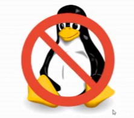
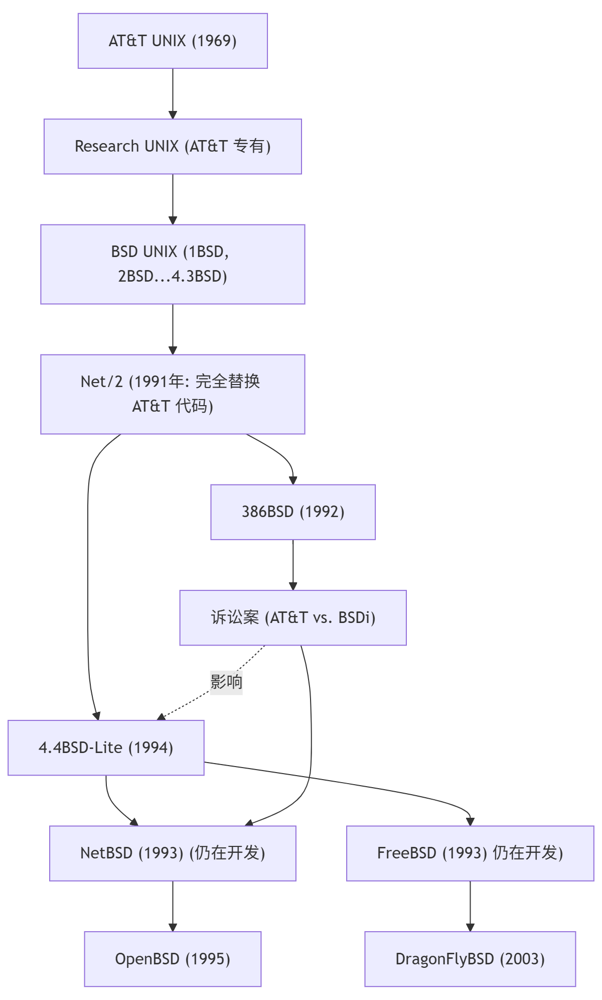

# 1.4 What is FreeBSD

> A bunch of PC hackers sat down and tried to write a Unix system for the PC, and the result was Linux.
>
> A bunch of Unix hackers sat down and tried to port a Unix system to the PC, and the result was BSD.
>
> — Anonymous

The term "hacker" here refers to people who are enthusiastic about and skilled in computer programming and design, not those who exploit system security vulnerabilities to attack networks or steal data.

## How to Pronounce FreeBSD

The correct pronunciation of FreeBSD is a common concern among new users. The current community consensus and common pronunciation is: /ˌfriːˌbiːɛsˈdiː/, that is, pronounced as "Free (/friː/) + B (/biː/) + S (/ɛs/) + D (/diː/)".

That is, first say "Free," then spell out B, S, D letter by letter.

BSD or FreeBSD is typically not pronounced as a single word. It is not pronounced as "Bai-si-de" or "Fu-rui-bai-si-de." ~~The Chinese registered trademark name of the FreeBSD Foundation in mainland China is "福瑞百思德基金会" (Furui Baiside Foundation).~~

## What Is FreeBSD?

FreeBSD is not Linux, nor is it a clone of UNIX. FreeBSD is free software, with source code that is publicly available and can be freely used, modified, and distributed.



The term FreeBSD consists of two parts: "Free" and "BSD."

BSD was originally developed by the Computer Systems Research Group (CSRG) at the University of California, Berkeley, and this work was named `Berkeley Software Distribution`. FreeBSD and other BSD systems are continuations of the work of the Computer Systems Research Group (CSRG).

Free carries two meanings: liberty (Liberty) and free of charge (Gratis).

FreeBSD Day is June 19. The FreeBSD Foundation and community celebrate FreeBSD's birthday on this day.

## The Ship of UNIX: Is FreeBSD UNIX?

This question is far less clear-cut than it appears on the surface. Many discussants, even those who lived through that era, find it difficult to give a clear answer or clarification. Some argue that BSD has never undergone any UNIX certification, and without holding the legal trademark, it is premature to draw simple conclusions; others merely broadly claim that FreeBSD is a continuation and rightful heir of UNIX, only "having the substance but not the name"; still others believe that BSD's relationship to UNIX is the same as Linux's relationship to UNIX.

The above answers diverge because this question is not a purely technical problem that can be simply analyzed through legal trademark ownership or code lineage. It involves profound ontological philosophical questions: is it that one cannot step into the same river twice, or that one cannot step into the same river even once? How one answers this question reflects one's philosophical outlook and view of science and technology.

>> **The Ship of Theseus**
>>
>>The ship on which Theseus sailed with the young Athenians had thirty oars. The Athenians preserved this ship down to the time of Demetrius Phalereus. They took away the old planks as they decayed and put in new and sound timber in their places. From then on, this ship became a frequently cited example for philosophers debating the question of development — one side maintaining that it remained the same ship, the other arguing that it was no longer the same ship.
>>
> - Plutarch. Parallel Lives[M]. Translated by Huang Hongxu, Lu Yongting, Wu Pengpeng. Beijing: The Commercial Press, 1990: 23.
>
> **Discussion Questions**
>
> 1. If the ship has had some components replaced, is this ship the Ship of Theseus?
>
> 2. If one day all the original components of the ship have been completely replaced, is this ship still the Ship of Theseus?
>
> 3. If all the replaced components are assembled into a new ship, is that ship the Ship of Theseus?

The BSD operating system is not a replica, but rather an open source derivative of AT&T Research Unix, sharing with modern UNIX® System V the status of one of the two main branches of UNIX. Prior to 4.4BSD, the full name of BSD was BSD UNIX.



Originally, UNIX was an operating system developed by AT&T. In the early 1980s, the Computer Systems Research Group (CSRG) at the University of California, Berkeley was formally established and began in-depth research on UNIX, developing a large number of user-space programs for it, forming the new system BSD (Berkeley Software Distribution). Over time, the BSD system gradually developed and incorporated many innovations, such as the implementation of the TCP/IP protocol stack. By the early 1990s, CSRG began re-implementing AT&T's proprietary code and released Networking Release 2 (Net/2). However, Net/2 still contained a small amount of AT&T code, which became the trigger for the subsequent USL lawsuit. It was not until the release of 4.4BSD-Lite after the lawsuit was settled in 1994 that all AT&T code was completely removed. After this, the BSD system split into multiple projects: FreeBSD and NetBSD were born in 1993, OpenBSD was forked from NetBSD in 1995, and DragonFly BSD was forked from FreeBSD in 2003.

If you examine FreeBSD's source code, you will also see comments and copyright notices left by early developers in 1982:

```C
/*-
 * SPDX-License-Identifier: BSD-3-Clause
 *
 * Copyright (c) 1982, 1986, 1993
 *	The Regents of the University of California.  All rights reserved.

 ...license text omitted below...

 */
```

The above copyright notice is from the source code file **sys/sys/_timespec.h**.

> **Discussion Questions**
>
> How should one understand the relationship between FreeBSD and UNIX?

## References

- M.D.Fuller, BSD For Linux Users[EB/OL]. [2026-06-01]. <https://www.over-yonder.net/~fullermd/rants/bsd4linux/01>. The article recounts the famous quote "Linux is what you get when a bunch of PC hackers sit down and try to write a Unix system for the PC. BSD is what you get when a bunch of Unix hackers sit down to try to port a Unix system to the PC."
- FreeBSD Foundation. Join us to celebrate FreeBSD Day![EB/OL]. [2026-03-26]. <https://freebsdfoundation.org/freebsd-day/>.
- Identity Over Time[EB/OL]. [2026-03-26]. <https://plato.stanford.edu/entries/identity-time>. SEP entry: identity over time.
- Sorites Paradox[EB/OL]. [2026-03-26]. <https://plato.stanford.edu/entries/sorites-paradox/>. SEP entry: the sorites paradox, the bald man paradox.

## Exercises

1. Watch the documentary *Revolution OS* (Moore J T S, director. Revolution OS[V]. USA: Seventh Art Releasing, 2002.), and analyze the impact of the open source movement on traditional software business models, combining the film's content with the UNIX/BSD history discussed in this chapter.
