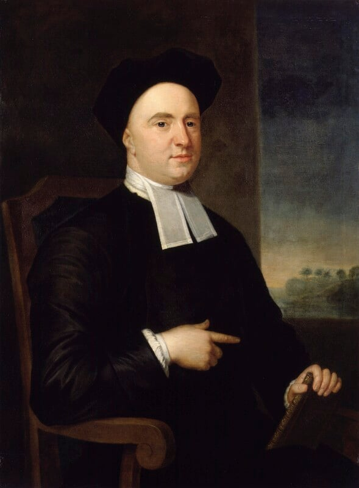
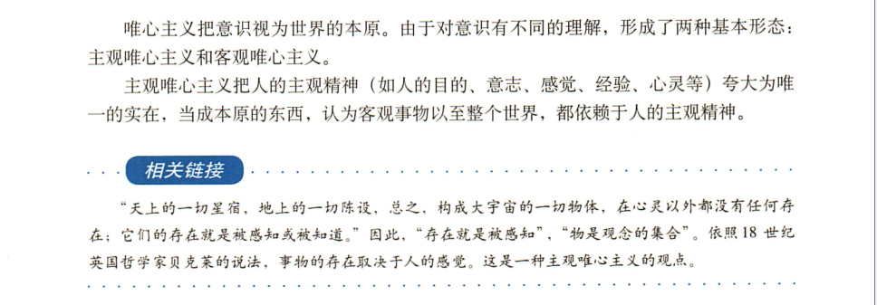

# 1.5 George Berkeley and the BSD Cultural Tradition

In the early 1980s, the Computer Systems Research Group (CSRG) at the University of California, Berkeley was formally established and began modifying and extending the UNIX operating system developed by AT&T Bell Laboratories. These modifications and extensions were initially released in the form of software distribution packages, hence the name Berkeley Software Distribution (BSD). FreeBSD is a continuation of the work of CSRG.

## The Naming of the City of Berkeley, the University of California, Berkeley, and BSD

The name BSD originates from its birthplace: the University of California, Berkeley, the city of Berkeley where the university is located, and the namesake of the city — George Berkeley.

The naming of the city of Berkeley can be traced back to 1866. At that time, Frederick Billings, a trustee of the College of California, citing the line "Westward the course of empire takes its way" from the Irish modern empiricist philosopher George Berkeley (1685–1753), suggested naming the new campus town Berkeley.

In 1868, the California legislature decided to establish the University of California in Berkeley.

Let us look at the poem by Berkeley, composed around 1726, titled "Verses on the Prospect of Planting Arts and Learning in America," to understand the origin of the name Berkeley. The poem was formally published in the 1752 Miscellany collection; its exact date of composition is debated, but scholars generally date it to 1725–1726 based on its connection to the Bermuda college plan (proposed in 1725).

The Muse, disgusted at an age and clime
Barren of every glorious theme,
In distant lands now waits a better time,
Producing subjects worthy fame.

In happy climes, where from the genial sun
And virgin earth such scenes ensue,
The force of art by nature seems outdone,
And fancied beauties by the true;

In happy climes, the seat of innocence,
Where nature guides and virtue rules,
Where men shall not impose for truth and sense
The pedantry of courts and schools:

There shall be sung another golden age,
The rise of empire and of arts,
The good and great inspiring epic rage,
The wisest heads and noblest hearts.

Not such as Europe breeds in her decay;
Such as she bred when fresh and young,
When heavenly flame did animate her clay,
By future poets shall be sung.
Westward the course of empire takes its way;

The four first Acts already past,
A fifth shall close the Drama with the day;
Time's noblest offspring is the last.

BERKELEY G. Verses on the Prospect of Planting Arts and Learning in America[C]//A miscellany, containing several tracts on various subjects. London: Printed for J. and R. Tonson, and S. Draper, 1752.

Translation:

The Muse, weary of this age and clime / barren of any glorious theme / awaits a better time in distant lands / to produce subjects worthy of fame.

In those happy lands / where the genial sun / and virgin earth interplay / the power of art seems surpassed by nature / and imagined beauty yields to the true.

In those happy lands / the dwelling of innocence / where nature guides and virtue rules / people no longer pass off / the pedantry of courts and schools / as truth and reason.

There / another golden age shall be sung / the rise of empire and of arts / the good and the great inspiring epic passion / the wisest minds and noblest hearts.

Not such as Europe breeds in her decay / but such as she bred when fresh and young / when heavenly fire once animated her clay / future poets shall sing of it / the course of empire / takes its way westward.

The first four acts have concluded / the fifth shall close the drama with the day / time's noblest offspring / always appears last.

## A Brief Biography of George Berkeley

In many works and documents, George Berkeley is often referred to as the Bishop of Cloyne or Bishop Berkeley.

"Berkeley" has different transliterations in Chinese, and its British and American pronunciations also differ (British /ˈbɑːkli, ˈbəːkli/, American /ˈbɚkli/), but the English spelling remains consistent.

Due to historical factors (such as the controversy over Berkeley's purchase of enslaved people) and translation conventions (formerly transliterated as "巴克莱" etc.), the connection between the city of Berkeley and Berkeley the person is little known in both the Chinese-speaking and English-speaking worlds.

The following portrait depicts this philosopher:

Image source: [National Portrait Gallery](https://www.npg.org.uk/collections/search/portrait/mw00534/George-Berkeley) (painted by John Smibert, 1730, held at the National Portrait Gallery, London).

George Berkeley (1685.3.12–1753.1.14); 2023 marked the 270th anniversary of his death. 2025 is also the 340th anniversary of his birth.

| Date | Age | Event |
| ---- | --- | ----- |
| 1685.3.12 | — | Born in Kilkenny, Ireland, to a gentleman's family; the eldest son. |
| 1696 | 11 | Entered Kilkenny College. |
| 1700 | 15 | Entered Trinity College Dublin. |
| 1704 | 19 | Awarded the degree of Bachelor of Arts. |
| 1707 | 22 | Awarded the degree of Master of Arts; remained at the college the same year as a Junior Fellow, lecturing on Greek. |
| 1709 | 24 | Ordained as a deacon in the Church of Ireland to satisfy college requirements. Published his first major work, *An Essay Towards a New Theory of Vision*; his philosophical thought was essentially formed. |
| 1710 | 25 | Ordained as a priest in the Church of Ireland. Published *A Treatise Concerning the Principles of Human Knowledge*, which already contained many discussions on motion. |
| 1713 | 28 | Published *Three Dialogues Between Hylas and Philonous*. |
| 1716 | 31 | Traveled to the European continent again, serving as tutor to the son of St George Ashe, accompanying him on a European tour of about 4 years, returning to Ireland in 1721. |
| 1717 | 32 | Appointed Senior Fellow of Trinity College. |
| 1721 | 36 | Awarded the degree of Doctor of Divinity; the same year (or the following year) appointed Dean of Dromore Cathedral in the Church of Ireland, but chose to remain at Trinity College Dublin to lecture on theology and Hebrew, and published *De Motu* (On Motion), which pointed out that many of Newton's fundamental ideas might be erroneous and criticized Newton's concepts of absolute space and time. |
| 1723 | 38 | Received a substantial inheritance from a friend. |
| 1724 | 39 | Appointed Dean of Derry Cathedral in the Church of Ireland, but never took up the post. |
| 1725 | 40 | Prepared to establish a theological college in Bermuda, but never visited Bermuda in his lifetime. The same year, he relinquished his previous deanery position to raise funds. |
| 1728 | 43 | Married Anne Forster; six weeks later, departed for the Americas to seek sponsorship for the college. They lived in Rhode Island for several years, purchased a plantation, and acquired several enslaved Africans to work on it (this matter is controversial). |
| 1729 | 44 | Had his first child. |
| 1731 | 46 | Returned to London after the college project proved hopeless (both the Stanford Encyclopedia of Philosophy and the Dictionary of Irish Biography record the return as 1731). Subsequently donated the Rhode Island estate and library to Yale University. Later, he also donated most of his property and the materials prepared for the college to related universities. |
| 1734.1.18 | 48 | Consecrated as Bishop of Cloyne in the Church of Ireland; consecrated on May 19 of the same year; published *The Analyst*. After this, he focused on Christian ministry and gradually withdrew from public view. |
| 1739 | — | The London Foundling Hospital was established; he was actively involved in it. |
| 1744 | 59 | Published *Siris: A Chain of Philosophical Reflexions and Inquiries Concerning the Virtues of Tar-water, and Divers Other Subjects Connected Together and Arising One from Another*, in which he advocated using pine tar as a panacea. This was his best-selling work during his lifetime. Records indicate that he applied this treatment to patients, and corresponding efficacy was observed. |
| 1752 | 67 | Entrusted his brother Dr. Robert Berkeley to oversee the Diocese of Cloyne, and moved to Oxford. |
| 1753.1.14 | 67 | Passed away in Oxford, with his wife Anne Forster reading a sermon at his bedside. |
| 1786 | — | His wife Anne Forster passed away. |

Note: The "Church of Ireland" here refers to the Anglican Church of Ireland, which is part of the Anglican Communion.

## Overview of Berkeley's Thought

### Paradoxes and the Foundations of Mathematics

Berkeley had a profound influence on philosophy, and his critique of the foundations of calculus is also an important chapter in the history of mathematics. Berkeley's writings sparked philosophical discussions on infinitesimals in mathematics (i.e., Berkeley's paradox; see his 1734 publication *The Analyst; or, A Discourse Addressed to an Infidel Mathematician, Wherein It Is Examined Whether the Object, Principles, and Inferences of the Modern Analysis Are More Distinctly Conceived, or More Evidently Deduced, Than Religious Mysteries and Points of Faith*).

Berkeley's paradox itself has not been "resolved"; at the philosophical level, it remains an open question. The ε-δ definition merely makes real analysis formally self-consistent within the ZFC axiom system. Many people often use this definition to resolve Zeno's paradoxes, thereby dismissing their philosophical value.

For more related resources, consult books on non-standard analysis, hyperreal numbers, and the philosophy of mathematics.

### Berkeley and Einstein

Berkeley's thought influenced not only philosophy and mathematics but also had an indirect impact on modern science. Bishop Berkeley, through his metaphysical ideas — particularly his critique of Newton's concepts of absolute space and time — inspired many 20th-century scientists, including Einstein. Einstein held that time is not absolute but is closely related to the observer's state of motion.

> **Tip**
>
> Einstein subscribed to Machian philosophy, and Mach was a Berkeleyan.

> **Gradually, philosophers and scientists arrived at a startling conclusion**: since every object is nothing more than the sum of its properties, and these properties exist only in the mind, the entire objective universe of matter and energy, of atoms and stars, has no existence apart from consciousness — it is merely a system of conventional symbols shaped by human senses.
>
>> "The vast stars above and the mountains and rivers below, in short, all the entities that constitute the framework of this magnificent world, have no substance apart from the mind... so long as they are not actually perceived by me, or exist in my mind, or in that of any other created spirit, they either have no existence at all, or exist only in the mind of some Eternal Spirit."
> As Berkeley — the arch-enemy of materialism — expressed it:
>
> Einstein pushed this logic to its extreme, demonstrating that even space and time are but forms of intuition that cannot be separated from consciousness, just like our concepts of color, shape, or size. Space has no objective reality apart from the arrangement and ordering of objects in our perception; and time cannot exist independently of the system we use to measure the sequence of events.
>
> **Realizing** that all our knowledge of the universe is but the residue of impressions clouded by our imperfect senses makes the pursuit of reality seem hopeless. If all existence must be predicated on being perceived, then the world seems to disintegrate into the chaos of individual perceptions.
>
> Yet there is a curious order in our perceptions, as if there truly exists some substratum of objective reality that our senses translate. Although no one can be certain that their experience of red or middle C is the same as another's, we can still act on the assumption that everyone's perception of color and tone is roughly similar.
>
> — Barnett L. The Universe and Dr. Einstein[M]. New York: William Sloane Associates, 1948.

### Berkeley's Philosophy

Berkeley's most famous philosophical proposition concerns the relationship between existence and perception.

> "esse est percipi, to be is to be perceived"
>
> — George Berkeley
>
> Note: Berkeley's original text in Section 3 of *A Treatise Concerning the Principles of Human Knowledge* uses a mixture of Latin and English: "esse is percipi." Later philosophical literature more commonly attributes the pure Latin form "esse est percipi" to him.

> **Note**
>
> **The above proposition absolutely does not mean that Berkeley advocated subjective idealism, nor does it mean he denied the existence of objective matter.**

One may consult *A Treatise Concerning the Principles of Human Knowledge* and other works, in which Berkeley argues for the necessary existence of God. In Berkeley's philosophy, the objectivity of material existence and the existence of God are not in conflict. This work also responds to many misunderstandings and objections.

In brief: there is no objective matter that exists independently and independently of human thought and perception (the "objective matter" we understand must be graspable by our thought and perception, otherwise the concept is meaningless). If such matter existed, since it is unknowable, it would be equivalent to non-existence, and positing its existence would be meaningless (furthermore, if one acknowledges the unknowability of matter, that is not pure materialism, and there is no fundamental difference from Berkeley's philosophy). Therefore, what we consider to be objective existence in the ordinary sense must depend on our perception in order to be perceived — that is, "to be is to be perceived." Any so-called "objective existence" beyond this is unknowable and meaningless. Thus, Berkeley holds that material existence depends on the mind's perception; matter that exists without being perceived is inconceivable. But it is certain that our world exists (if you deny this, Berkeley's philosophy would not be much different). Therefore, to ensure this, God must necessarily exist. People always take for granted, implicitly affirming through practice that what has been verified by practice is material — this is incorrect. If the "materiality" of practical activity is itself questionable, how can non-material existence confer material attributes upon this activity (through the pineal gland)? And this "materiality" of practical activity itself cannot be confirmed, because humans cannot know existence beyond their own perception. Unless one appeals to God, but in doing so, one has already presupposed its non-materiality.

Contemporary phenomenology shares common ground with Berkeley's philosophy: both emphasize the primacy of direct experience and perception.

> **Discussion Questions**
>
> The most famous philosophical experiment concerning his thought is: "If a tree falls in a forest and no one is around to hear it, does it make a sound?"
>>
>> - If you think it does not. Congratulations, you are now a Berkeleyan.
>>
>> - If you think it does, and provide a proof from physics (or other scientific or mathematical reasoning). Congratulations, you are now a Berkeleyan.
>>
> Question 1: How should one understand the relationship between the "observer" in quantum mechanics and the existence of "a tree falling in a forest"?
>>
>> - If you think it does, because the world exists objectively, independent of human will. Congratulations, you are now a Berkeleyan.
>>
>> - If you think it may or may not, or is unknowable, or something else. Congratulations, you are now a Berkeleyan.
>>
> Question 2: Please elaborate on the basis for each of the above conclusions, drawing on the preceding text or further reading of Berkeley's works.

Berkeley also held that the value of money does not depend on its metal content; money is merely a means of commodity exchange. Its value derives from credit and social consensus. He believed that income should be distributed equally among the population to achieve economic fairness.

He also advocated developing the economy through education, training, and reliance on the people. He believed that large-scale construction projects should be used to alleviate poverty.

Berkeley urged religious groups to set aside their disputes and unite for the common good. After withdrawing from public view, he focused on public welfare for local people, whether Catholic or Protestant.

Berkeley's ideas were not widely accepted during his lifetime, but their influence has been profound over the centuries since.

Almost every major work on the history of philosophy discusses his thought [the old PEP edition of the high school political textbook "Ideological and Political Required Course 4: Life and Philosophy," page 13, is one example (Ministry of Education Senior High School Political Course Curriculum Standard Experimental Textbook Writing Group. Ideological and Political Required Course 4: Life and Philosophy[M]. Beijing: People's Education Press, 2018. ISBN: 978-7-107-32710-0.)], and his philosophical experiment is also an enduring essay question in philosophy examinations.

In high school political textbooks, one can also find introductions to Berkeley's thought ~~although the expression in that textbook is considered erroneous; Ministry of Education, compiled. Senior High School Textbook Ideological and Political Required Course 4: Philosophy and Culture[M]. Beijing: People's Education Press, 2019. ISBN: 978-7-107-34195-3. has removed the relevant content~~.

### References

- Berkeley G. A Treatise Concerning the Principles of Human Knowledge and Three Dialogues[M]. Translated by Zhang Guiquan. Beijing: People's Publishing House, 2022. ISBN: 978-7-01-023684-1. Systematically expounds Berkeley's idealist philosophical system and the theory of existence and perception.
- Yan Jida. A New Exploration of Berkeley's Thought[M]. Shanghai: Fudan University Press, 1987. ISBN: 7-309-00033-1. In-depth analysis of Berkeley's philosophical thought and scientific methodology.
- Berkeley G. Siris[M]. Translated by Cao Man, Gao Xinmin. Beijing: The Commercial Press, 2000. ISBN: 978-7-100-02886-8. Chinese translation of Siris.
- Downing L. George Berkeley[EB/OL]. (2021)[2026-03-25]. <https://plato.stanford.edu/archives/fall2021/entries/berkeley/>. SEP entry on Berkeley. Provides an authoritative academic overview and research status of Berkeley's philosophical thought.
- Easwaran K, Hájek A, Mancosu P, et al. Infinity[EB/OL]. (2024)[2026-03-25]. <https://plato.stanford.edu/archives/sum2024/entries/infinity/>. SEP entry on infinity. Explores the historical development and philosophical controversies of the concept of infinity in the philosophy of mathematics.
- Urmson J O. Berkeley[M]. Translated by Meng Lingpeng. Beijing: Tsinghua University Press, 2019. ISBN: 978-7-302-52555-4. An accessible introduction to Berkeley's philosophical thought and historical influence.
- Wang Fangting. Foundations of Mathematics[M]. Revised edition. Beijing: Higher Education Press, 2018. ISBN: 978-7-04-050242-8. Systematically expounds the theory of mathematical foundations and the framework of axiomatic set theory.
- Robinson A. Non-standard Analysis[M]. Translated by Shen Yougen, Wang Shiqiang, Zhang Jinwen. Beijing: Science Press, 1980. Unified book number: 13031-1267. Establishes the theory of hyperreal numbers, providing a mathematical foundation for infinitesimals.
- Tao T. Analysis I[M]. Translated by Li Xin. 4th edition. Beijing: People's Posts and Telecommunications Press, 2025. ISBN: 978-7-115-66554-6. Constructs real analysis from mathematical foundations (natural numbers and set theory), emphasizing the combination of rigor and intuition.
- Berkeley G. The Querist, containing several queries proposed to the consideration of the public[M]. Farmington Hills: Gale ECCO, Print Editions, 2018. ISBN: 978-1-38541-101-8. Philosophical reflections on money, economics, and social issues.
- Stanford Encyclopedia of Philosophy. Zeno's Paradoxes[EB/OL]. [2026-04-04]. <https://plato.stanford.edu/entries/paradox-zeno/>. Entry on Zeno's paradoxes.
- Schabas M. Economics in Early Modern Philosophy[EB/OL]. (2022)[2026-03-25]. <https://plato.stanford.edu/archives/sum2022/entries/economics-early-modern/>. Traces the philosophical roots and historical development of early modern economic thought.
- Cloyne District Community Council. George Berkeley, Bishop of Cloyne/Philosopher[EB/OL]. [2026-03-25]. <http://cloyne.ie/about/george-berkeley-bishop-of-cloyne/>. Introduction to Bishop Berkeley's life and work in the Diocese of Cloyne.
- Britannica. George Berkeley[EB/OL]. [2026-03-25]. <https://www.britannica.com/biography/George-Berkeley>. Provides an authoritative encyclopedic introduction to Berkeley's life and thought.
- Stadtman V A, Centennial Publications Staff. The Centennial Record of the University of California, 1868–1968[M/OL]. Berkeley: University of California, 1967[2026-04-18]. <https://digicoll.lib.berkeley.edu/record/81096/files/centennial.pdf>. Records the history of Frederick Billings citing Berkeley's verse in 1866 to suggest naming the town Berkeley.
- Hu Huakai. Selected Materials on Chinese Scientific Criticism in the 1950s–1970s (Two Volumes)[M]. Jinan: Shandong Education Press, 2009. ISBN: 978-7-5328-5386-1. The entire second volume concerns criticism of Einstein. Academic historical records documenting the intersection of science and politics during a specific historical period.
- O'Grady P. Berkeley, George[EB/OL]//Dictionary of Irish Biography. [2026-04-18]. <https://www.dib.ie/biography/berkeley-george-a0611>. Dictionary of Irish Biography entry on Berkeley, providing the most detailed and authoritative academic biography, including precise dates (e.g., entered Kilkenny College on July 17, 1696; entered Trinity College Dublin on March 21, 1700; elected Fellow in June 1707; ordained as priest in spring 1710, etc.).
- Stock J. An Account of the Life of George Berkeley, D.D., Late Bishop of Cloyne in Ireland[M]. Dublin, 1776: 12. The earliest biography of Berkeley, recording details such as his wife reading a sermon at his deathbed.
- Popper K R. A Note on Berkeley as Precursor of Mach[J]. The British Journal for the Philosophy of Science, 1953, 4(13): 26-36. Argues that Berkeley's critique of Newton's absolute space and time preceded Mach's, making Berkeley an intellectual precursor of Einstein's general theory of relativity.
- Berkeley Historical Society. Why Is Berkeley Called Berkeley?[EB/OL]. [2026-04-18]. <https://berkhistory.org/why-is-berkeley-called-berkeley/>. Berkeley Historical Society and Museum; Frederick Billings cited Berkeley's verse in 1866 to name Berkeley.
- Berkeley Plaque Project. How Berkeley Got Its Name[EB/OL]. [2026-04-18]. <https://berkeleyplaques.org/plaque/how-berkeley-got-its-name/>. The name Berkeley was adopted on May 24, 1866.

## The Motto of the University of California, Berkeley: "Fiat Lux" (Let There Be Light)

"Fiat Lux" can also be freely translated as "Let the world be filled with light." Many awards at the University of California, Berkeley are named after "Fiat Lux."

The University of California, Berkeley was founded in 1868 as a public university. In the same year, Cai Yuanpei was born — he would later serve as the president of China's first modern national university, Peking University (originally the Imperial University of Peking, founded in 1898). His view that "for a good society, there must first be good individuals; for good individuals, there must first be good education" coincides with the philosophy advocated by "Fiat Lux" — that individual progress drives social development. Cai Yuanpei is revered as the "eternal president" of Peking University. In the same year, Japan launched the Meiji Restoration, entering a new era and embarking on a path of modernization, yet this process also laid the groundwork for Japan's future wars of aggression.

Fiat Lux comes from the Latin Bible "1.3: Dixitque Deus: Fiat lux. Et facta est lux." (Vulgate). "And God said, 'Let there be light,' and there was light." (NIV Bible) "1.3: And God said, Let there be light: and there was light." (King James Bible)

According to the scripture, light came before the world. In Christian theology, God created light before humanity; this light of truth shines upon all people and is regarded as the source of human reason.

As a motto, "Fiat Lux" means to enlighten the world with knowledge. Just as Plato's theory of illumination, knowledge is like the sun shining upon the world, dispelling the darkness of ignorance. This represents that students should use knowledge to transform the world and dispel darkness. Yet, where there is light, shadows must follow.

Nietzsche observed, "Whoever fights monsters should see to it that in the process he does not become a monster. And if you gaze long enough into an abyss, the abyss will gaze back into you."

This motto also constantly reminds students to be mindful of themselves and their surroundings, to avoid repeating Socrates' mistake: Socrates tried to make people admit that they actually knew nothing, possessing only opinions rather than truth. This shares common ground with Laozi's saying in the *Tao Te Ching*: "Bright but not dazzling."

It warns people to avoid dragging academia into ideological disputes. However, in today's American atmosphere that emphasizes identity politics, the University of California, Berkeley Library removed the portrait of George Berkeley (on the grounds that he had purchased enslaved people), citing equality and inclusivity. Yet the name of the Berkeley campus (UC Berkeley) itself derives from Berkeley. This action contradicts its consistent pursuit of liberal ideals and also goes against the Confucian principle articulated by Confucius: "If names be not correct, language will not flow smoothly; if language does not flow smoothly, affairs will not succeed." This prompts reflection: has the original aspiration been forgotten? Does the fear of darkness still exist?

Modern science's understanding of light has also been remarkably tortuous. Research shows that light possesses both wave-like and particle-like properties. The paradigm of scientific research on light continues to evolve, and the spiritual connotation of "Fiat Lux" evolves with it. At its founding, Berkeley was positioned as a beacon of education; today it emphasizes the value of each student as an independent source of light. A 2024 study showed that light also casts shadows.

"Fiat Lux" means that receiving education and acquiring knowledge can change not only individual destinies but also the course of human civilization. Yet this raises several philosophical questions: Is enlightenment truly possible? Is education possible? Kant held that "Enlightenment is man's emergence from his self-incurred immaturity." But the question is, do people truly have the courage to admit that they are immature, ignorant, and foolish? Do people truly wish to trade the pain of knowledge for the pleasure of ignorance? Would the people in Plato's cave truly be willing to break their chains and return to the surface to accept the light? Is there a responsibility, an obligation, and an ability to enlighten everyone? Is it possible for everyone to become a dragon? Would that be happiness for them? Are those who have received modern higher education still in a state of "learned ignorance"? Are they light, or darkness? Does equating modern science with light, while ignoring the unsettled theoretical foundations of modern science itself, oversimplify the matter?

Schopenhauer believed that many people regard worldly shrewdness as maturity, when in fact it is merely another form of immaturity. "Fiat Lux" calls upon students to forever preserve their childlike heart and pursue freedom and ideals. It encourages students not only to speak but, more importantly, to act.

As a public university, Fiat Lux means encouraging students to contribute to the development of California and the United States, raising the educational level of the American people. Berkeley's financial aid policy enables approximately 38% of undergraduates to pay no tuition (the UC system overall has 54% of California-resident undergraduates paying no tuition), aiming to guarantee the right to higher education for all, so that no one has to abandon their studies due to financial hardship, thereby fulfilling the university's educational mission. The University of California, Berkeley ranked 12th in the 2025 QS World Rankings. The University of California, Berkeley has produced 63 [Nobel laureates](https://inspire.berkeley.edu/get-inspired/nobels/), truly fulfilling the academic responsibility of the university.

The *Shuowen Jiezi* records: "光 (guāng), 明 (míng) also" — light means brightness. Fiat Lux means the pursuit of light and justice. Students at the University of California, Berkeley have also consistently practiced their motto through a series of movements including opposition to the Vietnam War and the Free Speech Movement. As a monument in the history of Chinese education, the National Southwestern Associated University, its memorial stele inscription reads: "The rivers and mountains restored, the sun and moon shine again, the wartime mission of the Associated University having been fulfilled, it was ordered to conclude on May 4 of the thirty-fifth year." In an extraordinarily difficult environment, it still preserved the spark of scholarship, radiating the light of the university. Although the National Southwestern Associated University existed for only a short time, it remains unforgettable. Students either took up arms to join the military or studied diligently with the resolve to serve their country. "Fiat Lux" is also the motto of dozens of other universities. The motto of the National Southwestern Associated University was "Resolute and Earnest" (刚毅坚卓), which, though containing no character for "light," saw both its teachers and students become light, driving the process of China's modernization. And now, the Southwestern Associated University can never be found again.

Light is also one of the core elements in popular culture. In the TV series *Ultraman Tiga*, Sayaka says: "Everyone has a dark side in their heart, but also a bright side! Now, I can believe that as long as we strive to the end without giving up, I believe humanity can surely create a bright future and beautiful life. As long as we cherish what is important, I believe we can achieve it!" This is a profound interpretation of the theme of "pursuing light" and "let there be light," giving this tokusatsu work a unique philosophical depth within the Ultraman series. The work deeply explores many social issues, such as the tension between environmental protection and energy development, urbanization and rural preservation, war and peace, and space exploration. The series further points out that light itself may also be the ultimate darkness: faced with a "red pill vs. blue pill" choice akin to *The Matrix*, are people willing to admit that the beautiful world might be nothing but an illusion? (Episode 45, "Eternal Life") In the Evil Tiga chapter, the tension between Daigo Madoka (マドカ ダイゴ) and Keigo Masaki (マサキ•ケイゴ) symbolizes the contradiction between light and shadow, illustrating that light itself is neither good nor evil; light and shadow are inherently one. In the Bible, God created light, and in this work's finale, as long as there is light in one's heart, anyone can become light, can become Ultraman Tiga. Ultraman Tiga, and indeed the entire Ultraman series, all involve questions of justice. How to define justice remains controversial, and the derivative question is the formation of morality. If one believes morality is a matter of convention, then the definition of justice varies by time and place. For example, the conflict between Christian and indigenous customs. Another view holds that terms like justice are lies used by the weak to deceive and enslave the strong; those who realize their own power are the ones who are just. If one believes morality is the embodiment of the ruler's will, then the definition of justice derives from the legitimacy and foundation of rule itself. If one believes morality comes from God, then justice is defined as acting according to God's will. If one believes morality is an illusion that does not exist at all, then justice itself is unjust. If one believes morality comes from a social contract, then justice means obeying the law. What makes something just? Must justice necessarily receive positive moral evaluation and value judgment? Is it acknowledged that there are some eternal moral principles that do not change with time or place? For example, "killing is never acceptable under any circumstances." From certain perspectives, Ultraman fighting monsters may be unjust (for instance, if Earth's inhabitants are not indigenous, if the monsters cause no actual harm, or if the monsters themselves are transformed from human victims, etc.). Furthermore, is there a necessary connection between justice and happiness or the highest pleasure? *Ultraman Tiga* deeply explores these philosophical issues. Most other Ultraman works focus on simple combat; even *Ultraman Dyna* and *Ultraman Gaia*, which followed *Ultraman Tiga*, are no exception. What distinguishes Tiga is his recognition of the plurality and uncertainty of justice; in some settings, Ultraman Tiga was even the embodiment of evil in ancient times. The work also deeply explores the tension between innate talent (Daigo possesses the giant's DNA, etc.), background, and individual effort. The work does not simply define monsters as evil and unjust, nor does it advocate that all monsters must be destroyed. Such a simplistic view would only reduce the work to something like a glorified recording of a PVP game or a mere toy commercial. Resisting popularization and entertainmentization is bound to fail, but not resisting — or even abetting it — is regrettable.

In the anime *When Supernatural Battles Became Commonplace* (異能バトルは日常系のなかで), Episode 7, minutes 10–13, the character Kushikawa Hatoko says: "What's cool about blood? What's good about being crazy, I don't understand! What does it mean to be burdened with sin? What is darkness? Is darkness good?! Justice and evil — why is evil better? Why is bad actually good?! Isn't it called bad precisely because it's bad?!" One view holds that Kushikawa Hatoko's words express a naive moral intuition, while the male protagonist Andō Jurai's argument amounts to superficial rhetoric (a chūnibyō episode). However, this judgment itself deserves re-examination. People often take for granted that certain things are sacred and beyond question, when in fact they may not have undergone any serious thought or argumentation. Is light good merely because it illuminates things, and is darkness merely the absence of light? What exactly is justice — a question that Plato discussed for hundreds of pages in *The Republic* without reaching a conclusion. Can we conclude that justice is worth pursuing and aspiring to merely because it is "good"? Is forcing others to accept the light and leave the cave truly good, truly so-called just? And is life in the cave necessarily evil and dark? Can one deny the fact that they may indeed feel happy in the cave?

Kant limited the domain of freedom to protect people's morality, but it remains ultimately unknowable. Light, perhaps, has never truly existed. The reality is that American society is increasingly polarized, with more and more students relying on loans to attend school, and some even becoming homeless. The University of California system has repeatedly experienced large-scale academic strikes over cost of living issues, campus security is poor, and campus buildings and other infrastructure struggle to meet the needs of an internationalized campus. Berkeley's dining services have also been criticized by students for quality issues.

The spirit of "Fiat Lux" pertains not only to education and knowledge but also permeates Berkeley's technological innovation, radiating into the field of modern computing technology.

Berkeley gave birth to important computing technologies such as BSD, RISC-V, and RAID. The open source spirit embodied by BSD operating systems represented by FreeBSD — that is, the BSD license, unlike the GPL license, is not "infectious" and does not compel users to open-source their code — is dedicated to knowledge sharing, enabling technology to be applied as widely as possible to produce maximum social benefit, faithfully upholding the spirit of "Fiat Lux."

BSD technology, like light, is present in many fields yet little known — from the iPhone to new energy vehicle infotainment systems, from the Sony PS5 to Netflix, its presence can be found.

Only by truly understanding "Fiat Lux" can one comprehend why BSD, why FreeBSD.

Fiat Lux!

### References

- University of California, Berkeley. Fiat Lux Scholarship[EB/OL]. [2026-03-25]. <https://financialaid.berkeley.edu/types-of-aid-at-berkeley/scholarships/fiat-lux-scholarship/>. A scholarship program providing financial assistance to UC Berkeley students.
- Peking University History Museum. Statue of Cai Yuanpei[EB/OL]. [2026-03-25]. <https://www.xsg.pku.edu.cn/details/1893.html>. Displays the statue of Mr. Cai Yuanpei.
- Yamamoto Shiro. Ogawa Mataji draft: Strategic Plan for the Conquest of Qing China[J]. Journal of Japanese History, 1964(75). With the Meiji Restoration, national power gradually increased, and Japan progressively embarked on a path of militarist expansion and aggression; in 1887, the Japanese General Staff Office formulated the so-called "Strategic Plan for the Conquest of Qing China," which gradually evolved into a "continental policy" centered on the invasion of China.
- Cai Yuanpei. Cai Yuanpei: Words with Substance, Actions with Principle[M]. Beijing: China Culture and History Press, 2023. ISBN: 978-7-5205-3816-9. Expounds Cai Yuanpei's educational thought and cultural ideals.
- Piazza L, Lummen T T A, Quiñonez E, et al. Simultaneous observation of the quantization and the interference pattern of a plasmonic near-field[J]. Nature Communications, 2015, 6: 6407. Reveals the quantization and interference phenomena of plasmonic near-fields.
- Kant I. On History[M]. Translated by He Zhaowu. Tianjin: Tianjin People's Publishing House, 2014: 22. An Answer to the Question: "What Is Enlightenment?". ISBN: 978-7-201-08641-5. Systematically expounds the philosophical connotations and historical significance of the Enlightenment.
- University of California, Berkeley Library. Portrait of UC Berkeley namesake no longer on display in Doe Library[EB/OL]. [2026-03-25]. <https://www.lib.berkeley.edu/about/news/george-berkeley-portrait>. Documents historical controversy and cultural reflection on a university campus.
- Nietzsche. Beyond Good and Evil[M]. Translated by Zhao Qianfan. Beijing: The Commercial Press, 2015. ISBN: 978-7-100-11749-4. Explores the core propositions of moral philosophy and the revaluation of values.
- Matsubara Shingo, Muraishi Hiromi, Kawasaki Gota, et al., directors. Ultraman Tiga[V]. Japan: Tsuburaya Productions, 1996. Episode 47 "Farewell to Darkness," Metamorga appears, minute 21, Sayaka. Explores the dialectical relationship between light and darkness through a tokusatsu work.
- Tsinghua University. Inscription on the Memorial Stele of the National Southwestern Associated University[EB/OL]. [2026-03-25]. <https://www.tsinghua.org.cn/info/1952/17852.htm>. Records the historical mission and academic spirit of the Southwestern Associated University.
- Wen Liming. The Southwestern Associated University and Modern China (1937–1946)[M]. Beijing: Social Sciences Academic Press, 2023. ISBN: 978-7-5201-9805-9. A comprehensive study of the historical position and cultural influence of the Southwestern Associated University.
- Otsuka Masahiko, Takahashi Masanori, Shimizu Hisatoshi, et al., directors. When Supernatural Battles Became Commonplace (異能バトルは日常系のなかで)[V]. Japan: Senkō High School Literature Club, 2014. An anime work set in an ordinary school life, in which a character's questioning of justice and evil constitutes the source of the quotation discussed in this section.
- Abrahao R A, Morin H P N, Pagé J T R, et al. Shadow of a laser beam[J]. Optica, 2024, 11(11): 1549-1555. Experimental demonstration of the optical phenomenon that a laser beam casts a shadow (the paper notes that light also has shadows).
- University of California, Berkeley. Nobelists[EB/OL]. [2026-04-16]. <https://inspire.berkeley.edu/get-inspired/nobels/>. Records "By our count, there are 63 Berkeley Nobelists."
- University of California, Berkeley. History & discoveries[EB/OL]. [2026-04-18]. <https://www.berkeley.edu/about/history/>. Official history of the University of California, Berkeley, founded in 1868.
- University of California. Tuition & financial aid[EB/OL]. [2026-04-18]. <https://admission.universityofcalifornia.edu/tuition-financial-aid/>. Official tuition and financial aid information for the University of California system; 54% of California-resident undergraduates pay no tuition.
- University of California, Berkeley. Cost[EB/OL]. [2026-04-18]. <https://admissions.berkeley.edu/cost/>. Official Berkeley admissions page; 38% of undergraduates pay no tuition.
- Patterson D A, Gibson G, Katz R H. A Case for Redundant Arrays of Inexpensive Disks (RAID)[R]. Berkeley: University of California, EECS Department, 1987. CSD-87-391. UC Berkeley technical report that first proposed the RAID concept.
- Asanović K, Waterman A, Lee Y. RISC-V ISA[EB/OL]. RISC-V International, [2026-04-18]. <https://riscv.org/about/>. The RISC-V instruction set architecture originated from the UC Berkeley Par Lab project in 2010.
- Peking University. About Peking University[EB/OL]. [2026-04-18]. <https://www.pku.edu.cn/about.html>. Official Peking University page; founded in 1898, originally named the Imperial University of Peking.

## Exercises

1. Translate *The analyst; or, a discourse addressed to an infidel mathematician. Wherein it is examined whether the object, principles, and inferences of the modern analysis are more distinctly conceived, or more evidently deduced, than religious mysteries and points of faith* into Chinese, and attempt to axiomatize it.
2. Compare the original text of Berkeley's *A Treatise Concerning the Principles of Human Knowledge* with its Chinese translation, reproduce the core argument about the relationship between existence and perception, and reconstruct its reasoning structure using first-order logic notation.
3. Write a history of the University of California, Berkeley and a history of the National Southwestern Associated University.
4. Watch the documentary *At Berkeley* (Wiseman F, director. At Berkeley[V]. USA: Zipporah Films, 2013.), and summarize the core characteristics of the University of California, Berkeley in terms of academic governance and educational philosophy as presented in the film.
