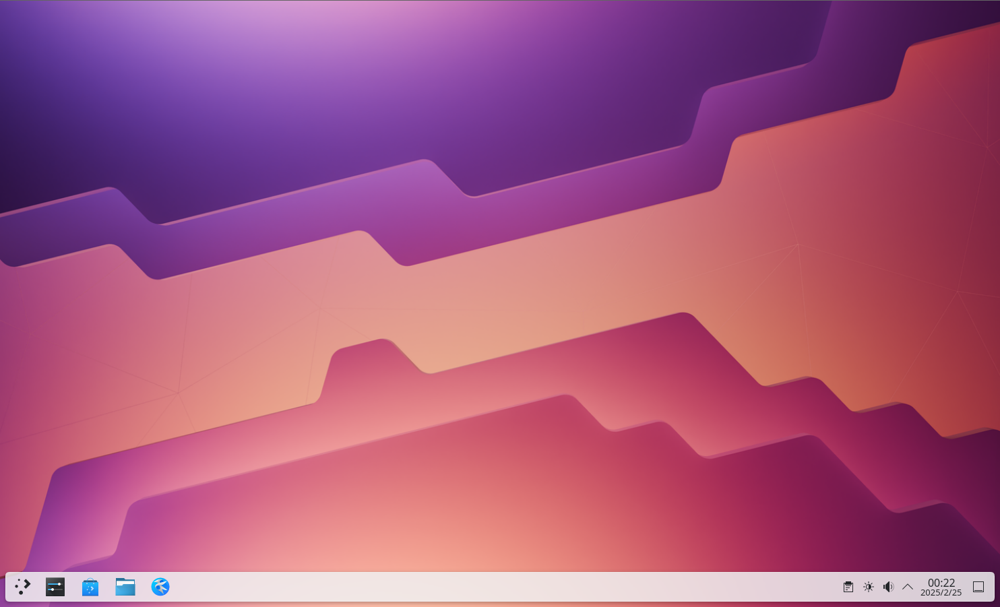
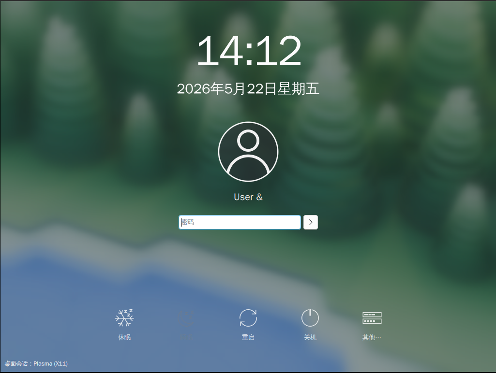
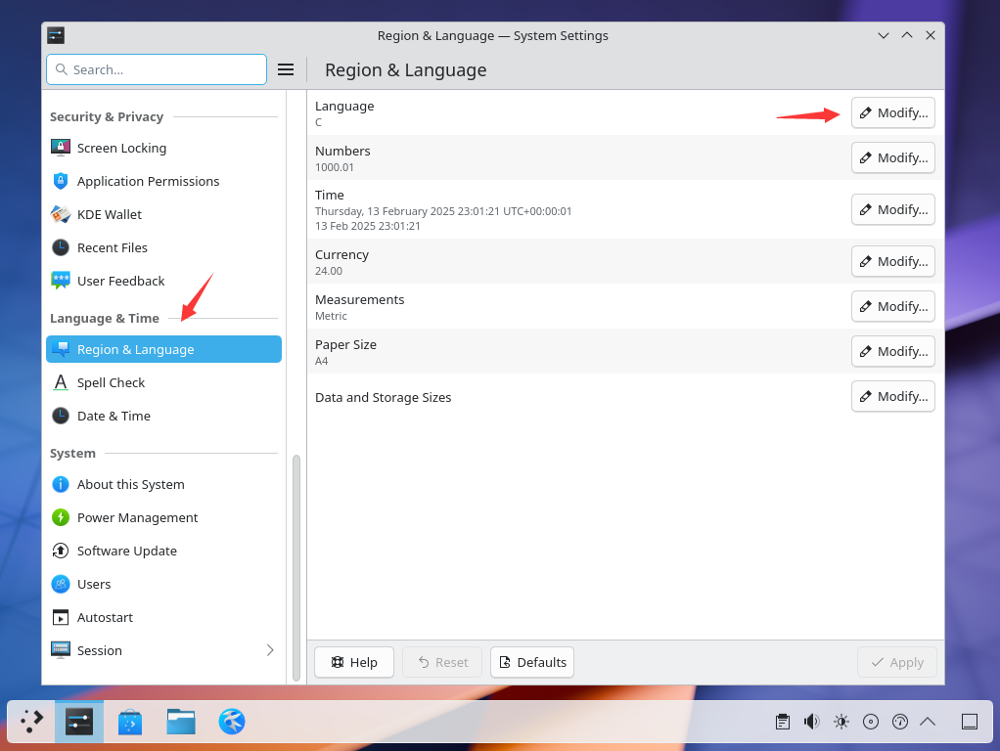
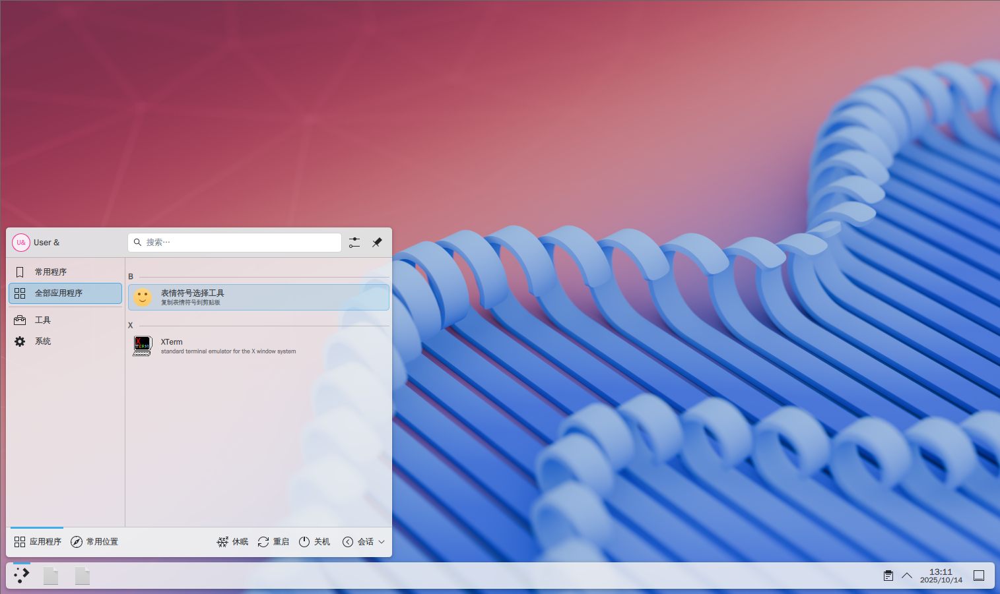
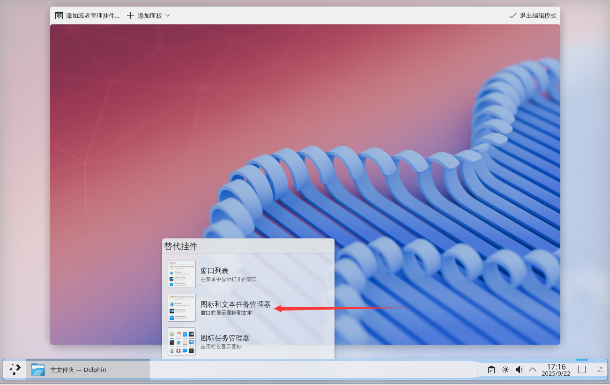
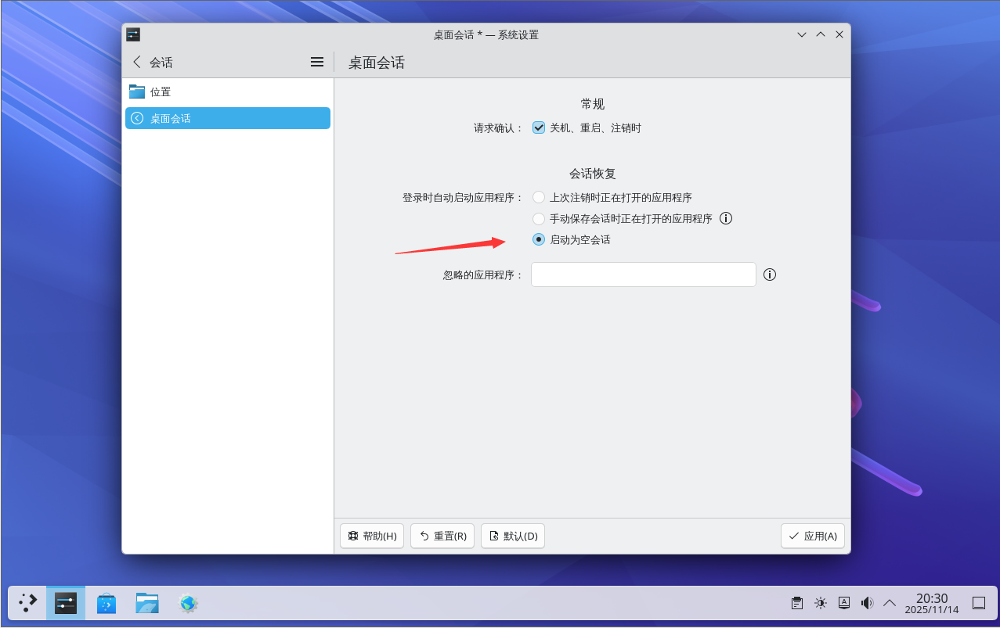
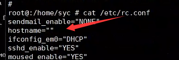
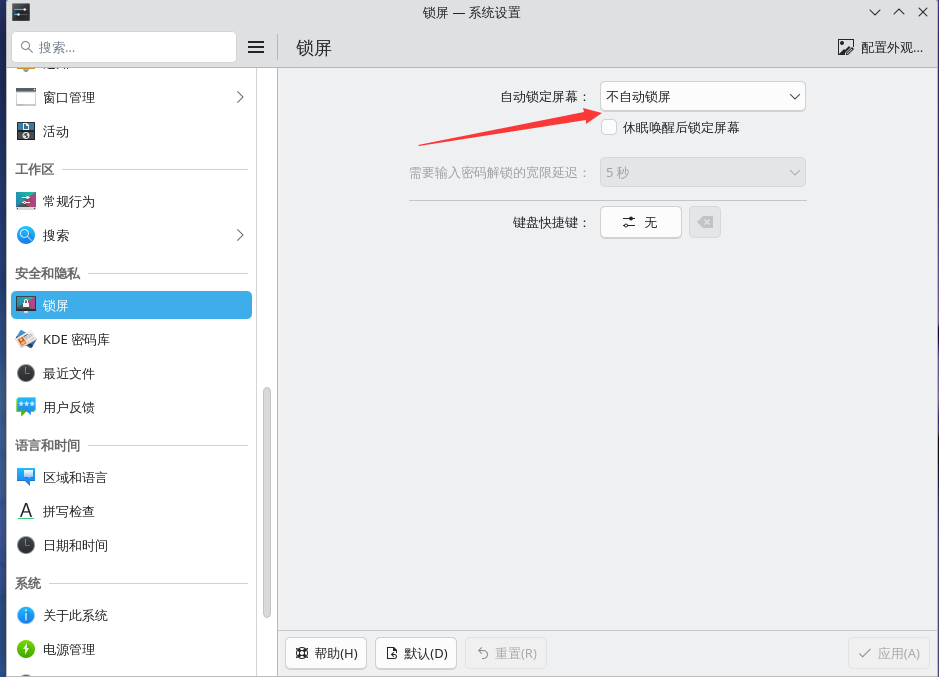

# 10.1 KDE 6 Desktop Environment (X11 Session)

KDE Plasma is an easy-to-use modern desktop environment that provides a collection of applications with consistent appearance and interaction experience, including unified menus and toolbars, keyboard shortcuts, color schemes, localization support, and centralized, dialog-driven desktop configuration tools.

The KDE desktop environment draws on the interaction paradigms of various desktop environments such as Windows, and the two share similarities in interface design. ~~It may also be that Windows drew more inspiration from the KDE desktop.~~

> **Tip**
>
> Video tutorial available at: FreeBSD Chinese Community. 003-FreeBSD14.2 Installing KDE6[EB/OL]. [2026-03-26]. <https://www.bilibili.com/video/BV12zAYeKEej>.

## Installing the Complete KDE Desktop Environment

> **Tip**
>
> Users who do not wish to bundle-install a large number of additional tools and software can use the minimal installation option below; users who do not need custom configuration can continue with this option.

- Install using pkg:

```sh
# pkg install xorg sddm kde wqy-fonts
```

> **Tip**
>
> If prompted that the `pkg` command is not found or the kde package is not provided, the binary package may not have been built yet, or you may need to switch the package repository branch. Refer to other relevant chapters in this book. If no binary package is available, install using Ports.

- Or install using Ports:

```sh
# cd /usr/ports/x11/xorg/ && make install clean
# cd /usr/ports/x11/kde/ && make install clean
# cd /usr/ports/x11/sddm/ && make install clean
# cd /usr/ports/x11-fonts/wqy/ && make install clean
```

### Package Description

| Package | Purpose |
| ------- | ------- |
| `xorg` | X Window System |
| `sddm` | Display Manager |
| `kde` | KDE Desktop Environment |
| `wqy-fonts` | WenQuanYi Chinese Fonts |

## Startup Configuration

D-Bus is used for inter-process communication in the desktop environment and is automatically installed as a dependency.

Enable D-Bus:

```sh
# service dbus enable
```

Enable the SDDM display manager:

```sh
# service sddm enable
```



## startx

```sh
$ echo "exec ck-launch-session startplasma-x11" > ~/.xinitrc
```

> **Note**
>
> If the above command was previously executed as root, new users still need to execute it once more to properly run startx (no root privileges or sudo required).

## Permission Configuration

Regular users must also be added to the `wheel` and `video` groups, otherwise some settings will not display and graphical interface functionality may be limited:

```sh
# pw groupmod wheel -m username
# pw groupmod video -m username
```

Replace "username" with the actual username.

## Configuring the Chinese Environment

### Set the SDDM Display Manager Language to Simplified Chinese

Execute the command:

```sh
# sysrc sddm_lang="zh_CN"
```

### System Chinese Environment Configuration Method ① User-level Configuration

Edit the **/etc/login.conf** file: find the `default:\` section and change `:lang=C.UTF-8` to `:lang=zh_CN.UTF-8`.

After editing, it should look like this:

```ini
      ...other parts omitted...

        :priority=0:\
        :umask=022:\
        :charset=UTF-8:\
        :lang=zh_CN.UTF-8:  <—— the original here is :lang=C.UTF-8

      ...other parts omitted...
```

Rebuild the capability database based on the **/etc/login.conf** file:

```sh
# cap_mkdb /etc/login.conf
```




### System Chinese Environment Configuration Method ② System Settings

Click the Application Launcher → System Settings → Language & Time, click Modify in the Language field of Region & Language, find and select "Simplified Chinese". If it displays as `□□□□`, check whether Chinese fonts are installed. Then click the Apply button; after logging out and logging back in, the system language will switch to Chinese.




### References

- FreeBSD Forums. SDDM login screen with KDE: change language?[EB/OL]. [2026-03-25]. <https://forums.freebsd.org/threads/sddm-login-screen-with-kde-change-language.80535/>. Discusses solutions for SDDM login screen language settings not taking effect.
- silversack. デスクトップ 環境 の 構築 - 4-7. LXQT のインストールと 設定 (LXQT 2.0.0)[EB/OL]. [2026-03-25]. <https://silversack.my.coocan.jp/bsd/fbsd11x_bde-4-7_lxqt.htm>. The LXQt installation and configuration section of a Japanese FreeBSD desktop environment construction guide.

## Appendix: Minimal KDE Desktop Installation

Installing **x11/kde** directly will also install various Plasma desktop components and **x11/kde-baseapps** as dependencies, which bundles a large number of utility software that may not be convenient for deployment and use in certain scenarios.

### Install using pkg

Basic desktop installation.

```sh
# pkg install xorg sddm plasma6-plasma-desktop plasma6-sddm-kcm wqy-fonts plasma6-kactivitymanagerd plasma6-kscreen plasma6-systemsettings
```

| Package | Purpose |
| ------- | ------- |
| **plasma6-kactivitymanagerd** | A system service that manages user activities and tracks usage patterns. Missing this service may cause the KDE desktop to not display properly |
| **plasma6-kscreen** | KDE screen manager. **Without this package installed, resolution cannot be adjusted** |
| **plasma6-sddm-kcm** | SDDM configuration module, used to configure SDDM in System Settings |
| **plasma6-systemsettings** | System Settings |

Packages already listed above are not repeated here.

Optional packages:

```sh
# pkg install konsole dolphin kate plasma6-plasma-systemmonitor plasma6-plasma-pa plasma6-discover kdeconnect-kde plasma6-plasma-workspace-wallpapers plasma6-plasma-disks ark
```

| Package | Purpose |
| ------- | ------- |
| **konsole** | Terminal command-line tool |
| **dolphin** | File manager |
| **kate** | Text editor |
| **plasma6-plasma-systemmonitor** | System monitor |
| **plasma6-plasma-pa** | Audio management |
| **plasma6-discover** | Software management |
| **kdeconnect-kde** | Mobile device and desktop interconnection |
| **plasma6-plasma-workspace-wallpapers** | Desktop wallpapers |
| **plasma6-plasma-disks** | Disk health (S.M.A.R.T.) monitoring |
| **ark** | Archive manager |

### Install using Ports

Basic desktop installation.

```sh
# cd /usr/ports/x11/xorg/ && make install clean
# cd /usr/ports/x11/plasma6-plasma-desktop/ && make install clean
# cd /usr/ports/deskutils/plasma6-sddm-kcm/ && make install clean
# cd /usr/ports/x11/sddm/ && make install clean
# cd /usr/ports/x11-fonts/wqy/ && make install clean
# cd /usr/ports/x11/plasma6-kscreen/ && make install clean
# cd /usr/ports/x11/plasma6-kactivitymanagerd/ && make install clean
# cd /usr/ports/sysutils/plasma6-systemsettings/ && make install clean
```

Optional Ports:

```sh
# cd /usr/ports/x11/konsole/ && make install clean # Terminal
# cd /usr/ports/x11-fm/dolphin/ && make install clean # File manager
# cd /usr/ports/editors/kate/ && make install clean # Text editor
# cd /usr/ports/sysutils/plasma6-plasma-systemmonitor/ && make install clean # System monitor
# cd /usr/ports/audio/plasma6-plasma-pa/ && make install clean # Audio manager
# cd /usr/ports/sysutils/plasma6-discover/ && make install clean # Software manager
# cd /usr/ports/deskutils/kdeconnect-kde/ && make install clean # Mobile device and desktop interconnection
# cd /usr/ports/x11-themes/plasma6-plasma-workspace-wallpapers/ && make install clean # Desktop wallpapers
# cd /usr/ports/sysutils/plasma6-plasma-disks/ && make install clean # Disk health (S.M.A.R.T.) monitoring
# cd /usr/ports/archivers/ark/ && make install clean # Archive manager
```

### xinitrc

> **Note**
>
> If using the KDE minimal installation option, the **.xinitrc** file must be configured.

### Minimal KDE Installation Screenshots

> **Tip**
>
> The KDE desktop installed with this option lacks many features. You can refer to the "Runtime dependencies" and "Library dependencies" of [x11/plasma6-plasma](https://www.freshports.org/x11/plasma6-plasma/) to add missing functionality.

Without optional packages installed:



## Appendix: Expanding Taskbar Icons

Right-click on an empty area of the desktop, then click "Enter Edit Mode".


Click on the empty area in the middle of the taskbar, then click "Show Alternatives".


Select "Icons and Text Task Manager" in the popup window.



## Appendix: Resolving Automatic Opening of Specific Programs at Startup

Open Settings, select "Session" → "Desktop Session", and in "Session Restore" on the right, change it to "Start with an empty session". Finally, click "Apply" in the bottom right corner to save.



## Desktop Theme Customization

The following installs the [WhiteSur](https://www.pling.com/p/1398840/) theme.

1. Download the theme source package: `git clone https://github.com/vinceliuice/WhiteSur-kde`
2. Enter the theme package directory: `cd WhiteSur-kde`
3. Modify the shebang: edit the `install.sh` file, change the first line to `#!/usr/local/bin/bash`, then save.
4. Run the installation: `bash install.sh`

### Background Images

[Download link](https://github.com/vinceliuice/WhiteSur-kde/tree/master/wallpaper).

## Troubleshooting and Outstanding Issues

### SDDM Login Crash

If the SDDM bottom options are not displayed in a VMware virtual machine, follow the tutorial in the virtual machine configuration chapter to set up automatic screen scaling.

### Starting SDDM Shows **/usr/bin/xauth**: `(stdin):1: bad display name`, but `startx` Still Works Normally

You need to check in the **/etc/rc.conf** file whether `hostname="XXX"` is set (this entry should exist and should not be `hostname=""`):



Set `hostname` as needed.

### Menu Missing Shutdown, Restart, and Other Options

Edit the **/etc/sysctl.conf** file and change the value of `security.bsd.see_other_uids` to `1`. It will take effect after reboot. `1` means enabled; the default value is `1`, which may have been incorrectly set during installation as a security hardening option.

If this does not work, check whether "User Session" (which reads the `.xinitrc` file) was selected on the SDDM interface; you should select `plasma-x11` instead.

#### References

- FreeBSD Forums. Missing power buttons when logged in from SDDM[EB/OL]. [2026-03-25]. <https://forums.freebsd.org/threads/missing-power-buttons-when-logged-in-from-sddm.88231/>. FreeBSD official forum discussion resolving the technical issue of missing power buttons after SDDM login.

### Disabling Automatic Screen Lock

Click "Settings" → "Security & Privacy" → "Screen Locking" → "Automatically lock screen" and select "Do not lock automatically", then click "Apply". (Locking the screen after waking from suspend can be configured as needed)

Log out and log back in for it to take effect.



### Status Bar Not Showing Time and Date

Open the timezone settings and select the "Asia/Shanghai" timezone. If it still does not work, update the relevant packages first.
