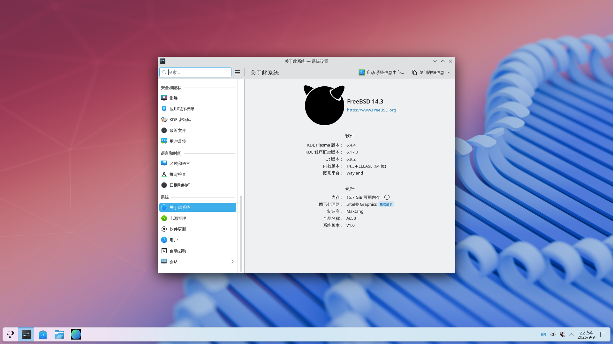
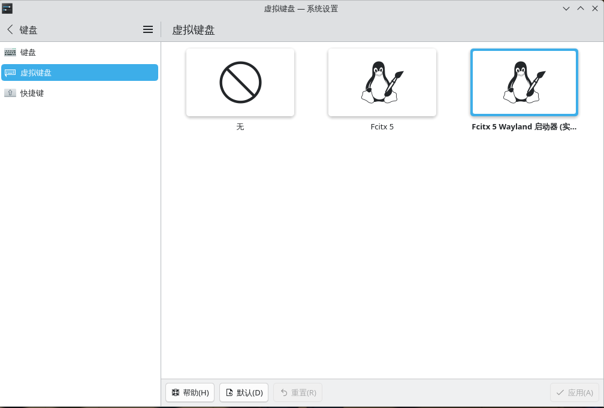
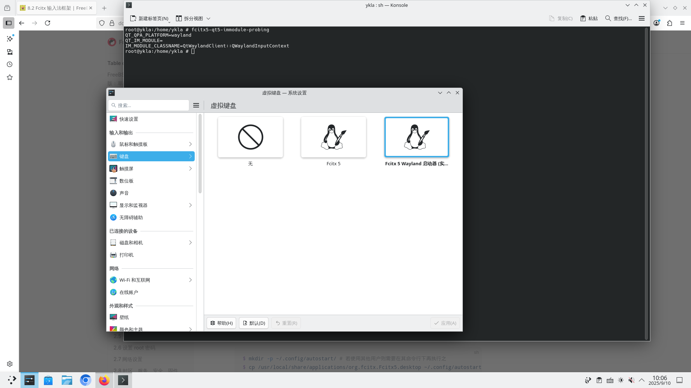
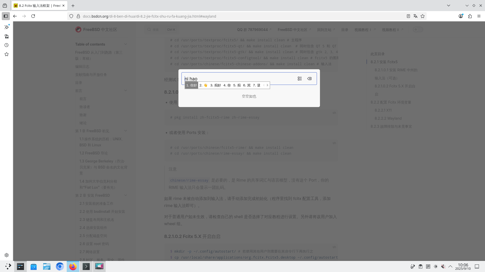
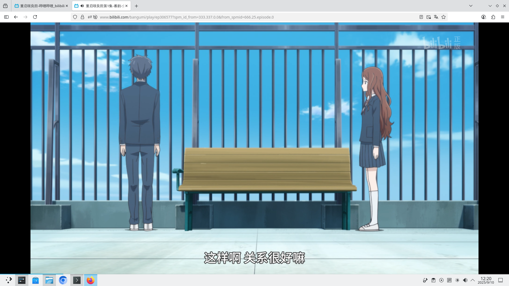

# 10.2 KDE 6 Desktop Environment (Wayland Session)

## Overview

Wayland is a display server protocol that replaces X11. KDE Plasma has gradually improved Wayland support since Plasma 5.4, becoming quite mature by 5.27 LTS, and KDE 6 further enhances it on this basis.

FreeBSD DRM driver porting only covers Intel, AMD, and NVIDIA GPUs; virtualization GPU drivers such as vmwgfx and virtio are not yet supported (see: freebsd/drm-kmod. Request to restore support for vboxvideo, vmwgfx and virtio DRM drivers #356[EB/OL]. [2026-04-04]. <https://github.com/freebsd/drm-kmod/issues/356>). Therefore, the content of this section cannot be reproduced in VMware, VirtualBox, or Virtio-based virtual machines; it must be operated on a physical host.

NVIDIA graphics cards have not been tested yet. This section uses the integrated graphics of an Intel 12th generation processor (i7-1260P) as the test environment.

Follow the preceding chapters to install DRM, KDE 6, Fcitx 5, Firefox browser, and other packages, **and configure the DRM graphics driver.** Only install the remaining packages without configuring them for now. Make sure to add the user to the video group.

## User Permission Configuration: Add to video Group

Add the specified user to the video group to gain permission to access graphics card devices:

```sh
# pw groupmod video -m actual_username
```

## seatd Related

### Installing seatd

seatd is a seat management daemon used to manage Wayland sessions and device access in non-systemd environments.

- Install using pkg:

```sh
# pkg install seatd
```

- Or install via Ports:

```sh
# cd /usr/ports/sysutils/seatd/
# make install clean
```

### Configuring the seatd Service

Add and enable the service:

```sh
# service dbus enable # Set D-Bus service to start on boot
# service seatd enable # Set Seatd service to start on boot
```

## Starting KDE 6

### Method ① SDDM

Set the SDDM service to start on boot:

```sh
# service sddm enable
```

Start KDE using the SDDM display manager, and select the "Wayland" session at the login screen.

### Method ②: Start via Script

- Create a script `kde.sh` in **~/**:

```sh
#! /bin/sh
/usr/local/bin/ck-launch-session /usr/local/lib/libexec/plasma-dbus-run-session-if-needed /usr/local/bin/startplasma-wayland # Command to start the desktop
```

- Grant executable permission to **~/kde.sh**:

```sh
$ chmod 755 ~/kde.sh
```

> **Note**
>
> The SDDM service must be stopped to use this script. Check **/etc/rc.conf** for the line `sddm_enable="YES"` and remove it if present. Press Ctrl+Alt+F2 to switch to a TTY, log in as root, and enter `service sddm stop` to stop the SDDM service.

- Enter KDE

At this point, log in as a regular user in the TTY interface, with no X11 sessions running (if any exist, disable the relevant services and reboot before trying again).

```sh
$ sh ~/kde.sh
```

## Screenshots



> **Tip**
>
> The image above shows "Intel UHD Graphics" instead of "Iris Xe Graphics" because the system has not enabled certain hardware acceleration features (related to memory configuration). ~~Unable to afford a second DDR5 memory stick.~~ See: Intel® Iris® Xe Graphics Shows As Intel® UHD Graphics in the Intel® Graphics Command Center and Device Manager[EB/OL]. [2026-03-26]. <https://www.intel.com/content/www/us/en/support/articles/000059744/graphics.html> (the Chinese translation on the corresponding webpage is inaccurate).

- Display the current session type (e.g., X11 or Wayland)

```sh
# echo $XDG_SESSION_TYPE
```


## Configuring the Fcitx 5 Input Method Framework

Configure Fcitx 5 to start automatically:

```sh
$ mkdir -p ~/.config/autostart/ # Create autostart directory
$ cp /usr/local/share/applications/org.fcitx.Fcitx5.desktop ~/.config/autostart/ # Automatically start Fcitx 5 on system boot
```

When entering the KDE Wayland desktop for the first time, KDE will display a notification in the bottom right corner indicating that the input method requires configuration in the virtual keyboard settings within System Settings. Pay attention to this notification. If this setting is not completed, you will be unable to switch input methods or input Chinese.


Open KDE System Settings: find "Keyboard" → "Virtual Keyboard"



Select "Fcitx 5 Wayland Launcher (Experimental)"



Chinese input works in Konsole terminal, Firefox, and Chromium (launched with `chrome --no-sandbox`).



## Video Playback Test



## Troubleshooting and Outstanding Issues

### No Sound When Logged in as root

The volume control widget in the bottom right corner shows "Not connected to audio service". You can set PulseAudio to start automatically: add the service in KDE settings and grant it executable permission.

## References

- Euroquis. KDE Plasma 6 Wayland on FreeBSD[EB/OL]. [2026-03-25]. <https://euroquis.nl/kde/2025/09/07/wayland.html>. Provides a technical guide for configuring KDE Plasma 6 Wayland sessions on FreeBSD, explicitly noting the necessity of the seatd service.
