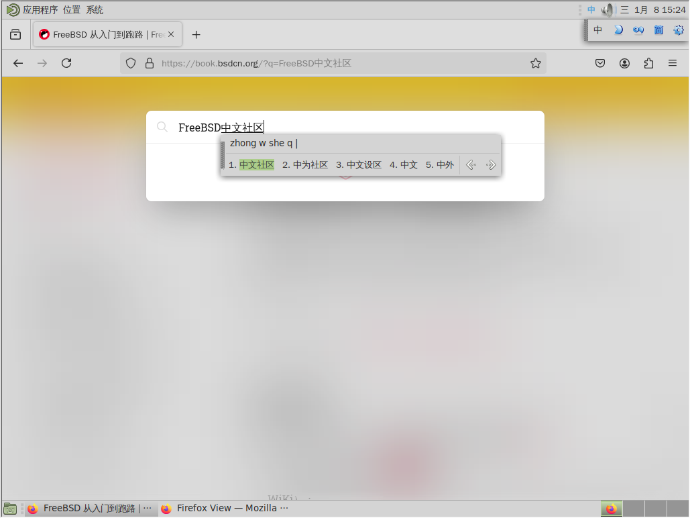
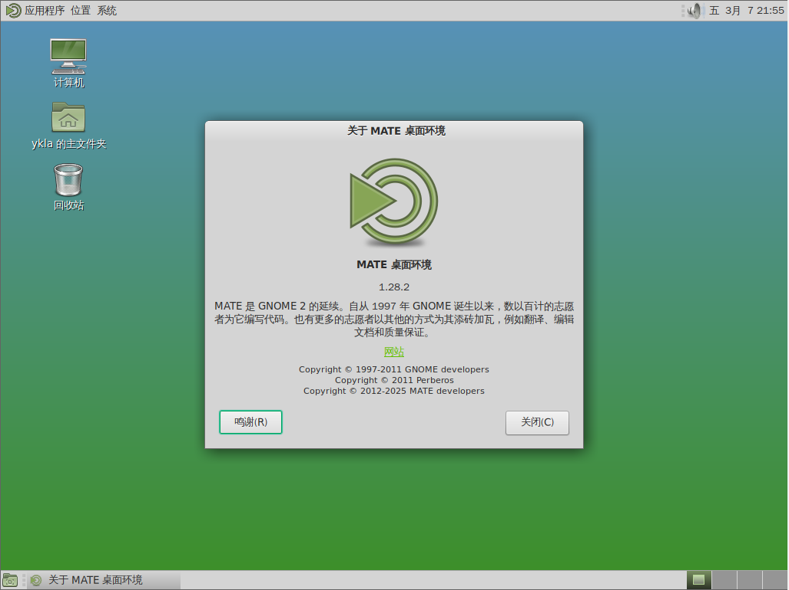
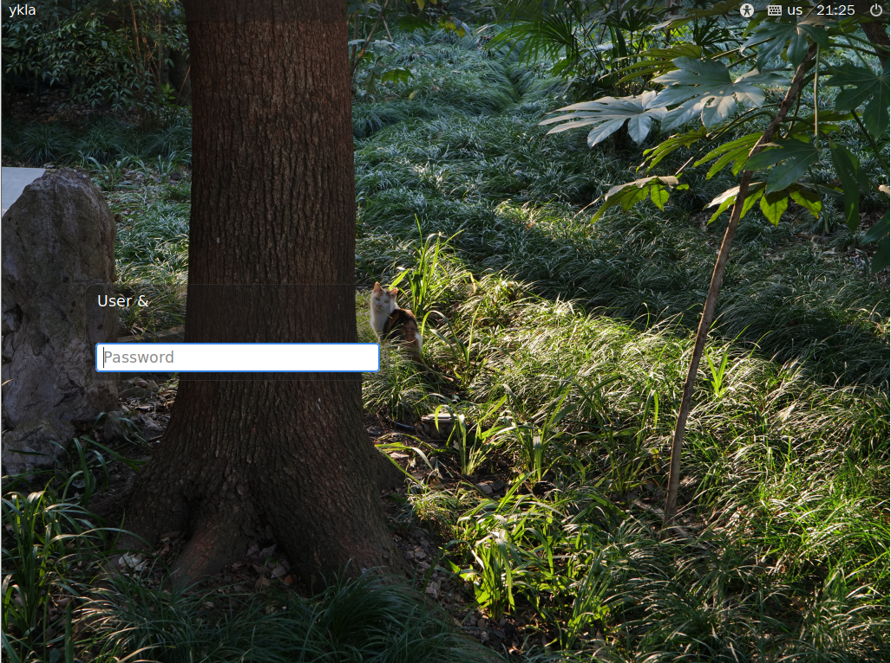

# 10.3 MATE

## MATE Desktop Environment Overview

MATE is a desktop environment forked from GNOME 2, and its design philosophy preserves the traditional interaction style of GNOME 2. "Mate" also refers to yerba mate (Ilex paraguariensis), the tea made from which is widely popular in South America.

## Installing the MATE Desktop Environment

- Install using pkg:

```sh
# pkg install mate xorg wqy-fonts lightdm slick-greeter xdg-user-dirs
```

- Or install using Ports:

```sh
# cd /usr/ports/x11/mate/ && make install clean
# cd /usr/ports/x11/xorg/ && make install clean
# cd /usr/ports/x11-fonts/wqy/ && make install clean
# cd /usr/ports/x11/lightdm/ && make install clean
# cd /usr/ports/x11/slick-greeter/ && make install clean
# cd /usr/ports/devel/xdg-user-dirs/ && make install clean
```

### Package Description

| Package | Description |
| ------- | ----------- |
| `mate` | MATE Desktop Environment |
| `xorg` | X Window System |
| `wqy-fonts` | WenQuanYi Chinese Fonts |
| `lightdm` | Lightweight Display Manager LightDM |
| `slick-greeter` | LightDM login screen plugin; LightDM requires at least one greeter to function properly |
| `xdg-user-dirs` | Automatically manages home directory subdirectories (optional installation) |

## Enable Services After Installation

Set the D-Bus service to start on boot:

```sh
# service dbus enable
```

Set the LightDM display manager to start on boot:

```sh
# service lightdm enable
```

## Configuring LightDM

Edit the **/usr/local/etc/lightdm/lightdm.conf** file and set `greeter-session` to `slick-greeter`.

## startx Configuration File

Add the following content to the **~/.xinitrc** file to start the MATE desktop session using the startx command:

```sh
exec mate-session
```

## Configuring the Chinese Desktop Environment

Edit the **/etc/login.conf** file: find the `default:\` section and change `:lang=C.UTF-8` to `:lang=zh_CN.UTF-8`.

Rebuild the capability database based on the **/etc/login.conf** file:

```sh
# cap_mkdb /etc/login.conf
```

## Input Method



The IBus input method framework has been tested and works; refer to the input method related chapters for specific configuration.

## Desktop Gallery




## Troubleshooting and Outstanding Issues

### Configuring slick-greeter

Create the **/usr/local/etc/lightdm/slick-greeter.conf** file and write the following configuration.

```ini
[Greeter]
# Set the background image path for the login screen
background=/home/ykla/cat.png

# Whether to draw user-customized background images
draw-user-backgrounds=false

# Set the GTK+ theme name
theme-name=Dracula

# Set the icon theme name
icon-theme-name=Adwaita

# Whether to show the hostname
show-hostname=true

# Set the font name and size
font-name=Sans 12

# Whether to show the virtual keyboard option
show-keyboard=true

# Whether to show power management options (e.g., shutdown, restart)
show-power=true

# Whether to show the clock
show-clock=true

# Whether to show the quit option
show-quit=true
```



#### References

- FreeBSD Forums. lightdm not reading slick-greeter.conf[EB/OL]. [2026-03-25]. <https://forums.freebsd.org/threads/lightdm-not-reading-slick-greeter-conf.92256/>. Resolves the technical issue of LightDM not correctly reading the slick-greeter configuration file.
