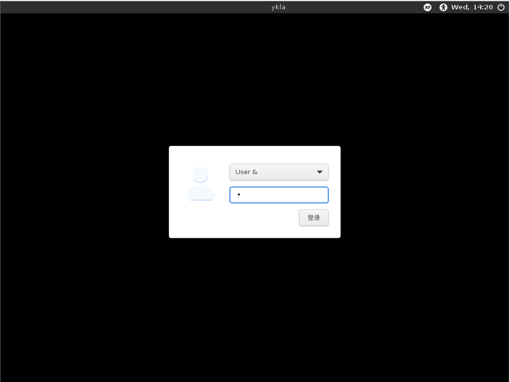

# 10.4 Xfce

Xfce is a lightweight desktop environment based on GTK+, providing a simple, efficient, and easy-to-use desktop experience. It is fully configurable, featuring a main panel with menus, applets, and application launchers, and provides a file manager and sound manager with theme support. Due to its fast, lightweight, and efficient nature, it is well-suited for computers with lower specifications or limited memory.

It is worth mentioning that the Xfce logo is a mouse 🐀. A user once shared an anecdote claiming that because the default Xfce wallpaper featured a mouse 🐀, their computer screen was scratched by a cat 🐈 (SanjaytheToilet. [joke] The default desktop startup screen causes damage to monitor![EB/OL]. (2015-08-04)[2026-04-04]. <https://bugzilla.xfce.org/show_bug.cgi?id=12117>.).

## Installing the Xfce Desktop Environment

- Install via pkg

```sh
# pkg install xorg lightdm lightdm-gtk-greeter xfce wqy-fonts xdg-user-dirs xfce4-goodies lightdm-gtk-greeter-settings
```

- Or install via ports:

```sh
# cd /usr/ports/x11/xorg/ && make install clean
# cd /usr/ports/x11-wm/xfce4 && make install clean # Note the number 4 in the package name
# cd /usr/ports/x11/xfce4-goodies/ && make install clean
# cd /usr/ports/x11-fonts/wqy/ && make install clean
# cd /usr/ports/x11/lightdm/ && make install clean
# cd /usr/ports/x11/lightdm-gtk-greeter/ && make install clean
# cd /usr/ports/x11/lightdm-gtk-greeter-settings/ && make install clean
# cd /usr/ports/devel/xdg-user-dirs/ && make install clean
```

### Package Description

| Package | Description |
| ------- | ----------- |
| `xorg` | X Window System |
| `lightdm` | Lightweight Display Manager LightDM |
| `lightdm-gtk-greeter` | LightDM GTK+ login screen plugin |
| `xfce` | Xfce Desktop Environment |
| `wqy-fonts` | WenQuanYi Chinese Fonts |
| `xdg-user-dirs` | Manage user home directories |
| `xfce4-goodies` | Xfce add-ons and plugins collection |
| `lightdm-gtk-greeter-settings` | Graphical tool for configuring the LightDM GTK+ login screen |

## startx Command

Write the Xfce startup script to the **~/.xinitrc** file to start Xfce using the startx command:

```sh
$ echo "/usr/local/etc/xdg/xfce4/xinitrc" > ~/.xinitrc
```

Write the Xfce startup script to the **~/.xsession** file to start Xfce via the display manager:

```sh
$ echo "/usr/local/etc/xdg/xfce4/xinitrc" > ~/.xsession
```

## Starting Services

Set the D-Bus service to start on boot:

```sh
# service dbus enable
```

Set the LightDM display manager to start on boot:

```sh
# service lightdm enable
```

## Setting the Chinese Environment

Edit the **/etc/login.conf** file: find the `default:\` section and change `:lang=C.UTF-8` to `:lang=zh_CN.UTF-8`.

You also need to rebuild the capability database based on the **/etc/login.conf** file:

```sh
# cap_mkdb /etc/login.conf
```

## Screenshots




## Global Menu (Optional)

Install using pkg:

```sh
# pkg install xfce4-appmenu-plugin appmenu-gtk-module appmenu-registrar
```

Or install using Ports:

```sh
# cd /usr/ports/x11/xfce4-appmenu-plugin/ && make install clean
# cd /usr/ports/x11/gtk-app-menu/ && make install clean
# cd /usr/ports/x11/appmenu-registrar/ && make install clean
```

Review the post-installation instructions and configure accordingly.

```sh
$ xfconf-query -c xsettings -p /Gtk/ShellShowsMenubar -n -t bool -s true  # Enable GTK menubar display
$ xfconf-query -c xsettings -p /Gtk/ShellShowsAppmenu -n -t bool -s true  # Enable GTK application menu display
$ xfconf-query -c xsettings -p /Gtk/Modules -n -t string -s "appmenu-gtk-module"  # Set GTK module to appmenu-gtk-module
```

## XTerm Terminal Dynamic Title

### sh

Edit the **~/.shrc** file and add:

```sh
if [ -t 1 ]; then
  while :; do
    printf '\033]0;%s\007' "$PWD"
    printf '\n$ '
    if ! IFS= read -r cmd; then
      break
    fi
    printf '\033]0;%s\007' "$cmd"
    eval "$cmd"
  done
  exit
fi
```

> **Warning**
>
> This script uses `eval` which poses an injection risk! Use with caution.

### csh

Edit the **~/.cshrc** file and add:

```sh
if ( $?TERM && $TERM =~ xterm* ) then
    set host = `hostname`
    alias postcmd 'rehash; printf -- "\033]2;%s\007" "${user}@${host}: ${cwd}"'
endif
```

### tcsh

Edit the **~/.tcshrc** file and add:

```sh
switch ($TERM)
case xterm*:
    set prompt="%{\033]0;%n@%m: %~\007%}%# "
    breaksw
default:
    set prompt="%# "
    breaksw
endsw
```

### Bash

Edit the **~/.bashrc** file and add:

```sh
case $TERM in
         xterm*)
             PS1="\[\033]0;\u@\h: \w\007\]bash\\$ "
             ;;
         *)
             PS1="bash\\$ "
             ;;
     esac
```

### Zsh

Edit the **~/.zshrc** file and add:

```sh
autoload -Uz add-zsh-hook

function xterm_title_precmd () {
	print -Pn -- '\e]2;%n@%m %~\a'
	[[ "$TERM" == 'screen'* ]] && print -Pn -- '\e_\005{2}%n\005{-}@\005{5}%m\005{-} \005{+b 4}%~\005{-}\e\\'
}

function xterm_title_preexec () {
	print -Pn -- '\e]2;%n@%m %~ %# ' && print -n -- "${(q)1}\a"
	[[ "$TERM" == 'screen'* ]] && { print -Pn -- '\e_\005{2}%n\005{-}@\005{5}%m\005{-} \005{+b 4}%~\005{-} %# ' && print -n -- "${(q)1}\e\\"; }
}

if [[ "$TERM" == (Eterm*|alacritty*|aterm*|foot*|gnome*|konsole*|kterm*|putty*|rxvt*|screen*|wezterm*|tmux*|xterm*) ]]; then
	add-zsh-hook -Uz precmd xterm_title_precmd
	add-zsh-hook -Uz preexec xterm_title_preexec
fi
```

### References

- Oracle Corporation. 6.1 Dynamically Setting the Title Does Not Work[EB/OL]. [2026-03-25]. <https://docs.oracle.com/cd/E19683-01/817-1951/6mhl8aiii/index.html>. The bash configuration is from this source.
- Wamphyre. BSD-XFCE[EB/OL]. [2026-03-25]. <https://web.archive.org/web/20260121072214/https://github.com/Wamphyre/BSD-XFCE>. Configuration reference collection.
- Arch Linux Project. Zsh[EB/OL]. [2026-03-25]. <https://wiki.archlinux.org/title/Zsh>. This document provides a detailed tutorial on Zsh configuration; the Zsh configuration in this section is derived from it.

## Troubleshooting and Outstanding Issues

To dynamically display the current process, currently only sh supports this functionality.
