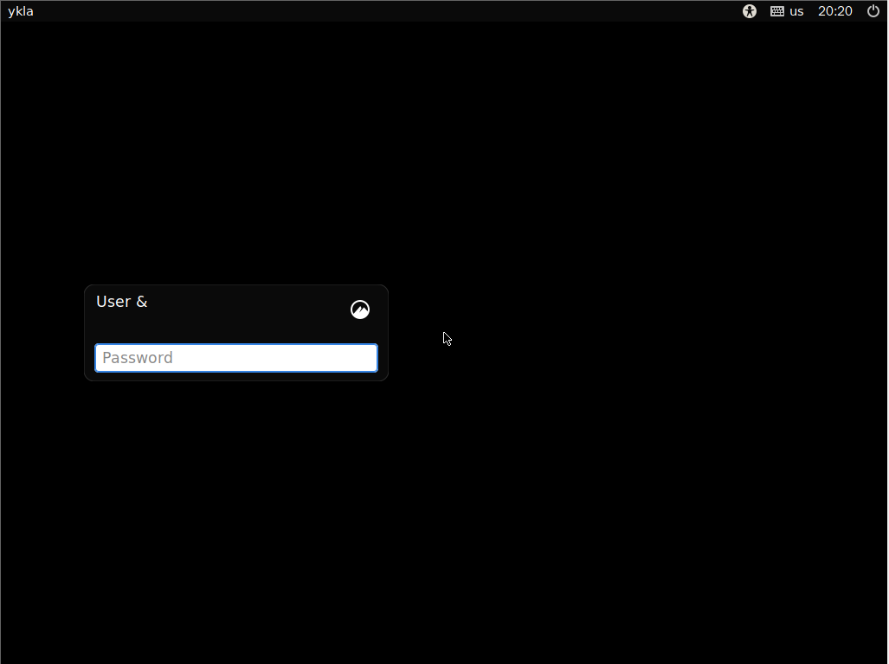
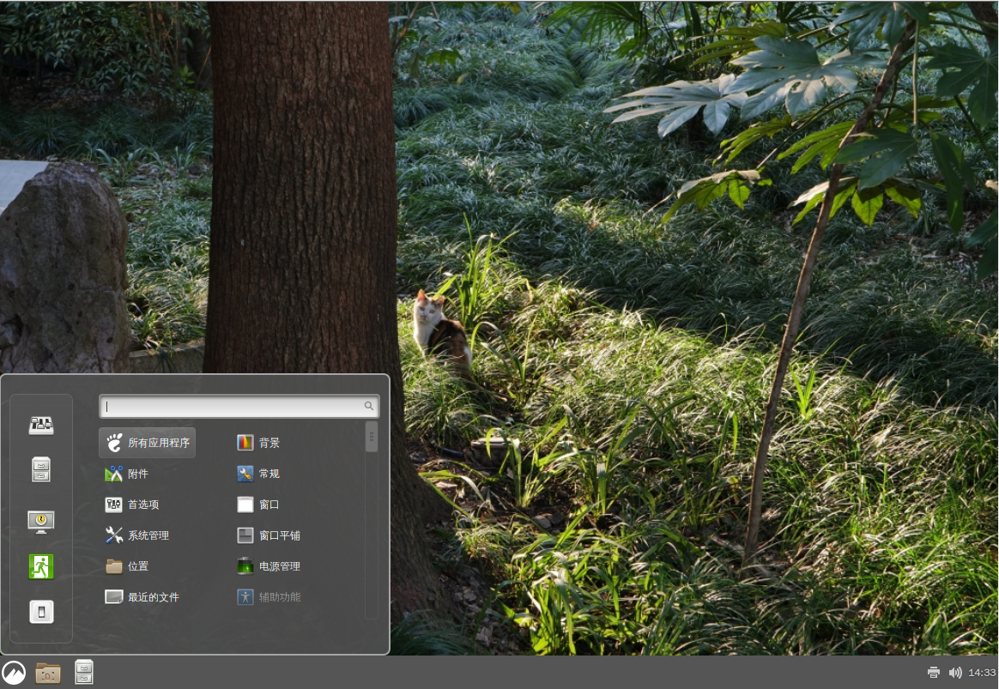

# 10.5 Cinnamon

Cinnamon is a core component of the Linux Mint project, maintaining a traditional desktop interaction style while incorporating innovative features and the original user experience. Its desktop layout is similar to GNOME 2, with underlying technology derived from GNOME Shell. Cinnamon focuses on user familiarity, providing an easy-to-use and comfortable desktop experience.

## Installing the Cinnamon Desktop Environment

- Install using pkg:

```sh
# pkg install xorg lightdm slick-greeter cinnamon wqy-fonts xdg-user-dirs
```

- Or install using Ports:

```sh
# cd /usr/ports/x11/xorg/ && make install clean
# cd /usr/ports/x11/cinnamon/ && make install clean
# cd /usr/ports/x11-fonts/wqy/ && make install clean
# cd /usr/ports/x11/lightdm/ && make install clean
# cd /usr/ports/x11/slick-greeter/ && make install clean
# cd /usr/ports/devel/xdg-user-dirs/ && make install clean
```

### Package Description

| Package | Description |
| ------- | ----------- |
| `xorg` | X Window System |
| `lightdm` | Lightweight Display Manager LightDM |
| `slick-greeter` | LightDM login screen plugin; LightDM requires at least one greeter to function properly |
| `cinnamon` | A desktop environment forked from GNOME Shell with a layout similar to GNOME 2 |
| `wqy-fonts` | WenQuanYi Chinese Fonts |
| `xdg-user-dirs` | Manages user directories such as "Desktop", "Downloads", etc. |

## Configuring startx

Edit the **~/.xinitrc** file and add:

```sh
exec cinnamon-session
```

The Cinnamon desktop can be started using the startx command.

## Configuring LightDM

Edit the **/usr/local/etc/lightdm/lightdm.conf** file and set `greeter-session` to `slick-greeter`.

## Mounting the proc File System

Edit the **/etc/fstab** file and add:

```ini
proc /proc procfs rw 0 0
```

Mount the `procfs` file system to **/proc** in read-write mode.

## Service Management

Set the D-Bus service to start on boot:

```sh
# service dbus enable
```

Set the LightDM display manager to start on boot:

```sh
# service lightdm enable
```

## Configuring the Chinese Environment

Edit the **/etc/login.conf** file: find the `default:\` section (line 24 at the time of writing) and change `:lang=C.UTF-8` to `:lang=zh_CN.UTF-8`.

You also need to rebuild the capability database based on the **/etc/login.conf** file for the changes to take effect:

```sh
# cap_mkdb /etc/login.conf
```

## Desktop Gallery




Note: The default wallpaper is black, which is normal.



Custom wallpaper.

## Appendix: Cinnamon: Distinguishing the Concepts of Rougui, Guipi, Guizhi, Yangui

Cinnamon refers to rougui (Ceylon cinnamon/Sri Lankan cinnamon), which is different from the guipi commonly used in daily cooking (both are bark from cinnamon trees, but from different species). It is a spice commonly used in making iced tea, Western pastries, and coffee.

Ceylon cinnamon is primarily produced in Sri Lanka and has a complex citrus-sweet aroma. Guipi (yangui is high-quality guipi with the green skin removed) is mainly produced in southern China and Vietnam, with a pungent, spicy traditional Chinese medicine scent.

The *Pharmacopoeia of the People's Republic of China, Part I, Medicinal Materials and Prepared Slices* (2025 Edition) defines rougui as: "This product is the dried bark of *Cinnamomum cassia* Presl, a plant of the Lauraceae family. It is mostly harvested in autumn and dried in the shade." This refers not to Ceylon cinnamon but to guipi. The tender young branches of the cinnamon tree are called guizhi. Ceylon cinnamon is actually "the bark of *Cinnamomum zeylanicum* Bl., a plant of the Lauraceae family." In plant taxonomy, Ceylon cinnamon and guipi both belong to the same section Cinnamomum sect. Cinnamomum.

Ceylon cinnamon is generally sold ground into powder, and its price is typically several to hundreds of times that of guipi.
