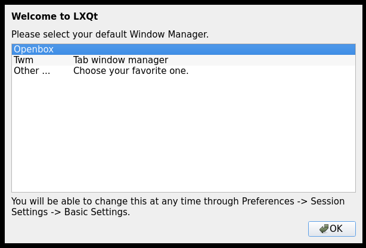
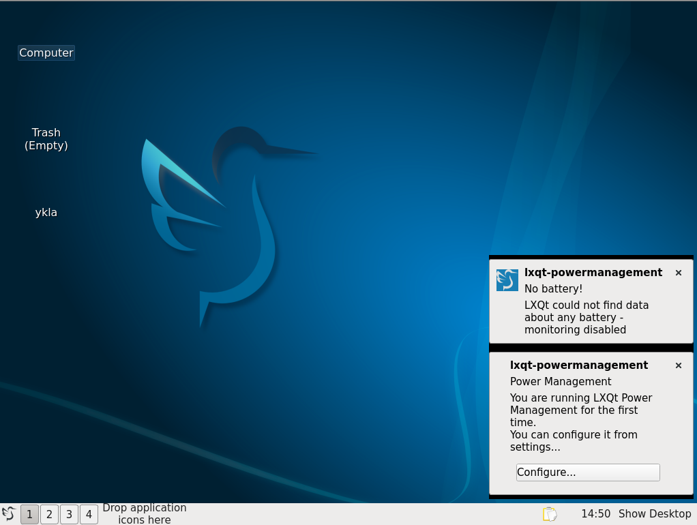
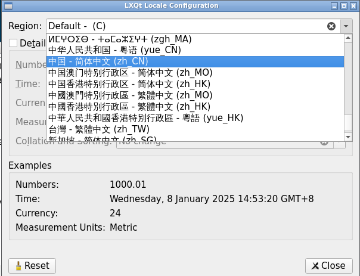

# 10.6 LXQt

LXQt is a lightweight desktop environment based on Qt, formed by the merger of the LXDE-Qt and Razor-qt projects (merger announced in July 2013, first version 0.7.0 released in May 2014), designed for users who value simplicity, speed, and an intuitive interface. Unlike most desktop environments, LXQt runs well even on computers with weaker performance.

## Installing the LXQt Desktop Environment

- Install via pkg:

```sh
# pkg install xorg sddm lxqt gvfs wqy-fonts xdg-user-dirs
```

- Or install using Ports:

```sh
# cd /usr/ports/x11/xorg/ && make install clean
# cd /usr/ports/x11-wm/lxqt/ && make install clean
# cd /usr/ports/x11-fonts/wqy/ && make install clean
# cd /usr/ports/x11/sddm/ && make install clean
# cd /usr/ports/filesystems/gvfs/ && make install clean
# cd /usr/ports/devel/xdg-user-dirs/ && make install clean
```

### Package Description

| Package | Description |
| ------- | ----------- |
| `xorg` | X Window System |
| `sddm` | Display Manager |
| `lxqt` | LXQt Desktop Environment |
| `gvfs` | GNOME Virtual File System; LXQt requires this component to open "Computer" and "Network" locations, otherwise it shows `Operation not supported` |
| `wqy-fonts` | WenQuanYi Chinese Fonts |
| `xdg-user-dirs` | Manages user directories such as "Desktop" and "Downloads", and handles localization of directory names |

## Service Management

Set the D-Bus service to start on boot:

```sh
# service dbus enable
```

Set the SDDM display manager to start on boot:

```sh
# service sddm enable
```

## Mounting the proc File System

Edit the **/etc/fstab** file and add the following line:

```ini
proc	/proc	procfs	rw	0	0
```

Mount the `procfs` file system to **/proc** in read-write mode.

## Starting LXQt via startx

Write the startup command to the **~/.xinitrc** file to start the LXQt desktop environment:

```sh
$ echo "exec ck-launch-session startlxqt" > ~/.xinitrc
```

This command should be executed as the actual logged-in user.

## Setting the Chinese Environment

### Setting the Chinese Environment for the SDDM Display Manager

```sh
# sysrc sddm_lang="zh_CN"
```






### Setting the Chinese Environment for the LXQt Desktop Environment

After entering LXQt, click Menu → "Preferences" → "LXQt Settings" → "Locale" → "Region", and select Chinese from the dropdown menu.




## Troubleshooting and Outstanding Issues

### Desktop Icons Not Displaying

The required icon themes must be installed first. Then: Menu → "Preferences" → "LXQt Settings" → "Appearance" → "Icons Theme", select the installed icon theme, click "Apply", and log back in.

## Appendix: LXDE Desktop Environment

> **Note**
>
> LXDE has entered maintenance mode with essentially stalled development; the main developers have moved to LXQt. The last major version of LXDE is the 0.10 series (released around 2021), with only minimal maintenance updates since then and no new feature development. New users are advised to prioritize LXQt.

LXDE is a lightweight desktop environment focused on resource efficiency and a simple interactive experience, performing well on low-specification hardware platforms. However, with the migration to LXQt, LXDE receives increasingly less maintenance.

### Installing the LXDE Desktop Environment

- Install using pkg:

```sh
# pkg install lxde-meta xorg lightdm lightdm-gtk-greeter wqy-fonts xdg-user-dirs
```

- Or install using Ports:

```sh
# cd /usr/ports/x11/lxde-meta/ && make install clean
# cd /usr/ports/x11/xorg/ && make install clean
# cd /usr/ports/x11/lightdm/ && make install clean
# cd /usr/ports/x11/lightdm-gtk-greeter/ && make install clean
# cd /usr/ports/x11-fonts/wqy/ && make install clean
# cd /usr/ports/devel/xdg-user-dirs/ && make install clean
```

#### Package Description

| Package | Description |
| ------- | ----------- |
| `xorg` | X Window System |
| `lxde-meta` | Meta package for the LXDE desktop environment |
| `lightdm` | Lightweight Display Manager LightDM |
| `lightdm-gtk-greeter` | LightDM GTK+ login screen plugin; LightDM requires at least one greeter to function properly |
| `wqy-fonts` | WenQuanYi Chinese Fonts |
| `xdg-user-dirs` | Manages user directories such as "Desktop", "Downloads", etc. |

### startx

Edit the **~/.xinitrc** file and add the following content to start the LXDE desktop environment using the startx command:

```sh
exec startlxde
```

### Startup Items

Set the D-Bus service to start on boot:

```sh
# service dbus enable
```

Set the LightDM display manager to start on boot:

```sh
# service lightdm enable
```

### Mounting the proc File System

Edit the **/etc/fstab** file and add the following line:

```ini
proc           /proc       procfs  rw  0   0
```

### Chinese Configuration

Add the following to the **/etc/rc.conf** file:

```ini
lightdm_env="LC_MESSAGES=zh_CN.UTF-8"
```

Set the LightDM environment variable to specify the system message language as Chinese.

You also need to edit the **/etc/login.conf** file, find the `default:\` section, and change `:lang=C.UTF-8` to `:lang=zh_CN.UTF-8`. Finally, rebuild the capability database based on the **/etc/login.conf** file:

```sh
# cap_mkdb /etc/login.conf
```

### Desktop Gallery


### References

- FreeBSD Project. Install & Configure a Desktop Environment: LXDE[EB/OL]. [2026-03-25]. <https://wiki.freebsd.org/LXDE>. LXDE desktop environment installation and configuration guide.
