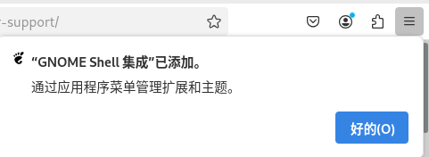
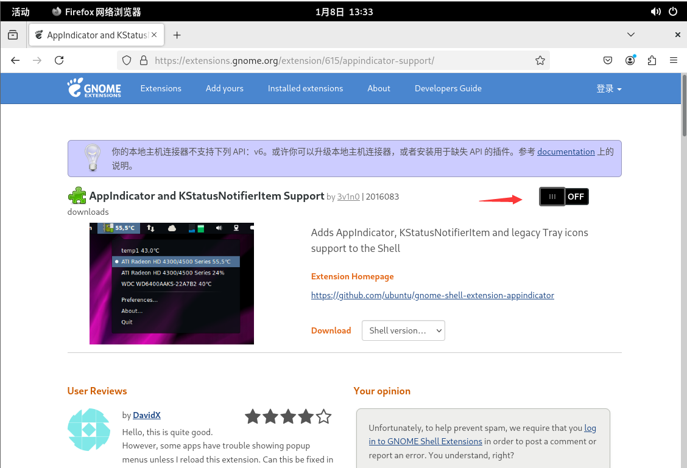
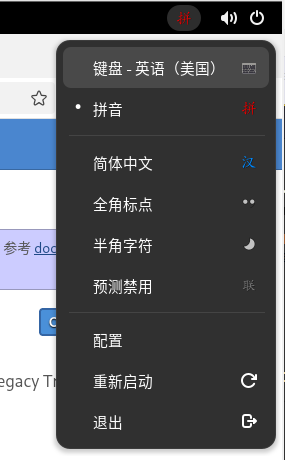
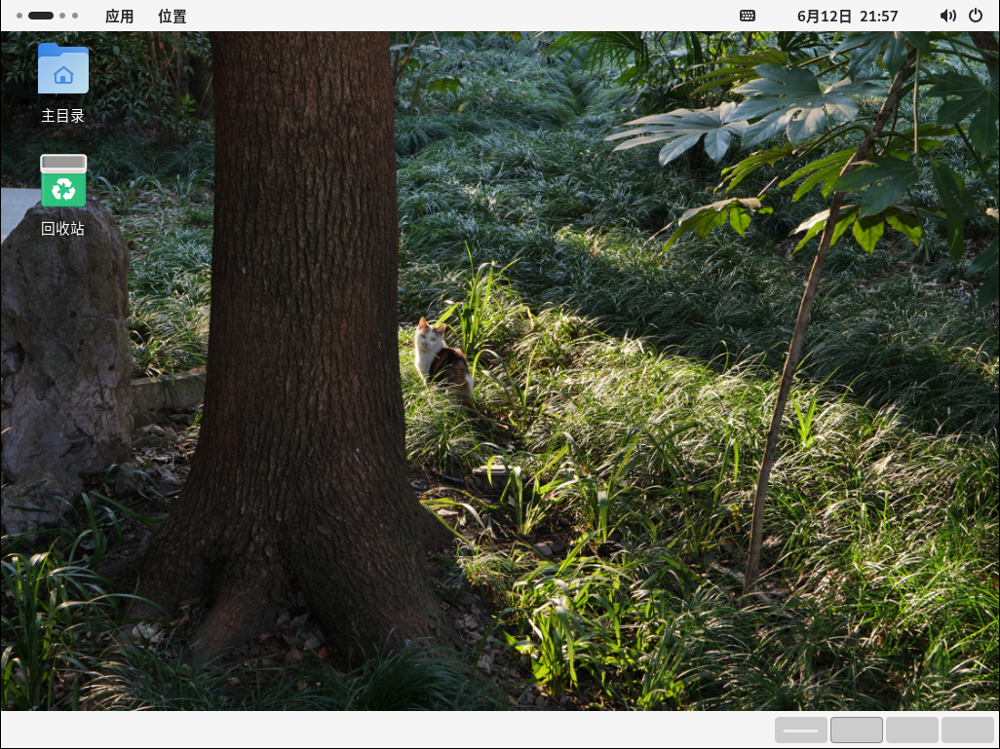
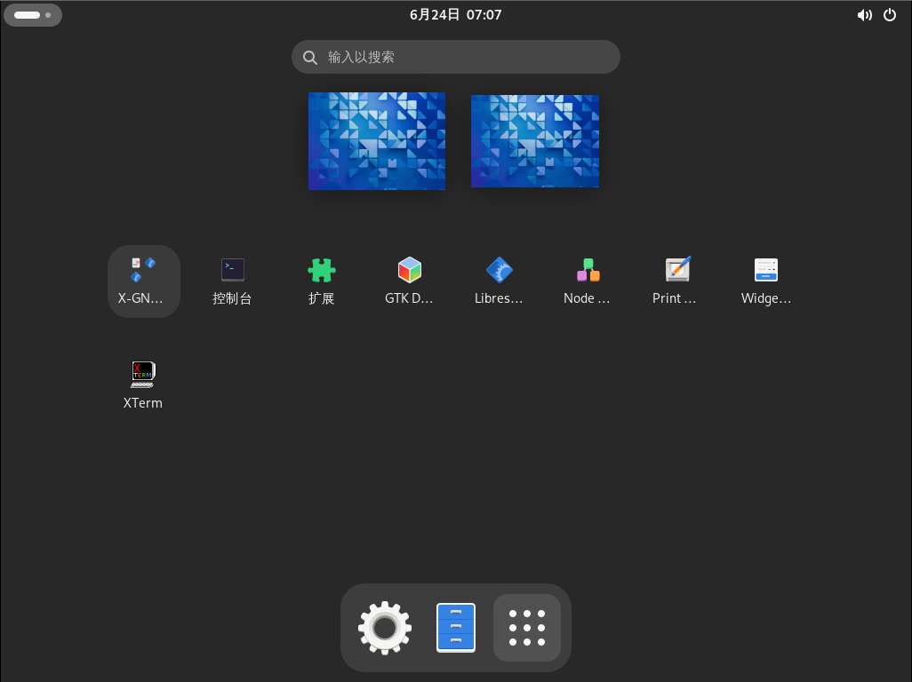

# 10.7 GNOME

GNOME is a user-oriented desktop environment. It includes panels for launching applications and displaying status, a desktop, local tools and applications, and a set of design specifications that enable applications to work together and maintain consistency.

## GNOME Desktop Environment Overview

> **Warning**
>
> Currently, due to FreeBSD Bugzilla Bug 287955 - x11/gdm: The user cannot log in; the system hangs at the login screen in gdm 47[EB/OL]. [2026-04-04]. <https://bugs.freebsd.org/bugzilla/show_bug.cgi?id=287955>. GDM cannot run properly and will hang at the login screen; `startx` works normally.
>
> It runs normally in virtual machines.

GNOME was formerly a component of the GNU Project, aimed at building a fully functional desktop environment, and is currently primarily developed and maintained by Red Hat. GNOME is a mainstream desktop environment for Linux and UNIX-like systems, with a clean and modern design. GNOME stands for GNU Network Object Model Environment, originating from the GNU Project; its initial letter G should be pronounced, as /ɡəˈnoʊm/ (similar to "guh-nome").

## Installing the Complete GNOME Desktop Environment

- Install using pkg:

```sh
# pkg install xorg gnome noto-sans-sc
```

- Or install using Ports:

```sh
# cd /usr/ports/x11/xorg/ && make install clean
# cd /usr/ports/x11/gnome/ && make install clean
# cd /usr/ports/x11-fonts/noto-sans-sc/ && make install clean
```

### Package Description

| Software | Purpose |
| -------- | ------- |
| xorg | X11 |
| gnome | GNOME main program |
| noto-sans-sc | Noto Sans SC (Simplified Chinese) |

## Configuration

You also need to configure automatic mounting of the procfs file system.

Add the following content to the **/etc/fstab** file:

```ini
proc /proc procfs rw 0 0
```

Set the D-Bus service to start on boot:

```sh
# service dbus enable
```

Set the GDM display manager to start on boot:

```sh
# service gdm enable
```

Execute the following command to write the GNOME session command to the **~/.xinitrc** file, so that GNOME can be started using the startx command:

```sh
$ echo "/usr/local/bin/gnome-session" > ~/.xinitrc
```


Root login is disabled by default.


This is the default wallpaper.


## Configuring the Chinese Environment for the GNOME Desktop

The configuration parameters in this section are independent of the user's shell; even if using csh, configure as described below.

Open the GDM localization configuration file **/usr/local/etc/gdm/locale.conf** with a text editor and modify the language settings. Replace the existing content as follows:

```ini
LANG="zh_CN.UTF-8"         # Set the system default language to Simplified Chinese UTF-8
LC_CTYPE="zh_CN.UTF-8"     # Set the character type and encoding to Simplified Chinese UTF-8
LC_MESSAGES="zh_CN.UTF-8"  # Set the system message display language to Simplified Chinese UTF-8
```

## Chinese Input Method

Choose either IBus or Fcitx 5.

### IBus

The default input method framework used by GNOME is IBus.

Install using pkg:

```sh
# pkg install zh-ibus-libpinyin
```

Or install using Ports:

```sh
# cd /usr/ports/chinese/ibus-libpinyin/
# make install clean
```

After installation, run the initialization command `ibus-setup`. Then: Settings → Keyboard → Input Sources, click "Add Input Source", select "Chinese (China)", and add "Intelligent Pinyin".

### Fcitx 5

Refer to the input method related chapters.

> **Warning**
>
> IBus is a dependency of GNOME; even if you do not use IBus, you cannot uninstall it, otherwise GNOME will be uninstalled as well.


## Settings Adjustments Different from Conventional Habits

GNOME's design philosophy differs from some users' operational habits, such as not allowing desktop icons and lacking a system tray in the top right corner. ~~Is this similar to how a trash can must not contain trash, a person must not be in bed, a door must not be closed, and nothing must be placed on a table?~~

### System Optimization Tool

Install using pkg:

```sh
# pkg install gnome-tweaks
```

Or install using Ports:

```sh
# cd /usr/ports/deskutils/gnome-tweaks/
# make install clean
```

### Restoring Tray Icons in the GNOME Top Bar

You need to install the Firefox browser **www/firefox** and the Port **www/chrome-gnome-shell**.

[TopIcons Plus](https://extensions.gnome.org/extension/1031/topicons/) has not been updated for a long time, so you can only use [AppIndicator and KStatusNotifierItem Support](https://extensions.gnome.org/extension/615/appindicator-support/).








#### References

- Abhishek Prakash. Getting the Top Indicator Panel Back in GNOME[EB/OL]. [2026-03-25]. <https://itsfoss.com/enable-applet-indicator-gnome>. Provides detailed steps and extension installation guide for restoring tray icon display in the GNOME top bar.

### Placing Icons on the Desktop

The extension [gnome-shell-extension-desktop-icons](https://extensions.gnome.org/extension/1465/desktop-icons/) has not been updated for a long time; the project address is: [Desktop Icons](https://gitlab.gnome.org/World/ShellExtensions/desktop-icons).

You can use [Desktop Icons NG (DING)](https://extensions.gnome.org/extension/2087/desktop-icons-ng-ding/) as a solution. The installation method is the same as above.



The wallpaper is custom-set; everything else is the default configuration.

## Desktop Theme Customization

After installing a desktop environment on FreeBSD, a clean style is adopted. The following content applies to desktop environments based on the GTK library.

The following lists some icons and themes; for more resources, visit [FreshPorts](https://www.freshports.org).

- GTK Desktop Themes

| Theme | Install Command |
| ----- | --------------- |
| matcha | `# pkg install matcha-gtk-themes` |
| Qogir | `# pkg install qogir-gtk-themes` |
| Pop | `# pkg install pop-gtk-themes` |
| Flat | `# pkg install flat-remix-gtk-themes` |
| Numix | `# pkg install numix-gtk-theme` |
| Sierra | `# pkg install sierra-gtk-themes` |
| Yaru | `# pkg install yaru-gtk-themes` |
| Canta | `# pkg install canta-gtk-themes` |

- GTK Desktop Icons

| Icons | Install Command |
| ----- | --------------- |
| papirus | `# pkg install papirus-icon-theme` |
| Qogir | `# pkg install qogir-icon-themes` |
| Pop | `# pkg install pop-icon-theme` |
| Flat | `# pkg install flat-remix-icon-themes` |
| Numix | `# pkg install numix-icon-theme` |
| Numix Circle | `# pkg install numix-icon-theme-circle` |
| Yaru | `# pkg install yaru-icon-theme` |
| Canta | `# pkg install canta-icon-theme` |

### GNOME Theme Customization

The following installs the [WhiteSur](https://www.pling.com/p/1403328/) theme.

1. Download the theme source package: `git clone https://github.com/vinceliuice/WhiteSur-gtk-theme`
2. Enter the theme package directory: `cd WhiteSur-gtk-theme`
3. Modify the shebang: edit the `install.sh` file, change the first line to `#!/usr/local/bin/bash`, then save.
4. Run the installation: `bash install.sh`

### WhiteSur Icons

[Icons](https://www.pling.com/p/1405756/)

1. Download the icons: `git clone https://github.com/vinceliuice/WhiteSur-icon-theme`
2. Enter the software directory: `cd WhiteSur-icon-theme`
3. Modify the shebang: edit the `install.sh` file, change the first line to `#!/usr/local/bin/bash`, then save.
4. Run the installation: `bash install.sh`

### Cursors

[Cursors](https://www.pling.com/p/1355701/)

1. Download the cursors: `git clone https://github.com/vinceliuice/McMojave-cursors`
2. Enter the software directory: `cd McMojave-cursors`
3. Modify the shebang: edit the `install.sh` file, change the first line to `#!/usr/local/bin/bash`, then save.
4. Run the installation: `bash install.sh`

### Exercise

Follow the steps below to install [Papirus Icons](https://www.gnome-look.org/p/1166289/) in the terminal:

```sh
$ git clone https://github.com/PapirusDevelopmentTeam/papirus-icon-theme
$ cd papirus-icon-theme
$ ./install.sh
```

## Appendix: GNOME Desktop Environment Minimal Installation

- Install using pkg:

```sh
# pkg install xorg-minimal gnome-lite wqy-fonts xdg-user-dirs
```

- Or install using Ports:

```sh
# cd /usr/ports/x11/xorg-minimal/ && make install clean
# cd /usr/ports/x11/gnome/ && make FLAVOR=lite install clean
# cd /usr/ports/x11-fonts/wqy/ && make install clean
# cd /usr/ports/devel/xdg-user-dirs/ && make install clean
```

### Package Description

| Package | Purpose |
| ------- | ------- |
| `xorg-minimal` | Minimal X graphics environment |
| `gnome-lite` | Minimal GNOME desktop |

### Slimming Down an Existing Full GNOME Installation

If the full version is already installed, you can use pkg to uninstall the bundled games:

```sh
# pkg delete gnome-2048 gnome-klotski gnome-tetravex gnome-mines gnome-taquin gnome-sudoku gnome-robots gnome-nibbles lightsoff tali quadrapassel swell-foop gnome-mahjongg five-or-more iagno aisleriot four-in-a-row
```


