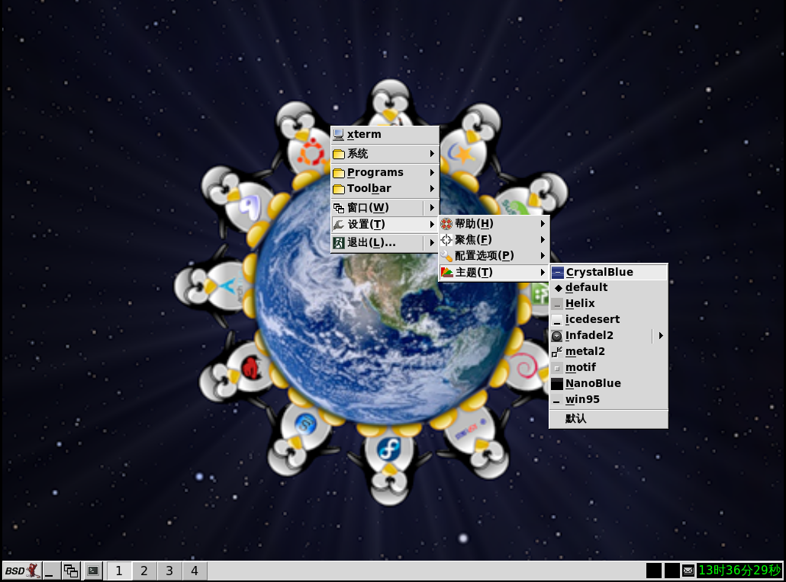

# 10.8 IceWM

## IceWM Window Manager Overview

IceWM is a window manager based on the X Window System. Its design goals are fast response, simple structure, and non-interference with the user's workflow. It features a built-in paged taskbar, global and window-level key bindings, and provides a dynamic menu system. Windows can be managed using keyboard and mouse combinations. Users can iconify windows to the taskbar, system tray, or desktop area, or hide them. Window management supports fast window switching (Alt+Tab) or a window list. Multiple configurable window focus modes can be selected via the menu. Multi-monitor environments are supported through RandR and Xinerama extensions. IceWM is highly customizable, supports custom themes, and provides comprehensive documentation. IceWM offers an optional external wallpaper manager (with transparency support), a simple session manager, and a system tray. IceWM runs on mainstream Linux distributions and most *BSD systems. (Quoted from [IceWM Window Manager](https://ice-wm.org/))

## Installing the IceWM Window Manager

- Install using pkg:

```sh
# pkg install xorg icewm icewm-extra-themes slim wqy-fonts xdg-user-dirs
```

- Install using Ports:

```sh
# cd /usr/ports/x11-wm/icewm/ && make install clean
# cd /usr/ports/x11-themes/icewm-extra-themes/ && make install clean
# cd /usr/ports/x11/xorg/ && make install clean
# cd /usr/ports/x11/slim/ && make install clean
# cd /usr/ports/x11-fonts/wqy/ && make install clean
# cd /usr/ports/devel/xdg-user-dirs/ && make install clean
```

### Package Description

| Package | Description |
| ------- | ----------- |
| `xorg` | X Window System |
| `icewm` | Lightweight window manager |
| `icewm-extra-themes` | IceWM extra theme collection |
| `slim` | Lightweight graphical display manager |
| `wqy-fonts` | WenQuanYi Chinese Fonts |
| `xdg-user-dirs` | Manages user directories such as "Desktop", "Downloads", etc. |

## startx

Edit the **~/.xinitrc** file and add the following content (should be modified as the currently logged-in user):

```ini
exec icewm-session
```

This allows starting an IceWM session using the startx command in a TTY.

## Startup Items

Set the D-Bus service to start on boot (automatically installed as a dependency):

```sh
# service dbus enable
```

Set the SLiM display manager to start on boot:

```sh
# service slim enable
```

## Mounting the proc File System

Edit the **/etc/fstab** file and add the following line:

```ini
proc           /proc       procfs  rw  0   0
```

Mount the procfs file system to **/proc** in read-write mode.

## Configuring the Chinese Environment

Edit the **/etc/login.conf** file, find the `default:\` section, and change `:lang=C.UTF-8` to `:lang=zh_CN.UTF-8`.

Rebuild the capability database based on the `login.conf` file for the configuration to take effect:

```sh
# cap_mkdb /etc/login.conf
```

## Desktop Gallery


The default interface after installation is shown above; you can choose to change the theme:




## Troubleshooting and Outstanding Issues

### Incomplete Chinese Environment

This issue has been reported at [Many UI Strings Are Missing from .po Files](https://github.com/bbidulock/icewm/issues/821).

## References

- FreeBSD Project. icewm-preferences(5)[EB/OL]. [2026-03-25]. <https://man.freebsd.org/cgi/man.cgi?query=icewm-preferences&sektion=5>. The official manual page for IceWM window manager configuration options, detailing various configuration parameters.
