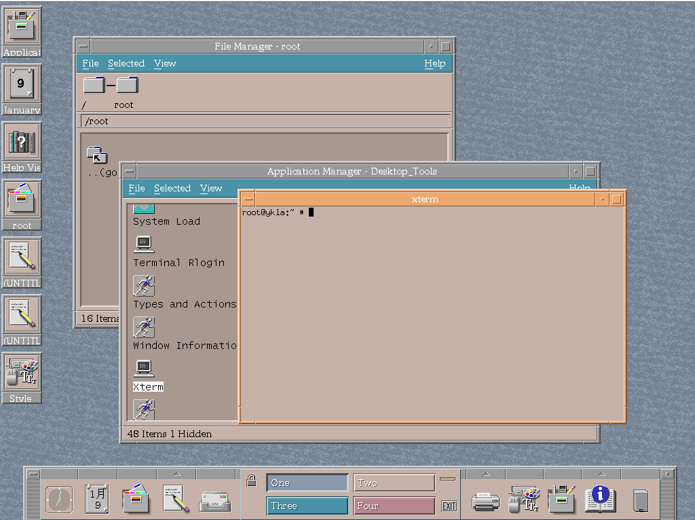

# 10.9 CDE (To Be Removed)

## CDE Desktop Environment Overview

CDE (Common Desktop Environment) was the standard desktop environment for commercial UNIX systems in the 1990s, widely used in commercial distributions such as Solaris, HP-UX, and AIX.

## Installing the CDE Desktop Environment

- Install using pkg:

```sh
# pkg install xorg cde wqy-fonts xdg-user-dirs
```

- Or install using Ports:

```sh
# cd /usr/ports/x11/xorg/ && make install clean
# cd /usr/ports/x11/cde/ && make install clean
# cd /usr/ports/x11-fonts/wqy/ && make install clean
# cd /usr/ports/devel/xdg-user-dirs/ && make install clean
```

### Package Description

| Package | Description |
| ------- | ----------- |
| `xorg` | X Window System |
| `cde` | Provides the traditional CDE desktop environment |
| `wqy-fonts` | WenQuanYi Chinese Fonts |
| `xdg-user-dirs` | Manages user directories such as "Desktop", "Downloads", etc. |

- View post-installation information

```sh
# pkg info -D cde
```

## Configuring Services and Files

- Configure services

```sh
# service rpcbind enable  # Set RPC bind service to start on boot
# service dtcms enable  # Set DTCMS service to start on boot
# service inetd enable  # Set inetd daemon to start on boot
# service dtlogin enable  # Set DTLogin display manager to start on boot
```

- Configure the X server to allow any user to start:

```sh
# echo "allowed_users=anybody" > /usr/local/etc/X11/Xwrapper.config
```

- Create a symbolic link to Xsession for the current user, used to start the desktop session:

```sh
$ ln -s /usr/local/dt/bin/Xsession ~/.xinitrc
```

- Configure the dtspcd service to start via TCP, add the following content to the **/etc/inetd.conf** file:

```ini
dtspc	stream	tcp	nowait	root	 /usr/local/dt/bin/dtspcd	/usr/local/dt/bin/dtspcd
```

- Specify TCP port 6112 for the dtspc service, add the following content to the **/etc/services** file:

```ini
dtspc		6112/tcp
```

### Chinese Configuration

Edit the **/etc/login.conf** file: find the `default:\` section and change `:lang=C.UTF-8` to `:lang=zh_CN.UTF-8`.

Rebuild the capability database based on the **/etc/login.conf** file for the configuration to take effect:

```sh
# cap_mkdb /etc/login.conf
```

## Desktop Gallery


It pauses at this stage for several minutes each time it starts.




## Troubleshooting and Outstanding Issues

### Unable to Set Chinese Environment

The overall CDE interface cannot be switched to Chinese; only the calendar component can display Chinese.

According to the source code at <https://sourceforge.net/p/cdesktopenv/code/ci/master/tree/cde/imports/motif/localized/>, CDE does not have Simplified Chinese support. However, according to the [Simplified Chinese Solaris User Guide](https://docs.oracle.com/cd/E19683-01/816-0668/6m7500nqp/index.html), the Solaris version does include Simplified Chinese support. This localization support may have been lost during the open-sourcing process, or the Solaris version may be an unmerged branch. This has been reported at [Missing Simplified Chinese locale support under cde/imports/motif/localized](https://sourceforge.net/p/cdesktopenv/discussion/general/thread/c51abcd846/).

## References

- FreshPorts. cde Common Desktop Environment[EB/OL]. [2026-03-25]. <https://www.freshports.org/x11/cde>. CDE desktop environment Port details and installation guide provided by FreshPorts.
- FreeBSD Project. Setting up Common Desktop Environment for modern use[EB/OL]. [2026-03-25]. <https://forums.freebsd.org/threads/setting-up-common-desktop-environment-for-modern-use.69475/>. For detailed configuration, refer to the relevant FreeBSD forum discussion.
- CDE Project. CDE - Common Desktop Environment Wiki[EB/OL]. [2026-03-25]. <https://sourceforge.net/p/cdesktopenv/wiki/FreeBSDBuild/>. FreeBSD platform build and configuration guide provided by the official CDE project Wiki.
