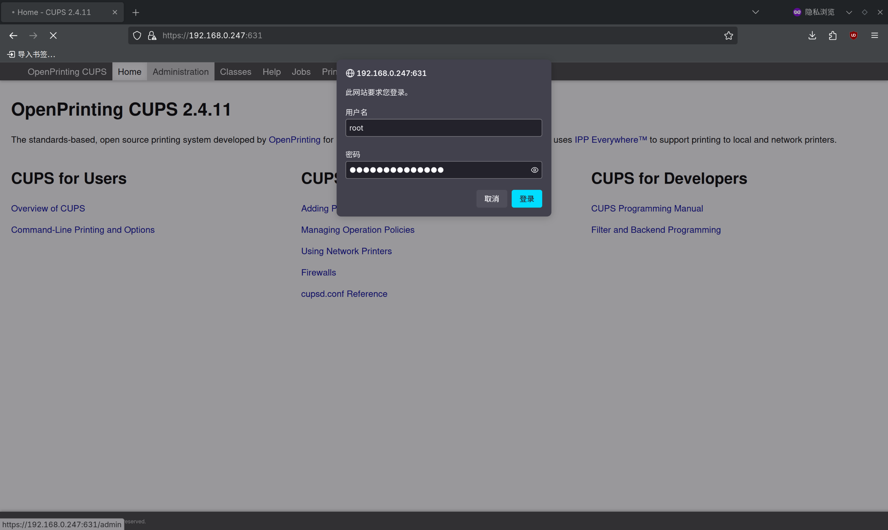
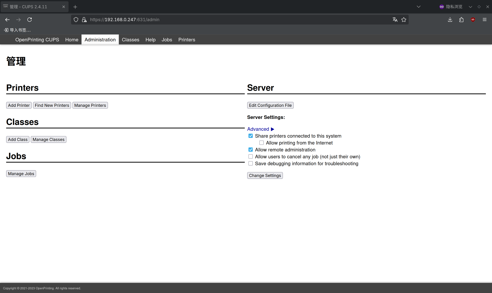
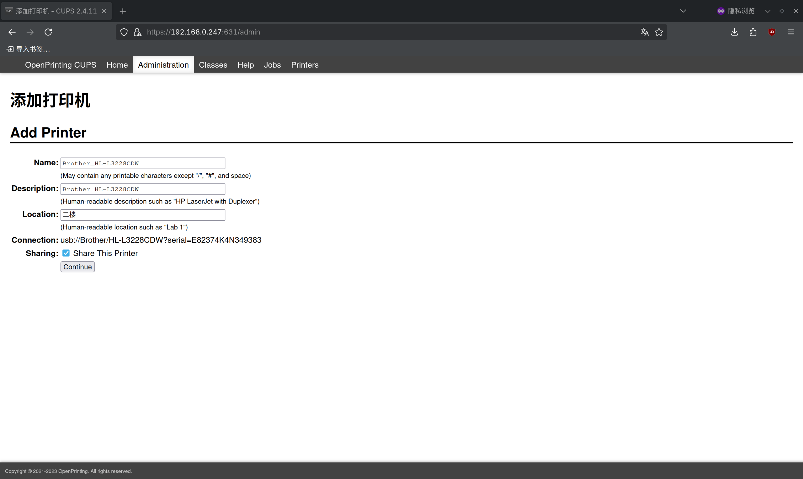
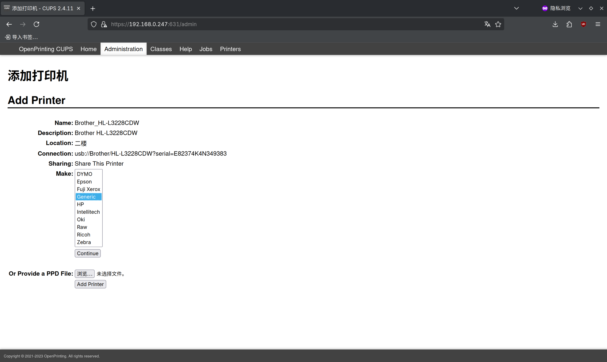
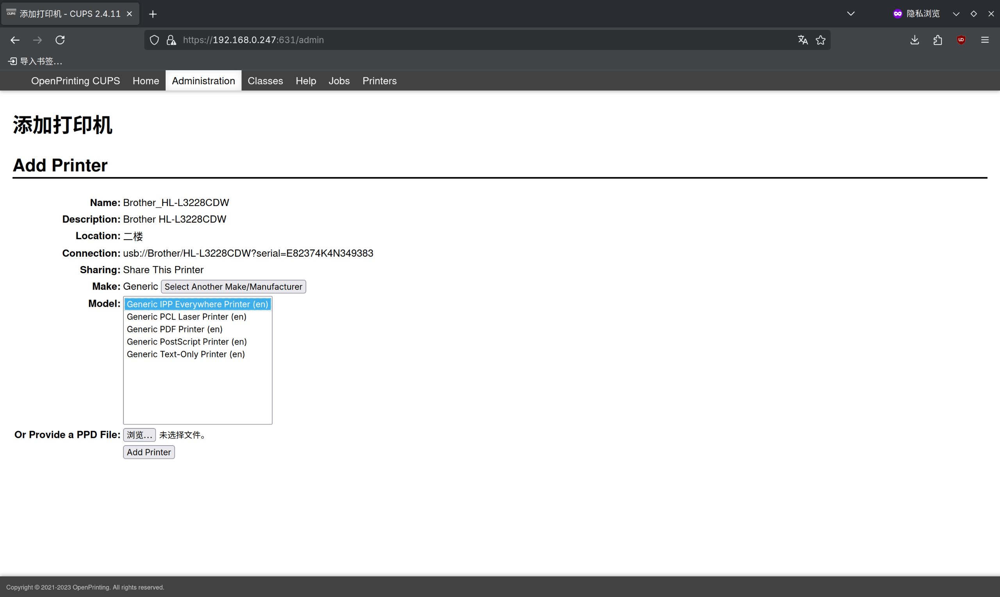
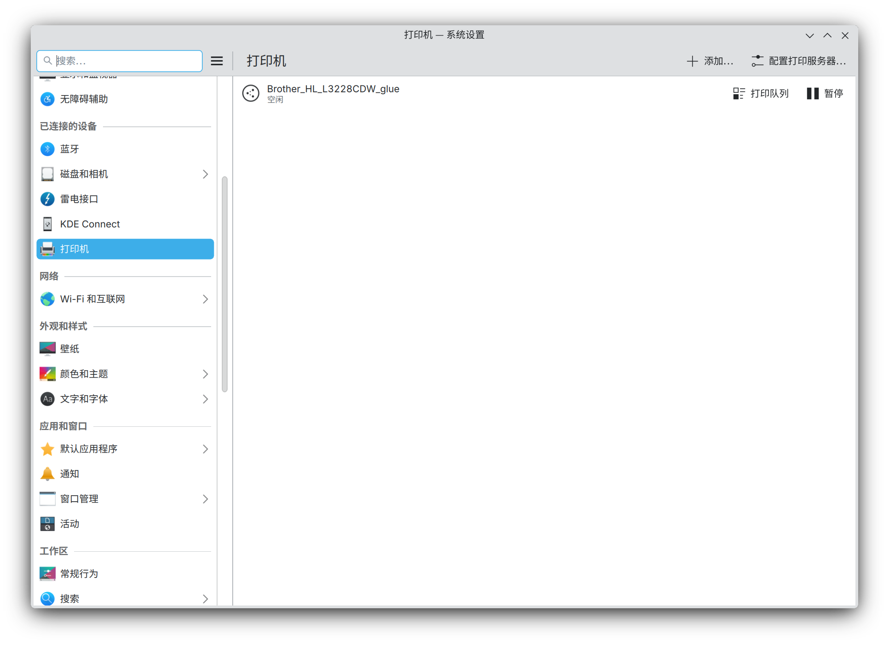
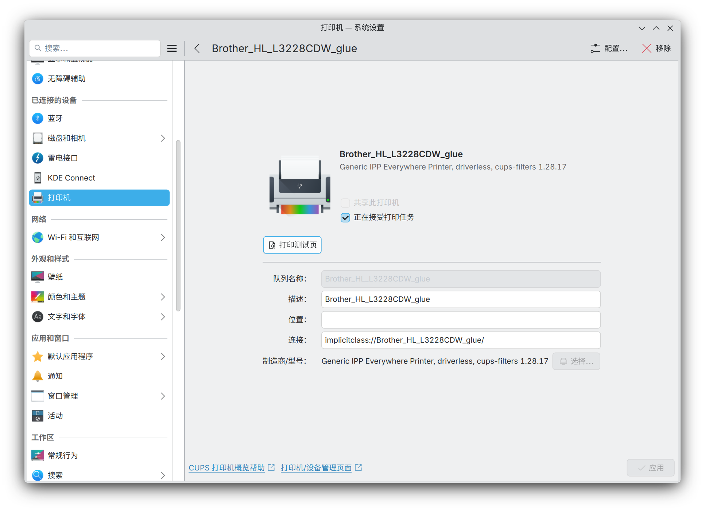
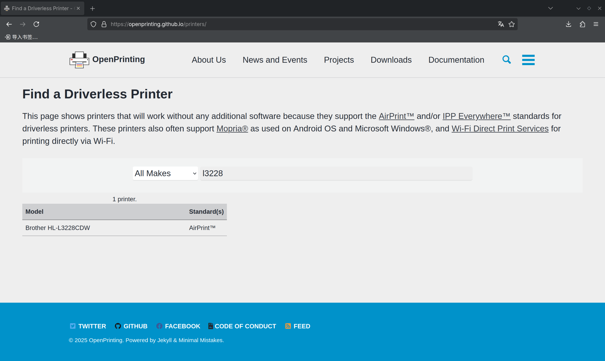

# 11.2 Printers

CUPS (Common Unix Printing System) is a modular printing system architecture that supports multiple printing protocols and printer devices, and can share printers to the network via IPP (Internet Printing Protocol) or SMB (Server Message Block) protocol.

Printers connect to the print server (i.e., the FreeBSD system) through the USB (Universal Serial Bus) bus. The print server shares the printer to the local area network. Other computers on the LAN can automatically query available printers by sending multicast packets using zero-configuration networking technology.

This has been tested on Android, macOS, Debian, and other platforms, and all the above systems can properly discover and use this print server.

## Installing CUPS (Common Unix Printing System)

Install CUPS:

- Install using pkg (binary package manager):

```sh
# pkg install cups cups-filters
```

- Or install via Ports (source code package manager):

```sh
# cd /usr/ports/print/cups/ && make install clean
# cd /usr/ports/print/cups-filters/ && make install clean
```

> **Tip**
>
> If using a desktop environment, select the `x11` compile option in the Ports options screen to generate a graphical application icon for adding and configuring printers on the system.

## Package Descriptions

| Package | Description |
| ------- | ----------- |
| `cups` | Provides CUPS core printing services |
| `cups-filters` | Provides additional backends, filters, and other software required by CUPS, including driverless printing (IPP Everywhere protocol) support |
| `dbus` | Required by Avahi, automatically installed as a CUPS dependency |
| `avahi-app` | Avahi component, automatically installed as a CUPS dependency, used for automatic printer discovery on the local area network |

> **Tip**
>
> This section describes configuring FreeBSD as a print server. If FreeBSD is only used as a print client, printing via a local USB connection without sharing the print service, avahi-app and dbus are not required components.

> **Note**
>
> If the printer does not support driverless printing, the corresponding manufacturer driver must be installed.

## Adding Services

Set the D-Bus (Desktop Bus), avahi-daemon (Avahi daemon), and cupsd (CUPS daemon) services to automatically start at system boot, to ensure that the printing service and its automatic discovery functionality continue to work properly after a system restart:

```sh
# service dbus enable           # Set D-Bus service to start at boot
# service avahi-daemon enable   # Set Avahi daemon to start at boot (for network service discovery)
# service cupsd enable          # Set CUPS printing service to start at boot
```

Start the above services immediately:

```sh
# service dbus start
# service avahi-daemon start
# service cupsd start
```

After starting the services, other devices should be able to automatically discover the shared printer on the network. You can print a test page to verify that the functionality is working properly.

## Sharing the Print Service to the Local Area Network

If "Allow LAN access" is not configured, hosts other than the local loopback address `localhost` will not be able to use the print service.

Related file structure:

```sh
/
├── usr/
│   └── local/
│       └── etc/
│           └── cups/
│               └── cupsd.conf       # CUPS main configuration file
└── var/
    └── run/
        └── cups/
            └── cups.sock            # CUPS UNIX socket
```

Edit the CUPS main configuration file **/usr/local/etc/cups/cupsd.conf**:

- After the existing listening configuration section

```ini
Listen localhost:631
Listen /var/run/cups/cups.sock
```

add the following configuration (replace the IP with the FreeBSD system's LAN IP address):

```ini
Listen IP:631
```

This configuration specifies the network interface IP address and port number that the CUPS printing service listens on (631 is the standard port for the IPP protocol).

- Then change

```apache
# Restrict access to the server...
<Location />
  Order allow,deny
</Location>

# Restrict access to the admin pages...
<Location /admin>
  AuthType Default
  Require user @SYSTEM
  Order allow,deny
</Location>
```

to:

```apache
# Restrict access to the server...
<Location />
  Allow from 192.168.0.0/24   # Allowed IP network segment
  Order allow,deny
</Location>

# Restrict access to the admin pages...
<Location /admin>
  Allow from 192.168.0.0/24   # Allowed IP network segment
  AuthType Default             # Use default authentication type
  Require user @SYSTEM         # Only system users can access
  Order allow,deny
</Location>
```

> **Tip**
>
> The `192.168.0.0/24` in the above example is a placeholder and must be replaced with the actual value.

After completing the configuration, the CUPS administration page can be accessed from within the local area network.

## Adding a Printer

Enter `http://IP:631` in a browser; this address is the administration page of the print server.


Click `Administration-Add Printer` and follow the prompts to create a printer.

This step will prompt for an account and password. Log in using the `root` user or a user in the `wheel` group (enter their account password on the FreeBSD system).



Click `Add Printer` to add the printer.



The printer model used in this section is Brother HL-L3228CDW.


Make sure to check `Share This Printer` when creating it.



Select the model.



If the printer supports driverless printing, select `Generic IPP Everywhere Printer (en)` for `Model`; otherwise, install the corresponding driver and select the appropriate printer model.



Printer added successfully.


## Adding a Printer on the KDE Desktop

No additional steps are required. Devices that need to print can usually automatically discover the print server and add it to the printer list, and it can be selected when printing files. For example, on the KDE desktop:





## Printing a Test Page

Print a test page from a Debian machine on the network:


## Troubleshooting and Outstanding Issues

### Printer Driverless Support Issues

To confirm whether a printer supports driverless printing, you can check at [OpenPrinting](https://openprinting.github.io/printers/). Using the printer from this section as an example:



HP (Hewlett-Packard) printers can be supported by installing the Port `print/hplip`.

### FreeBSD Print Test Page Example

Select the printer in the CUPS administration page and click "Print Test Page" to print a test page and verify that the printing functionality is working properly.
