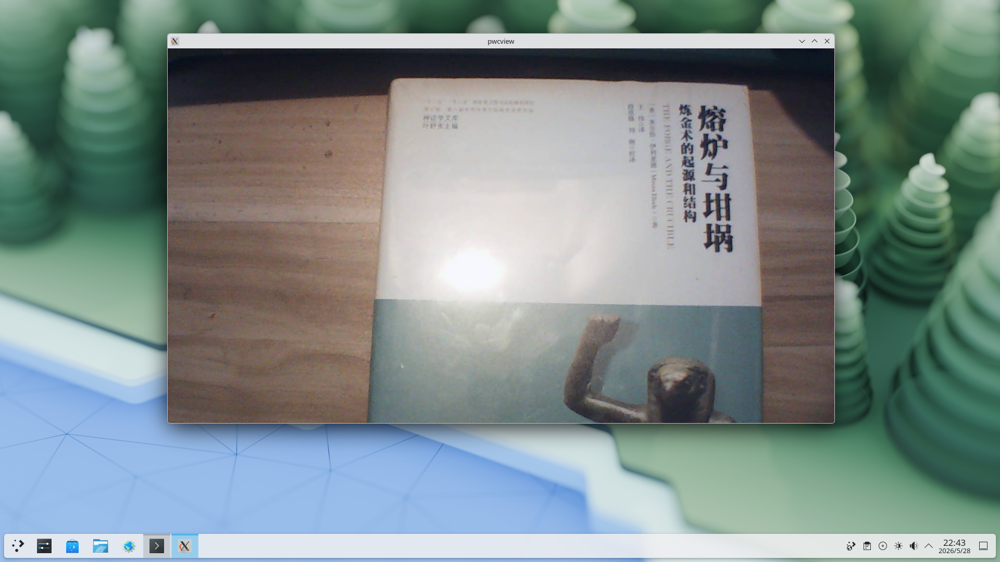
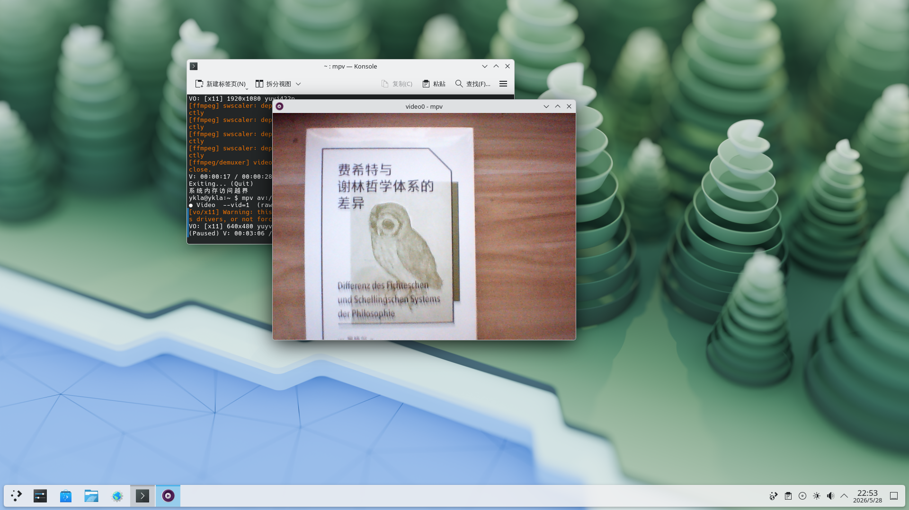
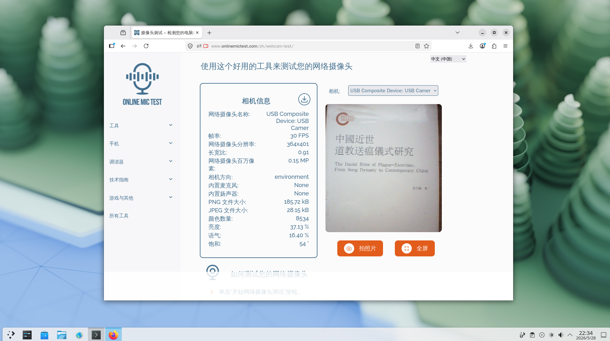

# 11.3 Cameras

This section describes how to configure a camera for a FreeBSD system.

Video for Linux 2 (V4L2) is the second generation of V4L. V4L2 is the kernel driver framework for video devices in the Linux kernel.

FreeBSD requires the following tools to access and configure cameras:

| Port | Description |
| ---- | ----------- |
| multimedia/webcamd | A daemon ported from Linux USB webcam and DVB drivers, supporting hundreds of different USB cameras and DVB USB devices |
| multimedia/pwcview | Can be used to view camera video streams |
| multimedia/mpv | Can also be used to view camera V4L2 video streams |
| multimedia/v4l-utils | Used for configuring and testing Video4Linux devices |

## Installing Camera Software

To install the required utilities using pkg, run:

```sh
# pkg install webcamd pwcview mpv v4l-utils
```

Install using Ports:

```sh
# cd /usr/ports/multimedia/webcamd && make install clean
# cd /usr/ports/multimedia/pwcview && make install clean
# cd /usr/ports/multimedia/mpv && make install clean
# cd /usr/ports/multimedia/v4l-utils && make install clean
```

## Service Management

Enable the webcamd service so it starts automatically at system boot:

```sh
# service webcamd enable
```

Restart the device state service:

```sh
# service devd restart
```

## User Management

The user must belong to the `webcamd` group. To add user ykla to the `webcamd` group, run the following command:

```sh
# pw groupmod webcamd -m ykla
```

## Getting the Camera List

After installing these tools, you can use webcamd to display the list of available cameras:

```sh
# webcamd -l
```

The output should look similar to the following:

```sh
webcamd [-d ugen1.2] -N Jieli-Technology-USB-Composite-Device -S unknown -M 0
```

An available camera "Jieli-Technology-USB-Composite-Device" has been found.

Test the camera temporarily:

```sh
$ webcamd -d ugen1.2
```

Keep it running in the foreground for subsequent configuration.

Device files **/dev/video0** and **/dev/video1** will be generated.

## Viewing Camera Configuration

Use the **v4l2-ctl** tool to list the parameters supported by the camera:

```sh
$ v4l2-ctl --list-formats-ext -d /dev/video0

ioctl: VIDIOC_ENUM_FMT

        Type: Video Capture


        [0]: 'MJPG' (Motion-JPEG, compressed)

                Size: Discrete 1920x1080

                        Interval: Discrete 0.033s (30.000 fps)

                        Interval: Discrete 0.040s (25.000 fps)

                Size: Discrete 1280x720

                        Interval: Discrete 0.033s (30.000 fps)

                        Interval: Discrete 0.040s (25.000 fps)

                Size: Discrete 640x480

                        Interval: Discrete 0.033s (30.000 fps)

                        Interval: Discrete 0.040s (25.000 fps)

                Size: Discrete 640x360

                        Interval: Discrete 0.033s (30.000 fps)

                        Interval: Discrete 0.040s (25.000 fps)

                Size: Discrete 352x288

                        Interval: Discrete 0.033s (30.000 fps)

                        Interval: Discrete 0.040s (25.000 fps)

        [1]: 'YUYV' (YUYV 4:2:2)

                Size: Discrete 640x480

                        Interval: Discrete 0.033s (30.000 fps)

                Size: Discrete 640x360

                        Interval: Discrete 0.033s (30.000 fps)

                Size: Discrete 352x288

                        Interval: Discrete 0.033s (30.000 fps)

                Size: Discrete 320x240

                        Interval: Discrete 0.033s (30.000 fps)
```

The above output lists in detail the video formats, resolutions, and frame rates (FPS) at different resolutions supported by this camera.

## Checking the Camera

### Checking the Camera with multimedia/pwcview

You can use multimedia/pwcview to check whether the camera is working properly.

Temporarily disable SDL's Xv hardware acceleration to avoid unexpected situations such as a black screen. If the test passes, this environment variable can be removed.

```sh
$ export SDL_VIDEO_YUV_HWACCEL=0
```

Run pwcview again (resolution 1600x1200@30fps):

```sh
$ pwcview -f 30 -s uxga
```

After this, multimedia/pwcview will display the camera image:



### Checking the Camera with mpv

You can use multimedia/mpv to check whether the camera is working properly.

```sh
$ mpv av://v4l2:/dev/video0 --vo=x11
```

The above command uses `--vo=x11` to disable hardware acceleration and avoid unexpected situations. If the test passes, this parameter can be removed.

After this, multimedia/mpv will display the camera image:



## Permanently Configuring the Camera

After confirming that the camera is working properly, you can make the above configuration permanent.

Configure the available camera by running the following command:

```sh
# sysrc webcamd_0_flags="-d ugen1.2"
```

> **Note**
>
> If this is a plug-and-play USB camera, the output of `webcamd -l` (especially the device identifier) will change after the USB port it is connected to changes, and `/etc/rc.conf` may need to be updated accordingly.

You must start the webcamd service by running the following command:

```sh
# service webcamd restart
```

The output should look similar to the following:

```sh
Starting webcamd.
webcamd 2652 - - Attached to ugen1.2[0]
```

## Testing the Camera Online

Use a "Webcam Test" website to test the camera online: <https://www.onlinemictest.com/webcam-test>.


