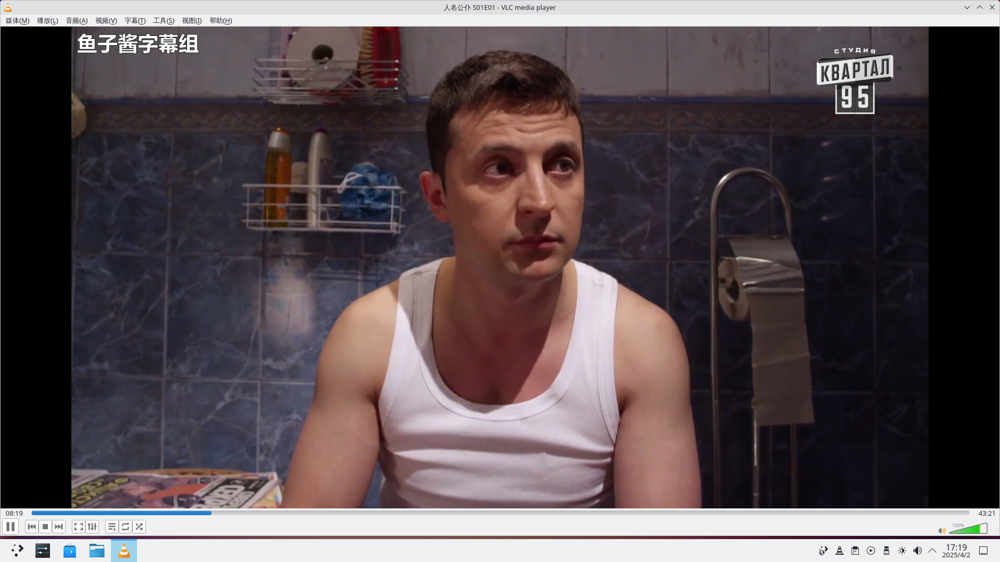
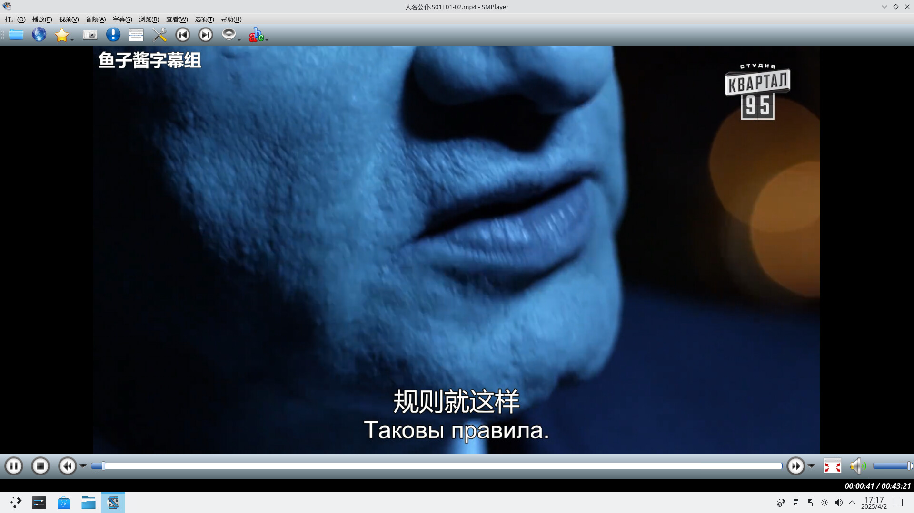
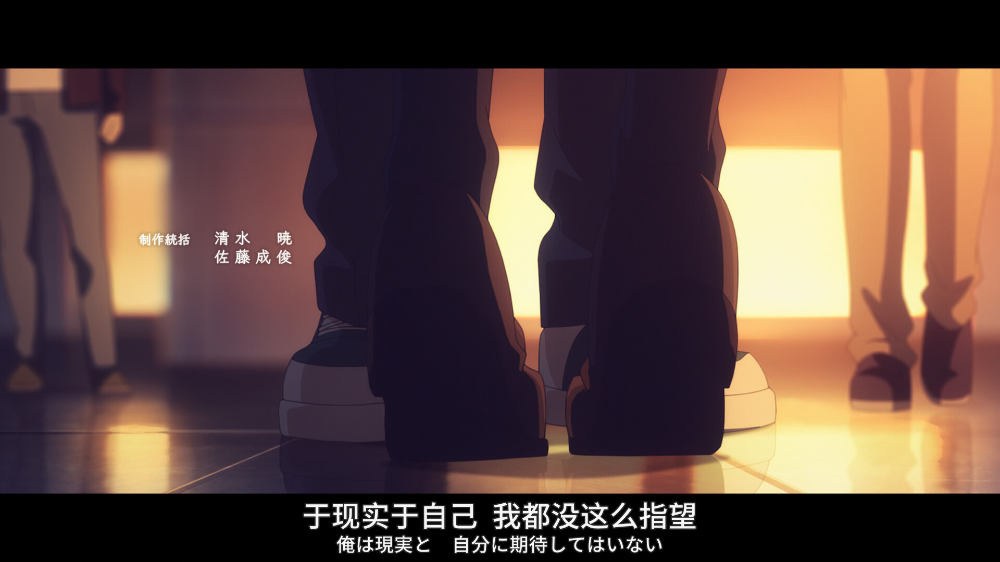
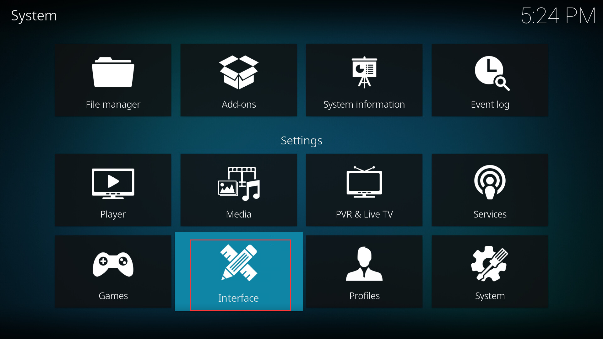
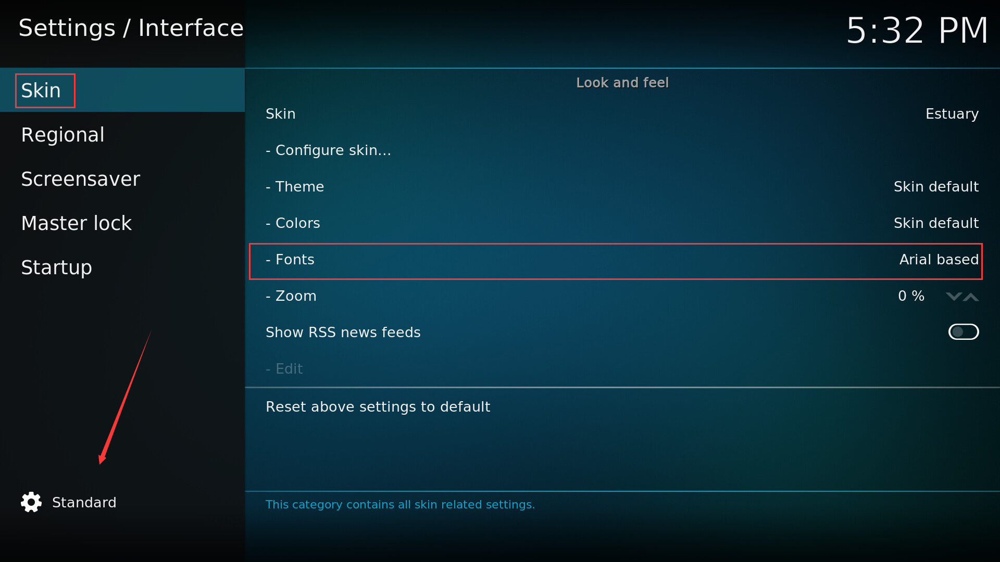
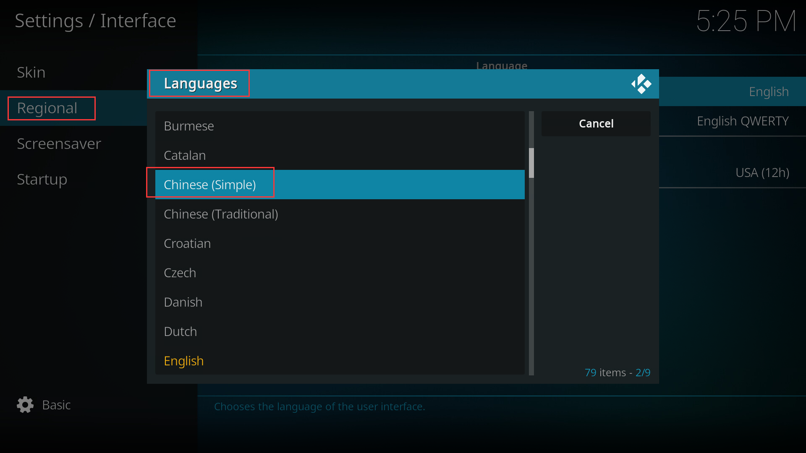
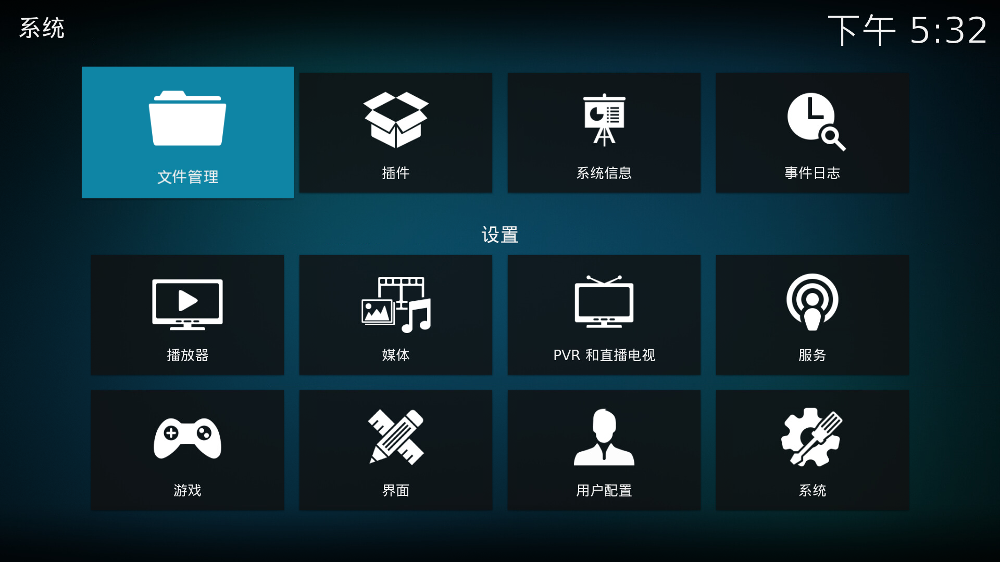
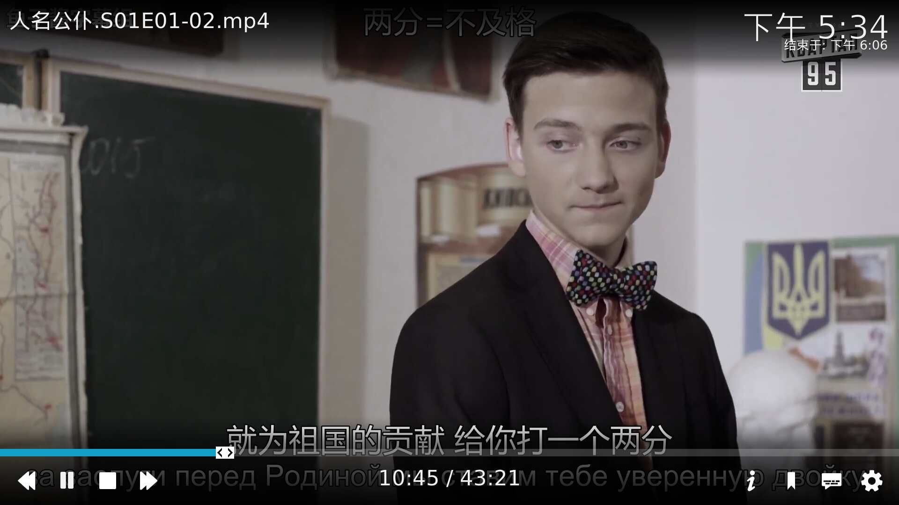

# 11.6 Video Players

The main video players on FreeBSD include VLC, SMPlayer, and Kodi, all of which support pkg installation. This section also includes a configuration method for playing video directly in the TTY using mpv.

## VLC

### Installing VLC

- Install using pkg (binary package manager):

```sh
# pkg install vlc
```

- Or compile and install using Ports (source code package manager):

```sh
# cd /usr/ports/multimedia/vlc/
# make install clean
```

### Playing Video with VLC

Based on testing, common video formats can all play normally in VLC.




## SMPlayer

SMPlayer is a Qt graphical frontend for MPlayer (a command-line video player) and mpv.

### Installing SMPlayer

- Install using the pkg binary package manager:

```sh
# pkg install smplayer
```

- Or compile and install using Ports source code:

```sh
# cd /usr/ports/multimedia/smplayer/
# make install clean
```

### Playing Video with SMPlayer

Based on testing, common video formats can all play normally in SMPlayer.






## Kodi

Kodi is an open-source media center software, formerly known as XBMC (Xbox Media Center).

### Installing Kodi

- Install using the pkg binary package manager:

```sh
# pkg install kodi
```

- Or compile and install using Ports source code:

```sh
# cd /usr/ports/multimedia/kodi/
# make install clean
```

### Setting Up a Chinese Environment for Kodi

First, open the `interface` settings option in the Kodi main interface:



Click the `Skin` option, then click the settings level button at the bottom left of the interface, changing the current `Basic` level to `Expert` or `Standard` level, otherwise you will not be able to see advanced settings options such as `Fonts`. Then set `Fonts` to `Arial based`, otherwise Chinese characters may display as garbled text.



After returning to the previous menu, select `Regional` → `Language` → `Chinese (Simplified)` in sequence to complete the language switch.



The effect after completing the Chinese interface setup is as follows:



### Playing Video with Kodi

Based on testing, common video formats can all play normally in the Kodi media center.



## Appendix: Playing Video Directly in TTY (mpv)

You can directly use the mpv command to play video files in a Linux/FreeBSD TTY (Teletypewriter, i.e., pure text terminal) environment.

- Install using pkg (binary package manager):

```sh
# pkg install mpv
```

- You can also compile and install via Ports source code:

```sh
# cd /usr/ports/multimedia/mpv/
# make install clean
```

After switching to the TTY terminal environment, use the mpv player to play the video file `1.mp4`:

```sh
$ mpv 1.mp4
```

> **Note**
>
> This functionality depends on the DRM (Direct Rendering Manager) graphics subsystem and may not work properly in virtual machine environments.
