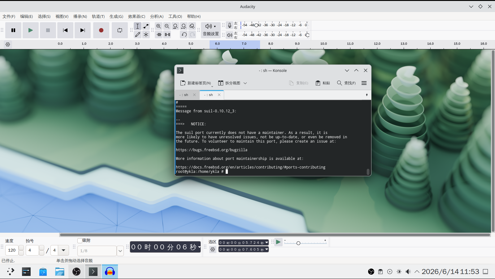
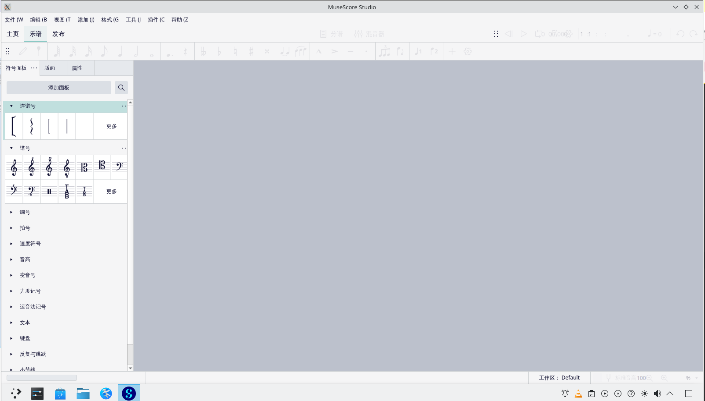
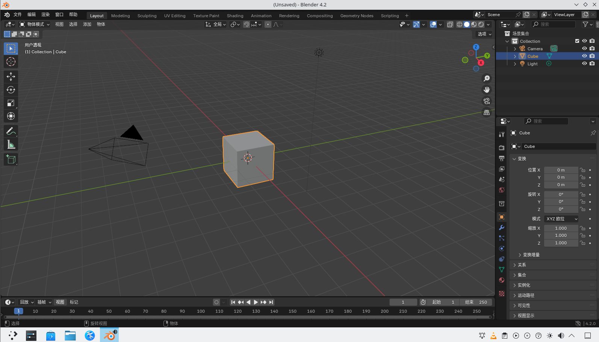
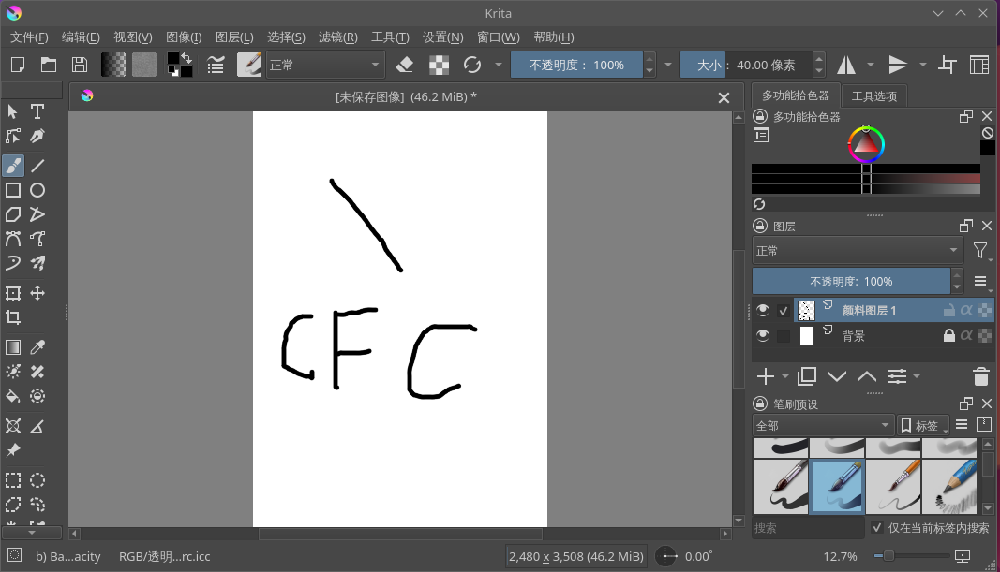

# 11.7 Multimedia Processing

FreeBSD supports tools such as Audacity (audio editing), Kdenlive/FFmpeg (video and subtitle processing), Inkscape (vector graphics processing), MuseScore (music notation), Blender (3D modeling), and Krita (digital painting). This section provides installation and basic usage methods by category.

## Video Streaming and Live Recording

### OBS Studio

OBS Studio is a free and open-source video streaming and live recording software.

Install using pkg:

```sh
# pkg install obs-studio
```

Or compile and install using Ports:

```sh
# cd /usr/ports/multimedia/obs-studio/
# make install clean
```

Adjust OBS Studio video input sources:


The microphone can adapt automatically. The main interface after adjustment:


## Audio Editing

### Audacity

Audacity is an open-source cross-platform audio editing software.

Install using pkg:

```sh
# pkg install audacity
```

Or compile and install using Ports:

```sh
# cd /usr/ports/audio/audacity/
# make install clean
```



## Video Editing

### Kdenlive

Kdenlive is an open-source non-linear video editing software.

Install Kdenlive using pkg:

```sh
# pkg install kdenlive
```

Or compile and install using Ports:

```sh
# cd /usr/ports/multimedia/kdenlive/
# make install clean
```

## Subtitles

### FFmpeg

FFmpeg is an open-source multimedia processing framework that can be used to burn subtitles into video.

Install FFmpeg using pkg:

```sh
# pkg install ffmpeg
```

Or compile and install using Ports:

```sh
# cd /usr/ports/multimedia/ffmpeg/
# make install clean
```

Example command for burning ASS (Advanced SubStation Alpha) format subtitles into video using FFmpeg:

```sh
$ ffmpeg -i video_file.mp4 -vf subtitles=corresponding_subtitle.ass output_video.mp4
```

Where:

- `-i` specifies the input video file;
- `-vf subtitles=` applies the subtitle filter and specifies the subtitle file path;
- `output_video.mp4` specifies the name of the output video file.


## Clipping

Inkscape is a vector drawing program. This section introduces basic clipping operations.

### Installing Inkscape

- Install Inkscape using pkg:

```sh
# pkg install inkscape
```

- Or compile and install using Ports source code:

```sh
# cd /usr/ports/graphics/inkscape/
# make install clean
```

### Basic Clipping Method with Inkscape

1. Use the shortcut `Ctrl` + `O` (the letter `o`) to open the image file to be processed;
2. Use the shortcut `Shift` + `F6` to switch to the Bezier curve and straight line drawing mode;
3. Use Bezier curves to draw a closed path along the edge of the target area (return to the starting point to close the path);
4. Hold down the `Shift` key and click to select the image and the closed path in sequence (the path must be above the image);
5. In the menu bar, select **Object** → **Clip** → **Set Clip** to achieve the clipping effect.

### References

- Inkscape. Inkscape Tutorials[EB/OL]. [2026-03-25]. <https://inkscape.org/learn/tutorials/>. Provides detailed tutorials for the Inkscape vector drawing software, covering basic operations and advanced features.

## Music

### Music Notation Software MuseScore

MuseScore is an open-source music notation software that supports score creation, editing, and playback.

Install using pkg:

```sh
# pkg install musescore
```

Or install using Ports:

```sh
# cd /usr/ports/audio/musescore/
# make install clean
```



## 3D Graphics

### 3D Modeling Blender

Blender is an open-source 3D modeling and animation software that supports modeling, rendering, animation, and other features.

Install using pkg:

```sh
# pkg install blender
```

Or install using Ports:

```sh
# cd /usr/ports/graphics/blender/
# make install clean
```

The software supports Simplified Chinese. Through the menu **Edit** → **Preferences** → **Interface** → **Translation**, select **Simplified Chinese (简体中文)** from the **Language** dropdown menu to switch the interface language.



## Painting

### Krita

Krita is an open-source digital painting software designed specifically for illustrators and concept artists.

Install using pkg:

```sh
# pkg install krita
```

Or install using Ports:

```sh
# cd /usr/ports/graphics/krita/
# make install clean
```


