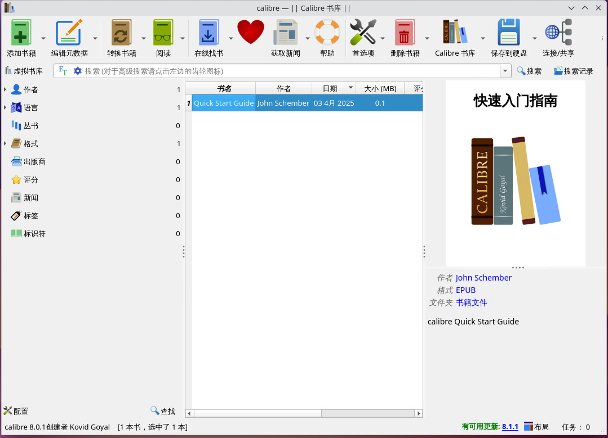
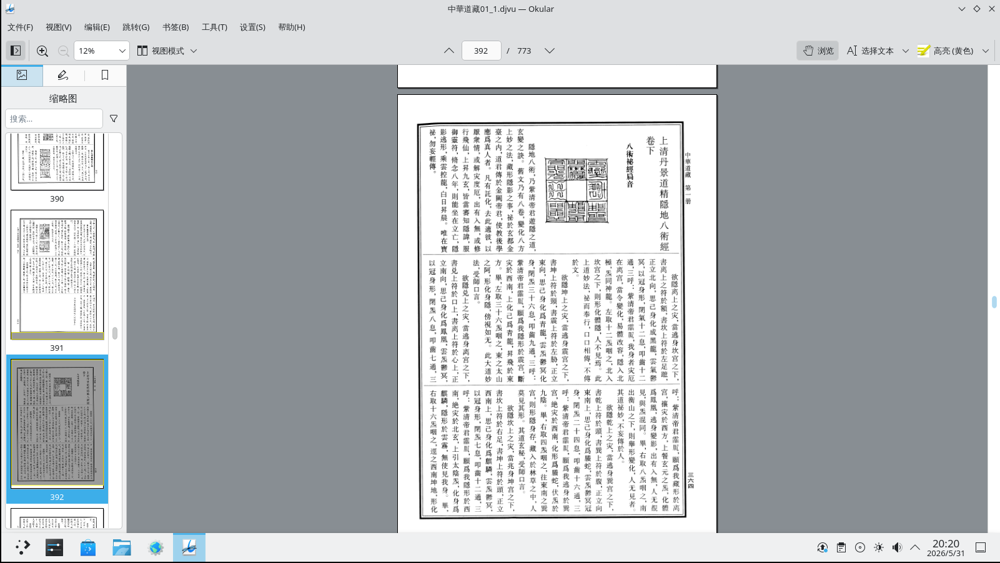
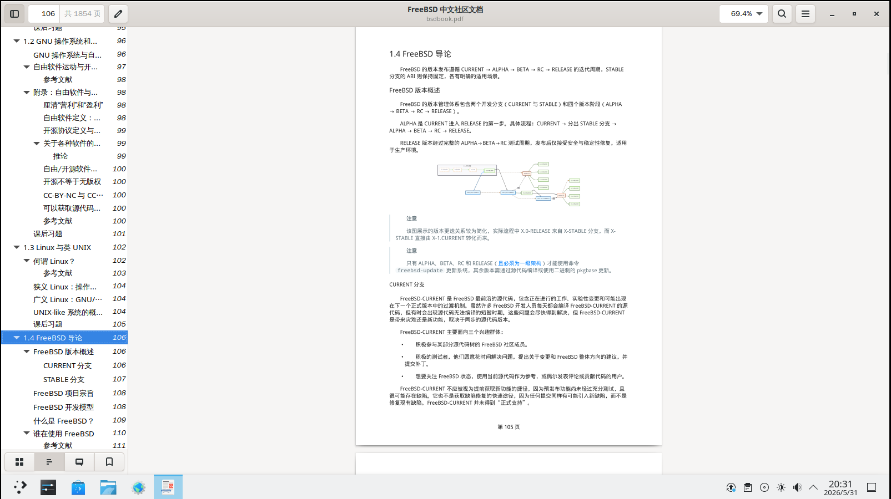
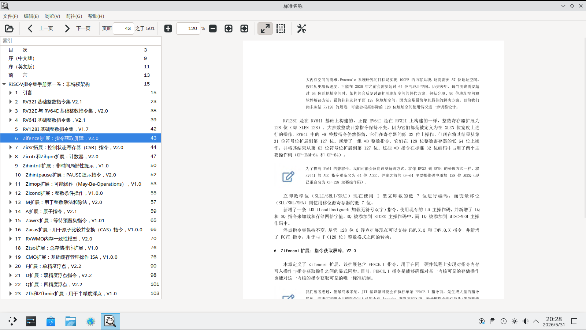
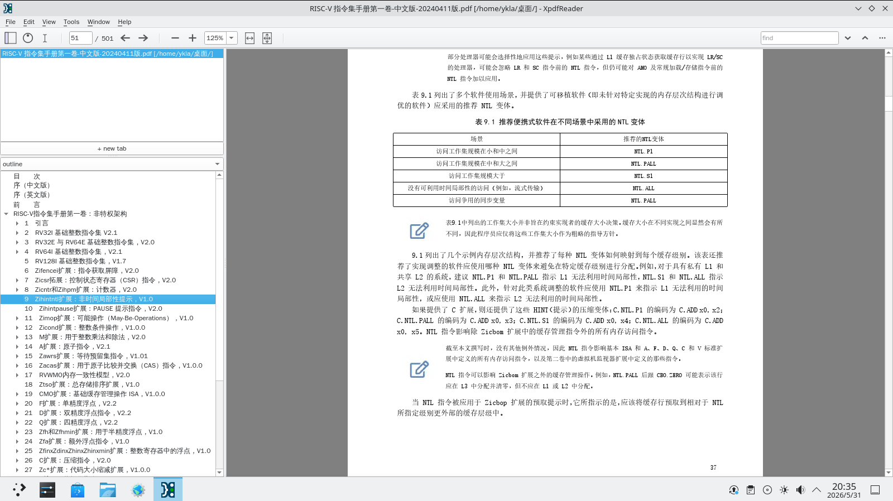
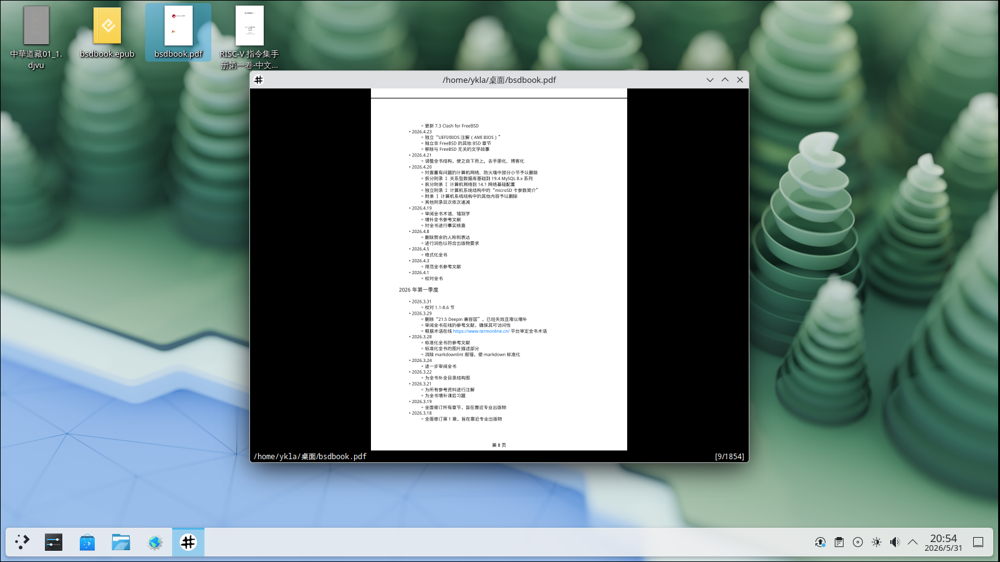
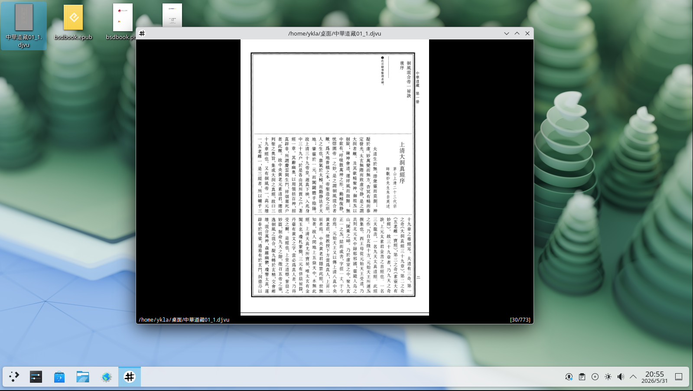

# 11.8 Document Viewers

Since the advent of UNIX, many new document formats have become popular, such as PDF, DjVu, MOBI, AZW3, EPUB, etc., and the viewers required for these formats may not exist in the base system. This section describes how to install document viewers.

## Calibre Document Management (PDF, EPUB, MOBI, AZW3, etc.)

Calibre is an e-book management tool that supports reading, converting, and organizing multiple e-book formats, and also supports custom CSS styles.

Install Calibre using pkg:

```sh
# pkg install calibre
```

Install using Ports:

```sh
# cd /usr/ports/deskutils/calibre/
# make install clean
```

The main interface of Calibre is as follows.



## Okular

Okular is a universal document viewer, part of KDE Gear (KDE application collection), and is installed along with the KDE desktop environment. Okular supports multiple document formats such as PDF, PostScript, DjVu, CHM, XPS, ePub, etc.

Install Okular using pkg:

```sh
# pkg install okular
```

Install using Ports:

```sh
# cd /usr/ports/graphics/okular/
# make install clean
```



## Evince

Evince is a document viewer that supports multiple document formats such as PDF, PostScript, etc. It is part of the GNOME project and is installed along with the GNOME desktop environment.

Install Evince using pkg:

```sh
# pkg install evince
```

Install using Ports:

```sh
# cd /usr/ports/graphics/evince/
# make install clean
```



## ePDFView

ePDFView is a lightweight PDF document viewer that only uses the Gtk+ and Poppler libraries. The goal of ePDFView is to provide a simple PDF document viewer similar to Evince, but without using GNOME libraries.

Install ePDFView using pkg:

```sh
# pkg install epdfview
```

Install using Ports:

```sh
# cd /usr/ports/graphics/epdfview/
# make install clean
```



## Xpdf

Xpdf is a PDF viewer. Currently `graphics/xpdf` is a slave port of `graphics/xpdf4`, which by default depends on the Qt5 toolkit and is no longer the traditional lightweight pure X11 version, making it unsuitable for users who prefer lightweight applications.

Install Xpdf using pkg:

```sh
# pkg install xpdf
```

Install using Ports:

```sh
# cd /usr/ports/graphics/xpdf/
# make install clean
```



## Zathura

Zathura is a highly customizable document viewer. It provides a minimalist, space-saving interface and focuses primarily on keyboard interaction.

### PDF Support (MuPDF Backend)

**zathura-pdf-mupdf** uses the MuPDF library as its backend, making it more lightweight.

Install Zathura with PDF support using pkg:

```sh
# pkg install zathura-pdf-mupdf
```

Install using Ports:

```sh
# cd /usr/ports/graphics/zathura-pdf-mupdf/
# make install clean
```



### PDF Support (Poppler Backend)

Additionally, you can install **graphics/zathura-pdf-poppler**, which uses the Poppler library, as an alternative choice for PDF support:

Install Zathura with PDF support using pkg:

```sh
# pkg install zathura-pdf-poppler
```

Install using Ports:

```sh
# cd /usr/ports/graphics/zathura-pdf-poppler/
# make install clean
```


### DjVu Support

Install Zathura with DjVu support using pkg:

```sh
# pkg install zathura-djvu
```

Install using Ports:

```sh
# cd /usr/ports/graphics/zathura-djvu/
# make install clean
```


