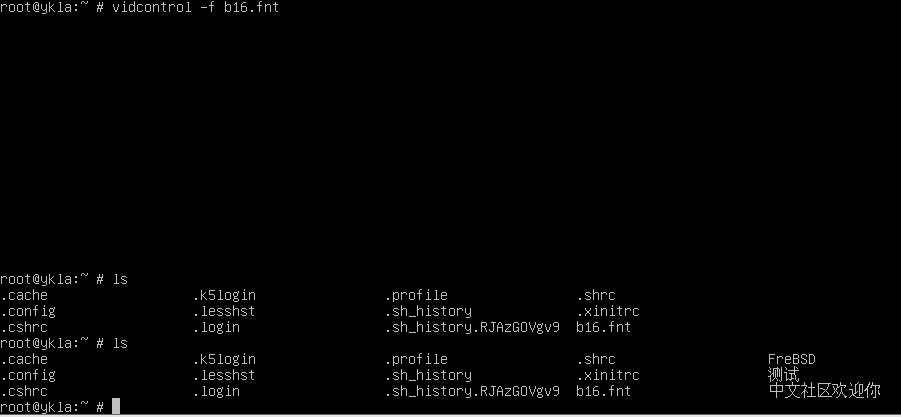
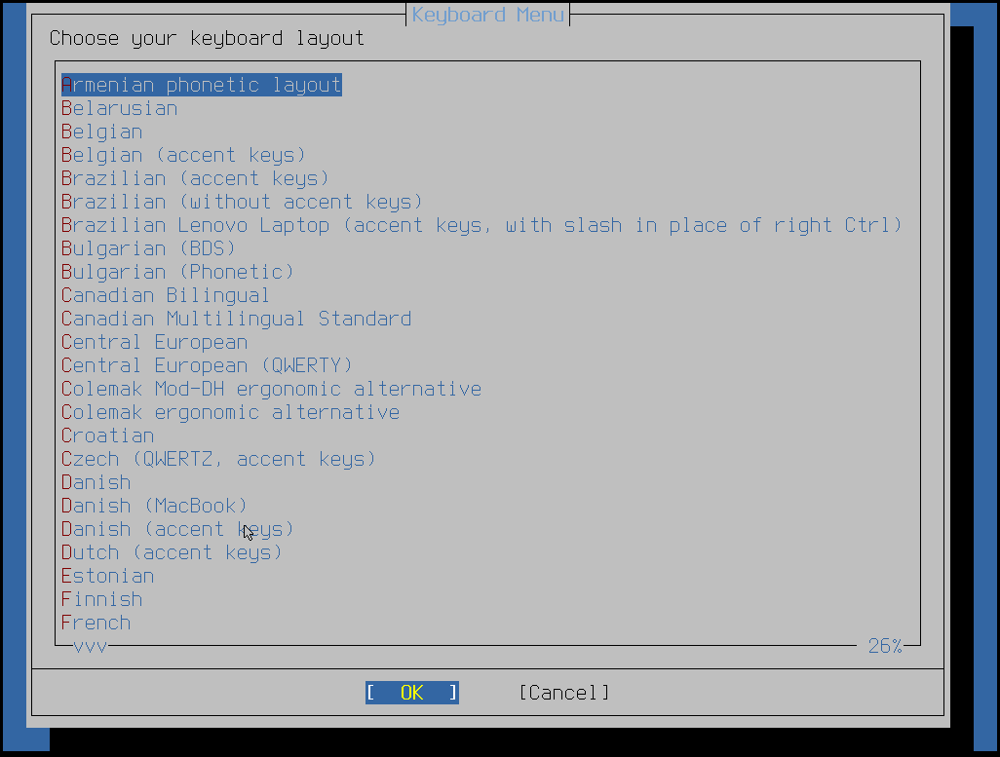

# 12.2 Locale Configuration for Specific Languages

This section describes various methods for configuring locale settings on a FreeBSD system.

## Using Localization

Localization settings are based on three components: language code, region code, and encoding. The locale name is composed of these parts as follows:

```sh
language_code (lowercase)_region_code (uppercase).encoding
```

The **language code** and **region code** are used to determine the region and specific language variant. The following are some examples of **language_code_region_code**:

**Common Language and Region Codes**

| Language_Code_Region_Code_Encoding | Description |
| ---------------------------------- | ----------- |
| en_US.UTF-8 | United States (English) |
| zh_CN.UTF-8 | China (Simplified Chinese) |
| zh_TW.UTF-8 | Taiwan, China (Traditional Chinese) |
| zh_HK.UTF-8 | Hong Kong, China (Traditional Chinese) |

Type the following command to view the complete list of available locales:

```sh
$ locale -a | more
C
C.UTF-8
POSIX
af_ZA.ISO8859-1
af_ZA.ISO8859-15
af_ZA.UTF-8
am_ET.UTF-8
ar_AE.UTF-8
ar_EG.UTF-8
ar_JO.UTF-8
ar_MA.UTF-8
ar_QA.UTF-8
ar_SA.UTF-8
be_BY.CP1131
be_BY.CP1251
be_BY.ISO8859-5
be_BY.UTF-8
bg_BG.CP1251
bg_BG.UTF-8
ca_AD.ISO8859-1
ca_AD.ISO8859-15
ca_AD.UTF-8
ca_ES.ISO8859-1
ca_ES.ISO8859-15
ca_ES.UTF-8
--More--(byte 314) # Press Enter to continue browsing, press q to exit
```

Use the `locale` command to view the current system localization settings:

```sh
$ locale
LANG=C.UTF-8
LC_CTYPE="C.UTF-8"
LC_COLLATE="C.UTF-8"
LC_TIME="C.UTF-8"
LC_NUMERIC="C.UTF-8"
LC_MONETARY="C.UTF-8"
LC_MESSAGES="C.UTF-8"
LC_ALL=
```

Languages such as Chinese or Japanese cannot be represented with ASCII characters and require extended language encodings using wide or multibyte characters. It is recommended to use **UTF-8**.

> **Note**
>
> The locale encoding used by FreeBSD is compatible with Xorg.

## Setting the Locale for the Login Shell

The locale can be configured in the user's **~/.login_conf** file or in the user's shell startup files: **~/.profile**, **~/.bashrc**, or **~/.cshrc**.

Two environment variables need to be set:

- `LANG`: sets the locale
- `MM_CHARSET`: sets the MIME character set used by applications

In addition to the user's shell configuration, these variables also need to be set in the configuration of specific applications and Xorg.

There are two methods to set the required variables: the recommended method is through the login class, and the other is through startup files.

### Login Class Method

This is the recommended method, which sets the required locale and MIME character set environment variables for each shell. This configuration can be done individually by each user, or uniformly by the superuser for all users.

The following is a minimal example that sets two variables for Simplified Chinese (UTF-8 encoding) in a personal user's **~/.login_conf**:

```ini
me:\
        :charset=UTF-8:\
        :lang=zh_CN.UTF-8:
```

The following is an example of a user's **~/.login_conf** that sets variables for Simplified Chinese UTF-8 encoding. Some applications do not correctly handle the locale variables for Chinese, Japanese, and Korean, so more variables are needed to ensure proper operation:

```ini
# If you do not use the currency and time format of mainland China, you can manually adjust the corresponding variables
me:\
        :lang=zh_CN.UTF-8:\
        :setenv=LC_ALL=zh_CN.UTF-8:\
        :charset=UTF-8:
```

>**Note**
>
> This `setenv` is unrelated to csh.

Additionally, the superuser can configure localization settings for all users on the system. The following variables can be configured in **/etc/login.conf** to set the locale and MIME character set:

```ini
Language|Account description:\
        :charset=MIME character set:\
        :lang=Locale:\
        :tc=default: # Inherit other default options
```

For example, the previously mentioned Simplified Chinese example can be configured in **/etc/login.conf** as follows:

```sh
chinese|chinese Users Accounts:\
        :charset=UTF-8:\
        :lang=zh_CN.UTF-8:\
        :tc=default:
```

>**Tip**
>
> This file contains a predefined *russian* class.

After each edit of **/etc/login.conf**, the following command must be executed to rebuild the login capability database:

```sh
# cap_mkdb /etc/login.conf
```

> **Note**
>
> End users need to run the `cap_mkdb` command on **~/.login_conf** for the changes to take effect.

#### Tools for Changing the Login Class

In addition to manually editing **/etc/login.conf**, some tools can be used to set locale settings for newly created users.

When using `vipw` to add a new user, the **chinese** class can be specified to set the locale to Simplified Chinese (UTF-8 encoding):

```ini
Username:Password:1111:11:chinese:0:0:User Name:/home/user:/bin/sh
```

For example, to assign the **chinese** class to user ykla, where no custom user class is currently assigned:

```ini
ykla:$6$SqMJXrv5aC6Wq.by$nmbZs078aHNBVyh9noLFouJsGHyFSvQIzH0W4zpdfXuPtGtt.FHgWfXDHVBa.g9P
0eZ32UwfByzRKdVnTaO7W.:1001:1001::0:0:User &:/home/ykla:/bin/sh
```

After assignment, it becomes:

```ini
ykla:$6$SqMJXrv5aC6Wq.by$nmbZs078aHNBVyh9noLFouJsGHyFSvQIzH0W4zpdfXuPtGtt.FHgWfXDHVBa.g9P
0eZ32UwfByzRKdVnTaO7W.:1001:1001:chinese:0:0:User &:/home/ykla:/bin/sh
```

When using `adduser` to add new users, a default language can be preconfigured for all new users, or a language can be specified for individual users.

If all new users use the same language (assuming Simplified Chinese), `defaultclass=chinese` can be set in **/etc/adduser.conf**.

To override this setting when creating a user, enter the desired login class at the following prompt:

```sh
Login class [default]:
```

Or specify the locale when invoking `adduser`:

```sh
# adduser -class chinese
Username:
```

If using `pw` to add a new user test, specify the locale as follows:

```sh
# pw useradd test -L chinese
```

To change the login class of an existing user, `chpass` or `pw usermod` can be used. Invoke as root and provide the username to edit as an argument:

```sh
# chpass ykla
```

```sh
# pw usermod ykla -L chinese
```

Verify the modification result:

```sh
# pw usershow ykla
ykla:$6$SqMJXrv5aC6Wq.by$nmbZs078aHNBVyh9noLFouJsGHyFSvQIzH0W4zpdfXuPtGtt.FHgWfXDHVBa.g9P0eZ32UwfByzRKdVnTaO7W.:1001:1001:chinese:0:0:User &:/home/ykla:/bin/sh
```

### Shell Startup File Method

This method is not recommended because each shell requires manual configuration, and each shell's configuration file and syntax differ. For example, to set Simplified Chinese for the `sh` shell, the following lines can be added to the **~/.profile** file to set the shell for that user only. These lines can also be added to **/etc/profile** or **/usr/share/skel/dot.profile** to set the shell for all users:

```sh
LANG=zh_CN.UTF-8; export LANG
MM_CHARSET=UTF-8; export MM_CHARSET
```

However, the `csh` shell's configuration file name and syntax are different. The equivalent settings in **~/.login**, **/etc/csh.login**, or **/usr/share/skel/dot.login** are:

```sh
setenv LANG zh_CN.UTF-8
setenv MM_CHARSET UTF-8
```

The syntax for configuring Xorg also depends on the shell being used, making the situation more complex. In **~/.xinitrc**, the configuration examples for `sh` shell and `csh` shell are as follows:

```sh
LANG=zh_CN.UTF-8; export LANG
```

```sh
setenv LANG zh_CN.UTF-8
```

## Console Settings

The VT console uses `xterm` as the default terminal type.

### Fonts

The FreeBSD VT console natively supports CJK character sets (CJK Unified Ideographs), and Chinese can be displayed by loading fonts. The required font format is `.fnt`: this is a binary font file, not a collection of code tables and PNG images.

Use the following command to switch the console font to **test.fnt** (effective only for the current session; reverts to the default font after reboot):

```sh
$ vidcontrol -f test.fnt
```

FreeBSD's base system provides a tool to convert bdf or hex format to fnt files, where `-o` is a required parameter:

```sh
$ vtfontcvt [ -h height ] [ -v ] [ -w width ] -o output_file.fnt font_path
```

Chinese font example:


```sh
# Download the b16 font file
fetch https://people.freebsd.org/~emaste/newcons/b16.fnt

# Switch the console font to b16
vidcontrol -f b16.fnt
```

> **Tip**
>
> If the above link is unavailable, please visit <https://github.com/FreeBSD-Ask/fnt-fonts> to download the font.



The above commands only take effect temporarily. To make them permanent, add the following to the **/etc/rc.conf** file:

```ini
# Set all console screens to use the b16 font
allscreens_flags="-f /root/b16.fnt"
```

## Keyboard Layout

Keyboard layout files are located in `/usr/share/vt/keymaps/`:

```sh
INDEX.keymaps                   il.kbd
am.kbd                          is.acc.kbd
be.acc.kbd                      is.kbd
be.kbd                          it.kbd

...some output omitted...

gr.101.acc.kbd                  us.emacs.kbd
gr.elot.acc.kbd                 us.intl.acc.kbd
gr.kbd                          us.kbd
hr.kbd                          us.macbook.kbd
hu.101.kbd                      us.unix.kbd
hu.102.kbd
```

For example, to change the current layout to the international US keyboard, add the following to the `/etc/rc.conf` file:

```ini
keymap="us.intl.acc"
```

> **Tip**
>
> When specifying a **keyboard layout**, do not include the **.kbd** suffix.

This takes effect after reboot.

To test the keyboard layout without rebooting, the `kbdmap` command can be used to interactively select a keyboard layout:



## Input Methods

**Available Input Methods** summarizes the input method applications available in FreeBSD Ports.

**Fcitx 5 Available Input Methods**

| Language | Input Method |
| -------- | ------------ |
| Simplified Chinese (Pinyin) | [chinese/fcitx5-chinese-addons](https://www.freshports.org/chinese/fcitx5-chinese-addons/) |
| Traditional Chinese (Bopomofo) | [chinese/fcitx5-chewing](https://www.freshports.org/chinese/fcitx5-chewing/) |
| Traditional Chinese (Bopomofo) | [chinese/fcitx5-mcbopomofo](https://www.freshports.org/chinese/fcitx5-mcbopomofo/) |
| Chinese (RIME) | [chinese/fcitx5-rime](https://www.freshports.org/chinese/fcitx5-rime/) |
| Chinese (Shape-based input method) | [chinese/fcitx5-table-extra](https://www.freshports.org/chinese/fcitx5-table-extra/) |
| Japanese (Anthy) | [japanese/fcitx5-anthy](https://www.freshports.org/japanese/fcitx5-anthy/) |
| Japanese (SKK) | [japanese/fcitx5-skk](https://www.freshports.org/japanese/fcitx5-skk/) |
| Japanese (SKK) | [japanese/fcitx5-cskk](https://www.freshports.org/japanese/fcitx5-cskk/) |
| Korean | [korean/fcitx5-hangul](https://www.freshports.org/korean/fcitx5-hangul/) |
| Non-Chinese input method tables | [chinese/fcitx5-table-other](https://www.freshports.org/chinese/fcitx5-table-other/) |

**IBus Available Input Methods**

| Language | Input Method |
| -------- | ------------ |
| Simplified Chinese (Pinyin) | [chinese/ibus-libpinyin](https://www.freshports.org/chinese/ibus-libpinyin/) |
| Traditional Chinese (Bopomofo) | [chinese/ibus-chewing](https://www.freshports.org/chinese/ibus-chewing/) |
| Chinese (RIME) | [chinese/ibus-rime](https://www.freshports.org/chinese/ibus-rime/) |
| Japanese (Anthy) | [japanese/ibus-anthy](https://www.freshports.org/japanese/ibus-anthy/) |
| Japanese (Mozc) | [japanese/ibus-mozc](https://www.freshports.org/japanese/ibus-mozc/) |
| Japanese (SKK) | [japanese/ibus-skk](https://www.freshports.org/japanese/ibus-skk/) |
| Korean | [korean/ibus-hangul](https://www.freshports.org/korean/ibus-hangul/) |

## Troubleshooting and Outstanding Issues

### How to Manually Generate fnt Files for Chinese Fonts

The method provided by [https://github.com/usonianhorizon/vt-fnt](https://github.com/usonianhorizon/vt-fnt) is relatively complex and can generate bdf files, but will produce the same error messages as described in the text. This project explores methods for generating FreeBSD console fonts. The FontForge software mentioned in the text provides a Windows version, available for download at [https://fontforge.org/en-US/downloads/windows-dl/](https://fontforge.org/en-US/downloads/windows-dl/).

## References

- FreeBSD Project. rc.conf[EB/OL]. [2026-03-25]. <https://man.freebsd.org/cgi/man.cgi?query=rc.conf&sektion=5>. This manual page provides detailed information about the syntax and options of the rc.conf system configuration file.
- Mariusz. vidcontrol font and color via /etc/rc.conf problem[EB/OL]. [2026-03-25]. <https://forums.freebsd.org/threads/vidcontrol-font-and-color-via-etc-rc-conf-problem.81696/>. This discussion thread explores issues related to console font and color configuration.
