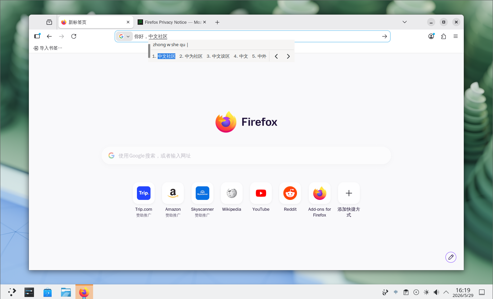
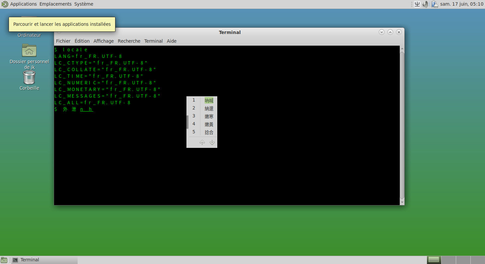

# 12.4 IBus Input Method Framework

IBus stands for "Intelligent Input Bus", an input method framework widely used in Linux and UNIX-like systems.

## Installing the IBus Input Method Framework

- Install using pkg:

```sh
# pkg install ibus zh-ibus-libpinyin
```

Where `zh-ibus-libpinyin` is the intelligent Pinyin input method.

- Or install using Ports:

```sh
# cd /usr/ports/textproc/ibus/ && make install clean
# cd /usr/ports/chinese/ibus-libpinyin/ && make install clean
```

Optional input methods include:

| Port | Description |
| ---- | ----------- |
| `chinese/ibus-cangjie` | Cangjie input method |
| `chinese/ibus-chewing` | New Chewing input method |
| `chinese/ibus-rime` | Rime input method engine |
| `chinese/ibus-table-chinese` | Includes Wubi, Cangjie, and various other input methods |

## Configuring Environment Variables

To set variables for Simplified Chinese UTF-8 encoding, edit the **~/.login_conf** file and add the following content:

```ini
me:\
        :lang=zh_CN.UTF-8:\
        :setenv=LC_ALL=zh_CN.UTF-8,LC_COLLATE=zh_CN.UTF-8,LC_CTYPE=zh_CN.UTF-8,LC_MESSAGES=zh_CN.UTF-8,LC_MONETARY=zh_CN.UTF-8,LC_NUMERIC=zh_CN.UTF-8,LC_TIME=zh_CN.UTF-8,XIM=ibus,GTK_IM_MODULE=ibus,QT_IM_MODULE=ibus,XMODIFIERS="@im=ibus",XIM_PROGRAM="ibus-daemon",XIM_ARGS="--daemonize --xim":\
        :charset=UTF-8:
```

The meanings of the input method-related environment variables are as follows:

| Variable | Description |
| -------- | ----------- |
| `XIM=ibus` | Specifies the X Input Method (XIM) framework as IBus |
| `GTK_IM_MODULE=ibus` | Specifies that GTK applications use the IBus input method module |
| `QT_IM_MODULE=ibus` | Specifies that Qt applications use the IBus input method module |
| `XMODIFIERS="@im=ibus"` | Specifies that X applications connect to IBus via the XIM protocol |
| `XIM_PROGRAM="ibus-daemon"` | Specifies the path to the XIM daemon |
| `XIM_ARGS="--daemonize --xim"` | Specifies the startup arguments for ibus-daemon; `--daemonize` means running as a background daemon, `--xim` means enabling XIM support |

After editing, execute the following command to update the login capability database:

```sh
$ cap_mkdb ~/.login_conf
```

### Wayland

Under Wayland, the environment variable configuration for IBus differs from X11. GNOME has integrated IBus since version 3.6, and under GNOME Wayland, there is no need to manually set `GTK_IM_MODULE` and `QT_IM_MODULE`. For other desktop environments, the configuration strategy for `GTK_IM_MODULE` and `QT_IM_MODULE` is similar to Fcitx 5 (see Section 12.3 Wayland section). `XIM_PROGRAM` and `XIM_ARGS` are only used in X11/XWayland environments and are not needed in pure Wayland sessions.

## Configuring IBus

After completing the environment variable configuration, set up IBus using the following method.

IBus setup tool:

```sh
$ ibus-setup
```



## UTF-8 Encoding

IBus requires UTF-8 encoding, but does not restrict the specific locale value (such as `C.UTF-8` or `zh_CN.UTF-8`).


