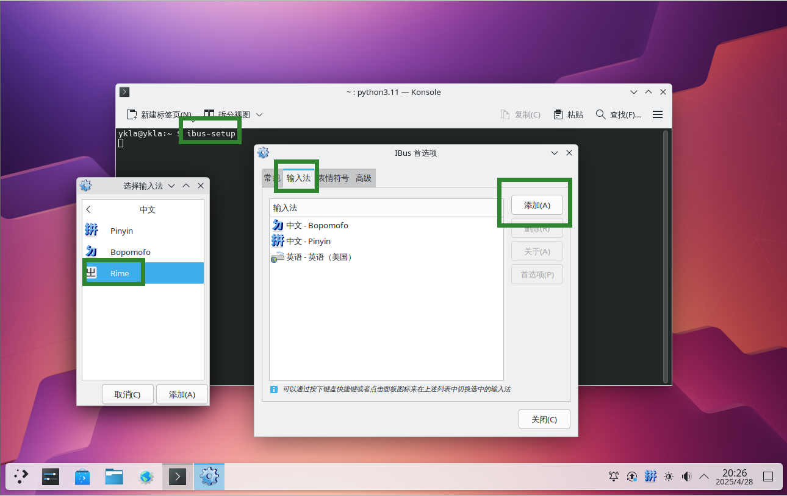
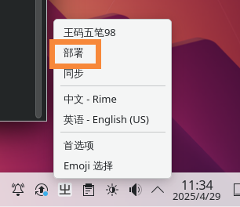
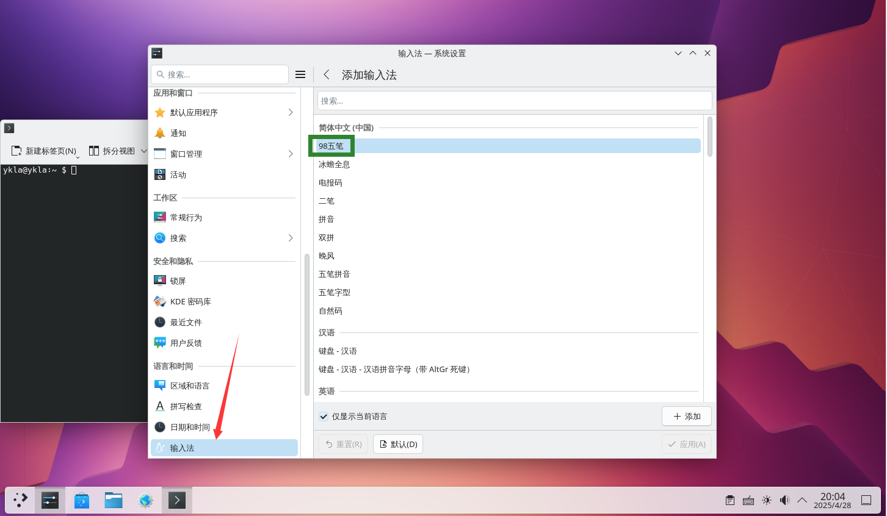
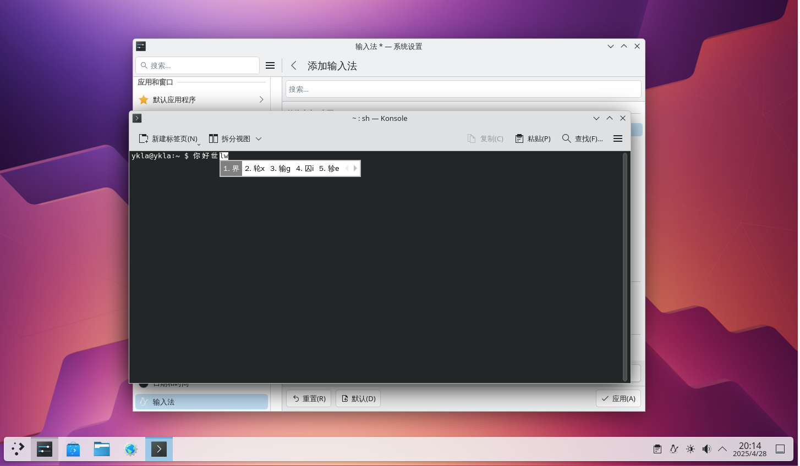

# 12.5 Wubi Input Method

The Wubi input method is a commonly used shape-based input method in the field of Chinese input. FreeBSD can implement Wubi support through either the IBus + Rime or Fcitx 5 + Wubi Pinyin combination.

## IBus Input Method Framework

IBus must be installed and configured first; this section does not provide detailed instructions.

### Installing the Rime Input Method

Under the IBus framework, the Wubi input method is used by installing the Rime input method.

- Install using pkg:

```sh
# pkg install zh-ibus-rime
```

Or install using Ports:

```sh
# cd /usr/ports/chinese/ibus-rime/
# make install clean
```

Run the initialization command `ibus-setup` in the terminal to add the `rime` input method:



### Configuring the Rime Input Method

After installation, configure the Rime input method to use the Wubi input method.

Copy the 98 Wubi table files (`free-bsd-98wubi-tables-master/wubi98.dict.yaml` and `free-bsd-98wubi-tables-master/wubi98.schema.yaml`) to the **/usr/local/share/rime-data** directory. 98 Wubi table download address: [FreeBSD-98wubi-tables](https://github.com/FreeBSD-Ask/98-input). This repository provides 98 Wubi input method table files for FreeBSD.

Configuration file structure:

```sh
/usr/local/share/
└── rime-data/
    └── default.yaml # Rime default configuration file (system-level)
```

Edit the user-level configuration file **~/.config/ibus/rime/default.custom.yaml** (IBus) or **~/.local/share/fcitx5/rime/default.custom.yaml** (Fcitx 5). Write the following content:

```yaml
patch:
  schema_list:
    - schema: wubi98
```

> **Note**
>
> `default.custom.yaml` is Rime's user-level patch file, which overrides the corresponding configuration items in the system-level `default.yaml` through the `patch` mechanism, without the need to directly modify system files. Redeploying the Rime input method will apply the changes.

Save and exit. Redeploy the Rime input method to apply the changes.




## Fcitx 5

In addition to IBus, the Wubi input method can also be used under the Fcitx 5 input method framework.

### Installing Fcitx 5

```sh
# pkg install fcitx5 fcitx5-qt5 fcitx5-qt6 fcitx5-gtk2 fcitx5-gtk3 fcitx5-gtk4 fcitx5-configtool zh-fcitx5-chinese-addons
```

The specific configuration steps for Fcitx 5 are not covered in detail in this section.

### Configuring 98 Wubi in Fcitx 5

To configure the 98 Wubi input method under the Fcitx 5 framework, follow these steps:

Download the required files from <https://github.com/FreeBSD-Ask/98-input>.

- Copy the `98五笔/98wbx.conf` file to the **/usr/local/share/fcitx5/inputmethod/** directory;
- Copy the `98五笔/fcitx-98wubi.png` and `org.fcitx.Fcitx5.fcitx-98wubi.png` icons to the **/usr/local/share/icons/hicolor/48x48/apps/** directory;
- Place the `98五笔/98wbx.main.dict` dictionary in the **/usr/local/share/libime/** directory.
- Restart fcitx5 and enable 98 Wubi in the settings.

Related file structure:

```sh
/usr/local/share/
├── fcitx5/
│   └── inputmethod/
│       └── 98wbx.conf # Fcitx5 98 Wubi configuration file
├── icons/
│   └── hicolor/
│       └── 48x48/
│           └── apps/
│               ├── fcitx-98wubi.png # 98 Wubi icon
│               └── org.fcitx.Fcitx5.fcitx-98wubi.png # 98 Wubi icon
└── libime/
    └── 98wbx.main.dict # 98 Wubi dictionary
```





#### Appendix: Method for Generating `.dict` Library from Wangma 98 Wubi

Use the libime tool to convert `98wbx.txt` to the `98wbx.main.dict` dictionary file:

```sh
$ libime_tabledict 98wbx.txt 98wbx.main.dict
```

## Configuring Rime to Use 86 Wubi

Install and configure Fcitx 5; configuration steps are omitted.

Install using pkg:

```sh
# pkg install zh-fcitx5-rime zh-rime-essay zh-rime-wubi
```

Or install using Ports:

```sh
# cd /usr/ports/chinese/rime-wubi/ && make install clean
# cd /usr/ports/chinese/fcitx5-rime/ && make install clean
# cd /usr/ports/chinese/rime-essay/ && make install clean
```

The method for adding the Rime input method is the same as above.

Edit the user-level configuration file **default.custom.yaml** (create it if it does not exist) and write the following content:

```yaml
patch:
  schema_list:
    - schema: wubi86
```

## Configuration Files

After installing the Wubi input method, the Rime configuration file locations are as follows:

- Rime configuration file path under IBus

```sh
$ cd ~/.config/ibus/rime
```

- Rime configuration file path under Fcitx 5

```sh
$ cd ~/.local/share/fcitx5/rime
```

Related file structure:

```sh
~/
├── .config/
│   └── ibus/
│       └── rime/ # Rime configuration file directory under IBus
│           └── build/
│               └── ibus_rime.yaml # IBus Rime configuration file
└── .local/
    └── share/
        └── fcitx5/
            └── rime/ # Rime configuration file directory under Fcitx 5
```

### Modifying Candidate Characters to Display 9 Columns Per Page

First switch to the configuration file directory mentioned above, then perform the following operations.

#### Method ①

Use the `rime_patch` tool to generate a menu for the default Rime input method:

```sh
$ rime_patch default menu
page_size: 9 # Enter and press Enter
^D # Press ctrl+D
patch applied.
```

Where:

- `default` corresponds to the `default.custom.yaml` file
- `menu` corresponds to the first-level option, `page_size` corresponds to the second-level option

Restart.

#### Method ②

Use the `rime_patch` tool to generate a menu with page size settings for the default Rime input method:

```sh
$ rime_patch default menu/page_size
9 # Enter and press Enter
^D # Press ctrl+D
patch applied.
```

Restart.

Method 2 is recommended for configuration; Method 1 requires some understanding of the configuration file format in complex scenarios.

### Default English Output

Use the `rime_patch` tool to reset the first switch (ascii_mode) configuration of the wubi86 input method:

```sh
$ rime_patch wubi86 'switches/@0/reset'
1
^D
patch applied.
```

Here the patch is applied to the wubi86 input method (written to the `wubi86.custom.yaml` file); most options are input method-related, while a few options are global settings (written to the `default.custom.yaml` file).

Restart.

### IBus Horizontal Output

Edit the **~/.config/ibus/rime/ibus_rime.custom.yaml** file, write the following content, and redeploy the input method or restart:

```yaml
patch:
  style/horizontal: true
```


## Troubleshooting

Directly modifying system-level files (such as `/usr/local/share/rime-data/default.yaml`) affects global settings and can easily be overwritten during system updates. It is recommended to always customize through user-level configuration files (`default.custom.yaml`).

## References

- Rime Project. CustomizationGuide[EB/OL]. [2026-03-25]. <https://github.com/rime/home/wiki/CustomizationGuide>. This guide describes the customization methods and techniques for the Rime input method.
- catfishjones. How to set ibus-rime input box to display horizontally[EB/OL]. [2026-03-25]. <https://github.com/rime/ibus-rime/issues/52>. This Issue provides a configuration solution for horizontal display in ibus-rime.
- LEOYoon-Tsaw. Rime_collections/Rime_description.md[EB/OL]. [2026-03-25]. <https://github.com/LEOYoon-Tsaw/Rime_collections/blob/master/Rime_description.md>. This document provides a detailed introduction to the configuration format and options of the Rime input method.
