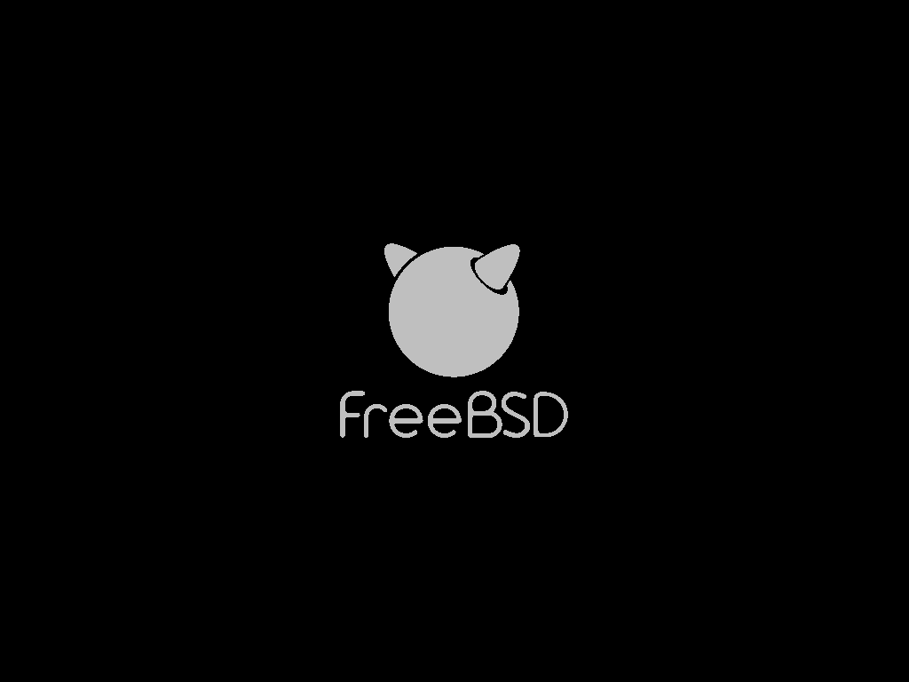
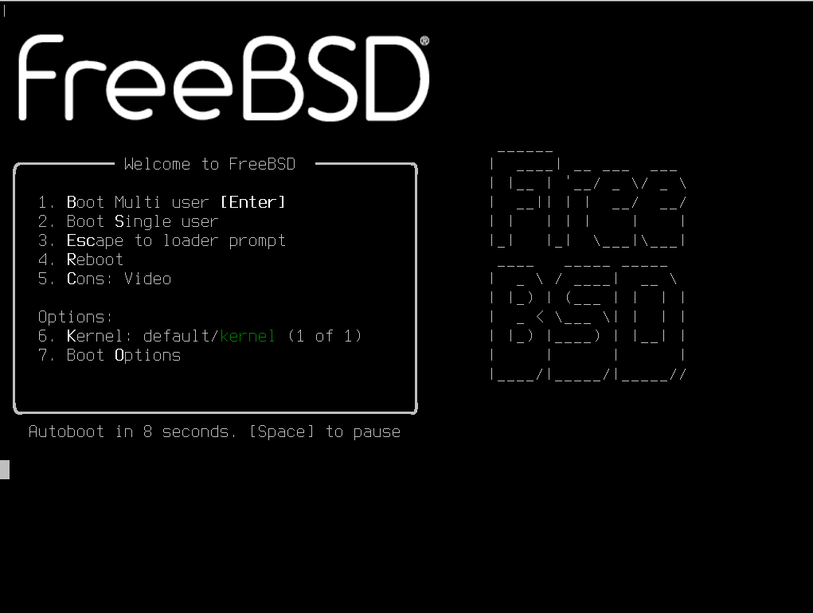

# 15.1 Boot Loaders

The FreeBSD boot process consists of five core stages: firmware initialization (BIOS or UEFI) → boot loader (boot0/boot1/boot2) → loader boot → kernel initialization → user space initialization, where the loader stage enables parameterized configuration through loader.conf. This section analyzes the boot process and explains the key configuration items of loader.conf.

## Overview of the FreeBSD Boot Process

The FreeBSD boot process is a multi-stage ordered sequence, starting from the hardware Power-On Self-Test (POST), proceeding through firmware initialization, boot loader execution, kernel loading, and finally entering user space initialization. The loader is the final stage of the boot loading process.

The FreeBSD boot process can be divided into the following stages:

1. **POST (Power-On Self-Test)**: After the computer is powered on, the CPU first executes the initialization code in the firmware (BIOS or UEFI), completing hardware self-testing and basic device configuration.

2. **Firmware Boot Stage**: After POST completes, the firmware locates the boot device according to the boot order.

- In BIOS mode, the firmware reads the boot code from the disk's Master Boot Record (MBR) or Volume Boot Record (VBR);
- In UEFI mode, the firmware loads an EFI application from the EFI System Partition (ESP). FreeBSD's UEFI boot program is located at **/EFI/freebsd/loader.efi**.

3. **Boot Loader Stage**: FreeBSD's boot loader is divided into four stages (in BIOS mode: `boot0`/`boot1`/`boot2`/`loader`, in UEFI mode: `loader.efi`). Among them, `boot0` is stage 0 (boot manager), `boot1` and `boot2` are stages 1 and 2, and `loader` is stage 3. The final stage loader(8) is an interactive boot loader that reads the **/boot/loader.conf** configuration file, loads the kernel and modules, and then transfers control to the kernel.

4. **Kernel Initialization Stage**: After the kernel is loaded, it first probes hardware and initializes devices, then mounts the root file system and starts the init(8) process. init(8) is always the first user space process started by the kernel, and its process ID (PID) is always 1.

init(8) signal parameters (BSD init does not use the System V runlevel mechanism):

| Signal | Action |
| ------ | ------ |
| SIGUSR1 | Halt |
| SIGUSR2 | Halt and power off (requires hardware support) |
| SIGWINCH | Halt, power off, then reboot (requires hardware support) |
| SIGTERM | Terminate multi-user operation and enter single-user mode |
| SIGINT | Terminate all processes and reboot the system |
| SIGTSTP | Prevent further logins (reboot(8) and halt(8) send this signal before shutdown to prevent new logins) |
| SIGHUP | Re-read the ttys(5) file |

> **Note**:
>
> If the secure level is enabled too early (greater than 1), it may prevent fsck(8) from repairing inconsistent file systems. It is recommended to set the secure level at the end of **/etc/rc**. When running init(8) in a Jail, the secure level is set independently for the Jail and does not affect the host system.

5. **User Space Initialization Stage**: init(8) reads the **/etc/rc** script, which starts system services according to the configuration in **/etc/rc.conf**, ultimately bringing the system into multi-user mode.

## FreeBSD Boot Process Under Traditional Boot (BIOS + MBR)

### Boot Manager (Stage 0)

`boot0cfg` only applies to BIOS/MBR boot mode and is not applicable to UEFI systems (UEFI uses efibootmgr(8)).

The boot manager code in the MBR is sometimes referred to as stage 0 of the boot process. By default, FreeBSD uses the boot0 boot manager.

The MBR installed by the FreeBSD installer is based on **/boot/boot0**. Due to the limitations of the partition table and the 0x55AA identifier at the end of the MBR, the size and functionality of boot0 are limited to 446 bytes.

> **Tip**
>
> At the end of the MBR, there is also a two-byte signature field with the value 0x55AA, known as the Sector Marker. This field typically also marks the end of Extended Boot Records (EBR) and boot sectors.

If boot0 and multiple operating systems are installed, a message similar to the following will be displayed at boot time:

```sh
F1 Win
F2 FreeBSD

Default: F2
```

#### References

- FreeBSD Project. boot0 MBR boot code[EB/OL]. [2026-04-28]. <https://github.com/freebsd/freebsd-src/blob/main/stand/i386/boot0/boot0.S>. This file contains the implementation of the MBR boot sector, with the last two bytes being the 0x55AA signature.

### Stage 1 and Stage 2

Conceptually, stage 1 and stage 2 are components of the same program residing in the same disk area. Due to space constraints, they are divided into two parts but are always installed together.

They are copied by the FreeBSD installer from **/boot/boot**.

These two stages reside outside the file system, in the first track of the boot partition, starting from the first sector. This is where boot0 or other boot managers look for the subsequent boot program.

Stage 1's boot1 is very simple due to its 512-byte size limitation. It knows just enough about the FreeBSD bsdlabel (which stores partition information) to find and execute boot2.

Stage 2's boot2 is slightly more complex; it can recognize the FreeBSD file system and find files within it. It provides a simple interface for selecting the kernel or loader to run. It runs the loader, which is more complex and capable of reading boot configuration files. If the boot process is interrupted at stage 2, the following interactive screen will be displayed:

```sh
>> FreeBSD/i386 BOOT
Default: 0:ada(0,a)/boot/loader
boot:
```

### Stage 3 (loader)

The loader is the final stage of the stage 3 boot process. It resides on the file system, typically at **/boot/loader**.

The loader provides an interactive configuration method using a built-in command set, supplemented by a more powerful interpreter that has a more complex command set. Starting from FreeBSD 12.0, the default script interpreter is Lua (previously Forth), while a Simple interpreter is retained to support pure built-in commands.

During initialization, the loader probes the console and disks, and determines which disk to boot from. It sets variables accordingly and starts an interpreter through which users can pass commands via scripts or interactively.

The loader then reads **/boot/loader.rc**, which by default reads **/boot/defaults/loader.conf** (setting reasonable default values for variables) and **/boot/loader.conf** (for local changes to these variables). loader.rc then loads the selected modules and kernel based on these variables.

Finally, by default, the loader waits 10 seconds for a user keypress; if uninterrupted, it boots the kernel. If the user interrupts this process, a prompt supporting the command set will appear, where the user can adjust variables, unload all modules, load modules, and then boot or reboot.

Common built-in commands of the loader are as follows:

| Command | Description |
| ------- | ----------- |
| `autoboot seconds` | Continues booting the kernel if not interrupted within the given time span (seconds). It displays a countdown; the default time span is 10 seconds. |
| `boot [-options] [kernelname]` | Immediately boots the kernel, with any specified options or kernel name. |
| `boot-conf` | Re-performs automatic module configuration based on specified variables (most commonly kernel). This command only makes sense after using `unload` to change variables first. |
| `help [topic]` | Displays help messages read from **/boot/loader.help**. |
| `include filename` | Reads the specified file and interprets it line by line. Errors immediately abort the file inclusion. |
| `load [-t type] filename` | Loads a kernel, kernel module, or file of the given type. |
| `ls [-l] [path]` | Displays a list of files in the given path. |
| `lsdev [-v]` | Lists all devices from which modules may be loaded. |
| `lsmod [-v]` | Displays loaded modules. |
| `more filename` | Displays the specified file, pausing at each page. |
| `reboot` | Immediately reboots the system. |
| `set variable`, `set variable=value` | Sets the specified environment variable. |
| `unload` | Removes all loaded modules. |

The following are several practical examples of using the loader.

Boot the default kernel in single-user mode:

```sh
boot -s
```

Unload the default kernel and modules, then load the previous kernel or another specified kernel:

```sh
unload
load /path1/path2/kernel_file
```

Use **/boot/kernel/kernel** to reference the default kernel that came with the installation, or use **/boot/kernel.old/kernel** to reference the previous kernel installed before a system upgrade or custom kernel configuration.

Use the following commands to load the default modules with another kernel. Note that the full path of the module does not need to be specified at this point:

```sh
unload
set kernel="kernel_name"
boot-conf
```

Load an automated kernel configuration script:

```sh
load -t script /boot/kernel.conf
```

### Final Stage

After the kernel is loaded by the loader or boot2 (boot2 can bypass the loader and load the kernel directly), the kernel checks the boot flags and adjusts its behavior accordingly. Commonly used boot flags are as follows:

| Option | Description |
| ------ | ----------- |
| `-a` | During kernel initialization, prompt for the device to mount as the root file system. |
| `-C` | Boot the root file system from CDROM. |
| `-s` | Boot into single-user mode. |
| `-v` | Output more detailed information during kernel boot. |

For more information about other boot flags, refer to boot(8).

After the kernel finishes booting, it transfers control to the user process init(8), which is located at **/sbin/init**, or the program path specified by the `init_path` variable in the loader. This is the final stage of the boot process.

The boot sequence ensures that the file systems available on the system are consistent. If a UFS file system is inconsistent and fsck cannot repair the inconsistencies, init will downgrade the system to single-user mode so that the system administrator can directly resolve the issue. If the file systems are fine, the system will boot into multi-user mode.

## Single-User Mode

A user can specify single-user mode by booting with `-s` or by setting the `boot_single` variable in the loader. You can also enter single-user mode from multi-user mode by running `shutdown now`. Upon entering single-user mode, the following will be displayed:

```sh
Enter full pathname of shell or RETURN for /bin/sh:
```

If the user presses Enter, the system will enter the default POSIX shell. To specify a different shell, enter the full path of the shell.

Single-user mode is typically used to repair a system that cannot boot due to file system inconsistencies or boot configuration file errors. It can also be used to reset the root password when it is unknown. Since the single-user mode prompt provides complete local access to the system and its configuration files, these operations are possible. There is no network in this mode.

Although single-user mode is practical for repairing systems, it poses a security risk unless the system is in a physically secure location. By default, anyone who can gain physical access to the system and boot into single-user mode will have complete control over the system.

## Multi-User Mode

If init finds the file systems are fine, or the user has completed operations in single-user mode and enters `exit` to leave single-user mode, the system enters multi-user mode and starts the system's resource configuration.

The resource configuration system reads default configuration from the **/etc/defaults/rc.conf** file and system-specific configuration from the **/etc/rc.conf** file. It then mounts the file systems listed in **/etc/fstab** and starts network services, system daemons, and startup scripts for locally installed packages.

For more information about the resource configuration system, refer to rc(8) and check the scripts in the **/etc/rc.d** directory.

## Shutdown Process

When a controlled shutdown is performed using shutdown(8), init(8) attempts to run the script **/etc/rc.shutdown**, then sends the TERM signal to all processes, followed by the KILL signal to any processes that do not terminate in time.

## Functionality and File Structure of loader.conf

loader.conf is the core configuration file in the FreeBSD system boot process; see loader.conf(5). This file is read during the boot loader loader(8) stage and is used to specify the kernel to boot, parameters to pass to the kernel, and additional modules to load. It can also set all variables supported by loader(8).

The file structure related to loader.conf(5) is as follows:

```sh
/
└── boot/ Programs and configuration files used during OS boot
     ├── loader.conf User-defined settings
     ├── loader.conf.lua User-defined settings written in Lua (does not exist by default)
     ├── loader.conf.d/ Subdirectory for user-defined settings (empty by default)
     │    ├── *.conf User-defined settings split into multiple files (does not exist by default)
     │    └── *.lua User-defined settings written in Lua and split into multiple files (does not exist by default)
     ├── loader.conf.local Machine-specific settings that can override settings in other configuration files (does not exist by default)
     └── defaults/ Directory for default boot configuration files
          └── loader.conf Default settings file (do not modify directly), see loader.conf(5)
```

loader.conf is the core file for system boot configuration, located at **/boot/loader.conf**. Configuration written here takes effect earlier than the `rc.conf` file, but improper configuration may prevent the system from booting properly.

> **Note**
>
> It is not recommended to modify the **/boot/defaults/loader.conf** file directly. For custom configuration, use the **/boot/loader.conf** file or the **/boot/loader.conf.local** file to extend local settings. The **/boot/loader.conf.local** file has the highest priority and is specifically for machine-specific settings.

## loader.conf Configuration for Standard ZFS Installation

In the standard ZFS installation scheme, the **/boot/loader.conf** file typically contains the following configuration (using 15.0-RELEASE as an example):

```ini
kern.geom.label.disk_ident.enable="0"     # Disable disk_ident labels, such as /dev/diskid/DISK-S3Z4NB0K123456 (hardware serial number)
kern.geom.label.gptid.enable="0"     # Disable device names based on GPT UUID, such as /dev/gptid/3f6c3a3e-4bcb-11ee-8e6d-001b217e6c8a
zfs_enable="YES"     # Load zfs module by default
```

This file is automatically written by the bsdinstall(8) installer during system installation. Specifically, the [usr.sbin/bsdinstall/scripts/zfsboot](https://github.com/freebsd/freebsd-src/blob/e6d579be42550f366cc85188b15c6eb0cad27367/usr.sbin/bsdinstall/scripts/zfsboot#L1385) script writes the three configuration lines `kern.geom.label.disk_ident.enable="0"`, `kern.geom.label.gptid.enable="0"`, and `zfs_enable="YES"` respectively. Therefore, in systems using the standard ZFS installation scheme, these three lines constitute the entire initial content of the **/boot/loader.conf** file.

## Content Structure and Description of the Default Configuration File

The default configuration file is located in the source code at [stand/defaults/loader.conf](https://github.com/freebsd/freebsd-src/blob/main/stand/defaults/loader.conf). The following content is based on the version at [loader.conf.5: "console" setting does not document multi-value possibility](https://github.com/freebsd/freebsd-src/commit/240c614d48cb0484bfe7876decdf6bbdcc99ba73):

```ini
# This is loader.conf — a file containing many useful variables
# You can change the system's default loading behavior by setting these variables.
# Do not edit this file directly!
# Put any overrides into one of the files in loader_conf_files
# so that updating these defaults later will not affect the native configuration.

#
# All parameters must be enclosed in double quotes.
#

###  Basic Configuration Options  ############################
# Execute command, print "Loading /boot/defaults/loader.conf" on screen
exec="echo Loading /boot/defaults/loader.conf"     # (Loading /boot/defaults/loader.conf)

# Kernel settings
kernel="kernel"		# /boot subdirectory containing the kernel and modules.
bootfile="kernel"	# Kernel name (can be an absolute path)
kernel_options=""	# Flags to pass to the kernel

# Boot loader configuration file settings
loader_conf_files="/boot/device.hints /boot/loader.conf"   # List of configuration files read by loader by default
loader_conf_dirs="/boot/loader.conf.d"                     # Configuration directory read by loader, will load *.conf and *.lua files in this directory
local_loader_conf_files="/boot/loader.conf.local"          # Machine-specific configuration file that can override settings in other configuration files
nextboot_conf="/boot/nextboot.conf"                        # Temporary configuration file for next boot
verbose_loading="NO"		# Set to YES to enable verbose boot output

###  Boot Screen Configuration  ############################
# Boot Logo settings
splash_bmp_load="NO"		# Set to YES to enable bmp boot splash
splash_pcx_load="NO"		# Set to YES to enable pcx boot splash
splash_txt_load="NO"		# Set to YES to enable TheDraw boot splash
vesa_load="NO"			# Set to YES to load vesa module
bitmap_load="NO"		# Set to YES if you want to use a boot splash
bitmap_name="splash.bmp"	# Set to filename
bitmap_type="splash_image_data" # And place it in module_path
splash="/boot/images/freebsd-logo-rev.png"  # Then set boot_mute=YES to load it

###  Screen Saver Modules  ###################################
# It is recommended to set these screen savers in rc.conf
screensave_load="NO"		# Set to YES to load screen saver module
screensave_name="green_saver"	# Set the screen saver module name to use

###  Early hostid Configuration ############################
# Unique identifier for this machine
hostuuid_load="YES"        # Set to YES to load hostuuid module
hostuuid_name="/etc/hostid" # Specify hostid file path
hostuuid_type="hostuuid"   # Specify module type as hostuuid

###  Random Number Generation Configuration  ##################
# For cryptographic modules, random number generation
# See rc.conf(5). The entropy_boot_file configuration variable in rc.conf must match the setting below
# entropy_boot_file in rc.conf and entropy_cache_name in loader.conf must specify the same file
entropy_cache_load="YES"		# Set to NO to disable loading cached entropy at boot
entropy_cache_name="/boot/entropy"	# Set to the name of this file
entropy_cache_type="boot_entropy_cache"	# Type required by the kernel to find the boot entropy cache. This value must never be changed even if _name above changes!
entropy_efi_seed="YES"			# Set to NO to disable loading entropy from UEFI hardware random number generator API
entropy_efi_seed_size="2048"		# Set to a different value to change the amount of entropy requested from EFI


###  RAM Blacklist Configuration  ############################
# For masking bad memory addresses, applicable to servers
ram_blacklist_load="NO"			# Set to YES to load a file containing a list of addresses to exclude from the running system
ram_blacklist_name="/boot/blacklist.txt" # Set to the name of this file
ram_blacklist_type="ram_blacklist"	# Type required by the kernel to find the blacklist module

###  Microcode Loading Configuration  ########################
# Processor microcode configuration
cpu_microcode_load="NO"			# Set to YES to load and apply microcode update file at boot
cpu_microcode_name="/boot/firmware/ucode.bin" # Set to microcode update file path
cpu_microcode_type="cpu_microcode"	# Type required by the kernel to find the microcode update file

###  ACPI Settings  ##########################################
acpi_dsdt_load="NO"		# DSDT override
acpi_dsdt_type="acpi_dsdt"	# Do not modify this
acpi_dsdt_name="/boot/acpi_dsdt.aml"     # Use this file to override DSDT in BIOS
acpi_video_load="NO"		# ACPI video extension driver

###  Audit Settings  #########################################
# Security audit system event definition preload configuration
audit_event_load="NO"		# Set to YES to preload audit_event configuration file early at boot
audit_event_name="/etc/security/audit_event" # Specify audit_event configuration file path
audit_event_type="etc_security_audit_event"  # Type required by the kernel to find and identify this configuration file

### Initial Memory Disk Settings ###########################
# Memory disk settings
#mdroot_load="YES"		# The "mdroot" prefix can be changed arbitrarily
#mdroot_type="md_image"		# Create an md(4) memory disk at boot
#mdroot_name="/boot/root.img"	# Path to the file containing the disk image
#rootdev="ufs:/dev/md0"		# Set the root file system to md(4) device

###  Boot Settings  ########################################
#loader_delay="3"		# Seconds to delay before loading anything. Default is unset and disabled (no delay)
#autoboot_delay="10"		# Seconds to delay before automatic boot, -1 means no user interruption, NO means disabled
#print_delay="1000000"		# Slow printing of loader messages for debugging. Unit is microseconds (1000000 microseconds = 1 second)
#password=""			# Password for modifying boot options, to prevent modification of boot options
#bootlock_password=""		# Set boot lock password to prevent unauthorized booting (see loader.conf(5))
#geom_eli_passphrase_prompt="NO" # Whether to prompt: enter geli(8) passphrase to mount root file system
bootenv_autolist="YES"		# Automatically populate ZFS boot environment list
#beastie_disable="NO"		# Whether to enable Beastie (little daemon) boot menu
efi_max_resolution="1x1"	# Set maximum resolution used under EFI boot: options include 480p, 720p, 1080p, 1440p, 2160p/4k, 5k; custom width x height (e.g., 1920x1080)
#kernels="kernel kernel.old"	        # List of kernels to display in the boot menu
kernels_autodetect="YES"	        # Automatically detect kernel directories in /boot
#loader_gfx="YES"		        # Use graphical interface when graphics are available
#loader_logo="orbbw"		        # Available boot logos: orbbw, orb, fbsdbw, beastiebw, beastie, none
#comconsole_speed="115200"	        # Set current serial console rate
#console="vidconsole"		        # Console list separated by comma (,) or space ( )
#currdev="disk1s1a"		        # Set current device
module_path="/boot/modules;/boot/firmware;/boot/dtb;/boot/dtb/overlays"  # Set module search path
module_blacklist="drm drm2 radeonkms i915kms amdgpu if_iwlwifi if_rtw88 if_rtw89"  # Boot loader module blacklist
module_blacklist="${module_blacklist} nvidia nvidia-drm nvidia-modeset"        # Append blacklist modules
#prompt="\\${interpret}"		        # Set loader command prompt
#root_disk_unit="0"		        # Force set root disk unit number
#rootdev="disk1s1a"		        # Set root file system
#dumpdev="disk1s1b"		        # Set dump device early at boot
#tftp.blksize="1428"		        # Set RFC 2348 TFTP block size. If TFTP server does not support RFC 2348, block size is 512. Valid range: (8,9007)
#twiddle_divisor="16"		        # Slow down progress indicator < 16 < Speed up progress indicator

###  Kernel Settings  ########################################
# The following boot_ variables are enabled by assignment
# They exist in the kernel environment (see kenv(1)) and have the same effect as setting the corresponding boot flag (see boot(8)).
#boot_askname=""	# -a: Prompt user for root device name
#boot_cdrom=""		# -C: Attempt to mount root file system from CD-ROM optical media
#boot_ddb=""		# -d: Instruct kernel to boot through DDB debugger mode
#boot_dfltroot=""	# -r: Use statically configured root file system
#boot_gdb=""		# -g: Select gdb-remote mode for kernel debugger
#boot_multicons=""	# -D: Use multiple consoles
#boot_mute=""		# -m: Mute console
#boot_pause=""		# -p: Pause at each line during device probing
#boot_serial=""		# -h: Use serial console
#boot_single=""		# -s: Boot system in single-user mode
#boot_verbose=""	# -v: Print extra debugging information
#init_path="/sbin/init:/sbin/oinit:/sbin/init.bak:/rescue/init"     # Set candidate path list for init
#init_shell="/bin/sh"	# Shell binary used by init(8)
#init_script=""		# Initial script run by init(8) before chroot
#init_chroot=""		# Directory for init(8) to chroot into

###  Kernel Tunable Parameters  ########################################
#hw.physmem="1G"		# Limit physical memory size (loader(8))
#kern.dfldsiz=""		# Set initial data segment size limit
#kern.dflssiz=""		# Set initial stack size limit
#kern.hz="100"			# Set kernel interval timer frequency
#kern.maxbcache=""		# Set maximum buffer cache KVA storage
#kern.maxdsiz=""		# Set maximum data segment size
#kern.maxfiles=""		# Set system-wide maximum open files
#kern.maxproc=""		# Set maximum number of processes
#kern.maxssiz=""		# Set maximum stack size
#kern.maxswzone=""		# Set maximum swap metadata KVA storage
#kern.maxtsiz=""		# Set maximum text segment size
#kern.maxusers="32"		# Set size of various static tables
#kern.msgbufsize="65536"	# Set kernel message buffer size
#kern.nbuf=""			# Set number of buffer headers
#kern.ncallout=""		# Set maximum number of timer events
#kern.ngroups="1023"		# Set maximum supplemental groups
#kern.sgrowsiz=""		# Set stack growth amount
#kern.cam.boot_delay="10000"	# CAM bus registration delay at root mount (milliseconds), useful when USB device is root partition
#kern.cam.scsi_delay="2000"	# Delay before SCSI scan (milliseconds)
#kern.ipc.maxsockets=""		# Set maximum available sockets
#kern.ipc.nmbclusters=""	# Set number of mbuf clusters
#kern.ipc.nsfbufs=""		# Set number of sendfile(2) buffers
#net.inet.tcp.tcbhashsize=""	# Set TCBHASHSIZE value (size of TCP control block hash table)
#vfs.root.mountfrom=""		# Specify root partition
#vm.kmem_size=""		# Set kernel memory size (bytes)
#debug.kdb.break_to_debugger="0" # Allow console to enter debugger
#debug.ktr.cpumask="0xf"	# CPU bitmask to enable KTR
#debug.ktr.mask="0x1200"	# Bitmask of KTR events to enable
#debug.ktr.verbose="1"		# Enable console output of KTR events

### Module Loading Syntax Example  ##########################
#module_load="YES"		# Load module "module"
#module_name="realname"		# Use "realname" instead of "module"
#module_type="type"		# Pass "-t type" when loading
#module_flags="flags"		# Pass "flags" to the module
#module_before="cmd"		# Execute "cmd" command before loading the module
#module_after="cmd"		# Execute "cmd" after loading the module
#module_error="cmd"		# Execute "cmd" when module loading fails

### Firmware Name Mapping List
# When loading network card drivers, the kernel looks for corresponding firmware files
iwm3160fw_type="firmware"   # iwm3160 firmware type
iwm7260fw_type="firmware"   # iwm7260 firmware type
iwm7265fw_type="firmware"   # iwm7265 firmware type
iwm8265fw_type="firmware"   # iwm8265 firmware type
iwm9260fw_type="firmware"   # iwm9260 firmware type
iwm3168fw_type="firmware"   # iwm3168 firmware type
iwm7265Dfw_type="firmware"  # iwm7265D firmware type
iwm8000Cfw_type="firmware"  # iwm8000C firmware type
iwm9000fw_type="firmware"   # iwm9000 firmware type
```

## Configuring the Boot Selection Screen Timeout

The timeout for the boot selection screen is controlled by the `autoboot_delay` parameter, which defines the time the system waits for user intervention before automatically booting the default kernel.

To adjust the timeout, edit the **/boot/loader.conf** file and add the following entry:

```ini
autoboot_delay="2"
```

Parameter description: `2` sets the system boot automatic boot delay to 2 seconds.

## Simplifying Boot Output

Simplifying system boot output can be approached from multiple levels: reducing kernel loading messages at the boot loader level, disabling status messages during service startup, and optimizing wait logic in network configuration.

```sh
# echo boot_mute="YES"  >> /boot/loader.conf # Silent boot and display Logo
# echo debug.acpi.disabled="thermal" >> /boot/loader.conf # Suppress possible ACPI errors
# sysrc rc_startmsgs="NO" # Disable process startup messages
# sysrc dhclient_flags="-q" # Quiet output
# sysrc background_dhclient="YES" # Background DHCP
# sysrc synchronous_dhclient="YES" # Synchronous DHCP at boot
# sysrc defaultroute_delay="0" # Add default route immediately
# sysrc defaultroute_carrier_delay="1" # Wait 1 second for carrier
```

As shown in the figure below, after setting, you can see the FreeBSD boot Logo.



### References

- vermaden. FreeBSD Desktop – Part 1 – Simplified Boot[EB/OL]. (2018-03-29)[2026-03-26]. <https://vermaden.wordpress.com/2018/03/29/freebsd-desktop-part-1-simplified-boot/>. Introduces simplified configuration methods for the FreeBSD boot loader and boot optimization practices.
- FreeBSD Project. loader(8)[EB/OL]. [2026-04-17]. <https://man.freebsd.org/cgi/man.cgi?query=loader&sektion=8>. System boot loader manual page.
- FreeBSD Project. bsdinstall(8)[EB/OL]. [2026-04-17]. <https://man.freebsd.org/cgi/man.cgi?query=bsdinstall&sektion=8>. FreeBSD installer manual page.

## Configuration and Application of the Console Screen Saver

By default, the console driver does not perform any special processing when the screen is idle. If the monitor needs to remain on and idle for long periods, a screen saver should be enabled to prevent burn-in.

## Configuring the Screen Saver Using bsdconfig

The screen saver can be configured using the `bsdconfig` tool:

```sh
# bsdconfig
```

After executing the command, the following interface will be displayed:

```sh
┌---------------------┤System Console Screen Saver├---------------------┐
│ By default, the console driver will not attempt to do anything        │
│ special with your screen when it's idle.  If you expect to leave your │
│ monitor switched on and idle for long periods of time then you should │
│ probably enable one of these screen savers to prevent burn-in.        │
│ ┌-------------------------------------------------------------------┐ │
│ │   1 None    Disable the screensaver                               │ │
│ │   2 Blank   Blank screen                                          │ │
│ │   3 Beastie "BSD Daemon" animated screen saver (graphics)         │ │
│ │   4 Daemon  "BSD Daemon" animated screen saver (text)             │ │
│ │   5 Dragon  Dragon screensaver (graphics)                         │ │
│ │   6 Fade    Fade out effect screen saver                          │ │
│ │   7 Fire    Flames effect screen saver                            │ │
│ │   8 Green   "Green" power saving mode (if supported by monitor)   │ │
│ │   9 Logo    FreeBSD "logo" animated screen saver (graphics)       │ │
│ │   a Rain    Rain drops screen saver                               │ │
│ │   b Snake   Draw a FreeBSD "snake" on your screen                 │ │
│ │   c Star    A "twinkling stars" effect                            │ │
│ │   d Warp    A "stars warping" effect                              │ │
│ │   Timeout   Set the screen saver timeout interval                 │ │
│ ┌-------------------------------------------------------------------┐ │
├-----------------------------------------------------------------------┤
│                         [  OK  ]     [Cancel]                         │
└----------------- Choose a nifty-looking screen saver -----------------┘
```

| Menu | Description |
| ---- | ----------- |
| 1 None Disable the screensaver | 1 None Disable the screen saver |
| 2 Blank Blank screen | 2 Blank Display a blank screen |
| 3 Beastie "BSD Daemon" animated screen saver (graphics) | 3 Beastie "BSD Daemon" animated screen saver (graphics) |
| 4 Daemon "BSD Daemon" animated screen saver (text) | 4 Daemon "BSD Daemon" animated screen saver (text) |
| 5 Dragon Dragon screensaver (graphics) | 5 Dragon Dragon screen saver (graphics) |
| 6 Fade Fade out effect screen saver | 6 Fade Fade out effect screen saver |
| 7 Fire Flames effect screen saver | 7 Fire Flames effect screen saver |
| 8 Green "Green" power saving mode (if supported by monitor) | 8 Green "Green" power saving mode (if supported by monitor) |
| 9 Logo FreeBSD "logo" animated screen saver (graphics) | 9 Logo FreeBSD "logo" animated screen saver (graphics) |
| a Rain Rain drops screen saver | a Rain Rain drops screen saver |
| b Snake Draw a FreeBSD "snake" on your screen | b Snake Draw a FreeBSD "snake" on your screen |
| c Star A "twinkling stars" effect | c Star A "twinkling stars" effect |
| d Warp A "stars warping" effect | d Warp A "stars warping" effect |
| Timeout Set the screen saver timeout interval | Timeout Set the screen saver timeout interval |

Select a screen saver style: In the main menu, select `7 Console`, then select `5 Saver     Configure the screen saver`, and here select `3 Beastie "BSD Daemon" animated screen saver (graphics)`.

Set the screen timeout: In the main menu, select `7 Console`, then select `5 Saver     Configure the screen saver`, then select `Timeout   Set the screen saver timeout interval`. The unit is seconds.

### Manual Configuration

You can also set the screen saver by manually editing the configuration file. Edit the **/etc/rc.conf** file and add the following configuration:

```ini
saver="beastie" # Select screen saver style
blanktime="300" # Screen timeout
```

The available screen saver modules are as follows:

```sh
# ls /boot/kernel/*saver*
/boot/kernel/beastie_saver.ko	/boot/kernel/fire_saver.ko	/boot/kernel/snake_saver.ko
/boot/kernel/blank_saver.ko	/boot/kernel/green_saver.ko	/boot/kernel/star_saver.ko
/boot/kernel/daemon_saver.ko	/boot/kernel/logo_saver.ko	/boot/kernel/warp_saver.ko
/boot/kernel/dragon_saver.ko	/boot/kernel/plasma_saver.ko
/boot/kernel/fade_saver.ko	/boot/kernel/rain_saver.ko
```

## Customizing the Boot Loader Logo

You can customize the boot loader logo to personalize the system boot interface. The following logos are available by default:

| Logo Name | Description |
| --------- | ----------- |
| `fbsdbw` | FreeBSD black and white logo |
| `beastie` | Little daemon color logo |
| `beastiebw` | Little daemon black and white logo |
| `orb` | Color Orb logo under UEFI |
| `orbbw` | Default black and white Orb logo |
| `none` | No logo |

Using `fbsdbw` as an example, add the following to the **/boot/loader.conf** file:

```ini
# Set boot loader logo to fbsdbw
loader_logo="fbsdbw"
```

The effect after reboot is as follows:




### References

- FreeBSD Forums. customize boot loader logo[EB/OL]. [2026-03-26]. <https://forums.freebsd.org/threads/customize-boot-loader-logo.72903/>. Discussion on how to replace the boot loader default logo.
- FreeBSD Forums. How to change the FreeBSD logo which appears as soon it boots with that of the little devil[EB/OL]. [2026-03-26]. <https://forums.freebsd.org/threads/how-to-change-the-freebsd-logo-which-appears-as-soon-it-boots-with-that-of-the-little-devil.85934/>. Inquiry about specific steps to replace the boot logo with the little daemon icon.
- FreeBSD Project. loader: Load a splash screen if "splash" variable is defined[EB/OL]. [2026-03-26]. <https://reviews.freebsd.org/D45932>. Code review for adding splash screen loading functionality to the boot loader.

## Exercises

1. Modify `autoboot_delay` to 0 and enable `boot_mute`, compare the output differences between two system boots, and analyze the design trade-offs of the boot loader between user experience and debugging needs.
2. Review the source code of the **/boot/loader.conf.d/** directory loading mechanism, create a custom configuration file and verify its priority relationship with the main configuration file, and analyze the impact of distributed configuration design on system management.
3. Customize a BMP format boot logo to replace the default logo, and document the loading process and format requirements.
