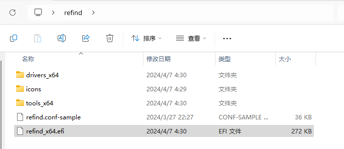
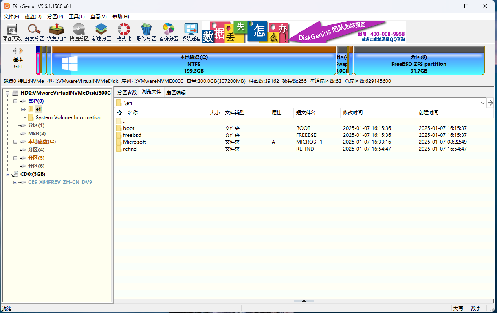
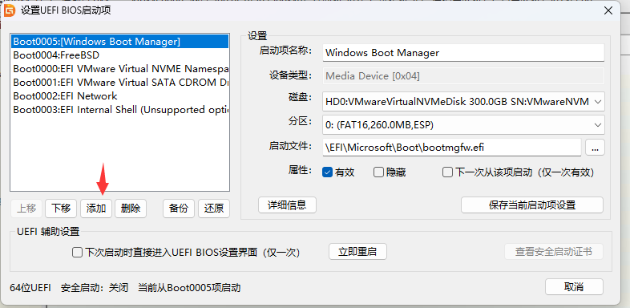
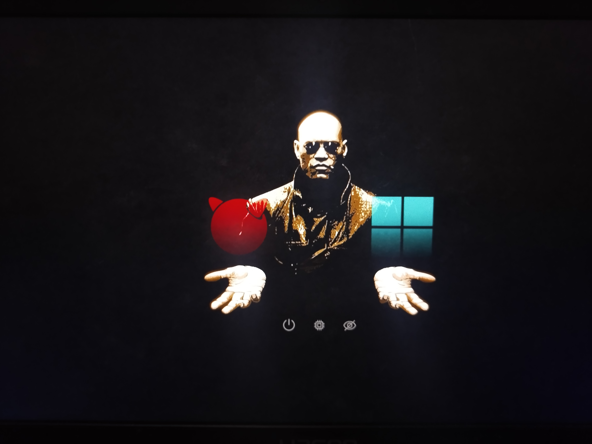

# 15.3 Boot Manager and UEFI Firmware

The Unified Extensible Firmware Interface (UEFI) is a modern computer firmware interface standard designed to replace the traditional Basic Input/Output System (BIOS).

The UEFI specification defines the interface between the operating system and platform firmware, providing Boot Services and Runtime Services, as well as non-volatile storage for boot variables.

FreeBSD supports both the traditional MBR standard and GUID Partition Table (GPT) boot methods. GPT partitions typically appear on computers using UEFI firmware, but FreeBSD can also boot from GPT partitions on machines with only traditional BIOS through gptboot(8).

The UEFI boot process differs architecturally from the traditional BIOS boot process.

In traditional BIOS systems, the firmware reads and executes the boot code from the Master Boot Record (MBR).

In UEFI systems, the firmware directly loads an EFI application from the FAT32 file system on the EFI System Partition (ESP). ESP is a dedicated partition with partition type GUID `C12A7328-F81F-11D2-BA4B-00A0C93EC93B`, typically mounted at **/boot/efi**. The UEFI boot loader is `loader.efi`. It can be loaded in two ways: directly by the firmware when configured through efibootmgr(8) or placed as the default boot program; when `loader.efi` resides within a UFS or ZFS file system, the firmware first loads `boot1.efi`, which then loads `loader.efi`. For systems installed with bsdinstall(8), `loader.efi` is loaded directly by the firmware.

## UEFI System Detection Method

efibootmgr is a tool in the FreeBSD base system for viewing and managing EFI boot entries, interacting with UEFI firmware to manipulate boot entry configuration.

Running efibootmgr in a non-UEFI environment will produce the error `efi variables not supported on this system`.

```sh
# efibootmgr
efibootmgr: efi variables not supported on this system. root? kldload efirt?
```

If the current system is UEFI, efibootmgr will output something like the following:

```sh
# efibootmgr
Boot to FW : false
BootCurrent: 0004
BootOrder  : 0004, 0000, 0001, 0002, 0003
+Boot0004* FreeBSD
Boot0000* EFI VMware Virtual SCSI Hard Drive (0.0)
Boot0001* EFI VMware Virtual IDE CDROM Drive (IDE 1:0)
Boot0002* EFI Network
Boot0003* EFI Internal Shell (Unsupported option)
```

## UEFI and efibootmgr

- View current boot entries:

```sh
# efibootmgr
Boot to FW : false
BootCurrent: 0001
Timeout    : 1 seconds
BootOrder  : 0002, 0003, 0000, 0001
 Boot0002* Windows Boot Manager
 Boot0003* UEFI OS
 Boot0000* refind
+Boot0001* freebsd # + indicates the default boot entry
```

> **Tip**
>
> Use `efibootmgr -v` to view detailed information.

Set rEFInd to boot with priority (this does not set it as the default boot entry, but only changes the boot order in BIOS/UEFI):

Set the EFI boot order to 0000, 0001, 0002, 0003:

```sh
# efibootmgr -o 0000,0001,0002,0003
Boot to FW : false
BootCurrent: 0001
Timeout    : 1 seconds
BootOrder  : 0000, 0001, 0002, 0003
 Boot0000* refind
+Boot0001* freebsd
 Boot0002* Windows Boot Manager
 Boot0003* UEFI OS
```

> **Warning**
>
> You should not use `efibootmgr -o 0000` to directly specify the boot order, as this would set BootOrder to contain only 0000, causing other boot entries to be excluded from the boot order (the boot entries themselves still exist, but will not be attempted by the firmware for booting).

## UEFI Operation Example

In multi-disk systems, it is sometimes necessary to merge scattered EFI partitions into a single partition for management to simplify boot configuration. The following example demonstrates how to unify EFI configuration files from two disks into one disk's EFI partition.

The directory structure of the EFI partition is as follows:

```sh
/mnt/efi/                  # EFI partition mount point
└── EFI/
    ├── freebsd/            # FreeBSD boot file directory
    │   └── loader.efi      # FreeBSD UEFI boot program
    ├── Boot/                # Default boot directory
    │   └── bootx64.efi     # UEFI platform default fallback boot program
    └── Microsoft/           # Windows boot directory (dual-boot scenario)
```

This example removes the EFI partition generated by the FreeBSD installation on nda0 and migrates FreeBSD's boot files to the EFI partition on the `ada0` disk.

First disable Windows fast startup with the command `powercfg /h off` (if you can enter the BIOS setup interface, this is not necessary).

Then shut down and reboot into the FreeBSD system, creating a mount point:

```sh
# mkdir /mnt/efi
```

Check whether `ada0p1` (the first partition on the disk) is the EFI partition to be mounted by entering the command:

```sh
# fstyp /dev/ada0p1 # Detect the file system type of /dev/ada0p1 partition without modifying it
```

If the above command outputs `ntfs`, it means the partition is not an EFI partition;

Then check the second partition:

```sh
# fstyp /dev/ada0p2 # Detect the file system type of /dev/ada0p2 partition
```

Output `msdosfs` indicates this is the EFI partition on the Windows disk.

Next, mount the EFI partition on the ada0 disk to FreeBSD's **/mnt/efi**:

```sh
# mount -t msdosfs /dev/ada0p2 /mnt/efi
```

Create a directory for the FreeBSD boot entry under the EFI path:

```sh
# mkdir /mnt/efi/EFI/freebsd
```

Copy the FreeBSD boot files to this path:

```sh
# cp /boot/loader.efi /mnt/efi/EFI/freebsd/loader.efi
```

Create an EFI boot entry "FreeBSD 15.0" pointing to FreeBSD's boot program:

```sh
# efibootmgr -a -c -l /mnt/efi/EFI/freebsd/loader.efi -L "FreeBSD 15.0"
```

Reboot into Windows and use EasyUEFI to activate the `FreeBSD 15.0` boot entry.

After confirming FreeBSD can boot normally, you can use [DiskGenius](https://www.diskgenius.cn/) or other partition tools to delete the EFI partition and its files on the nda0 disk.

## Grub

Testing shows that in UEFI + ZFS environments, GRUB has compatibility issues when directly booting the FreeBSD kernel; it is generally recommended to use the chainload mechanism (such as configuring `chainloader +1`) for indirect booting. In traditional BIOS boot + UFS root file system environments, GRUB can directly boot the FreeBSD kernel using the `kfreebsd` command.

```ini
menuentry "FreeBSD 14.2-RELEASE" { # Specify GRUB entry name
set root='(hd0,gpt1)'  # Confirm based on actual situation, this is the EFI system partition
chainloader /EFI/freebsd/loader.efi # Specify FreeBSD's EFI boot file
}
```

### Troubleshooting

Current configuration errors (`grub2-efi` FreeBSD 15.0):

```sh
# grub-install --target=x86_64-efi --efi-directory=/boot/efi/efi/ --bootloader-id=grub --boot-directory=/boot/ --modules="part_gpt part_msdos bsd zfs"
grub-install: error: relocation 0x4 is not implemented yet.
# grub-install --target=x86_64-efi --efi-directory=/boot/efi/efi/ --bootloader-id=grub --boot-directory=/boot/ --modules="part_gpt part_msdos bsd zfs"
Installing for x86_64-efi platform.
grub-install: error: unknown filesystem.
```

Adding the `-vvv` parameter shows detailed error information; the output is lengthy and can be viewed at <https://gist.github.com/ykla/9b6de6c8d4eee524840acb9981bf850a>.

## rEFInd Boot Manager (Multi-System Boot Management)

In a multi-system environment, frequently entering the BIOS firmware interface to switch operating systems is inconvenient. You can use [rEFInd](https://www.rodsbooks.com/refind/) to achieve a visual boot menu effect similar to Clover, allowing intuitive selection of the operating system to enter at boot time.

`rEFInd` is derived from `rEFIt`; its name can be understood as a combination of "re-find" (meaning "rediscover") and "EFI" (Extensible Firmware Interface), primarily used for managing UEFI boot, providing a graphical interface and flexible configuration options.

First, you need to download the rEFInd software. Open the download page [Getting rEFInd from Sourceforge](https://www.rodsbooks.com/refind/getting.html) and click the `A binary zip file` link to start downloading. The version used when writing this section is `refind-bin-0.14.2.zip`.

Of the downloaded archive, only some files are required boot files. You only need to keep the `refind` folder; the remaining files are not needed.

Within the `refind` folder, only some boot files are needed. All files containing `aa64` or `ia32` in their names can be deleted (typically only the `x64` version is kept).

The final files to keep are shown in the figure below.



Copy the `refind.conf-sample` file and rename it to `refind.conf`.

Typically, no manual configuration is needed. However, if existing operating systems cannot be automatically detected, manually add boot entries as follows:

Open the `refind.conf` file and add the following configuration in any blank area:

```ini
menuentry "FreeBSD" {
	icon \EFI\refind\icons\os_freebsd.png
	volume "FreeBSD"
	loader \EFI\freebsd\loader.efi
}

menuentry "Windows 10" {
	icon \EFI\refind\icons\os_win.png
	volume "Windows 10"
	loader \EFI\Microsoft\Boot\bootmgfw.efi
}
```

Directory structure:

```sh
EFI/
├── refind/
│   ├── refind.conf        # rEFInd main configuration file
│   ├── refind.conf-sample # rEFInd sample configuration file
│   ├── refind_x64.efi     # rEFInd 64-bit boot file
│   ├── icons/
│   │   ├── os_freebsd.png # FreeBSD icon
│   │   └── os_win.png    # Windows icon
│   └── themes/
│       └── Matrix-rEFInd/
│           └── theme.conf  # Matrix theme configuration
├── freebsd/
│   └── loader.efi        # FreeBSD boot loader
└── Microsoft/
    └── Boot/
        └── bootmgfw.efi   # Windows Boot Manager
```

Use [DiskGenius](https://www.diskgenius.com/) to copy the processed `refind` folder to the `EFI` directory on the EFI System Partition (ESP).



### Adding a Boot Entry

Use [DiskGenius](https://www.diskgenius.com/) to add a UEFI boot entry.


Click "Tools" in the menu bar and select "Set UEFI BIOS Boot Entry".



In the new window, click "Add", then browse and select the `refind_x64.efi` file within the `refind` folder.


Move this boot entry to the top of the list to set it as the first boot entry. Save the settings and restart the computer to test.


After restarting, select any operating system option in the rEFInd interface to enter the corresponding system.

### Appendix: rEFInd Themes

rEFInd supports various graphical themes.

This example uses the Matrix-rEFInd theme (inspired by the movie "The Matrix") for illustration.

The project address is: [Matrix-rEFInd](https://github.com/Yannis4444/Matrix-rEFInd/)

Download the project archive `Matrix-rEFInd-master.zip` and extract it. Rename the extracted folder `Matrix-rEFInd-master` to `Matrix-rEFInd`.

Create a new local directory `themes` and place the renamed `Matrix-rEFInd` folder into it.

Copy this entire `themes` directory to the **EFI\refind\** directory on the EFI System Partition.

Edit the `refind.conf` file (if you cannot edit directly on the ESP, copy it to the desktop, modify it, and overwrite the original file), adding the following line at the end of the file:

```ini
include themes/Matrix-rEFInd/theme.conf
```

This will invoke the Matrix-rEFInd theme.

Observe the effect after reboot:



> **Tip**
>
> If operating in a virtual machine (such as VMware, VirtualBox), due to the screen resolution limitations of their UEFI firmware, the rEFInd interface may not be able to display all operating system options simultaneously; you need to use arrow keys to switch views, which may differ from the effect shown in the figure above.

## References

- Microsoft. set id (Diskpart)[EB/OL]. (2024-11-01)[2026-04-28]. <https://learn.microsoft.com/en-us/windows-server/administration/windows-commands/set-id>. The GUID for the EFI system partition is c12a7328-f81f-11d2-ba4b-00a0c93ec93b.
- Smith R W. rEFInd Boot Manager[EB/OL]. [2026-04-17]. <https://www.rodsbooks.com/refind/>. rEFInd official website; this boot manager is derived from the rEFIt project and is used for managing multi-system boot in UEFI environments.
- archlinuxcn. efibootmgr cannot add UEFI boot entry[EB/OL]. [2026-03-26]. <https://bbs.archlinuxcn.org/viewtopic.php?id=12914>. Discussion on reasons why efibootmgr cannot write boot entries on some firmware and alternative solutions.
- FreeBSD Project. efibootmgr(8)[EB/OL]. [2026-03-26]. <https://man.freebsd.org/cgi/man.cgi?query=efibootmgr&sektion=8>. UEFI boot manager manual page.
- emacs_8861834. In-depth mastery of efibootmgr operation essentials and safe boot entry deletion method analysis[EB/OL]. [2026-03-26]. <https://my.oschina.net/emacs_8861834/blog/17450288>. Detailed explanation of efibootmgr subcommand usage and precautions for safely deleting boot entries.
- Stack Exchange. Working GRUB configuration for UEFI booting FreeBSD[EB/OL]. [2026-03-26]. <https://unix.stackexchange.com/questions/354260/working-grub-configuration-for-uefi-booting-freebsd>. Provides working GRUB configuration examples and troubleshooting experience for booting FreeBSD.
- Reddit. Trying to boot FBSD13 via grub2[EB/OL]. [2026-03-26]. <https://www.reddit.com/r/freebsd/comments/q4qgq9/trying_to_boot_fbsd13_via_grub2/>. Discussion on common issues encountered when booting FreeBSD 13 via GRUB2.

## Exercises

1. Test the multi-stage FreeBSD boot process under UEFI firmware in QEMU, verifying each stage of the EFI loader, loader.efi, and kernel loading.
2. Attempt to compile the Clover boot manager on FreeBSD, documenting platform adaptation issues encountered during the compilation process.
3. When installing FreeBSD, create separate EFI and freebsd-boot partitions, and compare the differences in system boot logs between the two boot methods.
