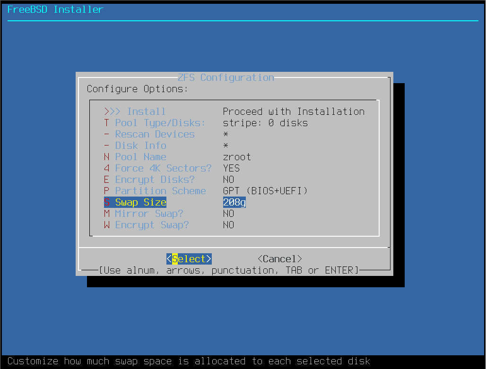
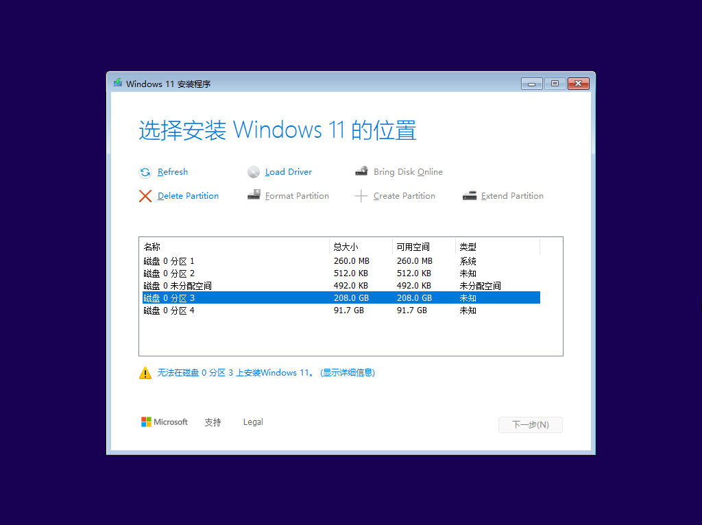
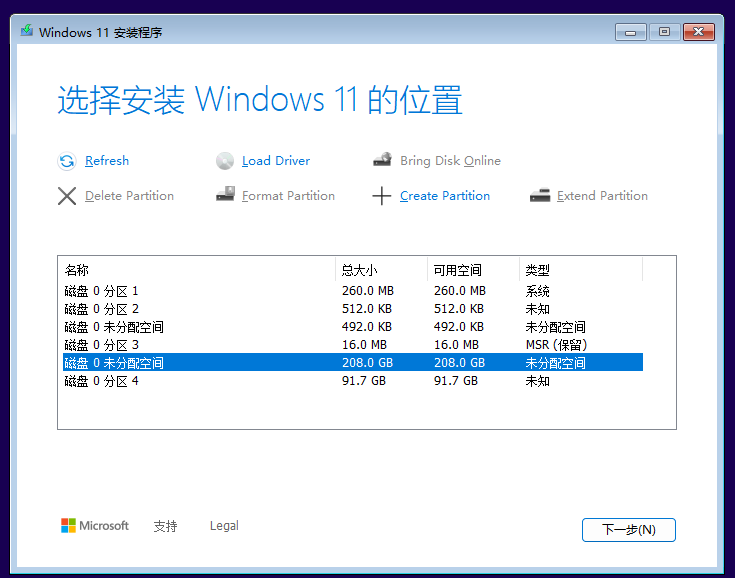
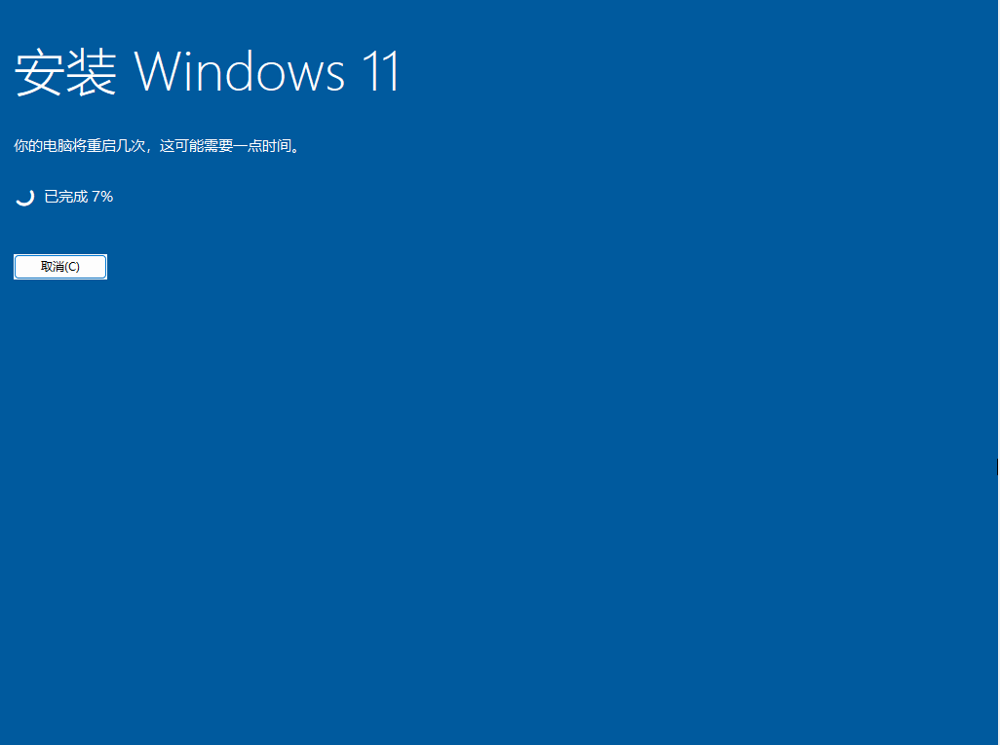
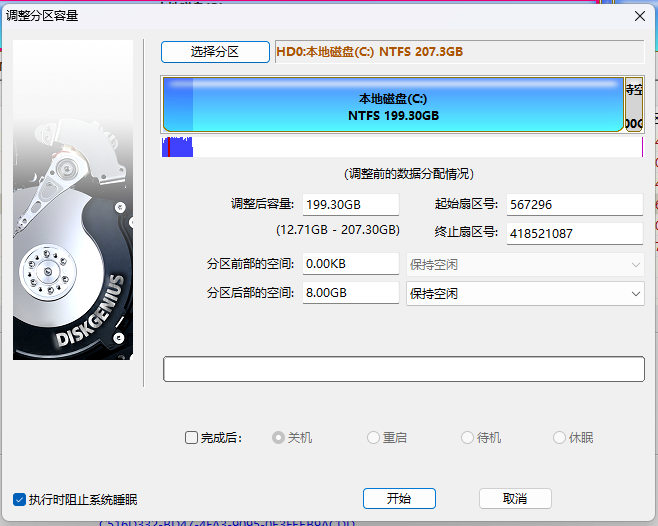

# 16.1 Dual-Boot Installation (FreeBSD Installed First)

This section covers deploying FreeBSD and Windows as a dual-boot system on the same physical device, installing FreeBSD first and then Windows.

## Installing FreeBSD 14.2-RELEASE

First, install the FreeBSD 14.2-RELEASE system. Unless otherwise specified, default settings and parameters are used throughout.


> **Tip**
>
> If you set `P Partition Scheme` to `GPT (UEFI)` here instead of other options (only older computers need to select `GPT (BIOS+UEFI)` and similar options), the subsequent partitioning and system update process will be simpler, and 4K alignment can also be achieved.


Here you need to set a larger temporary swap partition. This value should be the sum of the planned swap partition size and the Windows system partition size. This is done so that when installing Windows later, you can directly use this space without additional partitioning operations. In this section, the swap partition size is 8 GB, and the remaining 200 GB of space is reserved for Windows. Please adjust the value of `S Swap Size`.

> **Note**
>
> The `Partition Scheme` partition table should be set to `GPT (uefi)`! Otherwise, an extra `freebsd-boot` partition will be created.



List the system disk partition layout:

```sh
# gpart show
=>     9  639659  cd0  MBR  (1.2G)
       9  639659       - free -  (1.2G)

=>     9  639659  iso9660/14_2_RELEASE_AMD64_CD  MBR  (1.2G)
       9  639659                                 - free -  (1.2G)

=>       40  629145520  nda0 GPT  (300G)
         40     532480    1  efi  (260M)
     533544        984       - free -  (492K)
     534528  436207616    3  freebsd-swap  (208G)
  436742144  192401408    4  freebsd-zfs  (92G)
  629143552       2008       - free -  (1.0M)

```

Display swap partition and swap file usage (in MB/GB):

```sh
# swapinfo -mh
Device              Size     Used    Avail Capacity
/dev/nda0p3          208G       0B     208G     0%
```

The swap partition size is the configured 208 GB (of which 200 GB is reserved for the Windows operating system).

Edit the **/etc/fstab** file and add `#` at the beginning of the swap line to comment it out (in this example, it is the third line). This prevents the system from mounting this swap partition at boot, preparing for the subsequent Windows installation:

```sh
# Device                Mountpoint      FStype  Options         Dump    Pass#
/dev/gpt/efiboot0               /boot/efi       msdosfs rw              2       2
#/dev/nda0p3             none    swap    sw              0       0
```

## Installing Windows 11

After FreeBSD is installed, install the Windows system.

Insert the Windows installation media, select booting from this media in the firmware settings, and begin installing Windows. At this point, the installer will recognize the existing partition structure on the hard disk, and you can use the previously reserved space.



In the partition interface, delete (Delete Partition) the entire 208 GB swap partition (in this example, "Disk 0 Partition 3"), since this space has been reserved for Windows.



Then select Create Partition. If an error message appears, select Refresh. The Windows installer will automatically create the required partitions on the unallocated space, including the MSR partition, system partition, and recovery partition.

Select the 208 GB "Disk 0 Unallocated Space", confirm, and continue the installation.



## Restoring the Swap Partition

After Windows is installed, restore the FreeBSD swap partition. The previously reserved 208 GB of space includes 8 GB for the swap partition. The following operations use the tool [DiskGenius](https://www.diskgenius.com/).


Launch DiskGenius and adjust the C drive partition size to release 8 GB of unallocated space. After Windows installation, the C drive occupies most of the reserved space; shrinking 8 GB from the end of the C drive is sufficient.



Set the partition type of this 8 GB space to `FreeBSD Swap partition` and save the changes. This step marks the newly created swap partition with a type that FreeBSD can recognize.


Return to FreeBSD and check the disk partition layout:

```sh
# gpart show
=>       34  629145533  nda0  GPT  (300G)
         34          6        - free -  (3.0K)
         40     532480     1  efi  (260M)
     533544        984        - free -  (492K)
     534528      32768     3  ms-reserved  (16M)
     567296  417953792     4  ms-basic-data  (199G)
  418521088   16777216     5  freebsd-swap  (8.0G)
  435298304    1441792     6  ms-recovery  (704M)
  436740096       2048        - free -  (1.0M)
  436742144  192401408     7  freebsd-zfs  (92G)
  629143552       2015        - free -  (1.0M)

```

Partition 5 (`nda0p5`) is the newly created swap partition. Enable this swap partition:

```sh
# swapon /dev/nda0p5
```

No error output indicates the operation was successful, and the system has recognized and is using this swap partition.

Edit the **/etc/fstab** file, remove the comment symbol `#` from the beginning of the swap line, and change the partition to the correct value. The configuration in this example is shown on the third line:

```sh
# Device                Mountpoint      FStype  Options         Dump    Pass#
/dev/gpt/efiboot0               /boot/efi       msdosfs rw              2       2
/dev/nda0p5             none    swap    sw              0       0
```

After rebooting, check the current swap partition status again:

```sh
# swapinfo -mh
Device              Size     Used    Avail Capacity
/dev/nda0p5         8.0G       0B     8.0G     0%
```

List all ZFS pools and their status in the system:

```sh
# zpool list
NAME    SIZE  ALLOC   FREE  CKPOINT  EXPANDSZ   FRAG    CAP  DEDUP    HEALTH  ALTROOT
zroot  91.5G   922M  90.6G        -         -     0%     0%  1.00x    ONLINE  -
# zfs list
NAME                 USED  AVAIL  REFER  MOUNTPOINT
zroot                922M  87.8G    96K  /zroot
zroot/ROOT           919M  87.8G    96K  none
zroot/ROOT/default   919M  87.8G   919M  /
zroot/home           224K  87.8G    96K  /home
zroot/home/ykla      128K  87.8G   128K  /home/ykla
zroot/tmp            104K  87.8G   104K  /tmp
zroot/usr            288K  87.8G    96K  /usr
zroot/usr/ports       96K  87.8G    96K  /usr/ports
zroot/usr/src         96K  87.8G    96K  /usr/src
zroot/var            668K  87.8G    96K  /var
zroot/var/audit       96K  87.8G    96K  /var/audit
zroot/var/crash       96K  87.8G    96K  /var/crash
zroot/var/log        188K  87.8G   188K  /var/log
zroot/var/mail        96K  87.8G    96K  /var/mail
zroot/var/tmp         96K  87.8G    96K  /var/tmp
```
