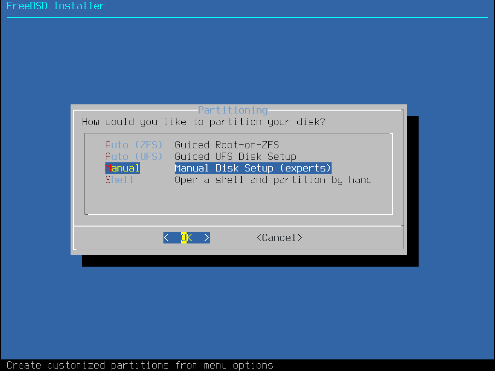
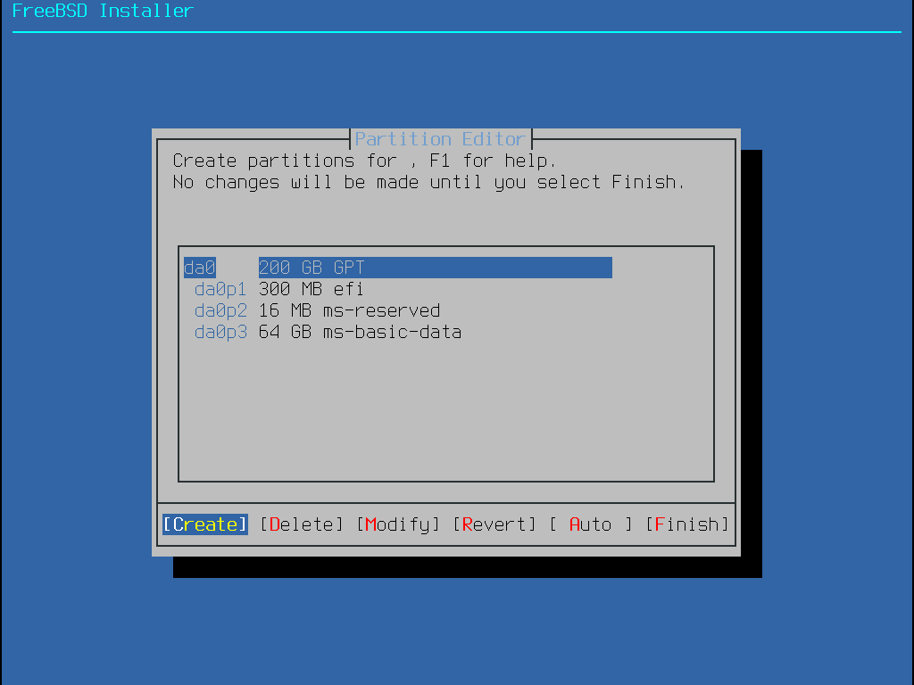
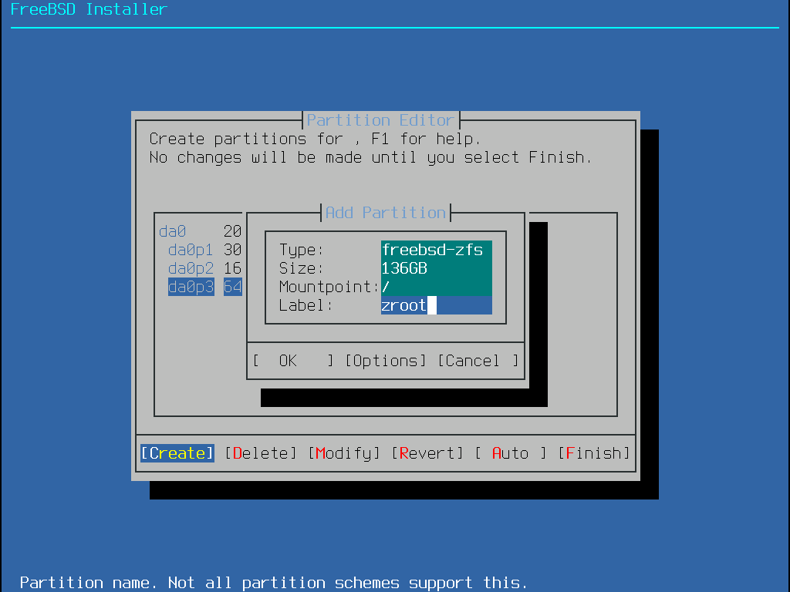
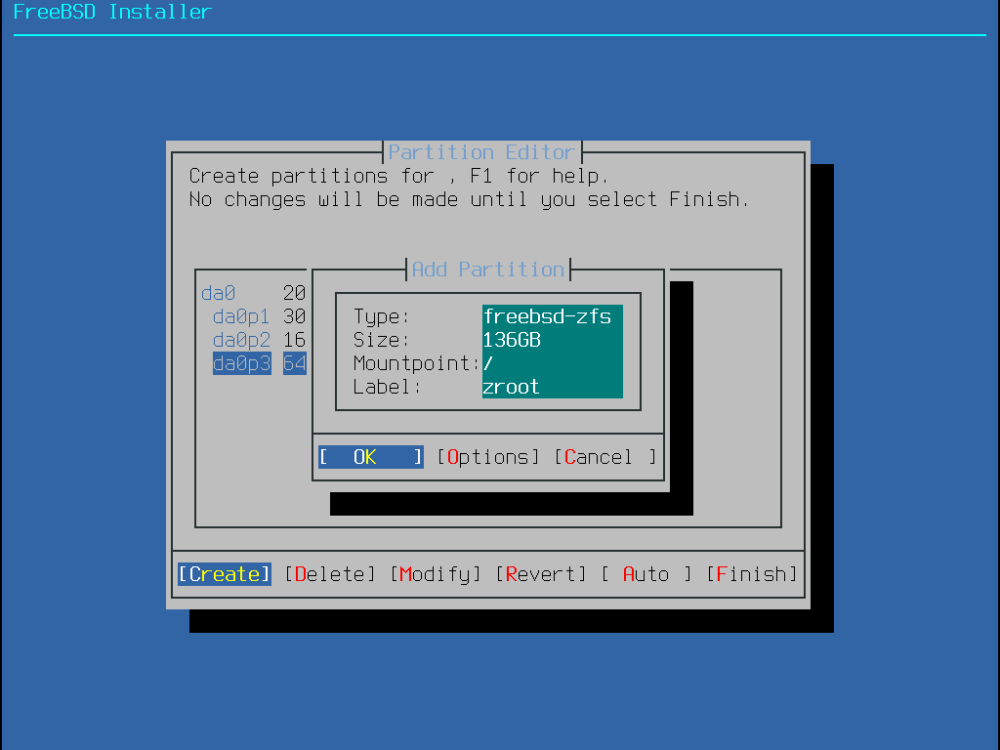
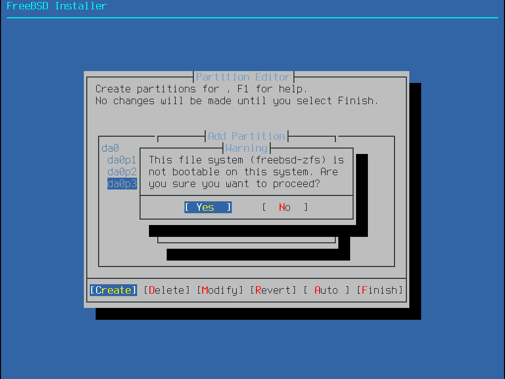
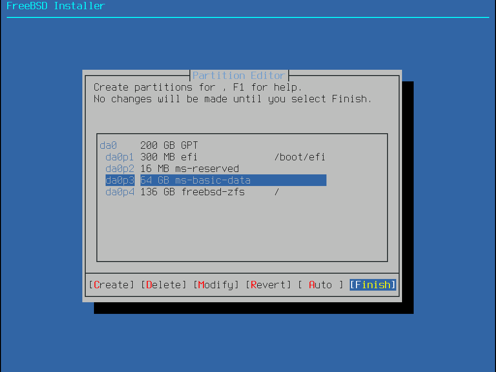
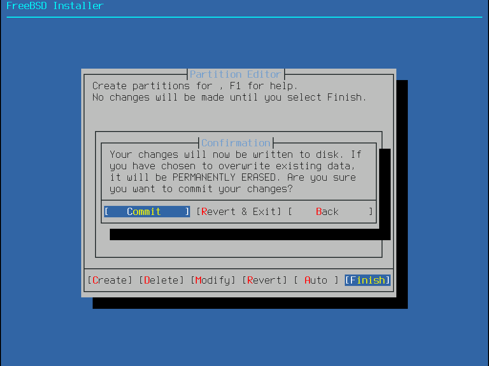
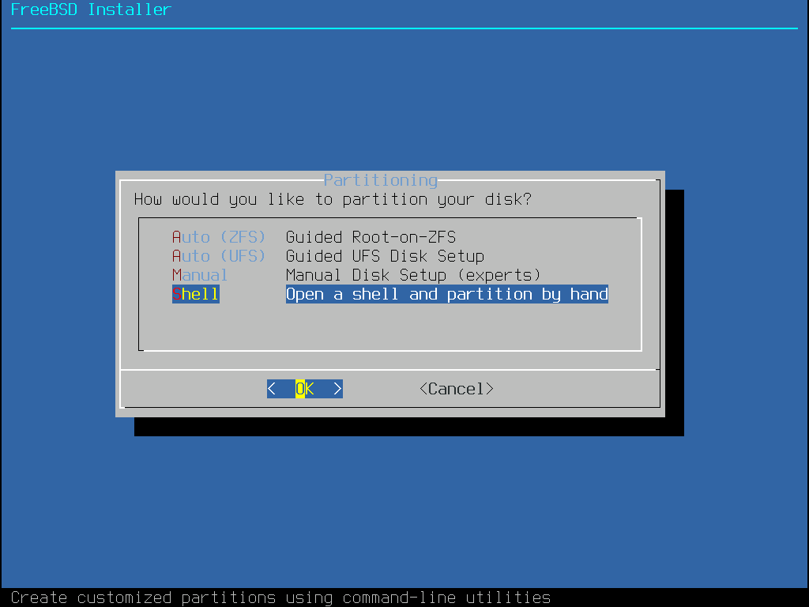
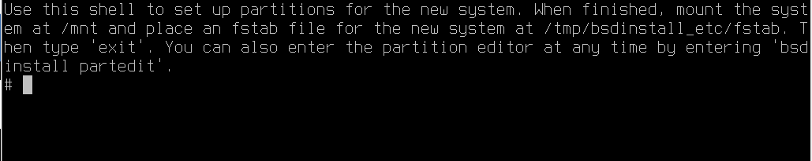

# 16.2 Installing a Dual-Boot System (FreeBSD After Another OS)

This section uses FreeBSD-14.2-RELEASE-amd64-disc1.iso as an example to demonstrate installing FreeBSD as a dual-boot system on a UEFI device that already has Windows 11 24H2 pre-installed, with emphasis on ESP partition space and boot management.

> **Tip**
>
> The example in this section requires installing another operating system (such as Windows) first, then installing FreeBSD. Please follow this installation order.

## Simple Installation Method

The following describes a relatively simple installation method.

> **Note**
>
> When installing FreeBSD using the method described in this section with ZFS, only the storage pool `zroot` (zpool) is created and directly mounted at **/**, without creating `zroot/ROOT/default` or other datasets. After installation, you can create datasets yourself and replace them; if you need the same initial layout as the automatic installation, please refer to the "Shell Partitioning" section of this chapter.

To install FreeBSD using the simple method, follow these steps.

First, you need to reserve space on the hard disk for FreeBSD. In a typical Windows installation, the last partition (in this example, `nda0p4`) is usually a recovery partition, which is not suitable for installing a system. The space reserved for FreeBSD does not need to be at the end of the hard disk; a middle position also works.

After partitioning, check the disk partition layout in FreeBSD, with the following results:

```sh
# gpart show
=>       34  419430333  nda0  GPT  (200G)
         34       2014        - free -  (1.0M)
       2048     204800     1  efi  (100M) # EFI partition
     206848      32768     2  ms-reserved  (16M) # MSR partition
     239616  207992832     3  ms-basic-data  (99G) # C drive (NTFS data partition), approximately 100G space reserved for FreeBSD
  417947648    1478656     4  ms-recovery  (722M) # Recovery partition
  419426304       4063        - free -  (100G)
```

You should disable Secure Boot and Fast Startup. Secure Boot prevents unsigned boot loaders from running, and FreeBSD's boot loader is not currently signed by Microsoft, so Secure Boot must be disabled. Fast Startup puts Windows into a special hibernation state when shutting down, which prevents other systems from properly accessing NTFS partitions. You can also use Windows Settings → System → Recovery → Advanced Startup to select booting from a USB device, then boot the FreeBSD installer normally until you reach the partition selection interface.



Select `Manual` here.

> **Tip**
>
> The partition editor interface used here is actually the same as the software `sade` (sysadmins disk editor, system administrator disk editor), and they share the same codebase. The `diskmgmt` module in `bsdconfig` directly calls `sade`.

Here you can view the hard disk partition layout. The image shows a single hard disk with a 300 MB EFI system partition, a 16 MB MSR partition, a 64 GB Windows system partition (i.e., C drive), and unshown free space. Select `Create` directly.



Here, enter the partition type on the first line (i.e., the `Filesystem type` listed below). If you need to add a swap partition, add it first in this step, because partitions are allocated from the beginning or end of the free space, and adding it later makes it difficult to control the partition size. Adding swap first allows better control of its position. When adding a UFS or ZFS partition, enter **/** in the `Mountpoint` field to mount this partition to the root directory. `Label` is FreeBSD's volume label (gptlabel) used to identify the partition; you can fill it in or leave it blank as needed. Here, ZFS is used without adding a swap partition, and the volume label `zroot` is entered.



Use the **Tab key** to move the focus to `OK`, then press Enter to confirm.



A warning will appear that the ZFS partition may not be bootable, but actual testing shows it can boot normally. This warning is a generic message from the installer and does not apply to UEFI configurations. Select `Yes` to dismiss this warning:



> **Note**
>
> Set the mount point of the 300 MB EFI system partition created by Windows to **/boot/efi**, so that FreeBSD can correctly find and use the existing EFI partition, avoiding the confusion of creating multiple EFI partitions.

Select `Finish`



Select `Commit`



After this, the normal installation process will proceed. After installation is complete, list all ZFS pools and their status in the system:

```sh
# zfs list
NAME  USED   AVAIL  REFER  MOUNTPOINT
root  534M    130G   534M  none
```

After entering the system, you can see there is only one `root` dataset. You can manually adjust the datasets to match the automatic installation layout, or refer to the Shell partitioning section below to partition during installation.

## Shell Partitioning

At this point, still on the partition selection interface, select `Shell`:



You will then enter the terminal (TTY):



Execute the following commands.

### Loading the ZFS Kernel Module

ZFS support is not built into the kernel but is provided as a loadable module.

The default installation image may not have ZFS enabled, so you also need to load the ZFS kernel module:

```sh
# kldload zfs
```

You can verify the module is loaded successfully via `kldstat`.

### Configuring ZFS Alignment (Only Affects Newly Created Disk Partitions)

Force the ZFS file system to use 4K alignment, which better adapts to the physical sector size of modern hard disks and improves read/write performance:

```sh
# sysctl vfs.zfs.vdev.min_auto_ashift=12
vfs.zfs.vdev.min_auto_ashift: 9 -> 12
```

> **Tip**
>
> The parameter `12` represents a sector size of 2^12 = 4096 bytes (4 KB). The default parameter (which can be viewed with the command `sysctl vfs.zfs.vdev.min_auto_ashift`) is `9`, meaning 2^9 = 512 bytes, which is the sector size of traditional hard disks.

> **Thought Exercise**
>
> When using NVMe hard disks, the default parameter for a new installation (UEFI+GPT, no freebsd-boot partition) is typically 12. But what exactly does 4K alignment align to? SSDs do not have the concept of physical sectors like traditional mechanical hard disks.

### Creating a Swap Partition

Create a 4 GB, 4K-aligned FreeBSD swap partition on the `nda0` disk and label it as swap:

```sh
# gpart add -a 4k -l swap -s 4G -t freebsd-swap nda0
```

Option descriptions:

| Option | Description |
| ------ | ----------- |
| `-t` | Specify partition type |
| `-l` | Specify volume label |
| `-s` | Specify partition size |
| `-a` | Specify alignment (e.g., `4k`) |

Please replace `nda0` with the actual hard disk identifier as appropriate.

### Creating a ZFS Partition

Create a 4K-aligned FreeBSD ZFS partition on the `nda0` disk and label it as zroot:

```sh
# gpart add -a 4k -l zroot -t freebsd-zfs nda0
```

The above setting will use all remaining free space. Please replace `nda0` with the actual hard disk identifier.

#### Viewing Partition Layout

Display the system disk partition layout:

```sh
# gpart show
=>       34  419430333  nda0  GPT  (200G)
         34       2014        - free -  (1.0M)
       2048     204800     1  efi  (100M)
     206848      32768     2  ms-reserved  (16M)
     239616  207992832     3  ms-basic-data  (99G)
  208232448    8388608     5  freebsd-swap  (4.0G)
  216621056  201326592     6  freebsd-zfs  (96G)
  417947648    1478656     4  ms-recovery  (722M)
  419426304       4063        - free -  (2.0M)
```

### Mounting a Temporary File System to Prepare for Installation

Mount a temporary file system (tmpfs) so that files needed during the installation process can be temporarily stored in memory, avoiding frequent disk writes:

```sh
# mount -t tmpfs tmpfs /mnt
```

### Creating a ZFS Pool

Create the ZFS pool zroot:

```sh
# zpool create -f -o altroot=/mnt -O compress=lz4 -O atime=off -m none zroot /dev/gpt/zroot
```

This command sets the mount point of the zroot pool to **/mnt**, enables LZ4 compression to save space and improve read/write performance, and disables access time recording to reduce disk writes.

Option descriptions are as follows:

| Option | Description |
| ------ | ----------- |
| `-o altroot=/mnt` | Temporarily mount it at **/mnt** |
| `-O compress=lz4` | Enable lz4 compression (can be changed to zstd, etc.) |
| `-O atime=off` | Disable access time recording |
| `-m none` | Do not set a mount point |
| **/dev/gpt/zroot** | The partition just created |

You can verify the pool's health status via `zpool status zroot`.

### Creating ZFS Datasets

The following dataset settings are created with reference to [**usr.sbin/bsdinstall/scripts/zfsboot**](https://github.com/freebsd/freebsd-src/blob/main/usr.sbin/bsdinstall/scripts/zfsboot) in the FreeBSD source code. FreeBSD itself continues to evolve, and ZFS datasets may differ between versions. If readers want to create the same dataset structure as the default installation, they should refer to the **usr.sbin/bsdinstall/scripts/zfsboot** file of the corresponding branch.

- Create the root dataset

```sh
# zfs create -o mountpoint=none zroot/ROOT
```

This creates the dataset `zroot/ROOT` without setting a mount point (`mountpoint=none`).

Such datasets without a specific mount point typically serve as containers for the system root dataset, under which sub-datasets for actual mounting or exclusion purposes will be created.

- Create the default root dataset

```sh
# zfs create -o mountpoint=/ zroot/ROOT/default
```

This creates the dataset `zroot/ROOT/default` and mounts it at the root directory **/**. This dataset will serve as the system's default root file system.

- Create the **/home** dataset

```sh
# zfs create -o mountpoint=/home zroot/home
```

This creates the dataset `zroot/home` and mounts it at **/home**, typically used for storing user home directories.

- Create the **/tmp** dataset

```sh
# zfs create -o mountpoint=/tmp -o exec=on -o setuid=off zroot/tmp
```

This creates the dataset `zroot/tmp` and mounts it at **/tmp**, allowing file execution (`exec=on`) but disabling setuid (`setuid=off`) to prevent files in this directory from using setuid to escalate privileges.

- Create the `zroot/usr` dataset

```sh
# zfs create -o mountpoint=/usr -o canmount=off zroot/usr
```

This creates the `zroot/usr` dataset with `canmount=off`, which prevents automatic mounting. This allows related sub-datasets to be organized together without this parent dataset being mounted separately.

- Create the **/usr/ports** dataset

```sh
# zfs create -o setuid=off zroot/usr/ports
```

This creates the **/usr/ports** dataset with setuid disabled (`setuid=off`).

- Create the **/usr/src** dataset

```sh
# zfs create zroot/usr/src
```

This creates the **/usr/src** dataset.

- Create the **/var** dataset

```sh
# zfs create -o mountpoint=/var -o canmount=off zroot/var
```

This creates the **/var** dataset with `canmount=off`, meaning it will not be automatically mounted.

- Create the **/var/audit** dataset

```sh
# zfs create -o exec=off -o setuid=off zroot/var/audit
```

This creates the **/var/audit** dataset with execution disabled (`exec=off`) and setuid disabled (`setuid=off`).

- Create the **/var/crash** dataset

```sh
# zfs create -o exec=off -o setuid=off zroot/var/crash
```

This creates the **/var/crash** dataset with execution disabled (`exec=off`) and setuid disabled (`setuid=off`).

- Create the **/var/log** dataset

```sh
# zfs create -o exec=off -o setuid=off zroot/var/log
```

This creates the **/var/log** dataset with execution disabled (`exec=off`) and setuid disabled (`setuid=off`).

- Create the **/var/tmp** dataset

```sh
# zfs create -o setuid=off zroot/var/tmp
```

This creates the **/var/tmp** dataset with setuid disabled (`setuid=off`).

- Create the **/var/mail** dataset

```sh
# zfs create -o atime=on zroot/var/mail
```

This creates the `zroot/var/mail` dataset with access time recording enabled (`atime=on`), typically used for storing mail data because mail programs may need to know the last access time of files.

> **Tip**
>
> The above parameters are referenced from the default configuration of bsdinstall(8). After installation, you can also view related properties with the command `zfs get exec,setuid,mountpoint`. The specific code is located at [usr.sbin/bsdinstall/scripts/zfsboot](https://github.com/freebsd/freebsd-src/blob/main/usr.sbin/bsdinstall/scripts/zfsboot).

Related file structure:

```sh
zroot/
├── ROOT/
│   └── default/      # Mounted at / (root file system)
├── home/             # Mounted at /home (user home directories)
├── tmp/              # Mounted at /tmp (temporary files)
├── usr/
│   ├── ports/        # Mounted at /usr/ports (Ports tree)
│   └── src/          # Mounted at /usr/src (system source code)
└── var/
    ├── audit/        # Mounted at /var/audit (audit logs)
    ├── crash/        # Mounted at /var/crash (system crash dumps)
    ├── log/          # Mounted at /var/log (system logs)
    ├── mail/         # Mounted at /var/mail (mail storage)
    └── tmp/          # Mounted at /var/tmp (persistent temporary files)
```

### Modifying Directory Permissions

Set the permissions of **/mnt/tmp** and **/mnt/var/tmp** to `1777` (sticky bit) to ensure correct temporary directory permissions, allowing any user to create files in these directories but only delete files they created:

```sh
# chmod 1777 /mnt/tmp        # Set sticky bit, allow all users to read/write but only owner can delete
# chmod 1777 /mnt/var/tmp    # Set sticky bit, allow all users to read/write but only owner can delete
```

### Configuring the Swap Partition in `fstab`

Add the swap partition **/dev/nda0p5** to the temporary fstab file so that the system can automatically mount this swap partition at boot:

```sh
# printf "/dev/nda0p5\tnone\tswap\tsw\t0\t0\n" >> /tmp/bsdinstall_etc/fstab
```

Note: replace **/dev/nda0p5** with the actual swap partition device name, which can be confirmed using the `gpart show nda0` command.

> **Tip**
>
> `\t` is the escape character for a tab (i.e., the character corresponding to the **Tab** key), used for aligning fields. Using spaces can achieve the same effect. You can also use the `ee /tmp/bsdinstall_etc/fstab` command to manually edit this file and write a line in the following format:
>
> ```sh
> /dev/nda0p5  none  swap  sw  0  0
> ```
>
> The same applies below.

### Setting Up Boot Entries and UEFI

- Set the boot file system (bootfs) of the ZFS pool to `zroot/ROOT/default`, so the system will automatically boot from this dataset at startup:

```sh
# zpool set bootfs=zroot/ROOT/default zroot
```

- Require the system to enable the ZFS service at boot.

```sh
# printf 'zfs_enable="YES"\n' >> /tmp/bsdinstall_etc/rc.conf
```

`\n` represents the newline character in Unix/Linux systems.

Windows text files typically use `\r\n` (carriage return + line feed) for line endings.

This command has the same effect as using `ee /tmp/bsdinstall_etc/rc.conf` to edit the file and add the line `zfs_enable="YES"`.

- Mount the existing EFI system partition so that FreeBSD boot files can be added to it:

```sh
# mount -t msdosfs /dev/nda0p1 /media
```

Note: replace **/dev/nda0p1** with the actual EFI partition device name.

- Create a boot directory for FreeBSD in the EFI system partition

```sh
# mkdir -p /media/efi/freebsd
```

- Copy the FreeBSD EFI boot file to the boot directory

```sh
# cp /boot/loader.efi /media/efi/freebsd/
```

- Use the `efibootmgr` tool to add a boot entry named `FreeBSD` to the motherboard UEFI firmware. After adding, the FreeBSD option will appear in the UEFI boot menu at startup.

```sh
# efibootmgr -c -a -L "FreeBSD" -l "/media/efi/freebsd/loader.efi"
```

- Unmount the EFI system partition

```sh
# umount /media
```

Directory structure:

```sh
/
├── boot/
│   └── loader.efi          # FreeBSD EFI boot loader
├── tmp/
│   └── bsdinstall_etc/
│       ├── fstab           # Temporary fstab configuration
│       └── rc.conf         # Temporary rc.conf configuration
└── media/
    └── efi/
        └── freebsd/
            └── loader.efi  # Boot loader copied to the EFI partition
```

- Exit the Shell

```sh
# exit
```

The installer will automatically continue with the remaining process.

### Completion

At this point, a set of ZFS dataset structure essentially the same as the automatic installer has been manually created (the automatic installation typically also creates a separate **/home/username** dataset, which is not included here).

Display the ZFS file system status of the installed system:

```sh
# zfs list
NAME                 USED  AVAIL  REFER  MOUNTPOINT
zroot                921M  91.6G    96K  none
zroot/ROOT           919M  91.6G    96K  none
zroot/ROOT/default   919M  91.6G   919M  /
zroot/home           128K  91.6G   128K  /home
zroot/tmp            104K  91.6G   104K  /tmp
zroot/usr            288K  91.6G    96K  /usr
zroot/usr/ports       96K  91.6G    96K  /usr/ports
zroot/usr/src         96K  91.6G    96K  /usr/src
zroot/var            636K  91.6G    96K  /var
zroot/var/audit       96K  91.6G    96K  /var/audit
zroot/var/crash       96K  91.6G    96K  /var/crash
zroot/var/log        156K  91.6G   156K  /var/log
zroot/var/mail        96K  91.6G    96K  /var/mail
zroot/var/tmp         96K  91.6G    96K  /var/tmp
```

## References

- Stanislas. How to manually install FreeBSD on a remote server (with UFS, ZFS, encryption...)[EB/OL]. (2018-12)[2026-03-26]. <https://stanislas.blog/2018/12/how-to-install-freebsd-server/>. Provides a complete technical guide for manual FreeBSD installation, including UFS, ZFS, and other file system configuration methods.
- FreeBSD Project. RootOnZFS/GPTZFSBoot[EB/OL]. [2026-03-26]. <https://wiki.freebsd.org/RootOnZFS/GPTZFSBoot>. Detailed introduction to the ZFS root file system configuration method for FreeBSD on GPT partition tables.
- FreeBSD Project. bsdinstall(8) -- system installer[EB/OL]. [2026-04-17]. <https://man.freebsd.org/cgi/man.cgi?query=bsdinstall&sektion=8>. FreeBSD system installer manual page.
