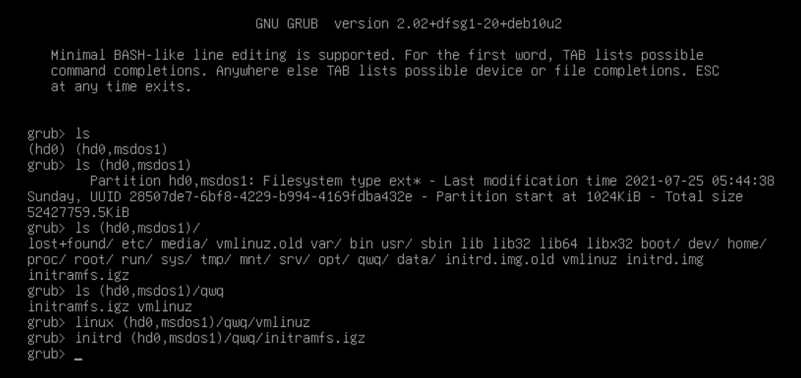
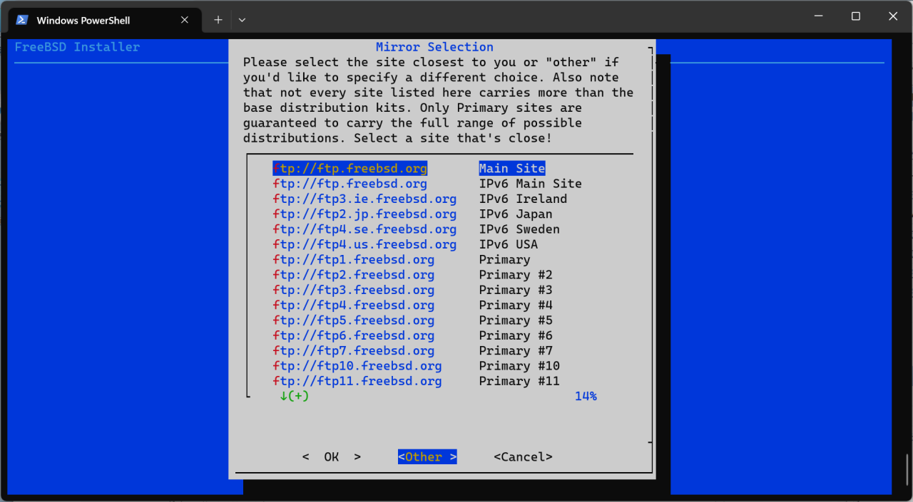
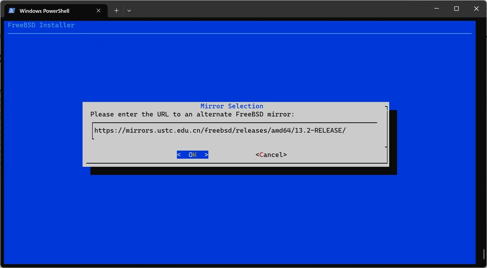
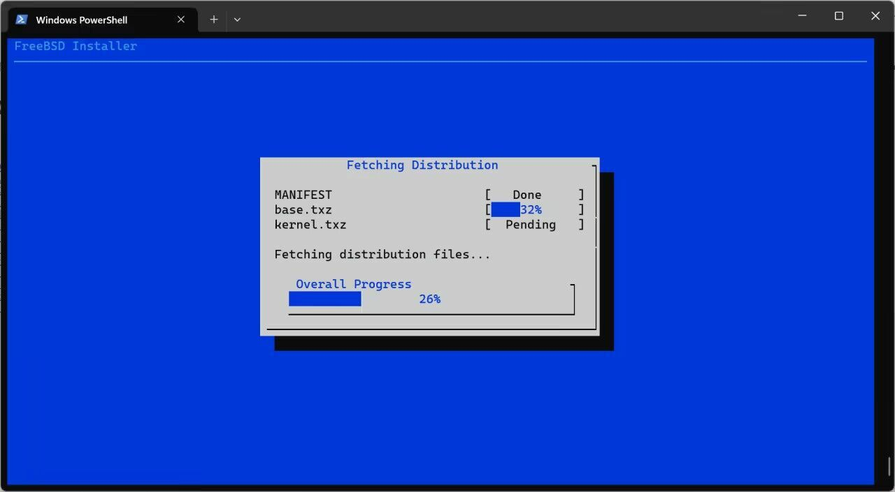
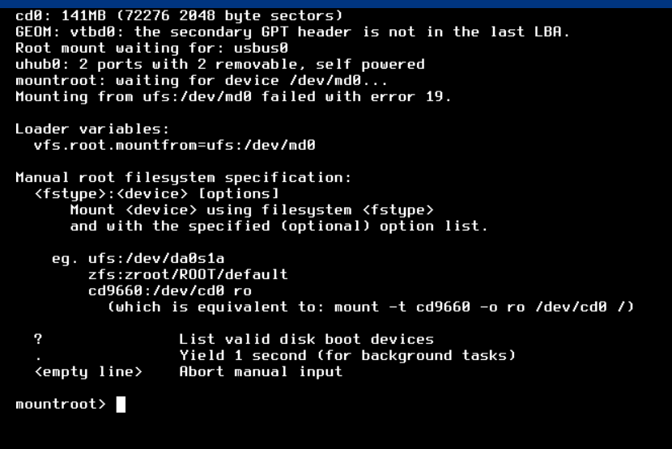

# 16.3 Installing FreeBSD on Tencent Cloud Lighthouse (Legacy Boot and MBR Partition Table)

This section demonstrates how to install and deploy FreeBSD on a Tencent Cloud Lighthouse instance without relying on additional installation media, using the existing Linux system on the local hard disk.

Before installation, please record the IP address, subnet mask, gateway information, and Maximum Transmission Unit (MTU) value in the existing Linux system, and note the subnet and CIDR notation. You can use the commands `ip addr` and `ip route show` to view the relevant information.

## Video Tutorial

FreeBSD Chinese Community. 08-Installing FreeBSD on Tencent Cloud Lighthouse and Other Servers[EB/OL]. [2026-04-04]. <https://www.bilibili.com/video/BV1y8411d7pp>.

The video content may differ from the text tutorial; you can choose either method. The SCP command can be replaced with the graphical tool WinSCP. After installation, it is recommended to set up key-based login and disable password authentication as described in other chapters to improve security.

## Introduction to Tencent Cloud Lighthouse and Alibaba Cloud Simple Application Server

[Tencent Cloud Lighthouse (i.e., Tencent Cloud Lightweight Cloud)](https://cloud.tencent.com/product/lighthouse) and [Alibaba Cloud Simple Application Server](https://www.aliyun.com/product/swas) both do not provide FreeBSD system support, and can only be installed manually through special methods.

> **Warning**
>
> Please be aware of data security. The operations in this section carry certain risks and require the corresponding operational capabilities.

The management panels of the above servers do not provide FreeBSD images, so a workaround is needed for installation. Since FreeBSD and Linux are incompatible at the kernel and executable file format levels, you cannot install by `chroot`ing and then deleting the original system. The installation method is: first boot a FreeBSD system from a memory disk (i.e., boot [mfsBSD](https://mfsbsd.vx.sk) first), then format the hard disk and install the new system. mfsBSD is a FreeBSD system that is entirely loaded into memory, similar to the Windows PE (Preinstallation Environment).

You need to download the img format mfsBSD image (available from the [mfsBSD official download page](https://mfsbsd.vx.sk/), select the corresponding version of the special edition under USB memstick images). You can download it in advance and upload it to the server via WinSCP; downloading directly on the server may take a long time (approximately two hours).

## Unhiding the GRUB Menu

Some Linux distributions (such as Fedora, Ubuntu 23.10+) have the GRUB menu hidden by default, requiring pressing the Esc key at boot to bring it up, but this operation sometimes goes directly to the BIOS setup interface.

Therefore, it is more convenient to directly disable the GRUB2 menu auto-hide setting:

```bash
# grub2-editenv - unset menu_auto_hide
```

## Writing mfsBSD Using mfsLinux

Since FreeBSD and the Linux ecosystem are different, you need to first boot into a Linux environment running in memory, write mfsBSD to the hard disk in that environment, and finally complete the system installation through the `bsdinstall` tool.

On the mfsBSD download page, you can find [mfsLinux](https://mfsbsd.vx.sk/files/iso/mfslinux/mfslinux-0.1.11-94b1466.iso) further down, which is the required Linux environment. Since this file is only available in ISO format and cannot be directly booted in the current environment, and this environment is based on the initramfs architecture, you need to extract the kernel and initramfs files from it, place them on the hard disk, and boot manually.

In a typical Linux system, initramfs is a minimal root filesystem packaged as a cpio archive, containing drivers, mounting tools, and data essential for the boot initialization program. At boot, the bootloader loads the kernel and initramfs, then the scripts in initramfs perform boot preparation, and finally hand control over to the init program on the hard disk.

First, place the kernel and initramfs files extracted from the ISO in the root directory. Restart the machine and enter the GRUB command line interface (you can press `e` during the boot countdown to enter edit mode, delete the original `linux` and `initrd` line contents and modify them, then press `Ctrl+X` to boot). Manually specify the kernel and initramfs to boot (you can use the `Tab` key for path completion). Type `boot` and press Enter to continue booting, or press `c` to enter GRUB command line mode.

```sh
linux (hd0,msdos1)/vmlinuz       # Specify the kernel file path
initrd (hd0,msdos1)/initramfs.igz  # Specify the initial RAM disk image file path
boot # Type boot and press Enter to continue booting
```

> **Tip**
>
> The partition identifier may not be `(hd0,msdos1)`, please use the actual situation as the standard. Be careful not to delete too much content, making it unrecognizable.



After booting this initramfs, the original system on the hard disk will not be loaded; instead, it will configure the network and start an SSH server on its own. This provides a Linux system running in memory.

At this point, you should be able to connect to the server via SSH and safely format the hard disk.

The default `root` password for both mfsBSD and mfsLinux images is `mfsroot`.

> **Warning**
>
> Writing to a block device with `dd` will overwrite all existing data on the disk, including the partition table and file system. This operation is irreversible. Please double-check that the device path specified by the `of=` parameter is correct.

```sh
# cd /tmp # Switch to the temporary directory
# wget https://mfsbsd.vx.sk/files/images/14/amd64/mfsbsd-se-14.2-RELEASE-amd64.img # Download the mfsBSD image (URL subject to the official website)
# dd if=mfsbsd-se-14.2-RELEASE-amd64.img of=/dev/vda # Please confirm whether the hard disk device is /dev/vda
# reboot # Restart the system
```

> **Tip**
>
> It is recommended to use the server's "snapshot" feature for backup here, to prevent subsequent operational errors from requiring reinstallation and causing time loss.

## Installing FreeBSD

After connecting to the server via SSH, execute `kldload zfs` to load the ZFS module, then run `bsdinstall`. When the interface shown in the figure appears, select `Other` and enter the specified mirror address (the address only needs to include the corresponding version number, which can be changed as needed):

For example, <https://mirrors.ustc.edu.cn/freebsd/releases/amd64/15.0-RELEASE/> or <https://download.freebsd.org/snapshots/ISO-IMAGES/16.0/>







- You can also manually download the FreeBSD installation files, using the `MANIFEST` file as an example:

```sh
# mkdir -p /usr/freebsd-dist # Create the target directory
# cd /usr/freebsd-dist # Enter the directory
# fetch https://download.freebsd.org/releases/amd64/14.2-RELEASE/MANIFEST # Download the MANIFEST file
```

## Troubleshooting and Unfinished Business

### Why Can't You Use dd Directly? (Incorrect Example, for Explanation Only, Do Not Execute)

> **Warning**
>
> The following commands are for incorrect demonstration only; do not execute them. Writing to a block device with `dd` will overwrite all existing data on the disk, and this operation is irreversible.

In a normal Linux system, if you directly write the mfsBSD img image to the hard disk using `dd`, the bootloader can load normally after reboot, but subsequent write operations to the hard disk by the system may prevent the memory disk from being mounted properly.

Download the mfsBSD image and write it to **/dev/vda**:

```sh
# wget https://mfsbsd.vx.sk/files/images/13/amd64/mfsbsd-se-13.1-RELEASE-amd64.img -O- | dd of=/dev/vda
```

Explanation:

- `|` is the pipe symbol, which passes the standard output of the previous command as the standard input to the next command.
- The `-O-` option instructs wget to download the file and output it to standard output; `dd` automatically reads from standard input when the `if` parameter is not specified.

Executing this `dd` command directly will produce an error, as shown in the figure:



### LVM Logical Volumes

If the cloud server uses LVM, all boot-related files must be placed within the **/boot** partition, otherwise they may not be recognized properly.

### Tencent Cloud Lighthouse May Not Be Able to Obtain an IPv6 Address

The way Tencent Cloud assigns IPv6 addresses is not a standard implementation, but rather uses a custom subnet scheme.

Tencent Cloud IPv6 may be provided by a proprietary service; this issue remains to be confirmed.

### Unsuccessful Approaches

#### Approach 1

In UEFI mode:

```sh
set iso=(hd0,gpt2)/bsd.iso          # Specify the ISO file path
loopback loop $iso                  # Mount the ISO file as a loop device
set root=(loop)                     # Set the GRUB root directory to the loop device
chainloader /boot/loader.efi        # Load the EFI boot loader
boot # Type boot and press Enter to continue booting
```

This method failed. This operation does not mount the image as a memory disk; although it can boot, FreeBSD will report an error during the startup process and cannot find the boot files.

Additionally, in UEFI mode, GRUB2 does not provide commands such as `linux16` and `kfreebsd`.

#### Approach 2

Using the traditional BIOS boot method.

- Install syslinux

- The syslinux package needs to be installed to obtain MEMDISK support.

```bash
# dnf install syslinux
```

> **Warning**
>
> The `memdisk.mod` module included with GRUB2 is not MEMDISK. The syslinux package must be installed to obtain the MEMDISK tool.

- Copy to **/boot**

```sh
# cp /usr/share/syslinux/memdisk /boot/
```

Enter the GRUB command line:

```sh
ls                                # List all disks and partitions
ls (hd0,gpt2)/                     # List the contents under the (hd0,gpt2) partition. Under MBR partition table, it may be (hd0,msdosx), subject to actual conditions
linux16 (hd0,gpt2)/memdisk iso     # Specify the memdisk kernel image
initrd16 (hd0,gpt2)/bsd.iso         # Specify the initial RAM disk image
boot                               # Type boot and press Enter to boot the system
```

The above method may work with BIOS and MBR partition tables, but testing failed with GPT partition tables.

#### Approach 3

Shrink the Linux root partition (**/**) and directly write the FreeBSD img image to the new partition using `dd`.

This approach is not feasible because the XFS file system does not support online shrinking (Red Hat series distributions typically use XFS with logical volume management).

#### Approach 4

Write directly to the EFI partition.

This approach is not feasible because the EFI System Partition (ESP) has size limitations.

#### Approach 5

GRUB does not support mounting ISO images as memory disks, but other boot loaders may be able to achieve this.

No viable approach has been found yet.

#### Approach 6

For file systems that support online resizing, you can compress approximately 2 GB of unallocated space, create a FAT32 partition, and then write the img image to this partition using the `dd` command.

In GRUB, use `chainloader +1` to point to the BSD EFI system partition generated after the `dd` operation. Note that general cloud servers may use a file as swap space by default; you can also try directly `dd`-ing the img image to the swap partition.

For cases where partitions cannot be compressed, you can temporarily purchase and attach a data disk, `dd` the image to the data disk, and then install the system through the installer on the data disk. After installation is complete, detach and delete the data disk.

A potential issue is that the img image may not correctly identify the partition, and you may need to manually specify the root file system.

Some distributions do not use GRUB, in which case you need to consider whether to install GRUB or handle it directly through boot loaders such as systemd-boot, and whether that is feasible.

## References

- FreeBSD Project. Remote Installation of the FreeBSD Operating System Without a Remote Console[EB/OL]. [2026-03-25]. <https://www.freebsd.org/doc/en/articles/remote-install/>. Official FreeBSD documentation, providing a detailed introduction to remote installation techniques without a remote console.
- Jin Buguo. GRUB2 Configuration File "grub.cfg" Detailed Explanation (GRUB2 Practical Manual)[EB/OL]. [2026-03-25]. <https://www.jinbuguo.com/linux/grub.cfg.html>. Provides detailed parameter explanations and practical guidance for GRUB2 configuration.
- Bird's Linux Private Kitchen - Beginner Discussion Area. About the Problem of GRUB Interface Not Displaying at Boot[EB/OL]. [2026-03-25]. <https://phorum.vbird.org/viewtopic.php?f=2&t=40587>. Discusses solutions to the GRUB boot interface hiding problem.
