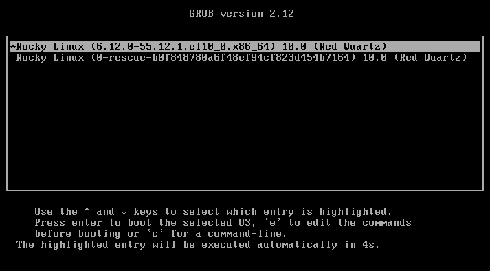
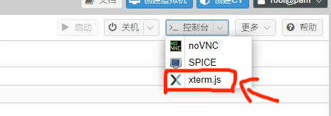
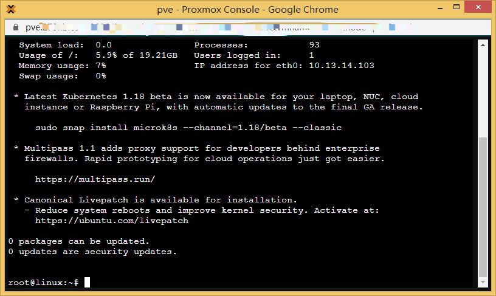
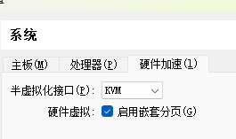
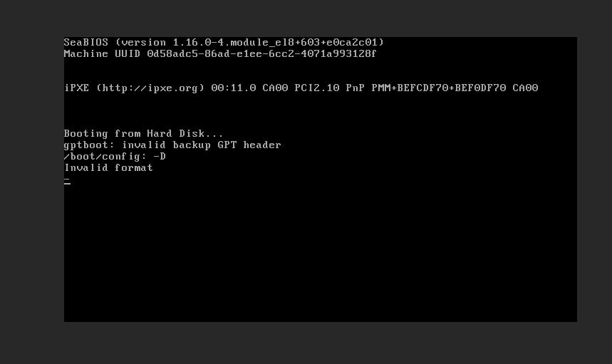

# 16.4 Installing FreeBSD on KVM, QEMU, and Other Platforms (Legacy Boot and MBR Partition Table)

On KVM/QEMU and other hardware-assisted virtualization platforms, installing FreeBSD via traditional BIOS + MBR is suitable for cloud service environments that do not directly provide FreeBSD images. The MEMDISK boot method described in this section does not support UEFI booting, nor is it applicable to containerized platforms such as OpenVZ and LXC.

> **Note**
>
> Because containerization technology is inherently not a complete virtualization solution — the host and guest share the same kernel — this method does not support containerized technologies such as OpenVZ and LXC. The kernel is already Linux, and FreeBSD cannot be run.
>
> The MEMDISK boot method described in this section does not support UEFI boot mode (BIOS + GPT partition table is also not supported); it only supports the traditional BIOS + MBR boot method. Please ensure your environment meets the requirements. If UEFI booting is needed, consider using mfsBSD's UEFI support or other boot solutions.

> **Warning**
>
> Please be aware of data security. The following tutorial carries certain risks and requires the operator to have the corresponding operational capabilities and system administration knowledge.

## Overview

This section introduces the method for installing FreeBSD on KVM, QEMU, and other platforms. Most service providers using KVM and QEMU virtualization architectures do not directly provide FreeBSD system support, requiring manual installation through special methods.

Some service providers offer FreeBSD system images on certain machine types, but support is not yet complete — for example, the default images do not have `BBR` enabled, and some machine types do not provide FreeBSD support at all.

This method does not require using mfsLinux as installation media, nor does it require installation via the `dd` command.

mfsBSD is a FreeBSD system that is entirely loaded into memory, similar to Windows PE (Preinstallation Environment).

This section uses GRUB2 with the MEMDISK module to load mfsBSD into memory and boot from it, then installs FreeBSD through the `bsdinstall` command in mfsBSD.

## Obtaining Existing Network Configuration

Some servers may not have DHCP service enabled, requiring manual IP specification; this is more common with smaller service providers.

Before installation, please confirm the IP address and subnet mask in the original Linux system. You can use the commands `ip addr` and `ip route show` to view gateway information.

## Preparing mfsBSD

Download mfsBSD. You can download it to a local computer and then upload it to the server via SCP, SFTP, or WinSCP; you can also download it directly on the server using the command line.

> **Note**
>
> Because mfsBSD's download site does not support IPv6 networks, servers that only support IPv6 cannot download via the command line.

Regarding this issue, the author has been contacted via email, but no reply has been received as of press time.

### Memory ≤ 512 MB

Download the mfsBSD Mini 14.2-RELEASE ISO image:

```sh
# wget https://mfsbsd.vx.sk/files/iso/14/amd64/mfsbsd-mini-14.2-RELEASE-amd64.iso
```

Checksum (the official website link is incorrect; feedback has been submitted but no reply received): [checksums](https://mfsbsd.vx.sk/files/iso/14/amd64/mfsbsd-mini-14.2-RELEASE-amd64.iso.sums.txt)

> **Note**
>
> Machines with 4 GB of memory or less are not recommended to use the ZFS file system.
>
> mfsBSD Mini uses Dropbear SSH instead of OpenSSH, but still includes the `zfs` kernel module, supporting the ZFS file system.

### Memory > 512 MB

Download the mfsBSD 14.2-RELEASE AMD64 ISO image:

```sh
# wget https://mfsbsd.vx.sk/files/iso/14/amd64/mfsbsd-14.2-RELEASE-amd64.iso
```

Checksum: [checksums](https://mfsbsd.vx.sk/files/iso/14/amd64/mfsbsd-14.2-RELEASE-amd64.iso.sums.txt)

### Preparing mfsBSD.iso

Rename the downloaded mfsBSD to `mfsbsd.iso` and place it in the **/boot** directory (placing it in other directories may result in hard disk partitions not being recognized due to LVM).

## Obtaining memdisk

memdisk is a tool provided by syslinux for loading ISO images into memory.

> **Warning**
>
> The `memdisk.mod` module included with GRUB2 is not the MEMDISK required here.
>
> memdisk must be obtained from syslinux installed via the package manager.

### Installing syslinux

The command to install syslinux varies across different Linux distributions.

- Debian/Ubuntu

```bash
# apt install syslinux
```

- Rocky Linux

```bash
# dnf install syslinux
```

### Extracting memdisk

Extract the memdisk file from the installed syslinux package to **/boot**:

- Debian/Ubuntu

```sh
# cp /usr/lib/syslinux/memdisk /boot/
```

- Rocky Linux

```sh
# cp /usr/share/syslinux/memdisk /boot/
```

## Unhiding the GRUB Menu

Disable the GRUB2 menu auto-hide setting:

```bash
# grub2-editenv - unset menu_auto_hide
```

## Booting mfsBSD

After restarting and entering the GRUB menu, press `c` to enter command line mode:




```sh
ls # Display disks. If the displayed disks are (hd0,gptxxx), this platform does not support the method in this section.
ls (hd0,msdos2)/
linux16 (hd0,msdos2)/memdisk iso
initrd16 (hd0,msdos2)/mfsbsd.iso
boot # Type boot and press Enter to continue booting from mfsBSD
```

> **Tip**
>
> If you encounter issues, try switching to the serial console (`console=comconsole`) or check the image integrity.

In Proxmox, you can directly click the `xterm.js` button on the interface to enter the serial console for troubleshooting.





## Configuring the Network for mfsBSD

The default `root` password for mfsBSD is `mfsroot`. You can connect using an SSH tool and then install.

> **Tip**
>
> If the platform supports DHCP for automatic network configuration, you can skip this section.

After rebooting into mfsBSD, configure the network.

Using interface `vtnet0` as an example, configure IPv4:

> **Warning**
>
> Please replace the examples below with actual IP addresses and routing information.

```sh
# ifconfig vtnet0 inet 192.0.2.123/24 # Set IPv4 for network interface vtnet0
# route add -inet default 192.0.2.1 # Set the default gateway/route
```

Check the network configuration:

```sh
# ifconfig vtnet0 # Display network information for interface vtnet0
# netstat -rn -f inet6 # Display the IPv6 routing table
```

## Starting the Installation

Use `kldload zfs` to load the ZFS module, then run `bsdinstall`.

This step can follow the installation method described in other chapters.

## Troubleshooting and Unfinished Business

### How to Install with a GPT Partition Table?

Refer to the following resources:

- Konstantin Kelemen. Booting mfsBSD via PXE with UEFI[EB/OL]. (2019-10-24)[2026-03-29]. <https://unix.stackexchange.com/questions/563053/booting-mfsbsd-via-pxe-with-uefi>.
- FreeBSD Forums. Booting mfsBSD via iPXE on EFI[EB/OL]. (2018-10-05)[2026-03-29]. <https://forums.freebsd.org/threads/booting-mfsbsd-via-ipxe-on-efi.66169/>.

This issue requires further research.

### VMware and VirtualBox Cannot Be Installed Using This Method

VirtualBox users can try selecting "KVM" as the virtualization engine and then booting again, but this may vary by environment (the test environment failed to boot successfully).



### Approaches to Try

The following approaches have not been verified and are provided for readers to try.

- `dd` write an image from the [VM-IMAGES list](https://download.freebsd.org/releases/VM-IMAGES/14.3-RELEASE/amd64/Latest/)
- `dd` write [FreeBSD-14.3-RELEASE-amd64-memstick](https://download.freebsd.org/releases/ISO-IMAGES/14.3/FreeBSD-14.3-RELEASE-amd64-memstick.img)
- On the QEMU platform, try using `dd` directly


Idea: You can use the `?` command on this interface to view disk information, which may allow continuing the boot process.

- Use mfsLinux to `dd` mfsBSD



This issue remains to be verified.

## References

- mfsBSD. mfsBSD — minimalistic FreeBSD distribution[EB/OL]. [2026-04-17]. <https://mfsbsd.vx.sk/>. mfsBSD project homepage, providing FreeBSD system images that are entirely loaded into memory.
- syslinux Wiki. MEMDISK[EB/OL]. [2026-04-17]. <https://wiki.syslinux.org/wiki/index.php?title=MEMDISK>. MEMDISK module documentation, used for loading ISO images into memory as virtual disks.
