# 16.5 Installing FreeBSD on Alibaba Cloud Lightweight Application Server (UEFI and GPT Partition Table)

This section demonstrates installing FreeBSD via UEFI + GPT on an Alibaba Cloud Simple Application Server, using Rocky Linux 9 as the intermediate host system for deployment.

## Server Environment

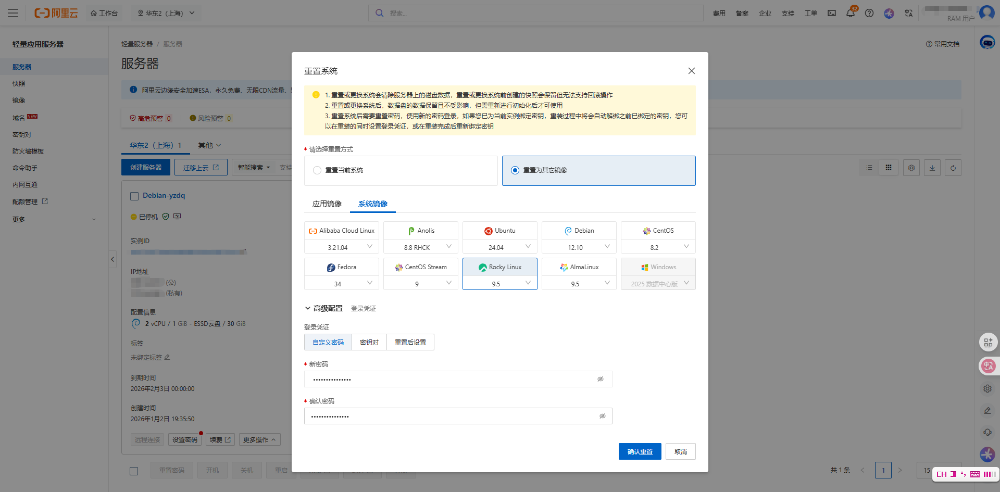

Reset the server system to Rocky Linux 9. This distribution holds a mainstream position in the server market, and most service providers offer support.

### Rescue Login

Configure rescue login.


Most of the operations described in this section are completed through VNC connection (rescue login).

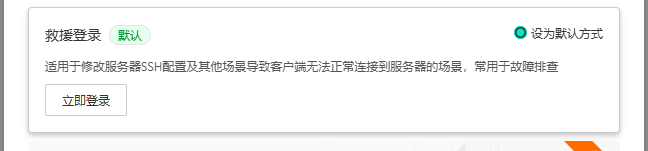

For convenience, you can temporarily set rescue login as the default login method.

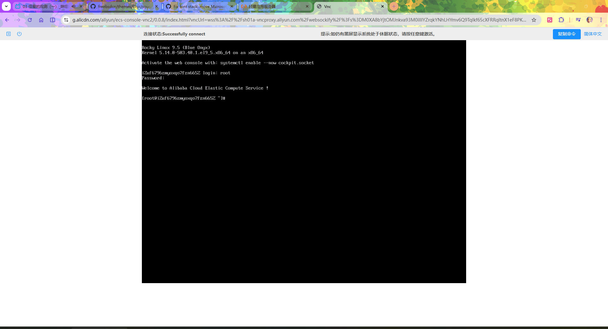

The rescue login interface is shown above. You can use the "Copy Command" option in the upper right corner to copy longer commands to the terminal for execution.

### Verifying Whether the Server Is in a UEFI Environment

This section targets UEFI boot environments and GPT partition tables, so you must first confirm whether the server is using a UEFI boot environment and GPT partition table. Several methods are provided below for reference.

- Determine whether the current system booted in UEFI or BIOS mode through the system firmware:

```sh
# [ -d /sys/firmware/efi ] && echo UEFI || echo BIOS
UEFI
```

- Determine the boot mode through the UEFI boot tool:

```sh
# efibootmgr
BootCurrent: 0003
Timeout: 0 seconds
BootOrder: 0006,0000,0001,0002,0003,0004,0005
Boot0000* UiApp
Boot0001* UEFI Floppy
Boot0002* UEFI Floppy 2
Boot0003* UEFI Misc Device
Boot0004* UEFI PXEv4 (MAC:00163E45BC81)
Boot0005* EFI Internal Shell
Boot0006* rocky
```

### Server Disk Partition Layout

- Determine through file system type and disk usage (also note that `/dev/vda2` is mounted at `/boot/efi`, which indicates the system is using UEFI mode):

```sh
# df -Th
Filesystem     Type      Size  Used Avail Use% Mounted on
devtmpfs       devtmpfs  4.0M     0  4.0M   0% /dev
tmpfs          tmpfs     447M     0  447M   0% /dev/shm
tmpfs          tmpfs     179M  2.8M  176M   2% /run
efivarfs       efivarfs  256K  7.4K  244K   3% /sys/firmware/efi/efivars
/dev/vda3      xfs        30G  3.4G   27G  12% /
/dev/vda2      vfat      100M  7.1M   93M   8% /boot/efi	# Indicates the system is using UEFI mode
tmpfs          tmpfs      90M     0   90M   0% /run/user/0
```

- Determine through the static file system mount configuration:

```sh
# cat /etc/fstab

#
# /etc/fstab
# Created by anaconda on Mon May 26 09:36:59 2025
#
# Accessible filesystems, by reference, are maintained under '/dev/disk/'.
# See man pages fstab(5), findfs(8), mount(8) and/or blkid(8) for more info.
#
# After editing this file, run 'systemctl daemon-reload' to update systemd
# units generated from this file.
#
UUID=a1a902bf-090a-4942-b533-c016a4e1c142 /                       xfs     defaults 0 0
UUID=638D-9E50          /boot/efi               vfat    defaults,uid=0,gid=0,umask=077,shortname=winnt 0 2
```

- View the UUID and file system type of block devices:

```sh
# blkid
/dev/vda2: SEC_TYPE="msdos" UUID="638D-9E50" TYPE="vfat" PARTUUID="a4ab187d-a07f-4f62-ac3e-c4e35548fcba"
/dev/vda3: LABEL="root" UUID="a1a902bf-090a-4942-b533-c016a4e1c142" TYPE="xfs" PARTUUID="4a488c1d-987b-4242-9b74-4b453717e917"
/dev/vda1: PARTUUID="6ce991dd-7936-4b15-b0f9-10fd95a4393c"
```

- Probe file system information for a specified block device:

```sh
# blkid -p /dev/vda1
/dev/vda1: PART_ENTRY_SCHEME="gpt" PART_ENTRY_UUID="6ce991dd-7936-4b15-b0f9-10fd95a4393c" PART_ENTRY_TYPE="21686148-6449-6e6f-744e-656564454649" PART_ENTRY_NUMBER="1" PART_ENTRY_OFFSET="2048" PART_ENTRY_SIZE="2048" PART_ENTRY_DISK="253:0"
```

The BIOS Boot partition is used for compatibility with traditional BIOS booting.

### Viewing System Hostname and System Information

```sh
# hostnamectl
 Static hostname: iZuf6796zmyoxqo7fzn665Z
       Icon name: computer-vm
         Chassis: vm 🖴
      Machine ID: 37ef1ea9b706405ea6df432d1348dc03
         Boot ID: 33fa5e31444449efb3888ceca163022e
  Virtualization: kvm
Operating System: Rocky Linux 9.5 (Blue Onyx)
     CPE OS Name: cpe:/o:rocky:rocky:9::baseos
          Kernel: Linux 5.14.0-503.40.1.el9_5.x86_64
    Architecture: x86-64
 Hardware Vendor: Alibaba Cloud
  Hardware Model: Alibaba Cloud ECS
Firmware Version: 0.0.0
```

### Viewing Network Information

- Display all network interfaces and their IP address information:

```sh
# ip a
1: lo: <LOOPBACK,UP,LOWER_UP> mtu 65536 qdisc noqueue state UNKNOWN group default qlen 1000
    link/loopback 00:00:00:00:00:00 brd 00:00:00:00:00:00
    inet 127.0.0.1/8 scope host lo
       valid_lft forever preferred_lft forever
    inet6 ::1/128 scope host
       valid_lft forever preferred_lft forever
2: eth0: <BROADCAST,MULTICAST,UP,LOWER_UP> mtu 1500 qdisc fq_codel state UP group default qlen 1000
    link/ether 00:16:3e:45:bc:81 brd ff:ff:ff:ff:ff:ff
    altname enp0s5
    altname ens5
    inet 172.24.0.80/18 brd 172.24.63.255 scope global dynamic noprefixroute eth0
       valid_lft 1892159248sec preferred_lft 1892159248sec
    inet6 fe80::216:3eff:fe45:bc81/64 scope link
       valid_lft forever preferred_lft forever
```

- Display the system routing table:

```sh
# ip route show
default via 172.24.63.253 dev eth0 proto dhcp src 172.24.0.80 metric 100
172.24.0.0/18 dev eth0 proto kernel scope link src 172.24.0.80 metric 100
```

- List all PCI buses and their device information:

```sh
# lspci
00:00.0 Host bridge: Intel Corporation 440FX - 82441FX PMC [Natoma] (rev 02)
00:01.0 ISA bridge: Intel Corporation 82371SB PIIX3 ISA [Natoma/Triton II]
00:01.1 IDE interface: Intel Corporation 82371SB PIIX3 IDE [Natoma/Triton II]
00:01.2 USB controller: Intel Corporation 82371SB PIIX3 USB [Natoma/Triton II] (rev 01)
00:01.3 Bridge: Intel Corporation 82371AB/EB/MB PIIX4 ACPI (rev 03)
00:02.0 VGA compatible controller: Cirrus Logic GD 5446
00:03.0 Communication controller: Red Hat, Inc. Virtio console
00:04.0 SCSI storage controller: Red Hat, Inc. Virtio block device
00:05.0 Ethernet controller: Red Hat, Inc. Virtio network device
00:06.0 Unclassified device [00ff]: Red Hat, Inc. Virtio memory balloon
```

## Installing FreeBSD via Raw Disk Image

Alibaba Cloud Simple Application Server supports installing FreeBSD via raw disk image. Please pay attention to the following warning before proceeding.

> **Warning**
>
> This operation will result in the loss of all data. Please complete data backup before proceeding. Based on testing, snapshots may not roll back correctly after the operation, but custom images can be used for indirect restoration.

Download and write the FreeBSD ZFS image to **/dev/vda**:

```sh
# wget -qO- https://mirrors.nju.edu.cn/freebsd/releases/VM-IMAGES/15.0-RELEASE/amd64/Latest/FreeBSD-15.0-RELEASE-amd64-zfs.raw.xz | xzcat | dd of=/dev/vda bs=4M status=progress
```

Parameter descriptions:

| Parameter | Description |
| --------- | ----------- |
| `wget -qO- URL` | `-q` silent mode, does not display download progress; `-O-` outputs downloaded content to standard output (stdout) |
| `xzcat` | Decompresses xz format files and outputs the decompressed content to standard output |
| `dd of=/dev/vda` | Writes input to the **/dev/vda** device (the entire disk, not a specific partition) |
| `bs=4M` | Sets block size to 4 MB, improving write efficiency |
| `status=progress` | Displays dd write progress |

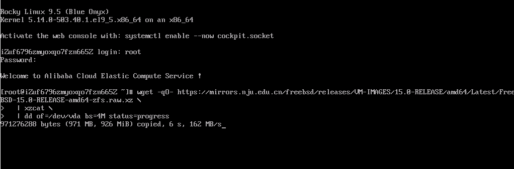

Then, in the Alibaba Cloud management console, select "More Operations" and "Restart" in sequence.

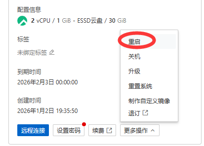

Check the "Force reboot instance" option.


Execute a forced reboot to enter FreeBSD.

Based on reader feedback and actual testing, installing or upgrading FreeBSD on paravirtualized platforms may encounter issues, such as problems with the VirtIO-BLK storage device driver on Alibaba Cloud.


At this point, when the FreeBSD system boots, at the loader menu interface (shown in the image above), press **ESC** to enter the "OK" command prompt.


On this interface, enter `set kern.maxphys=65536` to set the maximum physical I/O size of the kernel to 65536 bytes (large block I/O can sometimes trigger driver or cache issues), press Enter to confirm, then enter `boot` and press Enter to boot normally.

Then proceed with the normal installation process, selecting the ZFS partitioning method.

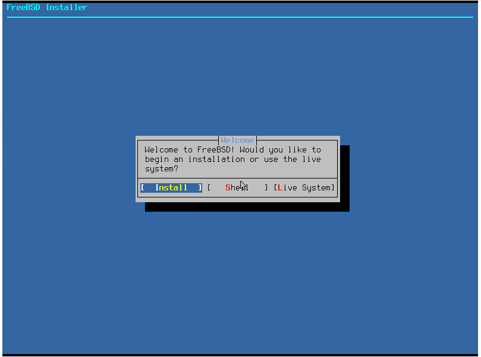

After the FreeBSD system has fully booted, permanently set the maximum I/O buffer size in the boot loader configuration file:

```sh
# echo "kern.maxphys=65536" >> /boot/loader.conf
```

Without this setting, the system may still get stuck at the boot interface on the next startup.

Next, list the FreeBSD system disk partition table and partition information:

```sh
root@freebsd:~ # gpart show
=>      34  62914486  vtbd0  GPT  (30G)
        34       348      1  freebsd-boot  (174K)
       382     66584      2  efi  (33M)
     66966   2097152      3  freebsd-swap  (1.0G)
   2164118  60750402      4  freebsd-zfs  (29G)
```

It can be observed that the system has automatically expanded the disk capacity.

View the FreeBSD system network interface information:

```sh
root@freebsd:~ # ifconfig
vtnet0: flags=1008843<UP,BROADCAST,RUNNING,SIMPLEX,MULTICAST,LOWER_UP> metric 0 mtu 1500
	options=ec07bb<RXCSUM,TXCSUM,VLAN_MTU,VLAN_HWTAGGING,JUMBO_MTU,VLAN_HWCSUM,TSO4,TSO6,LRO,VLAN_HWTSO,LINKSTATE,RXCSUM_IPV6,TXCSUM_IPV6,HWSTATS>
	ether 00:16:3e:45:bc:81
	inet 172.24.0.80 netmask 0xffffc000 broadcast 172.24.63.255
	inet6 fe80::216:3eff:fe45:bc81%vtnet0 prefixlen 64 scopeid 0x1
	media: Ethernet autoselect (10Gbase-T <full-duplex>)
	status: active
	nd6 options=23<PERFORMNUD,ACCEPT_RTADV,AUTO_LINKLOCAL>
lo0: flags=1008049<UP,LOOPBACK,RUNNING,MULTICAST,LOWER_UP> metric 0 mtu 16384
	options=680003<RXCSUM,TXCSUM,LINKSTATE,RXCSUM_IPV6,TXCSUM_IPV6>
	inet 127.0.0.1 netmask 0xff000000
	inet6 ::1 prefixlen 128
	inet6 fe80::1%lo0 prefixlen 64 scopeid 0x2
	groups: lo
	nd6 options=23<PERFORMNUD,ACCEPT_RTADV,AUTO_LINKLOCAL>
```

You can verify network connectivity by pinging common websites.

Display kernel boot information and kernel logs:

```sh
root@freebsd:~ # dmesg
---<<BOOT>>---
Copyright (c) 1992-2025 The FreeBSD Project.
Copyright (c) 1979, 1980, 1983, 1986, 1988, 1989, 1991, 1992, 1993, 1994
	The Regents of the University of California. All rights reserved.
FreeBSD is a registered trademark of The FreeBSD Foundation.
FreeBSD 15.0-RELEASE releng/15.0-n280995-7aedc8de6446 GENERIC amd64
FreeBSD clang version 19.1.7 (https://github.com/llvm/llvm-project.git llvmorg-19.1.7-0-gcd708029e0b2)
VT(efifb): resolution 800x600
CPU: Intel(R) Xeon(R) Platinum (2499.96-MHz K8-class CPU)
  Origin="GenuineIntel"  Id=0x50654  Family=0x6  Model=0x55  Stepping=4
  Features=0x1f83fbff<FPU,VME,DE,PSE,TSC,MSR,PAE,MCE,CX8,APIC,SEP,MTRR,PGE,MCA,CMOV,PAT,PSE36,MMX,FXSR,SSE,SSE2,SS,HTT>
  Features2=0xfffa3203<SSE3,PCLMULQDQ,SSSE3,FMA,CX16,PCID,SSE4.1,SSE4.2,x2APIC,MOVBE,POPCNT,TSCDLT,AESNI,XSAVE,OSXSAVE,AVX,F16C,RDRAND,HV>
  AMD Features=0x2c100800<SYSCALL,NX,Page1GB,RDTSCP,LM>
  AMD Features2=0x121<LAHF,ABM,Prefetch>
  Structured Extended Features=0xd19f07ab<FSGSBASE,TSCADJ,BMI1,AVX2,SMEP,BMI2,ERMS,INVPCID,AVX512F,AVX512DQ,RDSEED,ADX,SMAP,CLFLUSHOPT,CLWB,AVX512CD,AVX512BW,AVX512VL>
  XSAVE Features=0xf<XSAVEOPT,XSAVEC,XINUSE,XSAVES>
  TSC: P-state invariant
Hypervisor: Origin = "KVMKVMKVM"
real memory  = 1073741824 (1024 MB)
avail memory = 929538048 (886 MB)
Event timer "LAPIC" quality 600
ACPI APIC Table: <BOCHS  BXPCAPIC>
FreeBSD/SMP: Multiprocessor System Detected: 2 CPUs
FreeBSD/SMP: 1 package(s) x 1 core(s) x 2 hardware threads
random: registering fast source Intel Secure Key Seed
random: fast provider: "Intel Secure Key Seed"
arc4random: WARNING: initial seeding bypassed the cryptographic random device because it was not yet seeded and the knob 'bypass_before_seeding' was enabled.
ioapic0 <Version 1.1> irqs 0-23
Launching APs: 1
random: entropy device external interface
kbd1 at kbdmux0
efirtc0: <EFI Realtime Clock>
efirtc0: registered as a time-of-day clock, resolution 1.000000s
kvmclock0: <KVM paravirtual clock>
Timecounter "kvmclock" frequency 1000000000 Hz quality 975
kvmclock0: registered as a time-of-day clock, resolution 0.000001s
smbios0: <System Management BIOS> at iomem 0x3dbcc000-0x3dbcc01e
smbios0: Entry point: v2.1 (32-bit), Version: 2.8, BCD Revision: 2.8
aesni0: <AES-CBC,AES-CCM,AES-GCM,AES-ICM,AES-XTS>
acpi0: <BOCHS BXPCFACP>
acpi0: Power Button (fixed)
acpi0: Sleep Button (fixed)
cpu0: <ACPI CPU> on acpi0
atrtc0: <AT realtime clock> port 0x70-0x71,0x72-0x77 irq 8 on acpi0
atrtc0: registered as a time-of-day clock, resolution 1.000000s
Event timer "RTC" frequency 32768 Hz quality 0
Timecounter "ACPI-fast" frequency 3579545 Hz quality 900
acpi_timer0: <24-bit timer at 3.579545MHz> port 0xb008-0xb00b on acpi0
pcib0: <ACPI Host-PCI bridge> port 0xcf8-0xcff on acpi0
pci_link4: BIOS IRQ 10 for 0.1.INTA is invalid
pci_link3: BIOS IRQ 11 does not match initial IRQ 10
pci_link2: BIOS IRQ 11 does not match initial IRQ 10
pci_link1: BIOS IRQ 10 does not match initial IRQ 11
pci0: <ACPI PCI bus> on pcib0
isab0: <PCI-ISA bridge> at device 1.0 on pci0
isa0: <ISA bus> on isab0
atapci0: <Intel PIIX3 WDMA2 controller> port 0x1f0-0x1f7,0x3f6,0x170-0x177,0x376,0xc060-0xc06f at device 1.1 on pci0
ata0: <ATA channel> at channel 0 on atapci0
ata1: <ATA channel> at channel 1 on atapci0
uhci0: <Intel 82371SB (PIIX3) USB controller> port 0xc040-0xc05f irq 11 at device 1.2 on pci0
usbus0: controller did not stop
usbus0 on uhci0
usbus0: 12Mbps Full Speed USB v1.0
pci0: <bridge> at device 1.3 (no driver attached)
vgapci0: <VGA-compatible display> mem 0x80000000-0x81ffffff,0x82001000-0x82001fff at device 2.0 on pci0
vgapci0: Boot video device
virtio_pci0: <VirtIO PCI (legacy) Console adapter> port 0xc020-0xc03f mem 0x82000000-0x82000fff irq 11 at device 3.0 on pci0
virtio_pci1: <VirtIO PCI (legacy) Block adapter> mem 0x800000000-0x800000fff,0x800001000-0x800001fff at device 4.0 on pci0
vtblk0: <VirtIO Block Adapter> on virtio_pci1
vtblk0: 30720MB (62914560 512 byte sectors)
virtio_pci2: <VirtIO PCI (legacy) Network adapter> mem 0x800002000-0x800002fff,0x800003000-0x800003fff at device 5.0 on pci0
GEOM: vtbd0: the secondary GPT header is not in the last LBA.
vtnet0: <VirtIO Networking Adapter> on virtio_pci2
vtnet0: Ethernet address: 00:16:3e:45:bc:81
vtnet0: netmap queues/slots: TX 1/4096, RX 1/2048
000.000850 [ 452] vtnet_netmap_attach       vtnet attached txq=1, txd=4096 rxq=1, rxd=2048
virtio_pci3: <VirtIO PCI (legacy) Balloon adapter> port 0xc000-0xc01f irq 10 at device 6.0 on pci0
vtballoon0: <VirtIO Balloon Adapter> on virtio_pci3
acpi_syscontainer0: <System Container> port 0xaf00-0xaf1f on acpi0
atkbdc0: <Keyboard controller (i8042)> port 0x60,0x64 irq 1 on acpi0
atkbd0: <AT Keyboard> irq 1 on atkbdc0
kbd0 at atkbd0
atkbd0: [GIANT-LOCKED]
fdc0: <floppy drive controller> port 0x3f2-0x3f5,0x3f7 irq 6 drq 2 on acpi0
fdc0: does not respond
device_attach: fdc0 attach returned 6
uart: ns8250: UART FCR is broken (0x1)
uart0: <16550 or compatible> port 0x3f8-0x3ff irq 4 flags 0x10 on acpi0
uart0: console (115200,n,8,1)
attimer0: <AT timer> at port 0x40 on isa0
Timecounter "i8254" frequency 1193182 Hz quality 0
Event timer "i8254" frequency 1193182 Hz quality 100
attimer0: non-PNP ISA device will be removed from GENERIC in FreeBSD 16.
Timecounter "TSC-low" frequency 1250000111 Hz quality 1000
Timecounters tick every 10.000 msec
ugen0.1: <Intel UHCI root HUB> at usbus0
ZFS filesystem version: 5
uhub0 on usbus0
ZFS storage pool version: features support (5000)
uhub0: <Intel UHCI root HUB, class 9/0, rev 1.00/1.00, addr 1> on usbus0
Trying to mount root from zfs:zroot/ROOT/default []...
random: unblocking device.
uhub0: 2 ports with 2 removable, self powered
ugen0.2: <QEMU QEMU USB Tablet> at usbus0
usbhid0 on uhub0
usbhid0: <QEMU QEMU USB Tablet, class 0/0, rev 2.00/0.00, addr 2> on usbus0
hidbus0: <HID bus> on usbhid0
Dual Console: Serial Primary, Video Secondary
intsmb0: <Intel PIIX4 SMBUS Interface> irq 9 at device 1.3 on pci0
intsmb0: intr IRQ 9 enabled revision 0
smbus0: <System Management Bus> on intsmb0
hms0: <QEMU QEMU USB Tablet> on hidbus0
hms0: 3 buttons and [XYW] coordinates ID=0
vtcon0: <VirtIO Console Adapter> on virtio_pci0
lo0: link state changed to UP
vtnet0: link state changed to UP
```

## Installing FreeBSD Indirectly via mfsBSD

mfsBSD is a minimal FreeBSD memory disk image that supports UEFI and ZFS environments, and can be used to install FreeBSD or serve as a rescue disk. The download address for mfsBSD is: [mfsBSD and mfslinux](https://mfsbsd.vx.sk/).

> **Warning**
>
> Do not select any version with a suffix, such as `special edition` or `mini edition`. See the troubleshooting section.

Transfer the mfsBSD ISO image to Rocky Linux via WinSCP:

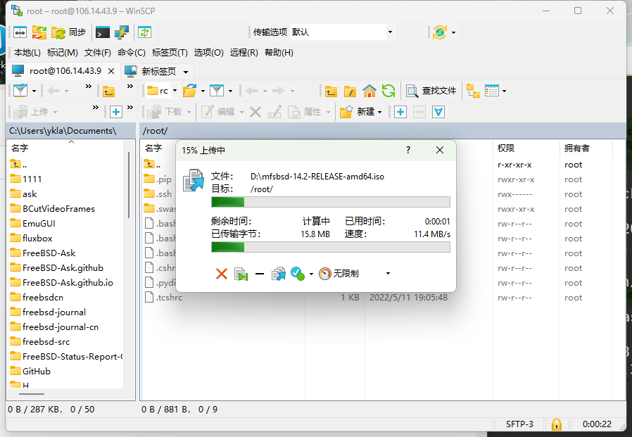

Write the mfsBSD ISO image to **/dev/vda** (block size 4 MB, with progress display):

```sh
# dd if=mfsbsd-14.2-RELEASE-amd64.iso of=/dev/vda bs=4M status=progress
25+1 records in
25+1 records out
105928704 bytes (106 MB, 101 MiB) copied, 0.206646 s, 513 MB/s
```

Force reboot the instance to boot into mfsBSD. When entering the boot menu interface, configure `kern.maxphys` as described in the previous section, otherwise the hard disk cannot be properly recognized.

> **Warning**
>
> Do not use the minimal system `mfsbsd-mini-14.2-RELEASE-amd64.iso` as a substitute; it cannot adjust the tunable parameter `kern.maxphys`, resulting in boot failure.
>
> 
>
> Even after manually specifying the tunable parameter, it still fails.
>
> 

After fully booting, enter the password to log in to the root account; the default password is `mfsroot`.

Observe the mfsBSD disk partition layout:

```sh
root@mfsbsd:~ # gpart show
=>      34  62914493  vtbd0  GPT  (30G) [CORRUPT]
        34      2014         - free -  (1.0M)
      2048      2048      1  bios-boot  (1.0M)
      4096    204800      2  efi  (100M)
    208896  62705631      3  linux-data  (30G)

=>      34  62914493  iso9660/MFSBSD  GPT  (30G) [CORRUPT]
        34      2014                  - free -  (1.0M)
      2048      2048               1  bios-boot  (1.0M)
      4096    204800               2  efi  (100M)
    208896  62705631               3  linux-data  (30G)

=>      34  62914493  diskid/DISK-uf69bteajghre1t7oe0z  GPT  (30G) [CORRUPT]
        34      2014                                    - free -  (1.0M)
      2048      2048                                 1  bios-boot  (1.0M)
      4096    204800                                 2  efi  (100M)
    208896  62705631                                 3  linux-data  (30G)
```

As can be seen, most partitions are marked as `[CORRUPT]`, which will affect system installation, so the GPT partition table must be repaired first:

```sh
root@mfsbsd:~ # gpart recover vtbd0	# Recover the partition table information of the vtbd0 disk
vtbd0 recovered
root@mfsbsd:~ # gpart show # View disk information after repairing the partition table
=>      40  62914487  vtbd0  GPT  (30G)
        40      2008         - free -  (1.0M)
      2048      2048      1  bios-boot  (1.0M)
      4096    204800      2  efi  (100M)
    208896  62705631      3  linux-data  (30G)

=>      40  62914487  iso9660/MFSBSD  GPT  (30G)
        40      2008                  - free -  (1.0M)
      2048      2048               1  bios-boot  (1.0M)
      4096    204800               2  efi  (100M)
    208896  62705631               3  linux-data  (30G)

=>      40  62914487  diskid/DISK-uf69bteajghre1t7oe0z  GPT  (30G)
        40      2008                                    - free -  (1.0M)
      2048      2048                                 1  bios-boot  (1.0M)
      4096    204800                                 2  efi  (100M)
    208896  62705631                                 3  linux-data  (30G)
```

### UFS Installation

Execute `bsdinstall` to start the installation; the process can be found in other related sections of this chapter.


After installation, connect to the FreeBSD machine using JuiceSSH:


### ZFS Installation

In the Shell interface, execute the following command to manually load the ZFS kernel module:

```sh
# kldload zfs
```

No output indicates successful loading.

You can also verify the ZFS module loading status with the following command:

```sh
# kldstat | grep zfs
```

If there is relevant output, you can proceed to enter the command `bsdinstall` to start the normal installation process.

The machine in this experiment has only 1 GB of memory. After mfsBSD uses approximately 100 MB, the available memory is less than 800 MB. Therefore, specifying ZFS installation will result in a "Distribution extract failed" error:


To view the actual error message, press Ctrl + C to return to the Shell interface, and observe through the following command:

```sh
# dmesg

…………Irrelevant output omitted…………

ZFS storage pool version: features support (5000)
pid 1151 (zpool) is attempting to use unsafe AIO requests - not logging anymore
pid 1562 (distextract), jid 0, uid 0, was killed: failed to reclaim memory
```

"failed to reclaim memory" indicates a memory reclaim failure. The extraction process 1562 was forcibly terminated due to insufficient memory.

This requires further testing; interested readers can also submit a PR after testing.

## Troubleshooting and Unfinished Business

Several methods were attempted during the actual operations in this section, but ultimately only two methods were relatively successful. To facilitate research by interested readers, the incomplete methods are listed here for future reference.

### Error During Installation: `sysctl: unknown oid 'vfs.zfs.min_auto_ashift'`

Analyzing the error message: literally, this parameter is used to set ZFS 4K alignment, and the error indicates that the parameter is unknown. Therefore, the problem is first located in the ZFS module.

This is usually caused by not manually loading the ZFS kernel module in advance.

The solution is to execute the command `kldload zfs` to manually load the kernel module as described above.

This may be a long-standing but difficult-to-reproduce bug; see: FreeBSD Project. Bug 249157 - installer reports sysctl: unknown oid 'vfs.zfs.min_auto_ashift' when ZFS module not loaded[EB/OL]. [2026-03-26]. <https://bugs.freebsd.org/bugzilla/show_bug.cgi?id=249157>.

### File System Does Not Support Online Shrinking

EXT2, EXT3, EXT4, and XFS file systems do not support online shrinking (Btrfs supports online shrinking but may have stability issues). There is currently no universal solution for this.

### Cannot Find UEFI Boot Entry, Goes Directly to UEFI Shell After Booting


Confirm that the selected image actually supports UEFI booting; for example, mfslinux and TinyCore-current.iso do not support UEFI booting.

### Cannot Find Root Partition

The image should be written to the entire disk (e.g., **/dev/vda**), not to a single partition (e.g., **/dev/vda2**), otherwise the following error may occur:


Even if the root partition is manually specified, the following error may still occur:

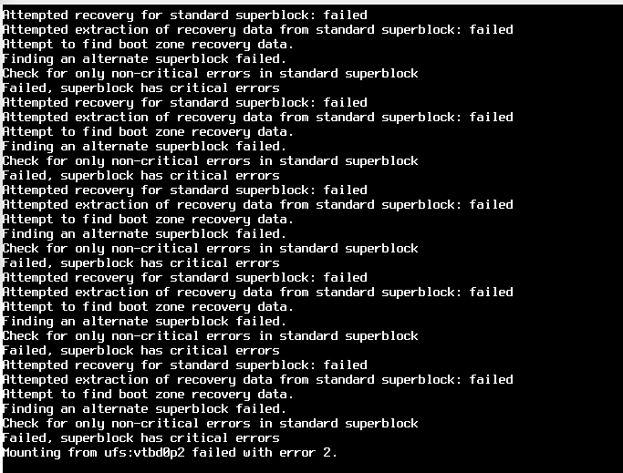

### Installing FreeBSD via Ventoy

Ventoy is a new-generation multi-system bootable USB solution. Its project website is [Ventoy](https://www.ventoy.net/cn/index.html).

The basic idea is to write Ventoy to the entire hard disk through a memory disk system, then mount the larger disk partition created by Ventoy to the memory disk, and write the FreeBSD system to this disk partition.

Then force reboot the instance to boot into Ventoy for system installation.

#### Ventoy Usage Method

Download the Ventoy Linux compressed package from the Nanjing University mirror:

```sh
# wget https://mirrors.nju.edu.cn/github-release/ventoy/Ventoy/Ventoy%201.1.10%20release/ventoy-1.1.10-linux.tar.gz
```

Extract the Ventoy files and directories in the current directory:

```sh
# tar xvf ventoy-1.1.10-linux.tar.gz
# ls	# List all files
ventoy-1.1.10  ventoy-1.1.10-linux.tar.gz
```

Install Ventoy to the hard disk:

```sh
# cd ventoy-1.1.10/	# Enter the Ventoy directory
# ls	# List Ventoy's files and directories
boot                    README          VentoyGUI.aarch64   VentoyPlugson.sh
CreatePersistentImg.sh  tool            VentoyGUI.i386      VentoyVlnk.sh
ExtendPersistentImg.sh  ventoy          VentoyGUI.mips64el  VentoyWeb.sh
plugin                  Ventoy2Disk.sh  VentoyGUI.x86_64    WebUI
# sh Ventoy2Disk.sh -I -g /dev/vda	# Execute the installation
```

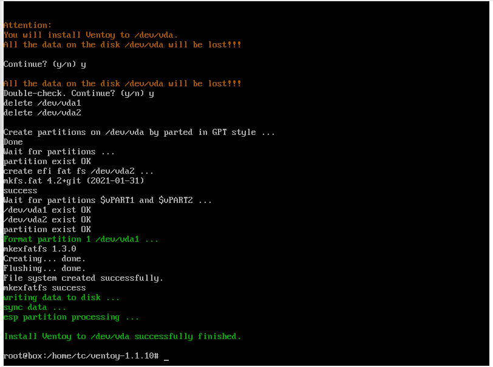

Ventoy2Disk.sh parameter descriptions:

- `-I`: Force install
- `-g`: Use GPT partition table

Verify the Ventoy installation through the command:


Readers can learn more through [Installing Ventoy on Linux — Command Line Interface](https://www.ventoy.net/cn/doc_start.html#doc_linux_cli).

#### Writing Ventoy Using Ventoy LiveCD

The Ventoy LiveCD download address is [Installation Package](https://www.ventoy.net/cn/download.html).

Ventoy LiveCD is not Ventoy itself, but a memory disk system image used to install Ventoy. See: Ventoy Team. Ventoy LiveCD Usage Instructions[EB/OL]. [2026-03-26]. <https://www.ventoy.net/cn/doc_livecd.html>.

After using dd to write the image to the entire hard disk, force reboot the instance; Ventoy LiveCD can boot normally.

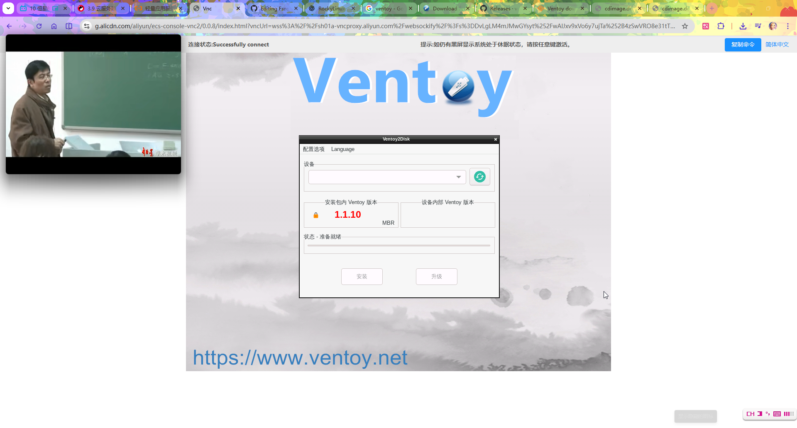

In the configuration options, allow all types of disks.


Install Ventoy to the entire disk.


After force rebooting the instance, the system can correctly boot into Ventoy.

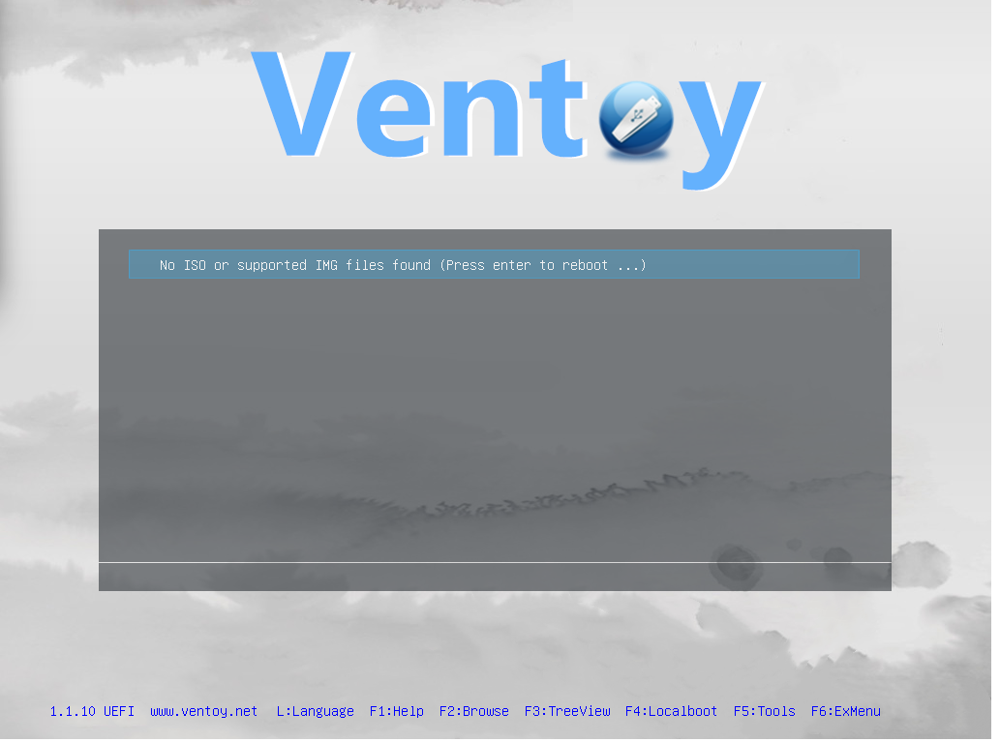

Ventoy currently does not support downloading ISO image files online.

Therefore, this method cannot proceed further.

You need to use another memory disk to write the image to the hard disk before booting Ventoy.

#### Writing Ventoy Using TinyCorePure64

TinyCorePure64 belongs to the [Core project](http://www.tinycorelinux.net/welcome.html), which is a highly modular system that supports community-customized builds.

TinyCorePure64 can be entirely loaded into memory after booting, and all data will be lost after reboot.

The TinyCorePure64 download address is [x86 Pure 64](http://www.tinycorelinux.net/ports.html); after entering the page, click "Core Pure 64 Latest Build" and select "TinyCorePure64-16.2.iso" or a similar version to download.

> **Note**
>
> Do not mistakenly download "CorePure64"; CorePure64 does not support UEFI boot environments.

```sh
# dd if=TinyCorePure64-16.2.iso of=/dev/vda bs=4M status=progress conv=fdatasync
```

> **Warning**
>
> Writing to a block device with `dd` will overwrite all existing data on the disk, and this operation is irreversible. Please double-check that the device path specified by the `of=` parameter is correct.

Force reboot the instance to boot into TinyCorePure64.


Select the last item "corew" because the default graphical interface (tc) may behave abnormally when executing commands via VNC. Additionally, the Ventoy graphical interface cannot run under its GUI because the libc format is incompatible.

Observe the partition layout:

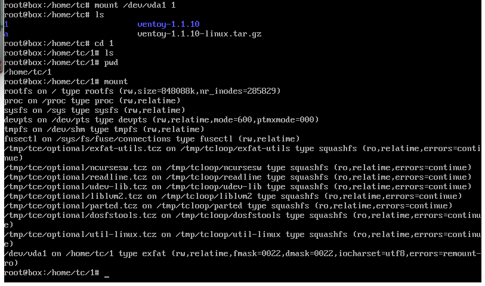

View in detail:


TinyCorePure64 is a minimal distribution that lacks many tools required by Ventoy, so they need to be installed manually.

Configure the Tiny Core Linux mirror source address, specifying the NetEase open source mirror as the download source:

```sh
# echo http://mirrors.163.com/tinycorelinux/ > /opt/tcemirror
```

Install exFAT tools, partition tools, FAT file system tools, Linux utility set, and certificate components:

```sh
$ tce-load -wi exfat-utils parted dosfstools util-linux openssl ca-certificates
```

> **Note**
>
> This package manager cannot run with root privileges.

Following the content in the above sections, install Ventoy to the entire disk. Then mount the disk generated by Ventoy to the memory disk.

Download the FreeBSD 15.0 Bootonly ISO image from the mirror to Ventoy using the specified user agent:

```sh
# wget --user-agent="Mozilla/5.0 (Windows NT 10.0; Win64; x64)" https://mirrors.nju.edu.cn/freebsd/releases/ISO-IMAGES/15.0/FreeBSD-15.0-RELEASE-amd64-bootonly.iso
```

Force reboot the instance into Ventoy.


Set the tunable parameter `kern.maxphys` in the boot menu, then continue booting the FreeBSD system.

List the disk partition layout:

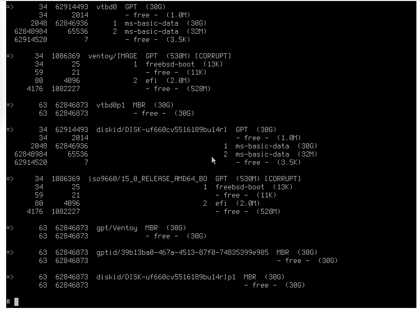

The disk is in read-only state, and no operations can be performed, including deleting the partition table, formatting, or using dd to write zeros.

All the above operations produce the following error:


Therefore, no installation operations can be performed.

## Appendix: Useful Commands That May Be Needed

Example of unmounting the EFI partition:

```sh
# umount /dev/vda2
```

Reformat the EFI partition as a FAT32 file system:

> **Warning**
>
> `mkfs.vfat` will format the specified partition, and existing data on the partition will be permanently lost. Please confirm the device path is correct.

```sh
# mkfs.vfat -F 32 /dev/vda2
mkfs.fat 4.2 (2021-01-31)
```

View the file system type of the **/dev/vda2** partition:

```sh
# blkid /dev/vda2
/dev/vda2: UUID="35FB-D455" TYPE="vfat" PARTUUID="a4ab187d-a07f-4f62-ac3e-c4e35548fcba"
```

## References

- Ventoy. Ventoy — A New Bootable USB Solution[EB/OL]. [2026-04-17]. <https://www.ventoy.net>. Ventoy project homepage, a new-generation multi-system bootable USB solution that supports booting directly from ISO images.
- FreeBSD Project. FreeBSD 15.0-RELEASE Release Notes[EB/OL]. [2026-04-17]. <https://www.freebsd.org/releases/15.0R/relnotes/>. FreeBSD 15.0 release notes, including VirtIO driver improvements and kernel tunable parameter changes.
