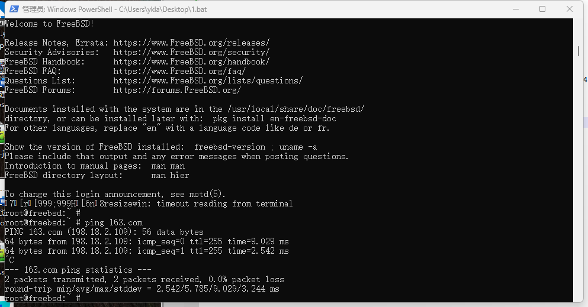

# 16.6 Installing RISC-V FreeBSD via QEMU (Based on x86 Windows Host)

QEMU (abbreviated from Quick Emulator) is an open-source general-purpose machine emulator and virtualizer.

The experimental environment in this section is based on Windows 11 24H2 (host machine, x86-64 architecture), FreeBSD 14.2-RELEASE (virtual machine, RISC-V architecture), and QEMU 20241220. All operation steps have been verified in this environment.

## Downloading QEMU for Windows

Please visit the QEMU official download page at [https://www.qemu.org/download/](https://www.qemu.org/download/#windows) to download and install the QEMU installer for Windows hosts (64-bit version).

The specific QEMU download address:

[QEMU Binaries for Windows (64 bit)](https://qemu.weilnetz.de/w64/), please download the latest installer from the list. At the time of writing, the latest version is `qemu-w64-setup-20241220.exe`, with a size of 174 MB.

After downloading, install QEMU on Windows.

## RISC-V FreeBSD Disk Image

After QEMU is installed, you need to download the RISC-V architecture FreeBSD disk image.

RISC-V FreeBSD disk image (using FreeBSD 14.2-RELEASE as an example):

<https://download.freebsd.org/releases/VM-IMAGES/14.2-RELEASE/riscv64/Latest/FreeBSD-14.2-RELEASE-riscv-riscv64-zfs.raw.xz>

After downloading, decompress it for later use.

## Related File Structure

After installation, the related files are distributed in the following directory structure.

```sh
/usr/
└── local/
    └── share/
        ├── opensbi/
        │   └── lp64/
        │       └── generic/
        │           └── firmware/
        │               └── fw_jump.elf # OpenSBI firmware
        └── u-boot/
            └── u-boot-qemu-riscv64/
                └── u-boot.bin # U-Boot boot loader
```

## OpenSBI

Obtain OpenSBI (RISC-V Open Source Supervisor Binary Interface), which functions similarly to boot firmware and is responsible for M-mode firmware work in the RISC-V boot process.

### Installing OpenSBI

The following commands need to be executed on a FreeBSD system (which can be another FreeBSD machine, a virtual machine, or FreeBSD in WSL). After installation, copy the firmware files to the Windows host for use.

Install using pkg:

```sh
# pkg install opensbi
```

Or install using Ports:

```sh
# cd /usr/ports/sysutils/opensbi/
# make install clean
```

### Extracting `fw_jump.elf`

```sh
# /etc/periodic/weekly/310.locate # Refresh the locate database
# locate fw_jump.elf
/usr/local/share/opensbi/lp64/generic/firmware/fw_jump.elf
```

Extract `fw_jump.elf` for use on Windows.

## U-Boot

Obtain U-Boot (Universal Boot Loader) on a FreeBSD system; it functions similarly to GRUB 2.

### Installing U-Boot

Install using pkg:

```sh
# pkg install u-boot-qemu-riscv64
```

Or install using Ports:

```sh
# cd /usr/ports/sysutils/u-boot-qemu-riscv64/
# make install clean
```

### Extracting the `u-boot.bin` File

```sh
# /etc/periodic/weekly/310.locate # Refresh the database
# locate u-boot.bin
/usr/local/share/u-boot/u-boot-qemu-riscv64/u-boot.bin
```

Extract `u-boot.bin` for use on Windows.

## Configuring QEMU

Create a new text file `qemu.bat` on the desktop and write the following content:

```batch
cd /d "C:\Program Files\qemu"
.\qemu-system-riscv64.exe ^
    -machine virt ^
    -smp 4 ^
    -cpu rv64 ^
    -m 4G ^
    -device virtio-blk-device,drive=hd ^
    -drive file="C:\Users\ykla\Desktop\FreeBSD-14.2-RELEASE-riscv-riscv64-zfs.raw",if=none,id=hd ^
    -device virtio-net-device,netdev=net ^
    -netdev user,id=net,hostfwd=tcp::8022-:22 ^
    -bios "C:\Users\ykla\Desktop\fw_jump.elf" ^
    -kernel "C:\Users\ykla\Desktop\u-boot.bin" ^
    -append "root=LABEL=rootfs" ^
    -nographic
```

Parameter descriptions:

| Parameter | Description |
| --------- | ----------- |
| `^` | Windows batch script line continuation character, allowing a long command to span multiple lines |
| `smp` | Number of CPUs |
| `cpu` | CPU architecture |
| `m` | Memory size |
| `hostfwd=tcp::8022-:22` | Forward host port 8022 to virtual machine port 22 (SSH) |

In the above example, please replace **C:\Users\ykla\Desktop\** with the actual path.

After saving the file, double-click to run the script.



Enter the username `root` to log in directly; there is no default password.

Whether using PowerShell or CMD, the output will display garbled characters (for example, when executing the `ee` command or pressing the **Tab key**).

Additionally, this image does not have SSH service configured for regular users by default, so you cannot directly connect to the FreeBSD device via SSH.

Create a regular user (if not already created, note to add it to the wheel group):

```sh
# adduser
```

## Configuring the sshd Service

Configure the sshd service as follows:

```sh
# service sshd enable # Add boot entry
# service sshd start # Start the sshd service
```

After this, you can connect via SSH from Windows (IP is `localhost`):

```powershell
ssh -p 8022 ykla@localhost
```

You can then connect to the local ykla user via SSH on port 8022 (as specified in the `qemu.bat` file).

## Troubleshooting and Unfinished Business

### Cannot Display Graphical Interface

The current version does not yet support graphical interface; related content is to be supplemented.

## References

- zg. Create FreeBSD virtual machine using qemu. Run the VM using xhyve.[EB/OL]. [2026-03-26]. <https://gist.github.com/zg/38a3afa112ddf7de4912aafc249ec82f>. Provides technical methods for expanding FreeBSD virtual machines under QEMU.
- Nativus. Setting Up a RISC-V Environment on QEMU for Windows x64 (Debian Linux)[EB/OL]. (2022-10-12)[2026-03-26]. <https://naiv.fun/Ops/83.html>. Provides conceptual explanations and an overall framework for setting up a RISC-V environment.
- smist08. RISC-V Emulation Revisited[EB/OL]. (2023-04-28)[2026-03-26]. <https://smist08.wordpress.com/2023/04/28/risc-v-emulation-revisited>. Detailed introduction to various configuration parameters and implementation details for RISC-V virtualization in QEMU.
