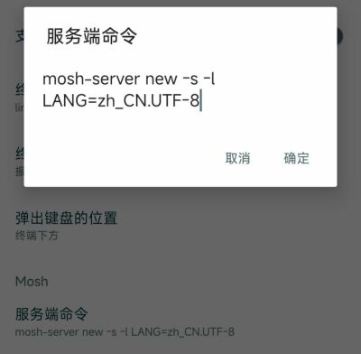
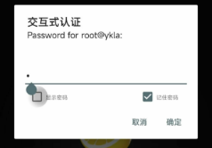
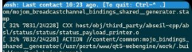

# 17.3 OpenSSH

## SSH and OpenSSH Overview

OpenSSH is a suite of network connectivity tools specifically designed for securely accessing remote hosts. TCP/IP connections can also be securely forwarded or encapsulated through SSH tunnels. OpenSSH encrypts all traffic, thereby guarding against eavesdropping, connection hijacking, and other network-layer attacks. If data is transmitted over the network in plaintext, network sniffers at any point between the client and server can intercept usernames, passwords, or data transmitted during the session. OpenSSH provides multiple authentication and encryption mechanisms to guard against such risks.

OpenSSH is maintained by the OpenBSD project and is installed by default with FreeBSD. OpenSSH is located at [/crypto/openssh](https://github.com/freebsd/freebsd-src/tree/main/crypto/openssh), and the current built-in version number can be obtained from the `ChangeLog`.

This section covers the OpenSSH included in the base system. The Ports collection also provides security/openssh-portable, which offers additional configuration options and more frequent updates.

## SSH Server Configuration Files

The SSH-related configuration files and directory structure are as follows:

```sh
/
├── etc/
│   └── ssh/
│       ├── sshd_config          # SSH server configuration file
│       ├── ssh_config           # SSH client configuration file
│       ├── ssh_host_rsa_key     # RSA host key file (private key)
│       ├── ssh_host_ecdsa_key   # ECDSA host key file (private key)
│       └── ssh_host_ed25519_key # Ed25519 host key file (private key)
└── User home directory (~)/
    └── .ssh/
        ├── id_ed25519           # Ed25519 private key
        ├── id_ed25519.pub       # Ed25519 public key
        └── authorized_keys       # List of authorized public keys for login
```

sshd is the server daemon of OpenSSH, responsible for listening for client connection requests, performing authentication, and establishing secure sessions. The runtime configuration of sshd is controlled by the `sshd_config` file, which defines all behavioral parameters of the server, including listening port, authentication methods, encryption algorithms, and log levels.

The client configuration is controlled by the `ssh_config` file.

## Enabling the SSH Server

In addition to the built-in SSH client tools, a FreeBSD system can also be configured as an SSH server to accept connections from other SSH clients.

To have the SSH server start automatically after a system reboot, execute the following command to enable the sshd service:

```sh
# service sshd enable
```

Then restart the sshd service:

```sh
# service sshd restart
```

When sshd starts for the first time on a FreeBSD system, it automatically generates host keys and displays their fingerprints on the console. These fingerprints should be communicated to users so they can verify them on first connection.

For available options when starting sshd, as well as complete descriptions of the authentication process, login procedure, and various configuration files, see sshd(8).

At this point, sshd is accessible to all accounts on the system that have passwords set.

## Key-Based Authentication

In addition to password-based methods, clients can also be configured to connect to remote hosts using keys. From a security perspective, key-based authentication is recommended.

Configuring OpenSSH to use public key authentication leverages asymmetric encryption technology to enhance security. This approach eliminates many risks associated with passwords, such as weak passwords and transmission interception, while also resisting various password-based attacks. However, it is essential to properly protect private keys to prevent unauthorized access.

### Generating Keys

`ssh-keygen` can be used to generate authentication keys. Specify the key type and follow the prompts to produce a public and private key pair. It is recommended to set a memorable and hard-to-guess passphrase to protect the private key.

```sh
# ssh-keygen
```

FreeBSD 13.1 and later versions include OpenSSH version 8.8 or higher. To check the current OpenSSH version:

```sh
# ssh -V
OpenSSH_10.0p2, OpenSSL 3.5.6 7 Apr 2026
```

You can generate keys using the default values:

```sh
# ssh-keygen
Generating public/private ed25519 key pair.
Enter file in which to save the key (/root/.ssh/id_ed25519): # Press Enter here to use the default storage location
Created directory '/root/.ssh'.
Enter passphrase for "/root/.ssh/id_ed25519" (empty for no passphrase):	# Enter passphrase here; pressing Enter will not set a passphrase (setting one is recommended for security)
Enter same passphrase again: # Repeat the passphrase here
Your identification has been saved in /root/.ssh/id_ed25519
Your public key has been saved in /root/.ssh/id_ed25519.pub
The key fingerprint is:
SHA256:7qHl6mBUpoGFhWowFkACTPjL08FVOmR4I5ZppEWKThI root@ykla
The key's randomart image is:
+--[ED25519 256]--+
|E+.**+o..        |
|==o*Bo+.         |
|==++.+=.         |
|=.. o= .         |
|.o oo.  S        |
|  +..  .         |
|   .o   +        |
|   . . = .       |
|     .+.o        |
+----[SHA256]-----+
```

> **Tip**
>
> The **192.168.179.128**, **192.168.1.32**, `ykla`, `1022`, and `/home/ykla` in the above examples are placeholders and must be replaced with actual values.

### Configuring Keys

Check permissions (default created permissions are as follows):

```sh
drwx------  2 root  wheel   512 Mar 22 18:27 /root/.ssh # Permission is 700
-rw-------  1 root  wheel   419 Mar 22 18:27 /root/.ssh/id_ed25519  # Private key, permission is 600
-rw-r--r--  1 root  wheel    99 Mar 22 18:27 /root/.ssh/id_ed25519.pub # Public key, permission is 644
```

Generate the verification public key:

```sh
# cat /root/.ssh/id_ed25519.pub >> /root/.ssh/authorized_keys # Store the public key in /root/.ssh/authorized_keys
-rw-------  1 root  wheel    99 Mar 22 18:39 /root/.ssh/authorized_keys # Check if the permission is 600; if not, manually modify the permission
```

After saving the private and public keys locally using WinSCP, you can delete the key files on the server:

> **Warning**
>
> Before deleting the private key, please confirm that it has been securely saved locally. Once the private key is deleted, it cannot be recovered. Failure to back it up will result in the inability to log in to the remote server via key authentication.

```sh
# rm /root/.ssh/id_ed25519*
```

### Configuring sshd to Use the Desired Authentication Method

> **Warning**
>
> Before disabling password authentication, please confirm that key authentication has been configured and tested successfully. If key authentication fails and password login has been disabled, you will be unable to remotely log in to the server. It is recommended to keep password login enabled first, and only disable it after key authentication has been verified to work correctly.

Edit the **/etc/ssh/sshd_config** file. Find the corresponding configuration items in the `sshd_config` file and modify them as needed, removing the leading `#`, and setting the parameters to `yes` or `no`, as shown below:

```ini
PermitRootLogin yes                          # Allow root user to log in directly
AuthorizedKeysFile     .ssh/authorized_keys  # Modify to use the key file in the user's directory; already correctly configured by default, can be checked again
PasswordAuthentication no                    # Do not allow users to log in using passwords; only public key authentication
KbdInteractiveAuthentication no              # Disable keyboard-interactive password verification
PermitEmptyPasswords no                      # Prohibit users with empty passwords from logging in
```

### Restarting the sshd Service

Restart the SSH service to apply the configuration changes:

```sh
# service sshd restart
```

Log in using Xshell, enter the key passphrase, import the private key `id_ed25519`, and you can log in.

If you are unable to log in using other SSH software, you should convert the key format.

## Allowing root User to Log In via SSH

> **Note**
>
> From a system security perspective, it is generally not recommended to allow the root user to log in directly via SSH. You should log in as a regular user and then switch to root privileges using `su` or `sudo`. If you must enable this, ensure the system uses strong passwords or key authentication.

> **Tip**
>
> For a video tutorial, see Chinese FreeBSD Community (CFC). 004-FreeBSD14.2 Allow root to log in via ssh[EB/OL]. (2024-12-04)[2026-04-04]. <https://www.bilibili.com/video/BV1gji2YLE2o>.

Edit the **/etc/ssh/sshd_config** file, remove the leading `#` from the corresponding line, and set the parameter to `yes` or `no` as needed:

```ini
PermitRootLogin yes          # Allow root login
PasswordAuthentication yes   # (Optional) Set whether to use SSH password authentication; default is no; note that PAM challenge-response mechanism on FreeBSD may bypass this restriction
```

> **Tip**
>
> If you cannot find the `#PasswordAuthentication no` line, confirm that you are modifying the **/etc/ssh/sshd_config** file, not the **/etc/ssh/ssh_config** file. Only `sshd_config` is the SSH service configuration file.

## Remote Login Client

`ssh` is the OpenSSH remote login client, used to log in to remote hosts and execute commands over an encrypted connection.

When logging in to an SSH server, use `ssh` and specify a valid username on that server, the IP address or hostname, and the port.

```sh
$ ssh -p port username@IP
```

For example, to use SSH to connect to port 1022 of the remote host **192.168.179.128** with the username ykla:

```sh
$ ssh -p 1022 ykla@192.168.179.128
```

If this is the first connection to the server, you will be asked to verify the server fingerprint:

```sh
The authenticity of host '192.168.179.128 (192.168.179.128)' can't be established.
ED25519 key fingerprint is SHA256:9RDBe66fTckKniNjdfAk1maQwKcrJRZgGx7BEYQs6hM.
This key is not known by any other names.
Are you sure you want to continue connecting (yes/no/[fingerprint])? yes
Warning: Permanently added '192.168.179.128' (ED25519) to the list of known hosts.
```

SSH uses a key fingerprint mechanism to verify the server's authenticity when the client connects. After entering `yes` to accept the fingerprint on the first connection, the fingerprint is stored in the file **~/.ssh/known_hosts**. Each subsequent login is compared against the saved key. If the server key does not match the record, ssh will issue a warning. In such cases, you should first investigate the reason for the key change before deciding whether to continue the connection.

Troubleshooting key changes is beyond the scope of this chapter.

## Securely Copying Files

`scp` can be used to securely copy files between local and remote hosts.

The following example copies `COPYRIGHT` from the remote system to the current local directory, keeping the same filename:

```sh
# scp user@host:/COPYRIGHT COPYRIGHT
```

> **Tip**
>
> The SSH client does not support the `username@IP:port` colon syntax for specifying the port (in SCP, the colon separates the hostname from the remote path; use the `-P` parameter to specify the port). If you need to embed the port number in the connection string, you can use the URI format `ssh://username@IP:port`.

The arguments for `scp` are similar to `cp`: the source file is the first argument, and the destination path is the second. Since files must be transmitted over the network, arguments use the format `user@host:<remote_file_path>`.

> **Note**
>
> When recursively copying directories, `scp` uses the `-r` option (note the lowercase r, not uppercase R, which differs from some FTP tools).

Example:

```sh
$ scp ykla@192.168.179.128:/COPYRIGHT COPYRIGHT
(ykla@192.168.179.128) Password for ykla@ykla:
COPYRIGHT                                                                             100% 6070   846.8KB/s   00:00
```

Since the host fingerprint has already been verified previously, the system automatically checks the server key before prompting for a password.

If you need to copy files interactively, you can use `sftp`, which operates similarly to an FTP client. The following example uploads the `FreeBSD-16.0-CURRENT-amd64-20260413-e9fc0c538264-285005-disc1.iso` file from the D drive to **/home/ykla**.

```powershell
PS C:\WINDOWS\system32> sftp ykla@192.168.179.128
(ykla@192.168.179.128) Password for ykla@ykla:
Connected to 192.168.179.128.
sftp> lcd D:\ # l=local, switch local directory
sftp> lpwd # lpwd shows current local path
Local working directory: d:\
sftp> pwd # List remote path
Remote working directory: /home/ykla
sftp> lls # List local directory contents
 Volume in drive D has no label.
 Volume Serial Number is 6071-07CB

 Directory of D:\

……other files omitted……

2026/05/02  12:23     4,405,243,904 FreeBSD-15.0-RELEASE-amd64-dvd1.iso

              34 File(s)  7,825,364,753 bytes
               5 Dir(s)  249,192,701,952 bytes free
sftp> put  FreeBSD-16.0-CURRENT-amd64-20260413-e9fc0c538264-285005-disc1.iso
Uploading FreeBSD-16.0-CURRENT-amd64-20260413-e9fc0c538264-285005-disc1.iso to /home/ykla/FreeBSD-16.0-CURRENT-amd64-20260413-e9fc0c538264-285005-disc1.iso
FreeBSD-16.0-CURRENT-amd64-20260413-e9fc0c538264-285005-disc1.iso                     100% 1313MB  13.9MB/s   01:34
sftp> ls # List remote directory contents
FreeBSD-16.0-CURRENT-amd64-20260413-e9fc0c538264-285005-disc1.iso
sftp> exit # Exit
```

## SSH Tunneling

OpenSSH can create tunnels that encapsulate other protocols within an encrypted session.

The following command instructs SSH to create a tunnel:

```sh
$ ssh -D 8080 user@host
```

This example uses the following options:

The `-D` option specifies a local "dynamic" application-level port forwarding.

`user@host` is the login name used on the specified remote SSH server.

The SSH tunnel works by creating a listening socket on `localport` of `localhost`.

This method can encapsulate any number of insecure TCP protocols, such as SMTP, POP3, and FTP.

## Keeping SSH Connections Alive

### screen

`screen` (meaning "screen") provides a virtual terminal environment that allows users to run multiple independent shell sessions within a single physical terminal.

Install using pkg:

```sh
# pkg install screen
```

Or install using Ports:

```sh
# cd /usr/ports/sysutils/screen/
# make install clean
```

screen usage:

```sh
# screen -S xxx
```

Use `-S` to specify `xxx` as the name for easy identification.

You can then connect to a remote host via SSH, and even if you close the terminal window, the session will not be interrupted.

To view currently running screen sessions:

Use the following command to list all screen sessions under the current user, including attached and detached sessions:

```sh
# screen -ls
There are screens on:
	18380.pts-0.ykla	(Attached)
	70812.xxx	(Detached)
	67169.pts-0.ykla	(Detached)
3 Sockets in /tmp/screens/S-root.
```

`Detached` sessions can be restored directly using `-r`:

```sh
# screen -r xxx	# Reattach (restore) screen session xxx (name or ID)
```

`Attached` sessions must be detached first before reattaching:

```sh
# screen -d 18380 # Detach the screen session with ID 18380 from the current terminal, keeping the session running in the background
[18380.pts-0.ykla detached.]

# screen -r 18380 # Restore
```

### tmux

`tmux` (Terminal Multiplexer) comes from OpenBSD, uses the ISC license, and is a modern replacement for GNU Screen. Compared to screen, tmux natively supports split panes, a more flexible configuration system, and a client-server architecture. It also maintains uninterrupted sessions in SSH remote management scenarios.

Install using pkg:

```sh
# pkg install tmux
```

Or install using Ports:

```sh
# cd /usr/ports/sysutils/tmux/
# make install clean
```

tmux uses a client-server model, with core concepts including:

- **Session**: A server can contain multiple sessions, which can be detached and run in the background.
- **Window**: A session can contain multiple windows, similar to tabs.
- **Pane**: A window can be divided into multiple panes, enabling split-screen operations.

Create a new session and specify a name:

```sh
# tmux new -s 123
```

Use `-s` to specify `123` as the session name for easy identification later.

You can then connect to a remote host via SSH, and even if you close the terminal window, the session will not be interrupted.

View currently running tmux sessions:

```sh
# tmux ls
123: 1 windows (created Fri Jun 12 11:41:41 2026) (attached)
```

Reattach a detached session:

```sh
# tmux attach -t 123	# Reattach session 123 (name or number)
```

If the session is still attached, you need to detach it first before reattaching:

```sh
# tmux detach -t 123	# Detach session 123 from the current terminal, keeping the session running in the background
# tmux attach -t 123	# Restore
```

All tmux keyboard shortcuts are triggered by the **prefix key** `Ctrl+b` (type the prefix key, release it, then type the function key). Common operations are as follows:

| Shortcut | Function |
| -------- | -------- |
| `Ctrl+b` `d` | Detach current session |
| `Ctrl+b` `c` | Create new window |
| `Ctrl+b` `n` | Switch to next window |
| `Ctrl+b` `p` | Switch to previous window |
| `Ctrl+b` `%` | Split pane left-right |
| `Ctrl+b` `"` | Split pane top-bottom |
| `Ctrl+b` `Arrow keys` | Switch between panes |
| `Ctrl+b` `x` | Close current pane |

> **Tip**
>
> The example configuration file for tmux is located at **/usr/local/share/examples/tmux/example_tmux.conf**, which can be copied to **/usr/local/etc/tmux.conf**.

### mosh

`mosh` (Mobile Shell) is suitable for remotely controlling servers from mobile devices (such as phones and tablets) over mobile networks.

Mosh does not support multiple windows, split-screen mode, or multiple clients connecting to the same server. When the client restarts or switches devices, it cannot automatically reconnect. If you need these features, you can use terminal multiplexers such as GNU Screen or OpenBSD tmux within a Mosh session; see [Mosh: A State-of-the-Art Good Old-Fashioned Mobile Shell](https://www.usenix.org/system/files/login/articles/winstein.pdf).

To use mosh: ① Both the server and client must be configured with the same UTF-8 encoding, ② Both sides must have mosh installed.

Install using pkg:

```sh
# pkg install mosh
```

Or install using Ports:

```sh
# cd /usr/ports/net/mosh/
# make install clean
```

Edit the **~/.login_conf** file and add:

- Default system:

```ini
me:\
        :charset=UTF-8:\
        :lang=en_US.UTF-8:\
        :setenv=LC_COLLATE=C:
```

- System with Chinese support (configure locale settings):

```ini
me:\
        :charset=UTF-8:\
        :lang=zh_CN.UTF-8:\
        :setenv=LC_COLLATE=zh_CN.UTF-8:
```

The client also requires the same configuration. Since Mosh is designed for mobile terminals, this section uses the [JuiceSSH](https://play.google.com/store/apps/details?id=com.sonelli.juicessh) software on an Android device for testing.



Select "Server Command" and set it as follows:

```sh
mosh-server new -s -l LANG=zh_CN.UTF-8
```

Set the locale for the new mosh server session to zh_CN.UTF-8.

The remaining configuration (username, password) is the same as SSH, still authenticating through port 22.

List all listening IPv4 sockets on the system:

```sh
# sockstat -4l
USER     COMMAND    PID   FD  PROTO  LOCAL ADDRESS         FOREIGN ADDRESS
root     mosh-serve 19493 4   udp4   192.168.31.187:60001  *:*
root     sshd        1140 4   tcp4   *:22                  *:*
ntpd     ntpd        1068 21  udp4   *:123                 *:*
ntpd     ntpd        1068 24  udp4   127.0.0.1:123         *:*
ntpd     ntpd        1068 26  udp4   192.168.31.187:123    *:*
root     syslogd     1017 7   udp4   *:514                 *:*
```

Based on the above output, the host port is 60001, so ports 60000-61000 need to be opened.

Test the connection:





Disconnect test:




After disconnection, a prompt will be displayed. When the network reconnects, the session will automatically resume with no difference from before disconnection (used in combination with `screen`).

## SSH Server Security Options

Although sshd is the most widely used remote management tool in FreeBSD, systems exposed to the public internet typically face brute-force attacks and port scanning. This section introduces several additional parameters to block such attacks. All configurations are written to **/etc/ssh/sshd_config**.

> **Note**
>
> Do not confuse **/etc/ssh/sshd_config** with **/etc/ssh/ssh_config** (note the extra `d` in the first filename). The former configures the server side, while the latter configures the client side.

You can use the `AllowUsers` keyword in the OpenSSH server configuration file to restrict which users are allowed to log in and their source addresses. For example, to only allow `user` to log in from **192.168.1.32**, add the following line to **/etc/ssh/sshd_config**:

```ini
AllowUsers user@192.168.1.32
```

If you want to allow `user` to log in from anywhere, simply list the username without an IP address:

```ini
AllowUsers user
```

Multiple users can be listed on the same line, such as:

```ini
AllowUsers root@192.168.1.32 user
```

After completing all modifications, before restarting the service, it is recommended to first run the following command to verify the configuration is correct:

```sh
# sshd -t
```

If the configuration is correct, there will be no output; if there are errors, output similar to the following will be displayed:

```sh
/etc/ssh/sshd_config: line 3: Bad configuration option: sdadasdasdasads
/etc/ssh/sshd_config: terminating, 1 bad configuration options
```

After confirming the configuration file is correct, execute the following command to reload sshd:

```sh
# service sshd reload
```

## Appendix: OpenSSH Server Configuration Reference

[/crypto/openssh/sshd_config](https://github.com/freebsd/freebsd-src/blob/main/crypto/openssh/sshd_config) is the default sshd configuration file. The following provides brief annotations for its main configuration items.

In the default `sshd_config` distributed with OpenSSH, options follow this strategy:

- Options and their default values are written out as much as possible, but kept in a commented state (the default values are listed for reference, but presented as comments; if not explicitly overridden, these values will still be in effect).
- Uncommented options will override the default values (i.e., they take effect through explicit overriding).

Some default values in FreeBSD differ from those in OpenBSD, and FreeBSD also has some additional options.

```ini
#Port 22	# Specify the port number sshd listens on; default is 22
#AddressFamily any	# Specify the address family to use; any means both IPv4 and IPv6
#ListenAddress 0.0.0.0	# Listen for connection requests on all IPv4 network interface addresses
#ListenAddress ::	# Listen for connection requests on all IPv6 network interface addresses

#HostKey /etc/ssh/ssh_host_rsa_key	# Specify the RSA host key file path
#HostKey /etc/ssh/ssh_host_ecdsa_key  # Specify the ECDSA host key file path
#HostKey /etc/ssh/ssh_host_ed25519_key  # Specify the Ed25519 host key file path

# Specify encryption algorithms and key exchange settings
#RekeyLimit default none	# Specify rekeying limits; default is no limit

# Logging
#SyslogFacility AUTH  # Specify the system facility for logging as authentication-related
#LogLevel INFO  # Specify the log verbosity level as INFO

# Authentication

#LoginGraceTime 2m  # Specify the login grace timeout as 2 minutes
#PermitRootLogin no  # Prohibit root user from logging in via SSH
#StrictModes yes  # Enable strict mode, checking host file and directory permissions
#MaxAuthTries 6  # Set maximum authentication attempts to 6
#MaxSessions 10  # Set maximum sessions per connection to 10

#PubkeyAuthentication yes  # Enable public key authentication

# By default, .ssh/authorized_keys and .ssh/authorized_keys2 are checked
# but this setting has been overridden, so the system only checks .ssh/authorized_keys

AuthorizedKeysFile	.ssh/authorized_keys  # Specify the user public key file path

#AuthorizedPrincipalsFile none	# Specify the authorized principals file path; default is no file

#AuthorizedKeysCommand none  # Specify the command for obtaining public keys; default is no command
#AuthorizedKeysCommandUser nobody  # Specify the user to run AuthorizedKeysCommand; default is nobody

# To enable this feature, host keys must also be configured in /etc/ssh/ssh_known_hosts
#HostbasedAuthentication no  # Disable host-based authentication
# If you don't trust ~/.ssh/known_hosts for HostbasedAuthentication, change to yes
#IgnoreUserKnownHosts no  # Whether to ignore the user's known hosts file
# Do not read the user's ~/.rhosts and ~/.shosts files
#IgnoreRhosts yes  # Enable to ignore rhosts files

# Change this to "yes" to enable built-in password authentication
# Note that passwords may also be accepted via KbdInteractiveAuthentication
#PasswordAuthentication no  # Disable password authentication
#PermitEmptyPasswords no  # Do not allow empty password logins

# Change this to "no" to disable keyboard-interactive authentication
# Depending on system configuration, this may involve passwords, challenge-response, one-time passwords, or a combination of these methods with others
# Keyboard-interactive authentication is also used for PAM authentication
#KbdInteractiveAuthentication yes  # Enable keyboard-interactive authentication

# Kerberos options
#KerberosAuthentication no  # Disable Kerberos authentication
#KerberosOrLocalPasswd yes  # If Kerberos authentication fails, allow using local password
#KerberosTicketCleanup yes  # Clean up Kerberos credential tickets after login
#KerberosGetAFSToken no  # Prohibit obtaining AFS tokens

# GSSAPI options
#GSSAPIAuthentication no  # Disable GSSAPI authentication
#GSSAPICleanupCredentials yes  # Clean up GSSAPI credentials after login

# Setting this to 'no' disables PAM authentication, account processing, and session processing
# If enabled, PAM authentication will be allowed via KbdInteractiveAuthentication and PasswordAuthentication
# Depending on PAM configuration, PAM authentication via KbdInteractiveAuthentication may bypass the "PermitRootLogin prohibit-password" setting
# If you only want to run PAM account and session checks without enabling PAM authentication,
# you can enable this, but set PasswordAuthentication and KbdInteractiveAuthentication to 'no'
#UsePAM yes  # Enable PAM authentication

#AllowAgentForwarding yes  # Allow SSH agent forwarding
#AllowTcpForwarding yes  # Allow TCP forwarding
#GatewayPorts no  # Disable gateway port forwarding
#X11Forwarding no  # Disable X11 forwarding
#X11DisplayOffset 10  # Set X11 display offset to 10
#X11UseLocalhost yes  # X11 forwarding binds only to localhost
#PermitTTY yes  # Allow pseudo-terminal allocation
#PrintMotd yes  # Display MOTD (message of the day) at login
#PrintLastLog yes  # Display last login information at login
#TCPKeepAlive yes  # Enable TCP KeepAlive
#PermitUserEnvironment no  # Disable reading user environment files
#Compression delayed  # Enable delayed compression
#ClientAliveInterval 0  # Client alive check interval; 0 means disabled
#ClientAliveCountMax 3  # Maximum unanswered client alive checks
#UseDNS yes  # Use DNS reverse lookup for client addresses
#PidFile /var/run/sshd.pid  # Specify sshd PID file path
#MaxStartups 10:30:100  # Limit simultaneous unauthenticated connections
#PermitTunnel no  # Disable VPN tunnels
#ChrootDirectory none  # Do not enable chroot directory
#UseBlocklist no  # Do not enable blocklist
#VersionAddendum FreeBSD-20250801  # SSH version additional information

# Default no login banner path
#Banner none  # Disable login banner

# Override default of no subsystems
Subsystem	sftp	/usr/libexec/sftp-server  # Specify SFTP subsystem and its execution path

# Example of overriding settings on a per-user basis
#Match User anoncvs  # Configuration block that applies only to user anoncvs
# X11Forwarding no  # Disable X11 forwarding
# AllowTcpForwarding no  # Disable TCP forwarding
# PermitTTY no  # Disable pseudo-terminal allocation
# ForceCommand cvs server  # Force execution of cvs server command
```

The above configuration is based on [sshd_config](https://github.com/freebsd/freebsd-src/commit/7238317403b95a8e35cf0bc7cd66fbd78ecbe521) in the FreeBSD source tree; specific configurations may change with version updates.

## References

- OpenBSD. ssh(1)[EB/OL]. [2026-04-17]. <https://man.openbsd.org/ssh.1>.
- FreeBSD Project. FreeBSD 13.1-RELEASE Announcement[EB/OL]. [2026-04-17]. <https://www.freebsd.org/releases/13.1R/announce/>. Starting from 13.1, OpenSSH 8.8p1 is included.
- mosh. mosh FAQ[EB/OL]. [2026-03-26]. <https://mosh.org/#faq>. Answers frequently asked questions about mosh, including connection principles and platform support.
- silbertmonaphia. ssh && mosh[EB/OL]. [2026-03-26]. <https://silbertmonaphia.github.io/ssh%E7%99%BB%E5%BD%95%E3%81%AE%E5%91%A8%E8%BE%BA-&&-Mosh.html>. Introduces the combined use of SSH and mosh along with configuration points.
- OpenBSD. scp — OpenSSH secure file copy[EB/OL]. [2026-03-26]. <https://man.openbsd.org/scp.1>.
- OpenBSD. OpenSSH 8.0 Release Notes[EB/OL]. [2026-04-17]. <https://www.openssh.com/txt/release-8.0>. "ssh-keygen(1): Increase the default RSA key size to 3072 bits,following NIST Special Publication 800-57's guidance for a 128-bit equivalent symmetric security level." Starting from version 8.0, ssh-keygen's default RSA key length increased from 2048 bits to 3072 bits.

## Exercises

1. Configure SSH to allow only key-based login and disable password authentication, analyzing the priority relationships and activation conditions of each authentication option in `sshd_config`.
2. Create a screen session and a tmux session respectively to run long-duration tasks, simulate network disconnection and reconnection to restore sessions, compare the process lifecycle differences between scenarios with and without session managers, and compare the similarities and differences in operation between screen and tmux.
3. Modify the `ClientAliveInterval` and `ClientAliveCountMax` parameters of sshd, test connection maintenance behavior under different settings, and analyze the impact of the keepalive mechanism on network interruption detection.
