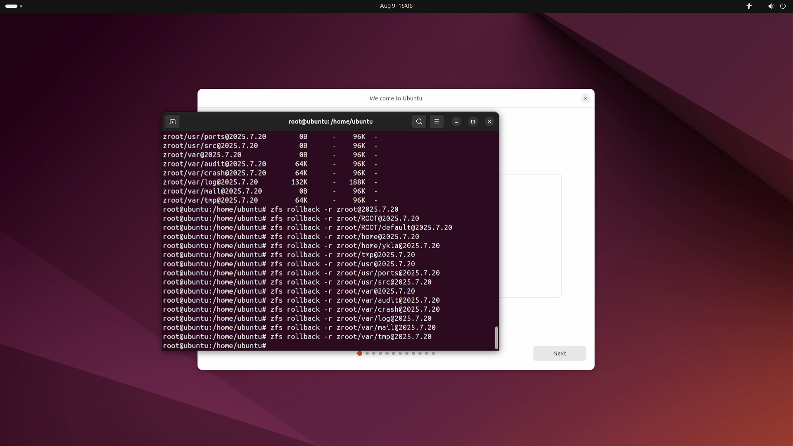

# 17.9 Live Images and System Recovery

## System Recovery Methods Overview

FreeBSD system recovery can use different methods depending on the severity of the failure, arranged from least to most invasive:

| Method | Applicable Scenario | Description |
| ------ | ------------------- | ----------- |
| Single-User Mode | Configuration file errors, forgotten root password | The system boots into single-user mode, mounting only the root filesystem (**/**), without starting network services or the multi-user environment, running with root privileges. Press 2 at boot to enter `single user` mode; no password is required by default, and the `passwd` command can be used to reset the password. |
| Live Image Boot | Boot loader corruption, severe root filesystem damage, lost disk partition table | Boot a complete FreeBSD runtime environment from installation media (USB drive or optical disc), without relying on the system on the hard disk. The Live environment provides a complete toolchain for performing filesystem checks (`fsck`), ZFS pool imports (`zpool import`), data backup, and other operations. |
| Disaster Recovery | Entire storage subsystem unavailable | Requires rebuilding the system using pre-created backups (such as remote replication of ZFS snapshots, `dump`/`restore` backups). This scenario is beyond the scope of this section. |

## System Recovery Operations Under UFS Filesystem

Mount the root UFS filesystem as writable:

```sh
# mount -u /
```

Mount all UFS filesystems:

```sh
# mount -a -t ufs
```

## ZFS Filesystem

> **Tip**
>
> In some cases, FreeBSD Live images may have limited ability to operate on ZFS disks, such as being unable to create mount points or switch to writable mode. Such limitations are typically related to the default configuration of the Live image.
>
> If you encounter such issues, you can try using Ubuntu 24.04 or later Live mode to operate ZFS disks, such as restoring snapshots.
>
> 

Mount the root filesystem as writable:

```sh
# mount -u /
```

Mount all ZFS filesystems:

```sh
# zfs mount -a
```

Mount the ZFS root filesystem:

```sh
# zpool import -fR /mnt zroot
```

Parameter descriptions:

- `-f`: Force import.
- `-R`: Specify alternate root directory (altroot).

Using `zpool import -fR /mnt zroot` together forces the zroot pool to be imported to **/mnt** as the alternate root directory.

### Troubleshooting and Unresolved Issues

#### `passwd: pam_chauthtok(): Error in service module`

Check whether the ZFS filesystem is in a read-only state:

```sh
# zfs get all | grep readonly
```

Remove the ZFS filesystem read-only property:

```sh
# zfs set readonly=off zroot
```

#### References

- OpenZFS. one ZFS file system always starts with readonly=on temporary on boot[EB/OL]. [2026-03-26]. <https://github.com/openzfs/zfs/issues/2133>. Reports the issue of ZFS filesystems temporarily mounting in read-only mode at boot and community discussion.

## Using USB Drive Devices

Mount the specified USB drive partition to **/mnt** with read-write access:

```sh
# mount -o rw /dev/adaXpN /mnt
```

Parameter descriptions:

- You can view device information using the `dmesg` command to determine the specific number after `ada`.
- The parameters `X` and `N` depend on the specific device numbers.

## Exercises

1. After entering single-user mode, perform root password reset operations on both UFS and ZFS filesystems respectively, and compare the differences between the two filesystems regarding read-only mounting and read-write remounting.
2. Analyze the FreeBSD Live image generation scripts (`release/`), and evaluate the scope of modifications and technical difficulty required to support persistent mounting.
3. Single-user mode bypasses authentication to directly grant root shell privileges, which is an intentionally designed security "backdoor." Compare this recovery mechanism with Linux's `init=/bin/bash` kernel parameter in terms of security design, and analyze the irreconcilable contradiction between system recovery convenience and physical security protection.
