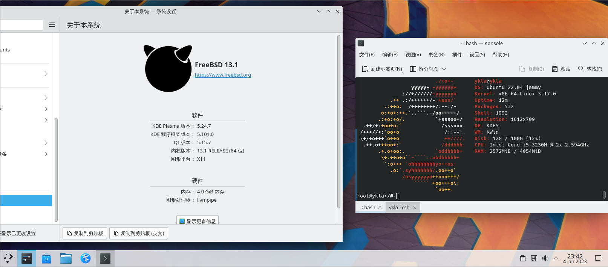
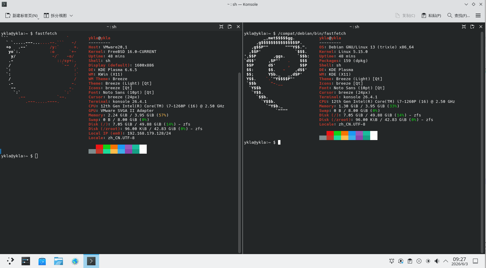
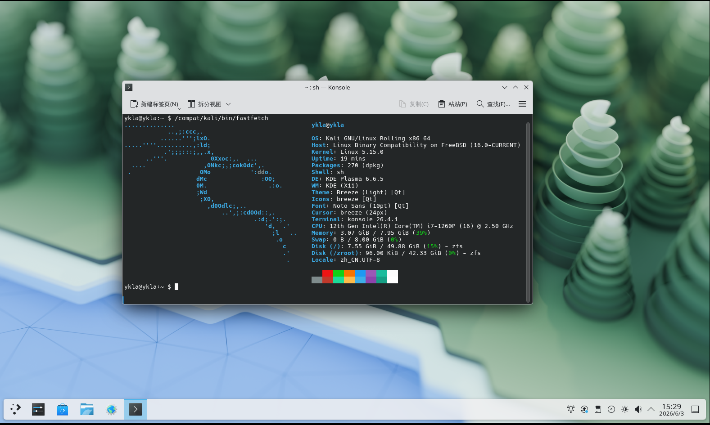

# 18.3 Ubuntu/Debian/Kali Linux Compatibility Layer

This section covers building Ubuntu 22.04/26.04 LTS compatibility layers on FreeBSD using debootstrap and WSL, along with Debian 13/Kali Linux build scripts.

Video tutorial: [06-FreeBSD-Ubuntu Compatibility Layer Script Usage Guide](https://www.bilibili.com/video/BV1iM4y1j7E9)

## Ubuntu Compatibility Layer



Additionally, a Debian compatibility layer can be built using a similar method. For support status of other systems, see the **/usr/local/share/debootstrap/scripts/** directory.

### Start Building the Ubuntu Compatibility Layer (Based on Ubuntu 22.04 LTS)

Before building, you need to enable the relevant daemons and services:

```sh
# service linux enable   # Enable the Linux compatibility layer service and set it to start on boot
# service linux start    # Start the Linux compatibility layer service
# service dbus enable    # Enable the D-Bus service and set it to start on boot (usually already configured by the desktop environment)
# service dbus start     # Start the D-Bus service (usually already configured by the desktop environment)
```

Build the Ubuntu 22.04 LTS base system:

```sh
# pkg install debootstrap                                   # Install the debootstrap tool
# debootstrap jammy /compat/ubuntu http://mirrors.ustc.edu.cn/ubuntu/   # Use debootstrap to install Ubuntu Jammy into /compat/ubuntu
```

### Specifying the Compatibility Layer Path

After building, you must mount the necessary file systems. Point the Linux compatibility layer default path to **/compat/ubuntu** to enable automatic mounting of the relevant file systems.

Take effect immediately:

```sh
# sysctl compat.linux.emul_path=/compat/ubuntu
```

Permanent setting:

```sh
# echo "compat.linux.emul_path=/compat/ubuntu" >> /etc/sysctl.conf
```

### Setting the Linux Kernel Version

You may need to set an appropriate Linux kernel version; otherwise, chroot will prompt `FATAL: kernel too old`.

`7.0.11` is only an example; it is recommended to refer to the version numbers published on [The Linux Kernel Archives](https://www.kernel.org/).

```sh
# echo "compat.linux.osrelease=7.0.11" >> /etc/sysctl.conf   # Write the kernel version to the sysctl configuration file for permanent effect
# sysctl compat.linux.osrelease=7.0.11                      # Set the kernel version immediately, usable in the current session
```

Restart the Linux compatibility layer service:

```sh
service linux restart
```

### Entering the Ubuntu Compatibility Layer

After completing file system mounting and kernel version settings, enter the Ubuntu compatibility layer to continue configuration.

chroot into the Ubuntu compatibility environment and remove software that may cause errors:

```bash
# chroot /compat/ubuntu /bin/bash	# Enter the Linux compatibility environment
# apt remove rsyslog # After entering the compatibility layer, uninstall rsyslog
```

### Switching Ubuntu Software Sources

Changing the software sources of the Ubuntu compatibility layer can improve download speeds.

After uninstalling rsyslog, you must change the software sources; since SSL certificates have not been updated yet, HTTPS sources cannot be used temporarily.

Use a text editor to edit the APT software source configuration file **/compat/ubuntu/etc/apt/sources.list** in the Ubuntu compatibility environment, and write the software sources:

```ini
deb http://mirrors.ustc.edu.cn/ubuntu/ jammy main restricted universe multiverse
deb-src http://mirrors.ustc.edu.cn/ubuntu/ jammy main restricted universe multiverse
deb http://mirrors.ustc.edu.cn/ubuntu/ jammy-security main restricted universe multiverse
deb-src http://mirrors.ustc.edu.cn/ubuntu/ jammy-security main restricted universe multiverse
deb http://mirrors.ustc.edu.cn/ubuntu/ jammy-updates main restricted universe multiverse
deb-src http://mirrors.ustc.edu.cn/ubuntu/ jammy-updates main restricted universe multiverse
deb http://mirrors.ustc.edu.cn/ubuntu/ jammy-backports main restricted universe multiverse
deb-src http://mirrors.ustc.edu.cn/ubuntu/ jammy-backports main restricted universe multiverse
```

Enter the Ubuntu compatibility layer, start updating the system, and install commonly used software:

```bash
# export LANG=C # Set character set to avoid errors
# apt update && apt upgrade && apt install nano wget fonts-wqy-microhei fonts-wqy-zenhei language-pack-zh-hans # The following commands are executed inside the Ubuntu compatibility layer
# update-locale LC_ALL=zh_CN.UTF-8 LANG=zh_CN.UTF-8 # Set Chinese character set
```

## Appendix: Ubuntu Compatibility Layer Script (Based on Ubuntu 26.04 LTS)

Ubuntu 26.04 LTS compatibility layer:


The script content is as follows:

```sh
#!/bin/sh

ROOT_DIR=/compat
DIST_Linux=ubuntu
DIST=ubuntu-releases
DIST_FULLNAME="Ubuntu 26.04"
VER=26
SUB_VER=04
FILE=ubuntu-${VER}.${SUB_VER}-wsl-amd64.wsl
SUBDIR=""
URL=https://mirrors.ustc.edu.cn/${DIST}/${VER}.${SUB_VER}/
UPDATE_CMD="apt-get update -y"
UPGRADE_CMD="apt-get upgrade -y"
INSTALL_CMD="apt-get install -y"
UPDATE=1
UPGRADE=1
INSTALL=1

# Create target directory in advance
TARGET_PATH="${ROOT_DIR}/${DIST_Linux}"
mkdir -p "${TARGET_PATH}"

echo "Starting ${DIST_FULLNAME} installation"
sleep 0.5

# Check Linux module
echo "Checking required modules"

if [ "$(sysrc -n linux_enable 2>/dev/null)" != "YES" ]; then
    echo "Linux service is not enabled. Enable it now? (Y|n)"
    read ANSWER
    case $ANSWER in
        [Nn][Oo]|[Nn])
            echo "Warning: You must start the Linux service with \"service linux start\" after each FreeBSD reboot."
            echo "Are you sure you want to continue without enabling the Linux service? (y|N)"
            read ANSWER
            case $ANSWER in
                [Yy][Ee][Ss]|[Yy])
                    echo "WARNING: Linux module not enabled"
                    ;;
                [Nn][Oo]|[Nn]|"")
                    echo "Enabling Linux module"
                    service linux enable
                    ;;
                *)
                    echo "Aborting."
                    exit 4
                    ;;
            esac
            ;;
        [Yy][Ee][Ss]|[Yy]|"")
            echo "Enabling Linux module"
            service linux enable
            ;;
        *)
            echo "Aborting."
            exit 4
            ;;
    esac
fi

echo "Starting Linux service"
service linux start

# Check dbus
if ! which -s dbus-daemon; then
    echo "dbus-daemon not found. Install D-Bus now? (Y|n)"
    read ANSWER
    case $ANSWER in
        [Nn][Oo]|[Nn])
            echo "Aborting. D-Bus not installed"
            exit 2
            ;;
        [Yy][Ee][Ss]|[Yy]|"")
            echo "Installing D-Bus"
            pkg install -y dbus
            ;;
        *)
            echo "Aborting."
            exit 4
            ;;
    esac
fi

if [ "$(sysrc -n dbus_enable 2>/dev/null)" != "YES" ]; then
    echo "D-Bus is not enabled. Enable it now? (Y|n)"
    read ANSWER
    case $ANSWER in
        [Nn][Oo]|[Nn])
            echo "WARNING: You must start D-Bus with \"service dbus start\" after each FreeBSD reboot."
            echo "Are you sure you want to continue without enabling D-Bus? (y|N)"
            read ANSWER
            case $ANSWER in
                [Yy][Ee][Ss]|[Yy])
                    echo "Warning: D-Bus service not enabled"
                    ;;
                [Nn][Oo]|[Nn]|"")
                    echo "Enabling D-Bus service"
                    service dbus enable
                    ;;
                *)
                    echo "Aborting."
                    exit 4
                    ;;
            esac
            ;;
        [Yy][Ee][Ss]|[Yy]|"")
            echo "Enabling D-Bus service"
            service dbus enable
            ;;
        *)
            echo "Aborting."
            exit 4
            ;;
    esac
fi

# =====================================================================
# Download and extraction main logic
# =====================================================================
echo "${DIST_FULLNAME} will be installed in ${TARGET_PATH}"

# Dynamic integrity verification
check_integrity() {
    # 1. Target file does not exist, return failure directly
    [ -f "${FILE}" ] || return 1

    # 2. Checksum file does not exist, return failure directly
    if [ ! -f "SHA256SUMS" ]; then
        echo "Error: SHA256SUMS file is missing." >&2
        return 1
    fi

    # 3. Extract the expected hash value from SHA256SUMS
    local expected_hash
    expected_hash=$(grep "${FILE}" SHA256SUMS | awk '{print $1}')

    if [ -z "${expected_hash}" ]; then
        return 1
    fi

    # 4. Get the local actual hash value
    local actual_hash
    if command -v sha256 >/dev/null 2>&1; then
        actual_hash=$(sha256 -q "${FILE}")
    else
        echo "Error: sha256 command not found on this system." >&2
        return 1
    fi

	# Print SHA256 comparison list
    echo "========================================================"
    echo " Verifying checksum for: ${FILE}"
    echo "--------------------------------------------------------"
    echo " Expected SHA256: ${expected_hash}"
    echo " Actual   SHA256: ${actual_hash}"
    echo "========================================================"

    # 5. String comparison
    if [ "${expected_hash}" = "${actual_hash}" ]; then
        return 0
    else
        return 1
    fi
}

# Download the latest checksum file first
echo "Updating verification manifest (SHA256SUMS)..."
fetch "${URL}/SHA256SUMS"

if [ ! -f "SHA256SUMS" ]; then
    echo "Critical Error: Failed to download SHA256SUMS manifest from remote server." >&2
    exit 1
fi

# Step 1: Check if a valid file already exists locally
if check_integrity; then
    echo "Valid basic system archive detected locally. Skipping download."
else
    # If the file exists but verification fails, the previous download was incomplete; attempt to resume
    if [ -f "${FILE}" ]; then
        echo "Local file exists but is incomplete or invalid. Attempting to resume download..."
    else
        echo "Downloading basic system..."
    fi

    # First download: use -r parameter to enable resume
    fetch -r "${URL}/${FILE}"

    # Step 2: Verify after download; if failed, retry once
    if ! check_integrity; then
        echo "Checksum mismatch after download. Cleaning up corrupted cache and retrying one last time..."

        # Clean up potentially corrupted resume fragments, retry full download
        rm -f "${FILE}"
        fetch "${URL}/${FILE}"

        # Final verification: if still failed, terminate script
        if ! check_integrity; then
            echo "Error: Checksum verification failed again after retry. Installation aborted." >&2
            exit 1
        fi
    fi
fi

# Step 3: Extract the base system
echo "Extracting basic system"
sleep 0.5
tar xvpf "${FILE}" ${SUBDIR:-} -C "${TARGET_PATH}" --numeric-owner 2>&1 | grep -v "Error exit delayed from previous errors"

# Modify the compatibility layer default path
sysctl compat.linux.emul_path="${TARGET_PATH}"
if ! grep -q "compat.linux.emul_path" /etc/sysctl.conf; then
    echo "compat.linux.emul_path=${TARGET_PATH}" >> /etc/sysctl.conf
else
    # If it already exists, update it
    sed -i '' "s|compat.linux.emul_path=.*|compat.linux.emul_path=${TARGET_PATH}|" /etc/sysctl.conf
fi

linux_path=$(sysctl -n compat.linux.emul_path)
echo "Now compat.linux.emul_path is $linux_path"

# Set Linux kernel version, otherwise chroot will prompt FATAL: kernel too old
sysctl compat.linux.osrelease=7.0.11
if ! grep -q "compat.linux.osrelease" /etc/sysctl.conf; then
    echo "compat.linux.osrelease=7.0.11" >> /etc/sysctl.conf
else
    sed -i '' "s|compat.linux.osrelease=.*|compat.linux.osrelease=7.0.11|" /etc/sysctl.conf
fi

osrelease=$(sysctl -n compat.linux.osrelease)
echo "Now compat.linux.osrelease is $osrelease"
service linux restart

# Configure DNS
echo "Should ${DIST_FULLNAME} use Alibaba DNS or local resolv.conf? ((A)li | (L)ocal | (C)ancel)"
read ANSWER
case $ANSWER in
    [Aa][Ll][Ii]|[Aa]|"")
        echo "Setting Alibaba DNS"
		grep -q "nameserver 223.5.5.5" "${TARGET_PATH}/etc/resolv.conf" 2>/dev/null || \
		    echo "nameserver 223.5.5.5" >> "${TARGET_PATH}/etc/resolv.conf"
		grep -q "nameserver 223.6.6.6" "${TARGET_PATH}/etc/resolv.conf" 2>/dev/null || \
		    echo "nameserver 223.6.6.6" >> "${TARGET_PATH}/etc/resolv.conf"
        ;;
    [Ll][Oo][Cc][Aa][Ll]|[Ll])
        echo "Using local resolv.conf"
        cp /etc/resolv.conf "${TARGET_PATH}/etc/resolv.conf"
        ;;
    *)
        echo "Canceled."
        echo "You must manually edit ${TARGET_PATH}/etc/resolv.conf!"
        ;;
esac

# Set USTC mirror source
echo "Do you want to use the USTC mirror for ${DIST_FULLNAME}? (Y|n)"
read ANSWER
case $ANSWER in
    [Yy][Ee][Ss]|[Yy]|"")
echo "Setting USTC mirror"
        chroot "${TARGET_PATH}" /bin/bash -c "sed -i.bak \
            -e 's|http://archive.ubuntu.com/ubuntu/|https://mirrors.ustc.edu.cn/ubuntu/|g' \
            -e 's|http://security.ubuntu.com/ubuntu/|https://mirrors.ustc.edu.cn/ubuntu/|g' \
            /etc/apt/sources.list.d/ubuntu.sources"
		# APT::Cache-Start is used to set the default apt cache size; increase as prompted
		echo "APT::Cache-Start 90000000;" >> "${TARGET_PATH}/etc/apt/apt.conf"
        ;;
    [Nn][Oo]|[Nn])
        echo "Will not set USTC mirror. Skipping update, upgrade, and installation."
        UPDATE=0
        UPGRADE=0
        INSTALL=0
        ;;
    *)
        echo "Aborting."
        exit 4
        ;;
esac

# Update, upgrade, and install software
# Check network connectivity
if ping -c 1 -W 3000 223.5.5.5 > /dev/null 2>&1; then
    echo "Network reachable, starting operations..."

    echo "Cleaning up snapd..."
    chroot "${TARGET_PATH}" /bin/bash -c "
        if dpkg -l | grep -q snapd; then
            dpkg --purge --force-all snapd 2>/dev/null
            apt-get autoremove --purge -y
        fi
    " || exit 1

    if [ "$UPDATE" = "1" ]; then
        echo "Updating package cache"
        chroot "${TARGET_PATH}" /bin/bash -c "$UPDATE_CMD" || exit 1
    fi

    if [ "$INSTALL" = "1" ]; then
        echo "Installing language-pack and tools"
        # Install language packs and generate locale; exit if installation fails
        chroot "${TARGET_PATH}" /bin/bash -c "$INSTALL_CMD nano language-pack-zh-hans locales && locale-gen zh_CN.UTF-8 && update-locale LC_ALL=zh_CN.UTF-8 LANG=zh_CN.UTF-8" || exit 1
    fi

    if [ "$UPGRADE" = "1" ]; then
        echo "Upgrading system packages"
        chroot "${TARGET_PATH}" /bin/bash -c "$UPGRADE_CMD" || exit 1
    fi

else
    echo "Network unreachable, skipping update and installation."
fi

# Cleanup
echo "Cleaning up"
rm -f ${FILE}

echo "All done."
echo "You can switch to ${DIST_FULLNAME} with \"chroot ${TARGET_PATH} /bin/bash\""
```

## Appendix: Debian 13 / Kali Linux Compatibility Layer

Debian 13 compatibility layer:



Kali Linux compatibility layer:



The script content is as follows:

```sh
#!/bin/sh

ROOT_DIR=/compat
UPDATE_CMD="apt-get update -y"
UPGRADE_CMD="apt-get upgrade -y"
INSTALL_CMD="apt-get install -y"
UPDATE=1
UPGRADE=1
INSTALL=1

echo "========================================"
echo "  Welcome to FreeBSD WSL Image Installer"
echo "========================================"
echo "Which distribution do you want to install?"
echo "1) Debian 13 (Default)"
echo "2) Kali Linux (Rolling)"
echo "----------------------------------------"
echo -n "Enter your choice (1 or 2): "
read DIST_CHOICE

case "$DIST_CHOICE" in
    2)
        DIST_Linux="kali"
        DIST_FULLNAME="Kali Linux"
        echo "Fetching latest Kali WSL image info..."
        RAW_DATA=$(fetch -q -o - https://kali.download/wsl-images/current/SHA256SUMS | awk '/amd64\.wsl/')
        EXPECTED_HASH=$(echo "$RAW_DATA" | awk '{print $1}')
        FILE=$(echo "$RAW_DATA" | awk '{print $2}')
        URL="https://kali.download/wsl-images/current"

        if [ -z "$FILE" ] || [ -z "$EXPECTED_HASH" ]; then
            echo "Error: Failed to fetch dynamic Kali image info. Check network."
            exit 1
        fi
        ;;
    1|"")
        DIST_Linux="debian"
        DIST_FULLNAME="Debian 13"
        DIST="9606244"
        VER="v1.26.0.0"
        FILE="Debian_WSL_AMD64_${VER}.wsl"
        URL="https://salsa.debian.org/debian/WSL/-/jobs/${DIST}/artifacts/raw/"
        EXPECTED_HASH="5ec7dc68216e75d1d4d4761474e99d8461a98d316537110314b137122a879e0f"
        ;;
    *)
        echo "Invalid choice. Aborting."
        exit 1
        ;;
esac

# Create target directory in advance
TARGET_PATH="${ROOT_DIR}/${DIST_Linux}"
mkdir -p "${TARGET_PATH}"

echo "Starting ${DIST_FULLNAME} installation workflow"
sleep 0.5

# -----------------
# Check Linux module
# -----------------
echo "Checking required modules"
if [ "$(sysrc -n linux_enable 2>/dev/null)" != "YES" ]; then
    echo "Linux service is not enabled. Enable it now? (Y|n)"
    read ANSWER
    case $ANSWER in
        [Nn][Oo]|[Nn])
            echo "Warning: You must start the Linux service with \"service linux start\" after each FreeBSD reboot."
            echo "Are you sure you want to continue without enabling the Linux service? (y|N)"
            read ANSWER
            case $ANSWER in
                [Yy][Ee][Ss]|[Yy])
                    echo "WARNING: Linux module not enabled"
                    ;;
                [Nn][Oo]|[Nn]|"")
                    echo "Enabling Linux module"
                    service linux enable
                    ;;
                *)
                    echo "Aborting."
                    exit 4
                    ;;
            esac
            ;;
        [Yy][Ee][Ss]|[Yy]|"")
            echo "Enabling Linux module"
            service linux enable
            ;;
        *)
            echo "Aborting."
            exit 4
            ;;
    esac
fi

echo "Starting Linux service"
service linux start

# -----------------
# Check dbus
# -----------------
if ! which -s dbus-daemon; then
    echo "dbus-daemon not found. Install D-Bus now? (Y|n)"
    read ANSWER
    case $ANSWER in
        [Nn][Oo]|[Nn])
            echo "Aborting. D-Bus not installed"
            exit 2
            ;;
        [Yy][Ee][Ss]|[Yy]|"")
            echo "Installing D-Bus"
            pkg install -y dbus
            ;;
        *)
            echo "Aborting."
            exit 4
            ;;
    esac
fi

if [ "$(sysrc -n dbus_enable 2>/dev/null)" != "YES" ]; then
    echo "D-Bus is not enabled. Enable it now? (Y|n)"
    read ANSWER
    case $ANSWER in
        [Nn][Oo]|[Nn])
            echo "WARNING: You must start D-Bus with \"service dbus start\" after each FreeBSD reboot."
            echo "Are you sure you want to continue without enabling D-Bus? (y|N)"
            read ANSWER
            case $ANSWER in
                [Yy][Ee][Ss]|[Yy])
                    echo "Warning: D-Bus service not enabled"
                    ;;
                [Nn][Oo]|[Nn]|"")
                    echo "Enabling D-Bus service"
                    service dbus enable
                    ;;
                *)
                    echo "Aborting."
                    exit 4
                    ;;
            esac
            ;;
        [Yy][Ee][Ss]|[Yy]|"")
            echo "Enabling D-Bus service"
            service dbus enable
            ;;
        *)
            echo "Aborting."
            exit 4
            ;;
    esac
fi

# -----------------------------------
# Download, integrity verification, and extraction
# -----------------------------------
echo "${DIST_FULLNAME} will be installed in ${TARGET_PATH}"
echo "Downloading basic system image: ${FILE}"
fetch "${URL}/${FILE}"

echo "Verifying SHA256 Checksum..."
ACTUAL_HASH=$(sha256 -q "${FILE}")

if [ "$ACTUAL_HASH" != "$EXPECTED_HASH" ]; then
    echo "CRITICAL ERROR: SHA256 checksum mismatch!"
    echo "Expected : $EXPECTED_HASH"
    echo "Actual   : $ACTUAL_HASH"
    echo "The file might be corrupted or compromised. Cleaning up and aborting."
    rm -f "${FILE}"
    exit 1
fi
echo "Checksum successfully verified!"

echo "Extracting basic system"
sleep 0.5
tar xvpf "${FILE}" -C "${TARGET_PATH}" --numeric-owner 2>&1 | grep -v "Error exit delayed from previous errors"

# Modify the default compatibility layer path
sysctl compat.linux.emul_path="${TARGET_PATH}"
if ! grep -q "compat.linux.emul_path" /etc/sysctl.conf; then
    echo "compat.linux.emul_path=${TARGET_PATH}" >> /etc/sysctl.conf
else
    sed -i '' "s|compat.linux.emul_path=.*|compat.linux.emul_path=${TARGET_PATH}|" /etc/sysctl.conf
fi

linux_path=$(sysctl -n compat.linux.emul_path)
echo "Now compat.linux.emul_path is $linux_path"

# Set Linux kernel version, otherwise chroot will prompt FATAL: kernel too old
sysctl compat.linux.osrelease=7.0.11
if ! grep -q "compat.linux.osrelease" /etc/sysctl.conf; then
    echo "compat.linux.osrelease=7.0.11" >> /etc/sysctl.conf
else
    sed -i '' "s|compat.linux.osrelease=.*|compat.linux.osrelease=7.0.11|" /etc/sysctl.conf
fi

osrelease=$(sysctl -n compat.linux.osrelease)
echo "Now compat.linux.osrelease is $osrelease"
service linux restart

# -----------------
# Basic network configuration
# -----------------
echo "Should ${DIST_FULLNAME} use Alibaba DNS or local resolv.conf? ((A)li | (L)ocal | (C)ancel)"
read ANSWER
case $ANSWER in
    [Aa][Ll][Ii]|[Aa]|"")
        echo "Setting Alibaba DNS"
		grep -q "nameserver 223.5.5.5" "${TARGET_PATH}/etc/resolv.conf" 2>/dev/null || \
		    echo "nameserver 223.5.5.5" >> "${TARGET_PATH}/etc/resolv.conf"
		grep -q "nameserver 223.6.6.6" "${TARGET_PATH}/etc/resolv.conf" 2>/dev/null || \
		    echo "nameserver 223.6.6.6" >> "${TARGET_PATH}/etc/resolv.conf"
        ;;
    [Ll][Oo][Cc][Aa][Ll]|[Ll])
        echo "Using local resolv.conf"
        cp /etc/resolv.conf "${TARGET_PATH}/etc/resolv.conf"
        ;;
    *)
        echo "Canceled."
        echo "You must manually edit ${TARGET_PATH}/etc/resolv.conf!"
        ;;
esac

# -----------------
# Mirror source configuration
# -----------------
echo "Do you want to use the USTC mirror for ${DIST_FULLNAME}? (Y|n)"
read ANSWER
case $ANSWER in
    [Yy][Ee][Ss]|[Yy]|"")
        echo "Setting USTC mirror for ${DIST_FULLNAME}"

        if [ "$DIST_Linux" = "debian" ]; then
            chroot "${TARGET_PATH}" /bin/bash -c "sed -i.bak \
                -e 's|http://archive.debian.org/|https://mirrors.ustc.edu.cn/|g' \
                -e 's|http://security.debian.org/|https://mirrors.ustc.edu.cn/|g' \
                /etc/apt/sources.list.d/0000debian.sources"

        elif [ "$DIST_Linux" = "kali" ]; then
            # Insert Kali mirror source at the beginning of the sources.list file
            echo "deb https://mirrors.ustc.edu.cn/kali kali-rolling main non-free non-free-firmware contrib" > "${TARGET_PATH}/etc/apt/sources.list"
            echo "deb-src https://mirrors.ustc.edu.cn/kali kali-rolling main non-free non-free-firmware contrib" >> "${TARGET_PATH}/etc/apt/sources.list"
        fi

        echo "APT::Cache-Start 90000000;" >> "${TARGET_PATH}/etc/apt/apt.conf"
        ;;
    [Nn][Oo]|[Nn])
        echo "Will not set USTC mirror. Skipping update, upgrade, and installation."
        UPDATE=0
        UPGRADE=0
        INSTALL=0
        ;;
    *)
        echo "Aborting."
        exit 4
        ;;
esac

# -----------------
# System initialization and update
# -----------------
if ping -c 1 -W 3000 223.5.5.5 > /dev/null 2>&1; then
    echo "Network reachable, starting operations..."

    # ==================== New: Kali Linux special locking logic ====================
    if [ "$DIST_Linux" = "kali" ]; then
        echo "Kali Linux detected. Locking core packages inside chroot..."
        chroot "${TARGET_PATH}" /bin/bash -c "apt-mark hold systemd dbus-user-session udev dhcpcd-base libpam-systemd:amd64 dbus-system-bus-common cron-daemon-common systemd-sysv openssh-server openssh-client cron openssh-client-gssapi dbus openssh-sftp-server" || exit 1
    fi
    # =====================================================================

    if [ "$UPDATE" = "1" ]; then
        echo "Updating package cache"
        chroot "${TARGET_PATH}" /bin/bash -c "$UPDATE_CMD" || exit 1
    fi

    if [ "$INSTALL" = "1" ]; then
        echo "Installing nano and configuring locale"
        chroot "${TARGET_PATH}" /bin/bash -c "$INSTALL_CMD nano locales && sed -i 's/^# *\(zh_CN.UTF-8 UTF-8\)/\1/' /etc/locale.gen && locale-gen && update-locale LC_ALL=zh_CN.UTF-8 LANG=zh_CN.UTF-8" || exit 1
    fi

    if [ "$UPGRADE" = "1" ]; then
        echo "Upgrading system packages"
        chroot "${TARGET_PATH}" /bin/bash -c "$UPGRADE_CMD" || exit 1
    fi
else
    echo "Network unreachable, skipping update and installation."
fi

# -----------------
# Cleanup phase
# -----------------
echo "Cleaning up"
rm -f "${FILE}"

echo "All done."
echo "You can switch to ${DIST_FULLNAME} with \"chroot ${TARGET_PATH} /bin/bash\""
```

## Appendix: Running X11 Software

Allow all local users to access the current X Server instance:

```sh
# xhost +local:	# At this point, you are in the FreeBSD system
```

## Troubleshooting and Unfinished Items

### What is the Command-line Launch Command for a Program?

Search in the following order (using `gedit` as an example):

- Execute the package name directly: `# gedit`;
- Use `whereis package_name` to locate it, then execute. `whereis gedit`;
- Locate through the software icon: navigate to the **/usr/share/applications** directory, find the corresponding file by package name, and open it with a text editor (such as ee, nano) (the **.desktop file** is a text file, not a symlink or image), find the program launch command within it and copy it to the terminal to run.
- Search globally using the `find` command (e.g., `# find / -name gedit`).

> How to search for software?
>
> ```bash
> # apt search --names-only XXX # Search for packages containing XXX by name
> ```
>
> Replace XXX with the name of the software you want to search for.

### Missing .so Files

- First check which .so files are missing; usually more than one is absent.

```sh
# ldd /usr/bin/qq	# View the dynamic libraries depended on by the executable qq
	linux_vdso.so.1 (0x00007ffffffff000)
	libffmpeg.so => not found
	libdl.so.2 => /lib/x86_64-linux-gnu/libdl.so.2 (0x0000000801061000)
	libpthread.so.0 => /lib/x86_64-linux-gnu/libpthread.so.0 (0x0000000801066000)
	…………………………omitted below……………………………………
```

Based on the output `libffmpeg.so => not found`, determine that "libffmpeg.so" is missing.

- Install the tool

```bash
# apt install apt-file   # Install the apt-file tool for querying which package a file belongs to
# apt-file update        # Update the apt-file package index database
```

- Check which package the `libffmpeg.so` file belongs to:

```bash
# apt-file search libffmpeg.so	# Query packages containing the libffmpeg.so file
qmmp: /usr/lib/qmmp/plugins/Input/libffmpeg.so
webcamoid-plugins: /usr/lib/x86_64-linux-gnu/avkys/submodules/MultiSink/libffmpeg.so
webcamoid-plugins: /usr/lib/x86_64-linux-gnu/avkys/submodules/MultiSrc/libffmpeg.so
webcamoid-plugins: /usr/lib/x86_64-linux-gnu/avkys/submodules/VideoCapture/libffmpeg.so
```

Multiple packages provide this file; install any one of them.

```bash
# apt install webcamoid-plugins	# Install Webcamoid's plugin components
```

- Copy the file according to the above path and refresh the ldd cache:

```sh
# cp /usr/lib/x86_64-linux-gnu/avkys/submodules/MultiSink/libffmpeg.so /usr/lib   # Copy the libffmpeg.so file to the system library directory
# ldconfig                                                                     # Regenerate the dynamic library cache
```

- Check the dynamic library dependencies of the executable **/usr/bin/qq** again:

```sh
# ldd /usr/bin/qq
	linux_vdso.so.1 (0x00007ffffffff000)
	libffmpeg.so => /lib/libffmpeg.so (0x0000000801063000)
	…………………………omitted below……………………………………
```

## References

- Debian Project. debootstrap(8)[EB/OL]. [2026-04-17]. <https://manpages.debian.org/stable/debootstrap/debootstrap.8.en.html>. debootstrap tool manual page, used for bootstrapping a Debian base system from a specified distribution repository.
