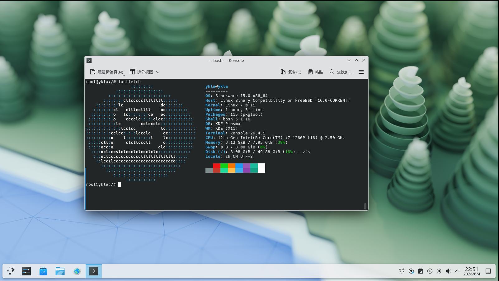

# 18.5 Slackware Linux Compatibility Layer

Slackware Linux does not provide a pre-built base system image; you need to generate one yourself via a script. The community maintains a script for building a Slackware Linux base system, located at <https://github.com/ykla/slackware-WSL/releases>.



The compatibility layer script content is as follows:

```sh
#!/bin/sh

ROOT_DIR=/compat/slackware
DIST_FULLNAME="Slackware Linux"
LinuxKernel=7.0.11
SUBDIR=""
BASE_URL="https://github.com/ykla/slackware-WSL/releases/download/auto-28"
UPDATE_CMD="DIALOG=off BATCH=on slackpkg update"
UPDATE=1
INSTALL=1

# ==========================================
# Version selection menu
# ==========================================
echo "Please select the ${DIST_FULLNAME} version to install:"
echo "1) Slackware64 15.0"
echo "2) Slackware64 Current"
echo "3) Slackware AArch64 Current"
echo -n "Enter your choice [1-3] (default 1): "
read VERSION_CHOICE

case $VERSION_CHOICE in
    2)
        VER="current"
        FILE="slackware64-current.tar.gz"
        ;;
    3)
        VER="current"
        FILE="slackwareaarch64-current.tar.gz"
        ;;
    1|*)
        VER="15.0"
        FILE="slackware64-15.0.tar.gz"
        ;;
esac

URL="${BASE_URL}/${FILE}"

echo "Starting ${DIST_FULLNAME} ($FILE) installation"
sleep 0.5

# ==========================================
# Check Linux module
# ==========================================
echo "Checking required modules"
if [ "$(sysrc -n linux_enable)" != "YES" ]; then
    echo "Linux service is not enabled. Enable it now? (Y|n)"
    read ANSWER
    case $ANSWER in
        [Nn][Oo]|[Nn])
            echo "Warning: You must start the Linux service with \"service linux start\" after each FreeBSD reboot."
            echo "Are you sure you want to continue without enabling the Linux service? (y|N)"
            read ANSWER
            case $ANSWER in
                [Yy][Ee][Ss]|[Yy])
                    echo "WARNING: Linux module not enabled"
                    ;;
                [Nn][Oo]|[Nn]|"")
                    echo "Enabling Linux module"
                    service linux enable
                    ;;
                *)
                    echo "Aborting."
                    exit 4
                    ;;
            esac
            ;;
        [Yy][Ee][Ss]|[Yy]|"")
            echo "Enabling Linux module"
            service linux enable
            ;;
        *)
            echo "Aborting."
            exit 4
            ;;
    esac
fi

echo "Starting Linux service"
service linux start

# ==========================================
# Check dbus
# ==========================================
if ! which -s dbus-daemon; then
    echo "dbus-daemon not found. Install D-Bus now? (Y|n)"
    read ANSWER
    case $ANSWER in
        [Nn][Oo]|[Nn])
            echo "Aborting. D-Bus not installed"
            exit 2
            ;;
        [Yy][Ee][Ss]|[Yy]|"")
            echo "Installing D-Bus"
            pkg install -y dbus
            ;;
        *)
            echo "Aborting."
            exit 4
            ;;
    esac
fi

if [ "$(sysrc -n dbus_enable)" != "YES" ]; then
    echo "D-Bus is not enabled. Enable it now? (Y|n)"
    read ANSWER
    case $ANSWER in
        [Nn][Oo]|[Nn])
            echo "WARNING: You must start D-Bus with \"service dbus start\" after each FreeBSD reboot."
            echo "Are you sure you want to continue without enabling D-Bus? (y|N)"
            read ANSWER
            case $ANSWER in
                [Yy][Ee][Ss]|[Yy])
                    echo "Warning: D-Bus not enabled"
                    ;;
                [Nn][Oo]|[Nn]|"")
                    echo "Enabling D-Bus service"
                    service dbus enable
                    ;;
                *)
                    echo "Aborting."
                    exit 4
                    ;;
            esac
            ;;
        [Yy][Ee][Ss]|[Yy]|"")
            echo "Enabling D-Bus service"
            service dbus enable
            ;;
        *)
            echo "Aborting."
            exit 4
            ;;
    esac
fi

if [ -z "$(ps aux | grep dbus | grep -v grep)" ]; then
    echo "Starting D-Bus service"
    service dbus start
fi

echo "compat.linux.osrelease=${LinuxKernel}"
sysctl compat.linux.osrelease=${LinuxKernel}

if ! grep -q '^compat.linux.osrelease=' /etc/sysctl.conf 2>/dev/null; then
    echo "compat.linux.osrelease=${LinuxKernel}" >> /etc/sysctl.conf
else
    sed -i '' "s|^compat.linux.osrelease=.*|compat.linux.osrelease=${LinuxKernel}|" /etc/sysctl.conf
fi

# ==========================================
# Download and extract the base system
# ==========================================
echo "${DIST_FULLNAME} will be installed in $ROOT_DIR"
echo "Downloading basic system from ${URL}"
fetch "${URL}"

echo "Extracting basic system"
sleep 0.5
mkdir -p "${ROOT_DIR}"
tar xvpf "${FILE}" ${SUBDIR:-} -C "${ROOT_DIR}" --numeric-owner 2>&1 | grep -v "Error exit delayed from previous errors"

# emulation path
sysctl compat.linux.emul_path="${ROOT_DIR}"

if ! grep -q '^compat.linux.emul_path=' /etc/sysctl.conf 2>/dev/null; then
    echo "compat.linux.emul_path=${ROOT_DIR}" >> /etc/sysctl.conf
else
    sed -i '' "s|^compat.linux.emul_path=.*|compat.linux.emul_path=${ROOT_DIR}|" /etc/sysctl.conf
fi

echo "compat.linux.emul_path=$(sysctl -n compat.linux.emul_path)"

service linux restart

# ==========================================
# Configure DNS
# ==========================================
echo "Should ${DIST_FULLNAME} use Alibaba DNS or local resolv.conf? ((A)li | (L)ocal | (C)ancel)"
read ANSWER
case $ANSWER in
    [Aa][Ll][Ii]|[Aa]|"")
        echo "Setting Alibaba DNS"
        grep -q "nameserver 223.5.5.5" "${ROOT_DIR}/etc/resolv.conf" 2>/dev/null || \
            echo "nameserver 223.5.5.5" >> "${ROOT_DIR}/etc/resolv.conf"

        grep -q "nameserver 223.6.6.6" "${ROOT_DIR}/etc/resolv.conf" 2>/dev/null || \
            echo "nameserver 223.6.6.6" >> "${ROOT_DIR}/etc/resolv.conf"
        ;;
    [Ll][Oo][Cc][Aa][Ll]|[Ll])
        echo "Using local resolv.conf"
        cp /etc/resolv.conf "${ROOT_DIR}/etc/resolv.conf"
        ;;
    *)
        echo "Canceled."
        echo "You must manually edit $ROOT_DIR/etc/resolv.conf!"
        ;;
esac

# ==========================================
# Update software sources
# ==========================================
if ping -c 1 -W 3000 223.5.5.5 > /dev/null 2>&1; then
    echo "Network reachable, starting operations..."
    [ $UPDATE = 1 ] && { echo "Updating package list"; chroot "${ROOT_DIR}" /bin/bash -c "${UPDATE_CMD}"; }
else
    echo "Network unreachable, skipping update and installation."
fi

echo "Setting up Bash configuration"
cp "${ROOT_DIR}/etc/profile" "${ROOT_DIR}/root/.bashrc"

# ==========================================
# Cleanup
# ==========================================
echo "Cleaning up"
rm "${FILE}"
service linux restart
echo "${DIST_FULLNAME} Base System is ready."
echo "chroot ${ROOT_DIR} /bin/bash"
```

## Troubleshooting

### Missing Dependencies

Most package managers in Slackware Linux do not resolve dependency issues, so installing any software will face a large number of missing dependencies.

If you need any dependency, you can search at <https://packages.slackware.com/>: enter a keyword such as "libgc.so.1", select the correct version for Release, set Mode to "content", and you will get the search result: "gc-8.0.6-x86_64-1.txz"; typically, you can install it using the command `slackpkg install gc`.
