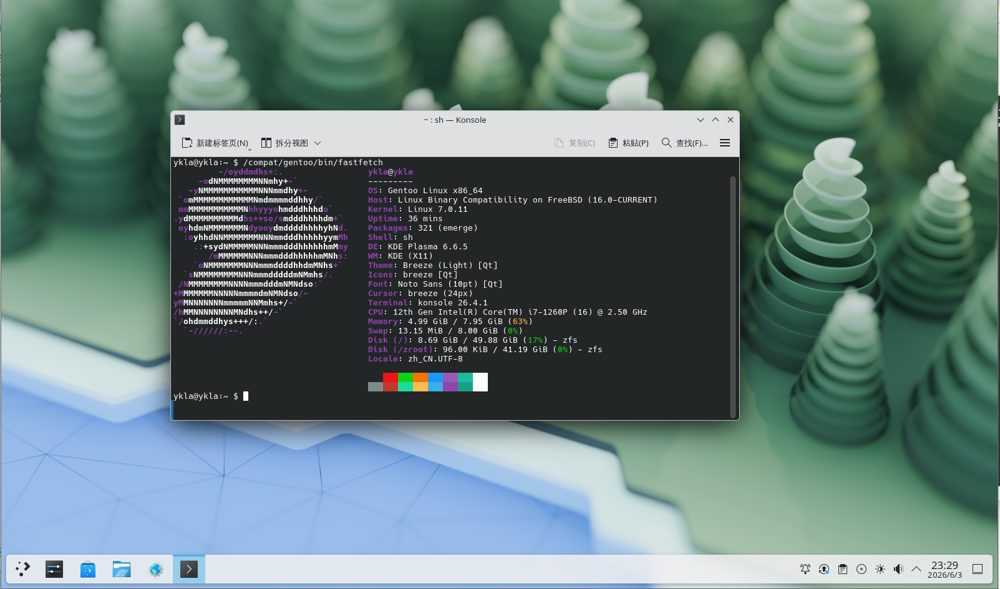

# 18.6 Gentoo Linux Compatibility Layer

The Gentoo compatibility layer builds the base system through a stage3 tarball; the Linux kernel module must be enabled before building. This section provides a complete script from daemon configuration to base system completion.

## Building the Base System

Before building the Gentoo Linux compatibility layer, you need to enable the core daemons.

### Daemons

```sh
# service linux enable       # Set the Linux kernel module to start on boot
# service linux start        # Start the Linux kernel module
# service dbus enable        # Set the dbus service to start on boot (usually already configured by the desktop environment)
# service dbus start         # Start the dbus service (usually already configured by the desktop environment)
```

### Obtaining the Base System Image

Download the Gentoo Stage3 image:

```sh
# fetch https://mirrors.ustc.edu.cn/gentoo/releases/amd64/autobuilds/20230101T164658Z/stage3-amd64-llvm-openrc-20230101T164658Z.tar.xz
```

The above link will change with version updates; please obtain the latest link yourself.

Create the Gentoo compatibility layer directory:

```sh
# mkdir -p /compat/gentoo
```

Extract the Gentoo image to the compatibility layer directory:

```sh
# tar xpvf stage3-amd64-llvm-openrc-20230101T164658Z.tar.xz -C /compat/gentoo --numeric-owner
```

### Mounting File Systems

After building, you must mount the necessary file systems. Point the Linux compatibility layer default path to **/compat/gentoo** to enable automatic mounting of the relevant file systems.

Take effect immediately:

```sh
# sysctl compat.linux.emul_path=/compat/gentoo
```

Permanent setting:

```sh
# echo "compat.linux.emul_path=/compat/gentoo" >> /etc/sysctl.conf
```

Restart the Linux compatibility layer service:

```sh
service linux restart
```

Project structure:

```sh
/compat/gentoo/
├── dev/                  # Device file system
│   ├── fd/               # File descriptor file system
│   └── shm/              # Memory file system
├── etc/
│   ├── portage/
│   │   ├── make.conf     # Portage configuration file
│   │   └── repos.conf/
│   │       └── gentoo.conf # Gentoo repository configuration
│   └── resolv.conf       # DNS configuration
├── home/                 # User home directory (optional)
├── proc/                 # Linux process file system
├── sys/                  # Linux kernel object file system
├── tmp/                  # Temporary directory
└── usr/
    └── share/
        └── portage/
            └── config/
                └── repos.conf # Default repository configuration
```

### Editing Gentoo Configuration Files

Edit the **/compat/gentoo/etc/portage/make.conf** file and add:

```sh
MAKEOPTS="-j2"                                                                 # Set the number of parallel jobs during compilation to 2
GENTOO_MIRRORS="https://mirrors.ustc.edu.cn/gentoo"                            # Specify the Gentoo mirror source
FEATURES="-ipc-sandbox -mount-sandbox -network-sandbox -pid-sandbox -xattr -sandbox -usersandbox"  # Disable various sandbox features and extended attribute preservation
```

Basic configuration:

```sh
# mkdir -p /compat/gentoo/etc/portage/repos.conf/                                        # Create the Portage repository configuration directory
# cp /compat/gentoo/usr/share/portage/config/repos.conf /compat/gentoo/etc/portage/repos.conf/gentoo.conf  # Copy the default repository configuration
# cp /etc/resolv.conf /compat/gentoo/etc/                                                   # Copy DNS configuration to the compatibility layer
```

### Modifying Gentoo Software Sources

On FreeBSD, edit the **/compat/gentoo/etc/portage/repos.conf/gentoo.conf** file and modify the Gentoo repository configuration: change `sync-uri = rsync://rsync.gentoo.org/gentoo-portage` to `sync-uri = rsync://mirrors.tuna.tsinghua.edu.cn/gentoo-portage`.

Enter the Gentoo compatibility layer environment using Bash as the shell:

```sh
# chroot /compat/gentoo /bin/bash # At this point, you are in the Gentoo compatibility layer
```

Use Gentoo's webrsync tool to synchronize the Portage tree:

```sh
# emerge-webrsync	# Fetch the Gentoo ebuild database snapshot.
```

## Testing

Use Gentoo Portage to install the fastfetch tool and display detailed output:

```sh
# emerge -ask fastfetch
```

You can run `fastfetch` directly from the FreeBSD command line:

```sh
$ /compat/gentoo/bin/fastfetch
```

The output is as follows:



## Shell Script

The script content:

```sh
#!/bin/sh

LinuxKernel=7.0.11
rootdir=/compat/gentoo   # Gentoo root directory path
fetch https://mirror.nju.edu.cn/gentoo/releases/amd64/autobuilds/latest-stage3-amd64-llvm-openrc.txt  # Download the latest Stage3 build list
gentoodownload=$(grep 'stage3-amd64-llvm-openrc' latest-stage3-amd64-llvm-openrc.txt  | awk '{print $1}')   # Extract the latest Stage3 filename
rm latest-stage3-amd64-llvm-openrc.txt  # Delete temporary file

url="https://mirror.nju.edu.cn/gentoo/releases/amd64/autobuilds/"

echo "Starting Gentoo Linux installation..."   # Prompt that installation is starting
echo "Checking required modules..."   # Prompt that module checking is in progress

# Check if the Linux module is enabled
if [ "$(sysrc -n linux_enable)" != "YES" ]; then
        echo "The Linux module is not enabled. Enable it now? (Y|n)"   # Prompt user whether to continue
        read answer   # Read user input
        case $answer in
                [Nn][Oo]|[Nn])
                        echo "Linux module not enabled"
                        exit 1
                        ;;
                [Yy][Ee][Ss]|[Yy]|"")
                        service linux enable
                        ;;
        esac
fi
echo "Starting Linux service"   # Prompt that the Linux service is starting
service linux start   # Start the Linux module

# Check if dbus is installed
if ! /usr/bin/which -s dbus-daemon;then
        echo "dbus-daemon not found. Install D-Bus? [Y|n]"   # Prompt to install dbus
        read  answer   # Read user input
        case $answer in
            [Nn][Oo]|[Nn])
                echo "D-Bus not installed"   # Prompt not installed
                exit 2   # Exit script
                ;;
            [Yy][Ee][Ss]|[Yy]|"")
                pkg install -y dbus   # Install dbus
                ;;
        esac
    fi

# Check if dbus is enabled
if [ "$(sysrc -n dbus_enable)" != "YES" ]; then
        echo "D-Bus is not enabled. Enable it now? (Y|n)"   # Prompt whether to enable
        read answer
        case $answer in
            [Nn][Oo]|[Nn])
                        echo "D-Bus not enabled"   # Prompt not running
                        exit 2
                        ;;
            [Yy][Ee][Ss]|[Yy]|"")
                        service dbus enable   # Enable dbus service
                        ;;
        esac
fi
echo "Starting D-Bus service"   # Prompt that the D-Bus service is starting
service dbus start   # Start the dbus service

echo "Now bootstrapping Gentoo"   # Prompt that Gentoo is being initialized

fetch "${url}/$gentoodownload"   # Download the latest Stage3 file
mkdir -p "${rootdir}"   # Create the Gentoo root directory
tar xpvf stage3-amd64-llvm-openrc*.tar.xz -C "${rootdir}" --numeric-owner  2>&1 | grep -v "Error exit delayed from previous errors" # Extract Stage3
rm stage3-amd64-llvm-openrc*.tar.xz   # Delete the archive

# Set the compatibility layer path
sysctl compat.linux.emul_path="${rootdir}"

if ! grep -q '^compat.linux.emul_path=' /etc/sysctl.conf 2>/dev/null; then
    echo "compat.linux.emul_path=${rootdir}" >> /etc/sysctl.conf
else
    sed -i '' "s|^compat.linux.emul_path=.*|compat.linux.emul_path=${rootdir}|" /etc/sysctl.conf
fi

echo "compat.linux.emul_path=$(sysctl -n compat.linux.emul_path)"

echo "compat.linux.osrelease=${LinuxKernel}"
sysctl compat.linux.osrelease=${LinuxKernel}

if ! grep -q '^compat.linux.osrelease=' /etc/sysctl.conf 2>/dev/null; then
    echo "compat.linux.osrelease=${LinuxKernel}" >> /etc/sysctl.conf
else
    sed -i '' "s|^compat.linux.osrelease=.*|compat.linux.osrelease=${LinuxKernel}|" /etc/sysctl.conf
fi

service linux restart

echo "Setting resolv.conf to Alibaba DNS"   # Prompt that DNS is about to be configured
echo "Continue? [Y|n]"
read answer
case $answer in
	[Nn][Oo]|[Nn])
		echo "Please configure Gentoo manually. Exiting."   # User chose not to auto-configure
		exit 0
		;;
	[Yy][Ee][Ss]|[Yy]|"")
		grep -q "nameserver 223.5.5.5" "${rootdir}/etc/resolv.conf" 2>/dev/null || \
		    echo "nameserver 223.5.5.5" >> "${rootdir}/etc/resolv.conf"
		grep -q "nameserver 223.6.6.6" "${rootdir}/etc/resolv.conf" 2>/dev/null || \
		    echo "nameserver 223.6.6.6" >> "${rootdir}/etc/resolv.conf"
esac
echo "Writing MAKEOPTS and FEATURES to /compat/gentoo/etc/portage/make.conf -- using NJU mirrors for GENTOO_MIRRORS"
echo "MAKEOPTS='-j2'" >> "${rootdir}/etc/portage/make.conf"
echo "GENTOO_MIRRORS='https://mirror.nju.edu.cn/gentoo'" >> "${rootdir}/etc/portage/make.conf"
echo "FEATURES='-ipc-sandbox -mount-sandbox -network-sandbox -pid-sandbox -xattr -sandbox -usersandbox'" >> "${rootdir}/etc/portage/make.conf"

echo "Now configuring software sources -- Using TUNA mirror for emerge-webrsync"
mkdir -p "${rootdir}/etc/portage/repos.conf/"
cp "${rootdir}/usr/share/portage/config/repos.conf" "${rootdir}/etc/portage/repos.conf/gentoo.conf"
sed -i "" 's/rsync.gentoo.org/mirrors.tuna.tsinghua.edu.cn/' "${rootdir}/etc/portage/repos.conf/gentoo.conf"
echo "Running emerge-webrsync"
chroot "${rootdir}" /bin/bash -c "emerge-webrsync"

echo "Base system ready."
echo "To enter: chroot ${rootdir} /bin/bash"
```
