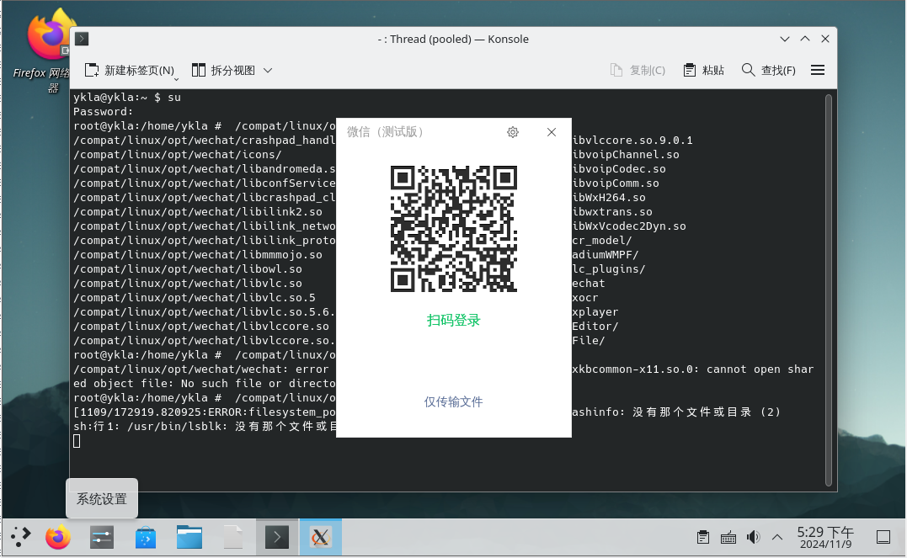
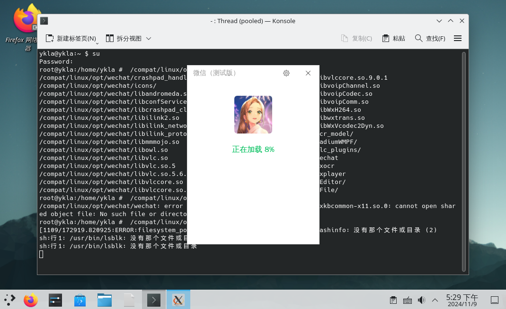
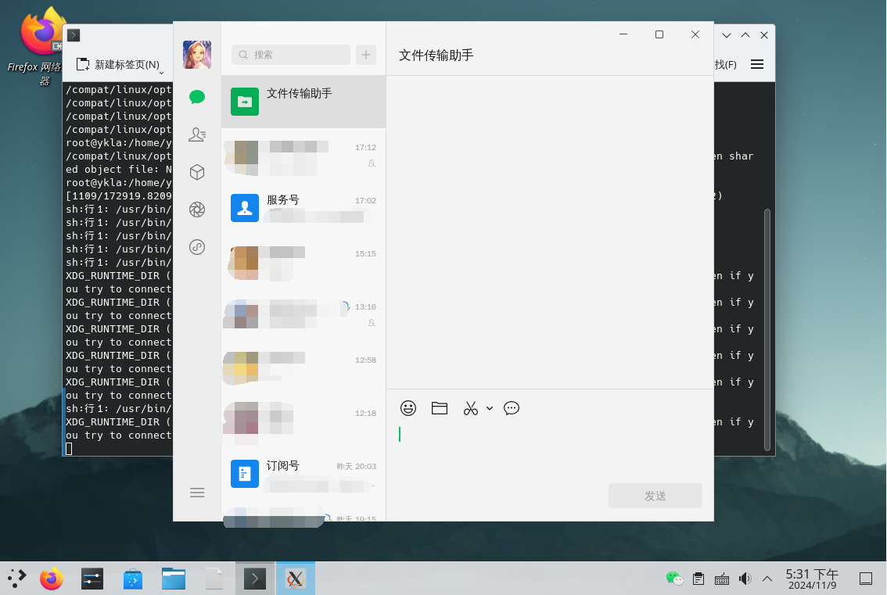
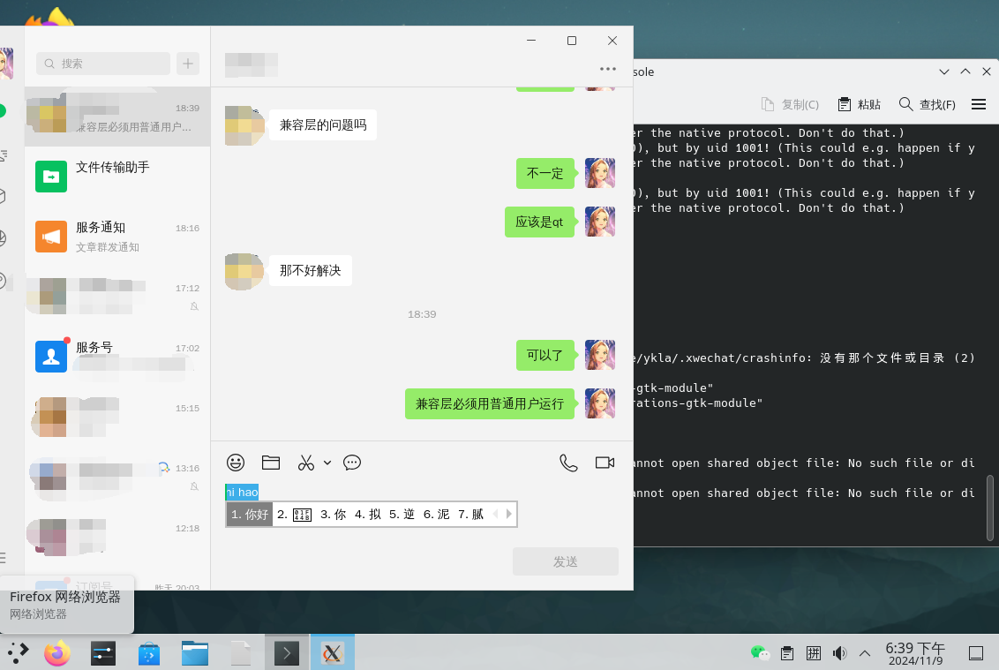

# 18.7 WeChat (Linux Version)

WeChat does not yet have a native FreeBSD version and needs to be installed and run through the Linux compatibility layer. This section is based on the Rocky Linux compatibility layer, installed and used via the RPM package manager.

## Based on Rocky Linux Compatibility Layer (FreeBSD Port)

Please refer to other chapters of this book to install the Rocky Linux compatibility layer (FreeBSD Port) first.

### Installing the RPM Tool

- Install using pkg:

```sh
# pkg install rpm4
```

- Alternatively, install using Ports:

```sh
# cd /usr/ports/archivers/rpm4/
# make install clean
```

### Downloading WeChat

Official download address: [WeChat Linux Beta](https://linux.weixin.qq.com/).

```sh
# fetch https://dldir1v6.qq.com/weixin/Universal/Linux/WeChatLinux_x86_64.rpm
```

This link is the address at the time of writing this section; please obtain the latest WeChat download link yourself.

### Installing WeChat

Switch to the compatibility layer path:

```sh
root@ykla:/ # cd /compat/linux/
```

Install:

```sh
root@ykla:/compat/linux # rpm2cpio < WeChatLinux_x86_64.rpm  | cpio -id
1393412 blocks
```

Please replace WeChatLinux_x86_64.rpm with the actual local file path.

### Resolving Dependency Issues

View dependencies:

```bash
# /compat/linux/usr/bin/bash	# Switch to the compatibility layer's shell
bash-5.1# ldd /opt/wechat/wechat	# Use ldd to check whether WeChat's dependency libraries are complete
	libatomic.so.1 => not found
	libbz2.so.1.0 => not found
	libxkbcommon-x11.so.0 => not found
	libxcb-icccm.so.4 => not found
	libxcb-image.so.0 => not found
	libxcb-render-util.so.0 => not found
	libxcb-keysyms.so.1 => not found
		……others omitted……
```

- Install the missing dependency library `libatomic.so.1`.

Install using pkg:

```sh
# pkg install linux-rl9-devtools
```

Alternatively, install using Ports:

```sh
# cd /usr/ports/devel/linux-rl9-devtools/
# make install clean
```

- Create a symbolic link for the missing dependency library `libbz2.so.1.0`:

```sh
# ln -s /compat/linux/lib64/libbz2.so.1.0.8 /compat/linux/lib64/libbz2.so.1.0 # Create the required symbolic link
```

> **Tip**
>
> The library `libbz2.so.1` already exists but has a different filename. If you cannot find it, you can type `ls /compat/linux/lib64/libbz2` and then press the **Tab** key for auto-completion to view the actual filename.

- Install the dependency library `libxkbcommon-x11.so.0`:

```sh
# fetch https://dl.rockylinux.org/pub/rocky/9/AppStream/x86_64/os/Packages/l/libxkbcommon-x11-1.0.3-4.el9.x86_64.rpm	# Download the required dependency library
# cd /compat/linux/
root@ykla:/compat/linux # rpm2cpio < libxkbcommon-x11-1.0.3-4.el9.x86_64.rpm  | cpio -id 	# Extract and install the dependency library
82 blocks
```

> **Tip**
>
> If you cannot find a certain Rocky Linux library, you can search at <https://rockylinux.pkgs.org/>. Some have already been packaged in FreeBSD Ports; you can search using `pkg-provides` as described in the pkg chapter.

- Resolve the dependency library `libxcb-icccm.so.4`:

```sh
# fetch https://dl.rockylinux.org/pub/rocky/9/AppStream/x86_64/os/Packages/x/xcb-util-wm-0.4.1-22.el9.x86_64.rpm	# Download the required dependency library
# cd /compat/linux/
root@ykla:/compat/linux #  rpm2cpio < xcb-util-wm-0.4.1-22.el9.x86_64.rpm  | cpio -id 	# Extract and install the dependency library
175 blocks
```

- Resolve other xcb library-related dependency issues.

Install using pkg:

```sh
# pkg install linux-rl9-xcb-util
```

Alternatively, install using Ports:

```sh
# cd /usr/ports/x11/linux-rl9-xcb-util/
# make install clean
```

### Launching WeChat

Run WeChat from the command line.

```sh
$ /compat/linux/opt/wechat/wechat
```

### Creating a Software Icon

Create a new text file `wechat.desktop` under the path **~/.local/share/applications**, and write:

```ini
[Desktop Entry]
Name=WeChat
Comment=WeChat
Exec=/compat/linux/opt/wechat/wechat
Terminal=false
Type=Application
Encoding=UTF-8
Icon=/compat/linux/opt/wechat/icons/wechat.png
Path=
StartupNotify=false
Categories=Network
```

Set the `wechat.desktop` file permissions to `755` to make it executable:

```sh
# chmod 755 ~/.local/share/applications/wechat.desktop
```

Icon directory structure:

```sh
~/
└── .local/
    └── share/
        └── applications/
            └── wechat.desktop # WeChat desktop icon file
```

After restarting the system, you can find WeChat in the system menu.

Functioning normally:







### Chinese Input Method Issues

If you run WeChat in the Rocky Linux compatibility layer with root privileges, the Chinese input method will not work (for the same reason as QQ: the input method framework depends on the user session's D-Bus and environment variables). Please run it with regular user privileges.


