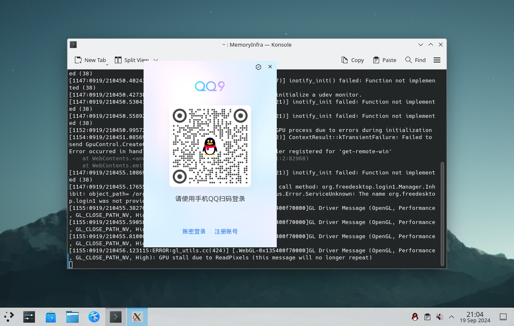
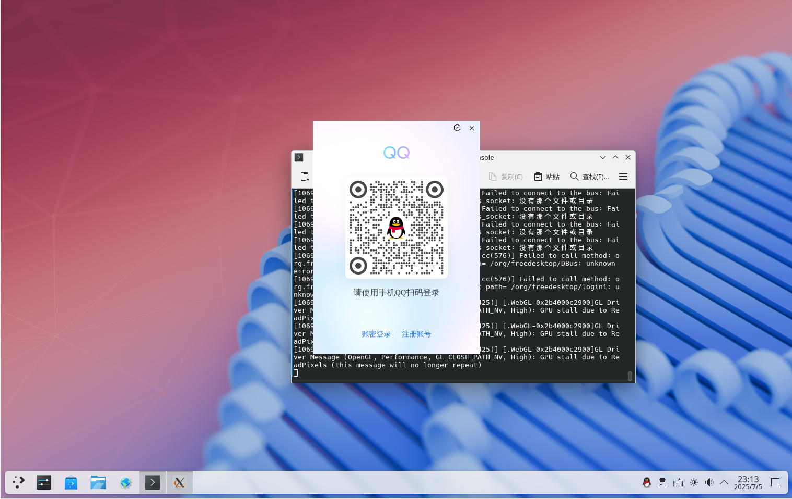

# 18.8 QQ (Linux Version)

QQ does not yet have a native FreeBSD version and must be installed and run through the Linux compatibility layer. This section provides installation steps for both the Rocky Linux (FreeBSD Port) and Ubuntu (debootstrap) compatibility layer approaches.

## Based on Rocky Linux (FreeBSD Port)

> **Note**
>
> Please refer to other chapters of this book to install the Rocky Linux compatibility layer (FreeBSD Port) first.

### Installing the RPM Tool

Refer to other relevant chapters of this book to install the RPM tool (`pkg install rpm4`).

### Downloading and Installing QQ

- Download QQ, official link: [QQ Linux Version - Be Yourself with Ease](https://im.qq.com/linuxqq/index.shtml).

```sh
# fetch https://dldir1.qq.com/qqfile/qq/QQNT/Linux/QQ_3.2.17_250521_x86_64_01.rpm # Link at the time of writing; please obtain the latest version for actual use
```

- Install QQ:

```sh
root@ykla:/ # cd /compat/linux/	# Switch to the compatibility layer path
root@ykla:/compat/linux # rpm2cpio < /home/ykla/QQ_3.2.17_250521_x86_64_01.rpm | cpio -id # Install QQ; please replace the file path with the actual local path
./usr/share/icons/hicolor/512x512/apps/qq.png: Cannot extract through symlink usr/share/icons/hicolor/512x512/apps/qq.png
1055863 blocks
```

> **Tip**
>
> The username `ykla`, hostname `ykla`, and path `/home/ykla` shown in the examples in this section are for illustration only; please replace them with actual values for your environment.

Related file structure:

```sh
/compat/linux/
├── opt/
│   └── QQ/
│       └── qq # QQ executable file
└── usr/
    └── share/
        └── icons/
            └── hicolor/
                └── 512x512/
                    └── apps/
                        └── qq.png # QQ icon
```

### Dependency Libraries

View dependencies:

```sh
# /compat/linux/usr/bin/bash # Switch to the compatibility layer's Shell
bash-5.1# ldd /opt/QQ/qq # View the dynamic library dependencies of the QQ executable
	linux-vdso.so.1 (0x00007fffffffe000)
	libffmpeg.so => /opt/QQ/libffmpeg.so (0x000000080c000000)
	.......partial output omitted......
```

You can see that the `ldd` output is normal, and there are no dependency issues to resolve.

### Resolving the Issue of Fcitx Chinese Input Method Not Working in QQ

Install `ibus-gtk3` and `ibus-libs` in the compatibility layer, download the installation packages and execute:

```sh
# fetch https://dl.rockylinux.org/pub/rocky/9/AppStream/x86_64/os/Packages/i/ibus-gtk3-1.5.25-6.el9.x86_64.rpm   # Download the ibus-gtk3 RPM package
# fetch https://dl.rockylinux.org/pub/rocky/9/AppStream/x86_64/os/Packages/i/ibus-libs-1.5.25-6.el9.x86_64.rpm   # Download the ibus-libs RPM package
# cd /compat/linux   # Switch to the Linux compatibility directory
# rpm2cpio < /home/ykla/ibus-gtk3-1.5.25-6.el9.x86_64.rpm | cpio -id   # Extract the ibus-gtk3 RPM package
# rpm2cpio < /home/ykla/ibus-libs-1.5.25-6.el9.x86_64.rpm | cpio -id   # Extract the ibus-libs RPM package
```

- Refresh the input method module cache:

```sh
# /compat/linux/usr/bin/bash # Switch to Rocky Linux's bash
bash-5.1# gtk-query-immodules-3.0-64 --update-cache   # Refresh the cache
```

### Launching QQ

Launch QQ in the Linux compatibility environment, disabling the sandbox and enabling in-process GPU:

```sh
$ /compat/linux/opt/QQ/qq --no-sandbox --in-process-gpu
```

> **Note**
>
> You must run QQ with regular user privileges here; otherwise, the input method will not work.

> **Tip**
>
> The `--no-sandbox` option is used to disable the sandbox; otherwise, QQ cannot run.
>
> The `--in-process-gpu` option is also necessary; otherwise, QQ cannot be reopened after exiting, and the system must be rebooted before it can be used again.



Fcitx5 input method working normally:


## Based on Arch Linux Compatibility Layer

Please refer to the "Arch Linux Compatibility Layer" section of this book.

```sh
# chroot /compat/arch/ /bin/bash # Enter the Arch compatibility layer
# passwd # Set a password for Arch's root
# passwd test # Set a password for the test user (created by the script above), otherwise AUR may not work properly

```

Please open a new terminal and enter `reboot` to restart FreeBSD; otherwise, the newly set passwords will not take effect.

```sh
# chroot /compat/arch/ /bin/bash # Enter the Arch compatibility layer
# su test # Switch to a regular user to use AUR; at this point, you are in the Arch compatibility layer
$ yay -S linuxqq # Current user is test, in the Arch compatibility layer
$ exit # Switch back to root
# # Switched back to root, in the Arch compatibility layer
```

Launch the QQ client, disabling the sandbox and enabling in-process GPU:

```sh
# /opt/QQ/qq --no-sandbox --in-process-gpu # At this point, you are in the Arch compatibility layer!
```

> **Note**
>
> If you get an error about not finding X11 when running QQ as a regular user, please check whether the `DISPLAY` environment variable is set correctly, and ensure that the X11 socket (**/tmp/.X11-unix/**) is accessible to regular users. You can try running the `xhost +local:` command to relax permissions.




## Based on Ubuntu Compatibility Layer

Please build the Ubuntu compatibility layer environment first.

```sh
# chroot /compat/ubuntu/ /bin/bash # Enter the Ubuntu compatibility layer
# wget https://dldir1v6.qq.com/qqfile/qq/QQNT/Linux/QQ_3.2.18_250626_amd64_01.deb # Download QQ; at this point, you are in the Ubuntu compatibility layer
```

Install QQ in the Ubuntu compatibility layer:

```bash
# apt install ./QQ*.deb
```

Install dependency files:

```sh
# apt install libgbm-dev libasound2-dev # Install dependencies in the Ubuntu compatibility layer
# ldconfig # Refresh dynamic libraries; at this point, you are in the Ubuntu compatibility layer
```

Launch QQ:

```sh
# /bin/qq --no-sandbox --in-process-gpu # At this point, you are in the Ubuntu compatibility layer
```

> **Note**
>
> You must run QQ as the root user here, and ensure that the Chinese character set has been set according to the Ubuntu compatibility layer build tutorial (when using the script, this process is completed automatically and does not require manual operation).


## Troubleshooting

### Network Errors

If the system has multiple network cards, such as a wired network card and a wireless network card, and a network error prompt appears after opening QQ, you must assign an IP address to the unused network card.

Refer to other relevant chapters.

### Chinese Input Method

> **Note**
>
> Installing an input method inside the compatibility layer is ineffective.

If you build the compatibility layer yourself, you must set the following Chinese environment variables inside the compatibility layer before launching QQ (if you follow this book's tutorial exactly, this step is not required as these variables have already been specified during the process):

```sh
# export LANG=zh_CN.UTF-8   # Set the system language to Chinese
# export LC_ALL=zh_CN.UTF-8 # Set all locale environment variables to Chinese
```

After setting, you can use the `locale` command to check. For software in the compatibility layer, the Fcitx input method only works when both of the above variables are set to the Chinese environment.

If the setting fails, please restart the FreeBSD system.

### QQ Crashing

Perform the following operations in the compatibility layer:

```sh
$ rm ~/.config/QQ/crash_files/*                 # Delete all files in the QQ crash files directory
$ chmod a-wx ~/.config/QQ/crash_files/          # Set the QQ crash files directory to non-writable and non-executable, preventing the generation of more crash logs that cause crashes
```

Related file structure:

```sh
~/
└── .config/
    └── QQ/
        └── crash_files/ # QQ crash files directory
```

#### References

- Weiyang. A Note on the New QQ Bug & Fix on Linux (Crash-related)[EB/OL]. [2026-03-25]. <https://zhuanlan.zhihu.com/p/645895811>. This article provides a solution to the crash issue of the Linux version of QQ.
- X.Org Foundation. xhost(1)[EB/OL]. [2026-04-17]. <https://man.openbsd.org/xhost.1>. Explains the X11 access control mechanism and the usage of the `xhost` command.
