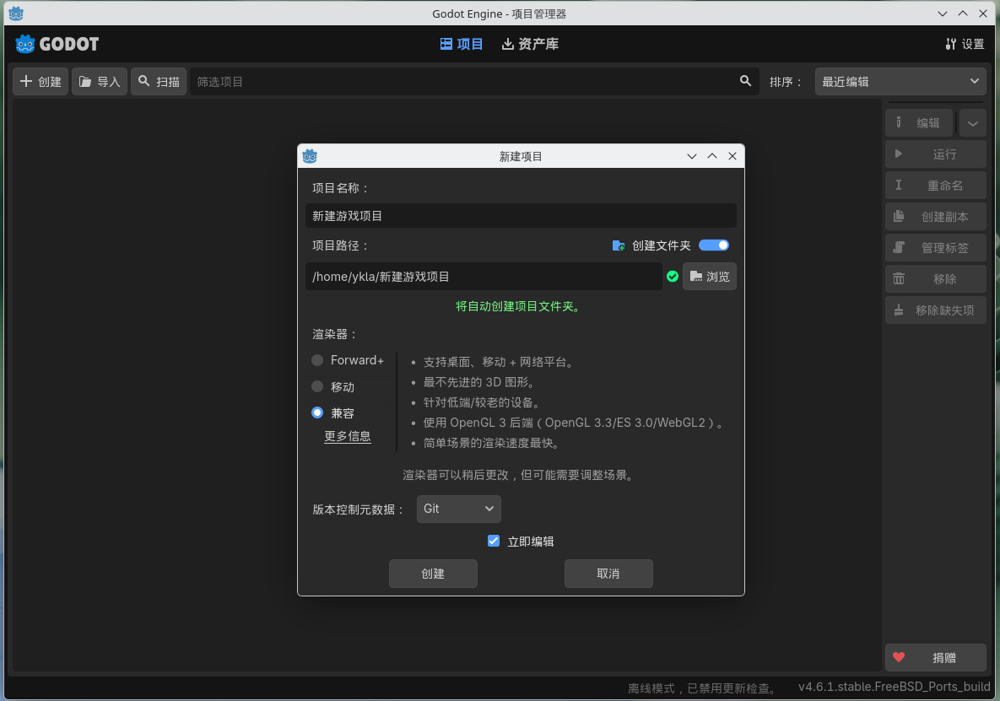
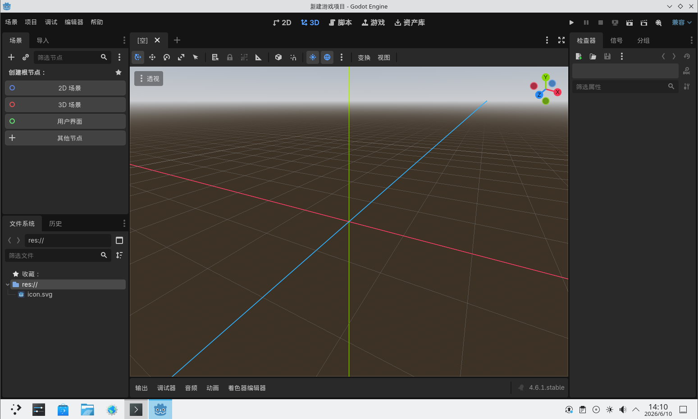
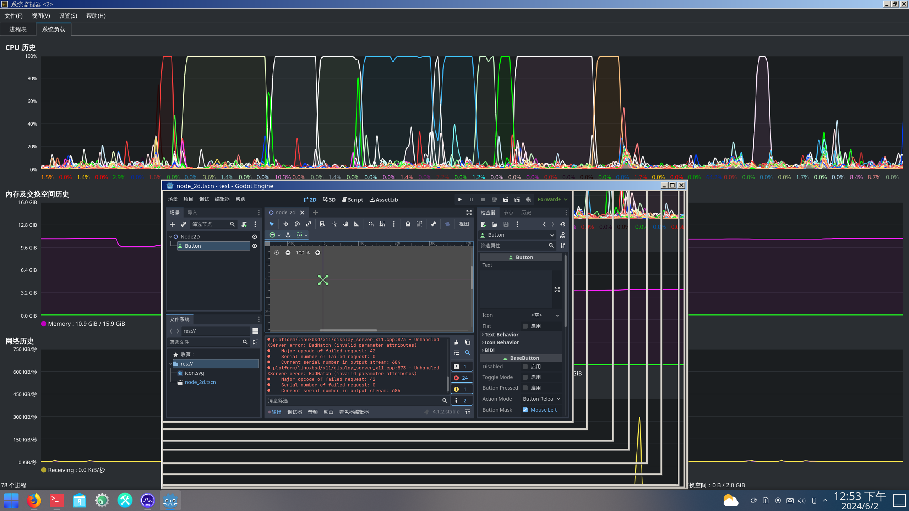
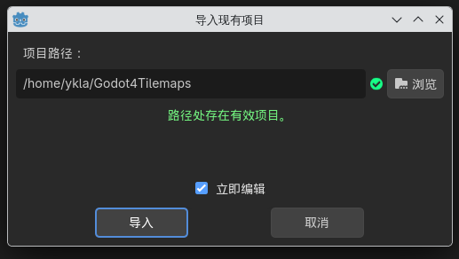
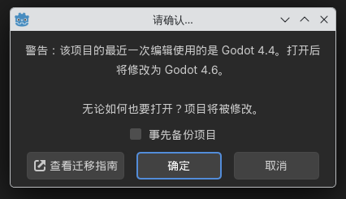

# 19.1 Godot Open Source Game Engine

## Overview

Godot is an open-source 2D/3D game engine. FreeBSD provides two packages through Ports: godot-tools (editor) and godot (runtime).

## Installing Godot

Install using pkg:

```sh
# pkg install godot godot-tools
```

Or install using Ports:

```sh
# cd /usr/ports/devel/godot-tools/ && make install clean
# cd /usr/ports/devel/godot/ && make install clean
```

## Using Godot

This section introduces the basic usage and performance optimization techniques for the Godot engine.

After installation, create a new project and enter the editor — the interface response is sluggish and CPU usage is high. Under FreeBSD's default configuration, Godot relies on CPU software rasterization rendering (via llvmpipe), which incurs significant performance overhead.

At this point, you need to add startup parameters to `godot-tools` to enable hardware-accelerated rendering. The OpenGL compatibility mode can enable GPU hardware acceleration. Launch Godot Tools using the OpenGL 3 driver:

```sh
$ godot-tools --rendering-driver opengl3
```

After opening the project and entering the Godot editor, scaling the Godot window shows no significant change in CPU usage, indicating that rendering work has been offloaded to the GPU.

Additionally, pay attention to how the project is created. If you encounter the above stuttering issue and have used the OpenGL parameter, select "Compatibility" when creating the project, rather than Forward+ or "Mobile". Forward+ and "Mobile" modes use RenderingDevice (a more modern rendering abstraction layer), whose features and compatibility requirements can be viewed in the description of the creation window. Only the "Compatibility" mode uses the OpenGL 3 backend.



The default interface for creating a Godot project is as follows:





## Project Demo

Godot4Tilemaps is a farming simulation game with source code included (non-standard open source). This subsection uses the Godot4Tilemaps game as a demo:

```sh
$ git clone https://github.com/anonomity/Godot4Tilemaps.git
```

Open the Godot main interface and click "Import Existing Project".


Navigate to the project folder cloned by git and select it.


Godot prompts "Valid project found at path", click "Import".



Godot prompts that the project was last edited with an older version of Godot Tools, select "OK".



Click the triangle symbol in the upper right corner, and select **scenes/proc_gen_world.tscn** as the main scene. The game demo screen is as follows.


## References

- Godot Engine. Godot documentation — Rendering drivers[EB/OL]. [2026-04-17]. <https://docs.godotengine.org/en/stable/tutorials/rendering/renderers.html>. Godot 4.x rendering driver documentation; Compatibility mode uses the OpenGL 3 backend, while Forward+ and Mobile modes use the Vulkan backend.
