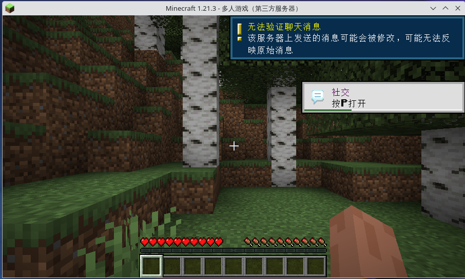

# 19.2 Minecraft Server

Minecraft is a sandbox game developed in Java. This section covers deploying the Minecraft server on FreeBSD. Setting up the server requires installing the Java runtime environment first; the server and client typically require the same Java version.

## Related File Structure

```sh
/
├── etc/
│   └── rc.conf # System configuration file, includes minecraft service configuration
├── usr/
│   └── local/
│       ├── bin/
│       │   └── minecraft-server # Minecraft server executable
│       └── etc/
│           └── minecraft-server/ # Minecraft server configuration directory
│               ├── eula.txt # End-user license agreement file
│               ├── java-args.txt # Java parameters configuration
│               └── server.properties # Server configuration file
├── var/
│   ├── log/
│   │   └── minecraft-server/ # Log and debug output directory
│   └── db/
│       └── minecraft-server/ # World files directory
```

## Installing OpenJDK

Note that outdated JDK versions are not supported by the server. This section was tested with JDK 21 and runs normally.

Install OpenJDK 21 using pkg:

```sh
# pkg install openjdk21
```

Or compile and install OpenJDK 21 using Ports, which can be optimized for server hardware:

```sh
# cd /usr/ports/java/openjdk21/
# make install clean
```

## Using Ports or the Official Server Program

There are two ways to set up a Minecraft server:

Testing has confirmed that the [Minecraft official server](https://www.minecraft.net/en-us/download/server) is a pure Java program that runs directly on FreeBSD 15.0 after installing OpenJDK. The Ports version provides FreeBSD-specific integration, including service management scripts and default configuration files.

You can also use **games/minecraft-server** available in Ports:

```sh
# cd /usr/ports/games/minecraft-server/
# make install clean
```

View configuration information:

```sh
# pkg info -D minecraft-server
```

Run the server:

```sh
$ /usr/local/bin/minecraft-server

…………part omitted…………

[15:52:21] [ServerMain/WARN]: Failed to load eula.txt
[15:52:21] [ServerMain/INFO]: You need to agree to the EULA in order to run the server. Go to eula.txt for more info.
```

The prompt indicates that you need to agree to the license agreement. Change `eula=false` to `eula=true` in the **/usr/local/etc/minecraft-server/eula.txt** file.

Run the installed Minecraft server program again:

```sh
# /usr/local/bin/minecraft-server
Starting net.minecraft.server.Main
[15:54:47] [ServerMain/INFO]: Environment: Environment[sessionHost=https://sessionserver.mojang.com, servicesHost=https://api.minecraftservices.com, name=PROD]
[15:54:48] [ServerMain/INFO]: No existing world data, creating new world
[15:54:49] [ServerMain/INFO]: Loaded 1290 recipes
[15:54:49] [ServerMain/INFO]: Loaded 1399 advancements
[15:54:49] [Server thread/INFO]: Starting minecraft server version 1.21.1
[15:54:49] [Server thread/INFO]: Loading properties
[15:54:49] [Server thread/INFO]: Default game type: SURVIVAL
[15:54:49] [Server thread/INFO]: Generating keypair
[15:54:49] [Server thread/INFO]: Starting Minecraft server on *:25565
[15:54:50] [Server thread/INFO]: Using default channel type
[15:54:50] [Server thread/INFO]: Preparing level "world"
[15:54:53] [Server thread/INFO]: Preparing start region for dimension minecraft:overworld
[15:54:53] [Worker-Main-2/INFO]: Preparing spawn area: 2%
[15:54:54] [Worker-Main-2/INFO]: Preparing spawn area: 2%
[15:54:54] [Worker-Main-3/INFO]: Preparing spawn area: 2%
[15:54:55] [Worker-Main-1/INFO]: Preparing spawn area: 2%
[15:54:55] [Worker-Main-2/INFO]: Preparing spawn area: 18%
[15:54:56] [Worker-Main-1/INFO]: Preparing spawn area: 51%
[15:54:56] [Worker-Main-3/INFO]: Preparing spawn area: 51%
[15:54:56] [Server thread/INFO]: Time elapsed: 3317 ms
[15:54:56] [Server thread/INFO]: Done (6.876s)! For help, type "help"
```

Press **Ctrl** + **C** to interrupt the program.

## Disabling Online Authentication

Under the current default configuration, the server has online authentication enabled (`online-mode=true`). This mechanism communicates with the Mojang session server and Microsoft authentication service to verify player identity, ensuring:

- Each player has a unique UUID assigned by Mojang/Microsoft, bound to their purchased account
- Players cannot log in using another person's username
- Bans and permission management are based on real account identity

> **Warning**
>
> You should only use `online-mode=false` when you fully understand the risks and have deployed additional protective measures.

If you need to allow players who have not purchased the game to connect in a LAN or testing environment, edit the **/usr/local/etc/minecraft-server/server.properties** file and change `online-mode=true` to `online-mode=false`.

Then run the installed Minecraft server program again:

```sh
# /usr/local/bin/minecraft-server
Starting net.minecraft.server.Main
[18:47:47] [ServerMain/INFO]: Environment: Environment[sessionHost=https://sessionserver.mojang.com, servicesHost=https://api.minecraftservices.com, name=PROD]
[18:47:51] [ServerMain/INFO]: Loaded 1337 recipes
[18:47:51] [ServerMain/INFO]: Loaded 1448 advancements
[18:47:51] [Server thread/INFO]: Starting minecraft server version 1.21.3
[18:47:51] [Server thread/INFO]: Loading properties
[18:47:51] [Server thread/INFO]: Default game type: SURVIVAL
[18:47:51] [Server thread/INFO]: Generating keypair
[18:47:51] [Server thread/INFO]: Starting Minecraft server on *:25565
[18:47:51] [Server thread/INFO]: Using default channel type
[18:47:52] [Server thread/WARN]: **** SERVER IS RUNNING IN OFFLINE/INSECURE MODE!
[18:47:52] [Server thread/WARN]: The server will make no attempt to authenticate usernames. Beware.
[18:47:52] [Server thread/WARN]: While this makes the game possible to play without internet access, it also opens up the ability for hackers to connect with any username they choose.
[18:47:52] [Server thread/WARN]: To change this, set "online-mode" to "true" in the server.properties file.
[18:47:52] [Server thread/INFO]: Preparing level "world"
[18:47:52] [Server thread/INFO]: Preparing start region for dimension minecraft:overworld
[18:47:53] [Worker-Main-5/INFO]: Preparing spawn area: 0%
[18:47:53] [Worker-Main-5/INFO]: Preparing spawn area: 0%
[18:47:53] [Worker-Main-5/INFO]: Preparing spawn area: 0%
[18:47:53] [Server thread/INFO]: Time elapsed: 1233 ms
[18:47:53] [Server thread/INFO]: Done (1.709s)! For help, type "help"
[18:48:34] [Server thread/INFO]: ykla[/127.0.0.1:37462] logged in with entity id 39 at (-1.5, 63.0, 1.5)
[18:48:34] [Server thread/INFO]: ykla joined the game
```



## Security Risks of Disabling Online Authentication

Completely disabling Mojang/Microsoft account verification introduces the following serious security risks:

1. **Administrator account impersonation**: Anyone can enter an administrator (OP) username to log in directly, gaining full administrative privileges, items, and territories on the server. Since UUIDs are generated locally based on usernames (`OfflinePlayer:username`), the server cannot distinguish between a real administrator and an impersonator.
2. **Bans become completely ineffective**: Banned users only need to change their username to rejoin without purchasing a new account, rendering the ban mechanism useless.
3. **Whitelist becomes ineffective**: In offline mode, the whitelist only checks usernames rather than account identity, and cannot prevent impersonation.
4. **Extremely low barrier for bot attacks**: Attackers can generate random usernames in bulk for automated attacks without purchasing any Minecraft accounts.
5. **Player data loss risk**: In offline mode, UUIDs are bound to usernames rather than accounts. If a player changes their username, all their items, builds, permissions, and other data will be permanently lost.
6. **Risk of violating the Minecraft EULA**: Allowing players who have not purchased the game to connect may violate Mojang's End User License Agreement.
7. **Skins and licensed features unavailable**: In offline mode, all players' appearances display as the default Steve/Alex skins.

If you genuinely need to use offline mode (e.g., in a closed LAN environment, or when using BungeeCord/Velocity proxy forwarding), the following mitigation measures are recommended:

- Install authentication plugins (such as AuthMeReloaded) to require players to register passwords, preventing username impersonation
- Use firewall restrictions to allow only trusted IP ranges to connect
- Use plugins like CoreProtect to log all block operations for traceability and rollback
- Use permission plugins like LuckPerms for fine-grained permission control, avoiding the `*` wildcard
- Regularly back up world data
