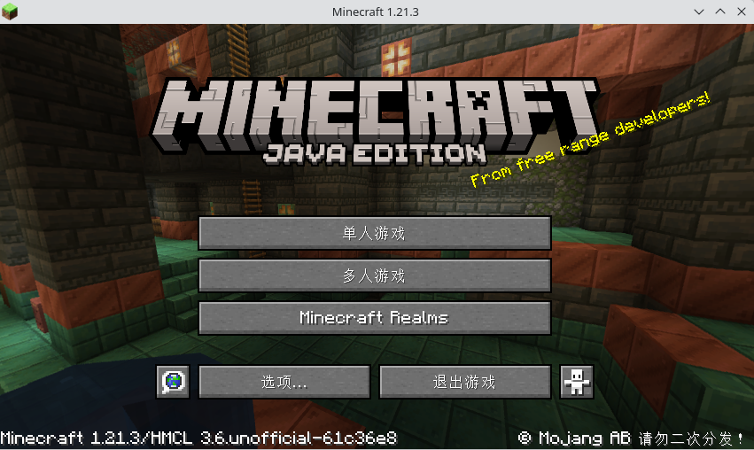
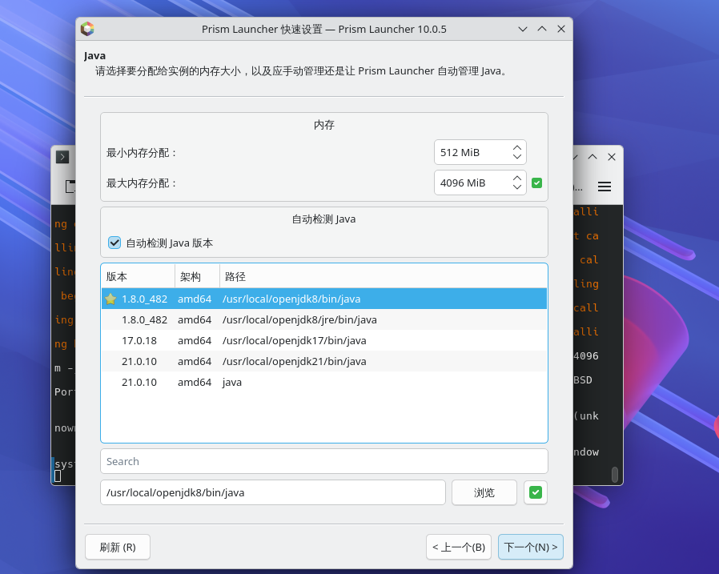
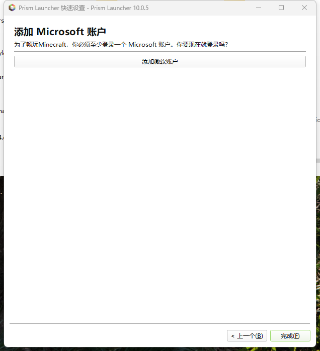

# 19.3 Minecraft

Minecraft is a sandbox game developed in Java. Different versions have specific JDK version requirements (1.20.5+ requires Java 21). This section covers OpenJDK installation and launcher configuration on FreeBSD.

## Installing OpenJDK

Different Minecraft versions require different JDK versions:

| Minecraft Version | Required JDK Version |
| ----------------- | -------------------- |
| 1.17 | Java 16 |
| 1.18 to 1.20.4 | Java 17 |
| 1.20.5 and above | Java 21 |

Testing has confirmed that JDK 21 runs the latest version of Minecraft normally.

Install OpenJDK 21 using pkg:

```sh
# pkg install openjdk21
```

Or install OpenJDK 21 using Ports:

```sh
# cd /usr/ports/java/openjdk21/
# make install clean
```

## Minecraft Client

There are two common launchers available on FreeBSD: HMCL and Prism Launcher. Prism Launcher is available through FreeBSD Ports, while HMCL can only be run by manually downloading the `.jar` file.

### HMCL

HMCL (Hello Minecraft! Launcher) is a Minecraft launcher developed in Java that supports multi-version management and mod loading.

#### Configuring HMCL

Before configuring the launcher, you need to obtain the installation file first.

Download the latest release from the [releases](https://github.com/HMCL-dev/HMCL/releases) page.

Open a terminal and run the command to launch the HMCL launcher JAR file using Java:

```sh
$ java -jar HMCL*.jar
```

Not all Minecraft versions are supported; for compatibility details, please refer to the [Platform Support Status](https://github.com/HMCL-dev/HMCL/blob/main/docs/PLATFORM.md) document. The remaining settings are platform-independent; key configurations include Java path settings, game directory selection, and memory allocation.

#### Launching the Game with HMCL

For specific steps on launching the game with HMCL, please refer to the screenshots below.




### Prism Launcher

Prism Launcher is an open-source launcher developed using C++ and the Qt framework. This launcher disables offline login by default and restricts [bypass methods](https://github.com/antunnitraj/Prism-Launcher-PolyMC-Offline-Bypass), and is recommended only for licensed users.

#### Installing Prism Launcher

Install Prism Launcher using pkg:

```sh
# pkg install prismlauncher
```

You can also install Prism Launcher using Ports:

```sh
# cd /usr/ports/games/prismlauncher/
# make install clean
```

#### Configuring Prism Launcher

Pay attention to desktop environment compatibility during configuration.

If using the KDE desktop environment, you need to update third-party packages to the latest version. This is because the KDE desktop environment requires a specific Qt version, and the Qt libraries that Prism Launcher depends on must be consistent with the system libraries.

```sh
# pkg upgrade
```

Otherwise, it may fail to start, and the terminal will display error messages about incompatible Qt library versions or missing symbols.

Click to launch the program:


This is the language setting, which supports Chinese by default.


This sets the Java version; keep the default settings.



Appearance settings; keep the default settings.


#### Launching Minecraft with Prism Launcher

After launching the program, you can see that Prism Launcher supports Chinese, but requires a licensed login.



After logging in, download the latest version of the game.

> **Note**
>
> A Minecraft licensed account is required to log in to the game. You can [purchase](https://www.minecraft.net/en-us/store/minecraft-java-bedrock-edition-pc) the game.


Enter the Minecraft game.


Enter the game screen.


## References

- Mojang Studios. Minecraft: Java Edition 1.20.5[EB/OL]. [2026-04-17]. <https://www.minecraft.net/en-us/article/minecraft-java-edition-1-20-5>. Minecraft 1.20.5 and later require Java 21 and a 64-bit operating system.
- HMCL-dev. Hello Minecraft! Launcher[EB/OL]. [2026-04-17]. <https://github.com/HMCL-dev/HMCL>. HMCL is an open-source cross-platform Minecraft launcher released under the GPLv3 license.
