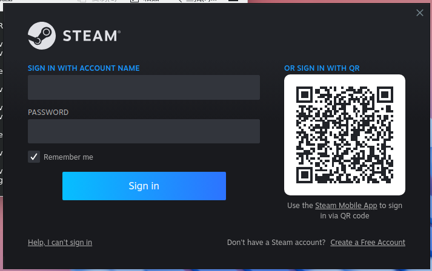
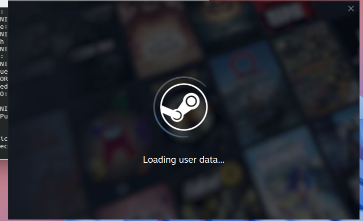
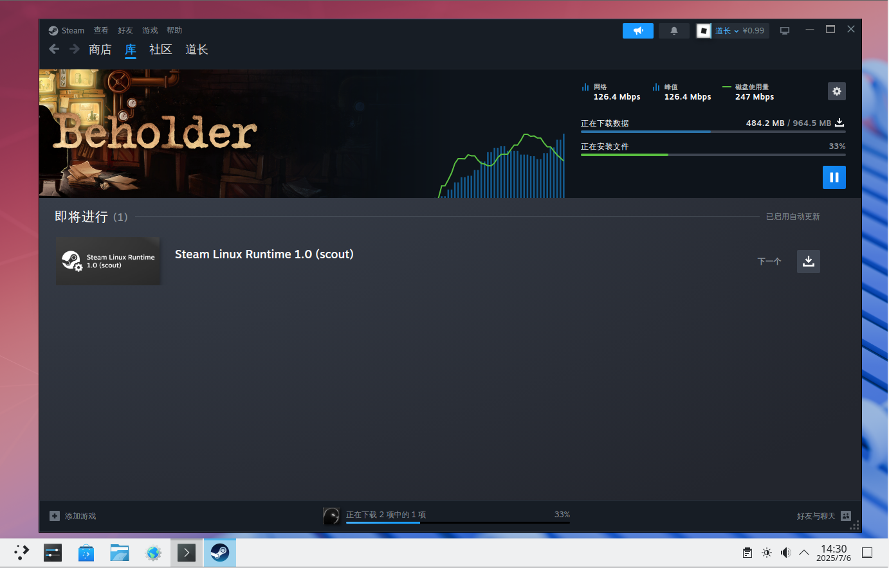

# 19.4 Steam Client

Steam does not have a native FreeBSD client; its Linux version can run through the FreeBSD Linux compatibility layer. This section covers the installation and configuration of **games/linux-steam-utils**.

## Based on Port games/linux-steam-utils

### Loading the Linux Compatibility Layer Module

This module enables the FreeBSD system to execute Linux binaries, which is a prerequisite for running Steam.

Enable and start the Linux compatibility layer service:

```sh
# service linux enable   # Enable the Linux compatibility layer service and set it to start at boot
# service linux start    # Start the Linux compatibility layer service
```

### Installing games/linux-steam-utils

This package is a community-developed third-party wrapper tool that provides the necessary tools and configuration scripts for running Steam on FreeBSD.

Install using pkg:

```sh
# pkg install linux-steam-utils
```

Install using Ports:

```sh
# cd /usr/ports/games/linux-steam-utils/
# make install clean
```

View the post-installation notes:

```sh
# pkg info -D linux-steam-utils
```

### File Structure

```sh
/
├── bin/
│   └── sh # Default shell for Steam users
├── etc/
│   └── sysctl.conf # System control variable configuration file
└── usr/
    └── local/
        ├── steam-utils/
        │   └── bin/
        │       ├── lsu-bootstrap # Steam bootstrap download tool
        │       └── steam # Steam launcher
        └── wine-proton/
            └── bin/
                └── pkg32.sh # 32-bit dependency installation script
```

### Configuring Port linux-steam-utils

The configuration process involves system parameter adjustments, user account creation, and other operations:

If using an NVIDIA graphics card, you need to install the appropriate Port **x11/linux-nvidia-libs(-xxx)**.

#### Setting sysctl Variables

Set the following sysctl system control variables to `1`. Steam needs these permissions to create isolated environments and mount necessary filesystems, and relies on real network interface names for network communication.

| Variable | Value | Description |
| -------- | ----- | ----------- |
| `security.bsd.unprivileged_chroot` | 1 | Allow unprivileged users to use chroot |
| `vfs.usermount` | 1 | Allow regular users to mount filesystems |
| `compat.linux.use_real_ifnames` | 1 | Use real network interface names |

Apply immediately:

```sh
# sysctl security.bsd.unprivileged_chroot=1   # Allow unprivileged users to use chroot
# sysctl vfs.usermount=1                      # Allow regular users to mount filesystems
# sysctl compat.linux.use_real_ifnames=1      # Use real network interface names
```

To make these changes persistent: edit the **/etc/sysctl.conf** file and add the following lines at the end:

```sh
security.bsd.unprivileged_chroot=1   # Allow unprivileged users to use chroot
vfs.usermount=1                      # Allow regular users to mount filesystems
compat.linux.use_real_ifnames=1      # Use real network interface names
```

#### Enabling the nullfs Kernel Module

nullfs is a pass-through filesystem used to create bind mounts of filesystems; Steam uses it to organize its filesystem structure.

Load the nullfs kernel module immediately:

```sh
# kldload nullfs
```

Add `nullfs` to `kld_list` to enable automatic loading at boot:

```sh
# sysrc kld_list+="nullfs"
```

#### Creating a Dedicated User Account for Steam

For security reasons, it is recommended to create a dedicated user account for Steam. This user should not belong to the wheel group to restrict its system privileges; otherwise, Steam will display a security warning at startup.

Create user test, specifying the default shell as **/bin/sh**, and create the home directory:

```sh
# pw useradd -n test -s /bin/sh -m
```

Switch to the test user:

```sh
# su test
```

> **Tip**
>
> Under the test user privileges, type `exit` to return to the previous user.

#### Downloading the Steam Bootstrap Executable

Launch the steam-utils lsu-bootstrap initialization program, which is responsible for downloading the Steam client bootstrap files:

```sh
$ /usr/local/steam-utils/bin/lsu-bootstrap
```

#### Allowing the test User to Access X11

Steam is a graphical application that needs to access the X Server to display its interface. Run the following command under the currently logged-in desktop user's privileges to allow the local user test to access the current X Server:

```sh
$ xhost +SI:localuser:test
```

### Launching Steam

Switch to the test user:

```sh
# su test
```

Launch the Steam client:

```sh
$ /usr/local/steam-utils/bin/steam
```

Enter your username and password to log in:



Loading:



Set the Chinese interface:


Steam:


### Testing the Game Beholder

This section tests Steam's functionality using the game Beholder as an example.

> **Note**
>
> Beholder is a paid game and must be purchased before you can play it.

Download Beholder:



Launch Beholder:


### Troubleshooting

This section covers solutions to common problems.

#### `Bubblewrap doesn't work on FreeBSD. Select LSU chroot or Legacy Runtime in the game compatibility settings.`

This error indicates that Steam's container runtime (pressure-vessel) is incompatible on FreeBSD, and a compatible runtime environment must be selected.

Right-click the game, click Properties, and in the Compatibility tab, check "Force the use of a specific Steam Play compatibility tool", then select "Legacy Runtime".

#### No Chinese Font Display

This issue can be resolved by installing Chinese fonts. It is recommended to install font packages such as `wqy-fonts` or `noto-sans-sc` (Simplified Chinese).

## References

- shkhln. linuxulator-steam-utils[EB/OL]. [2026-04-17]. <https://github.com/shkhln/linuxulator-steam-utils>. A community adaptation tool for running the Steam client on FreeBSD, providing bootstrap scripts and compatibility configuration.
