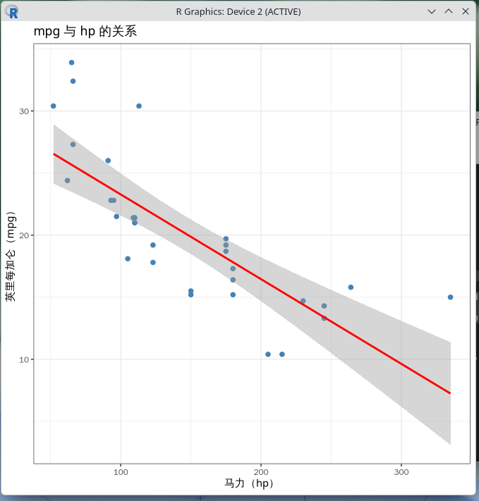
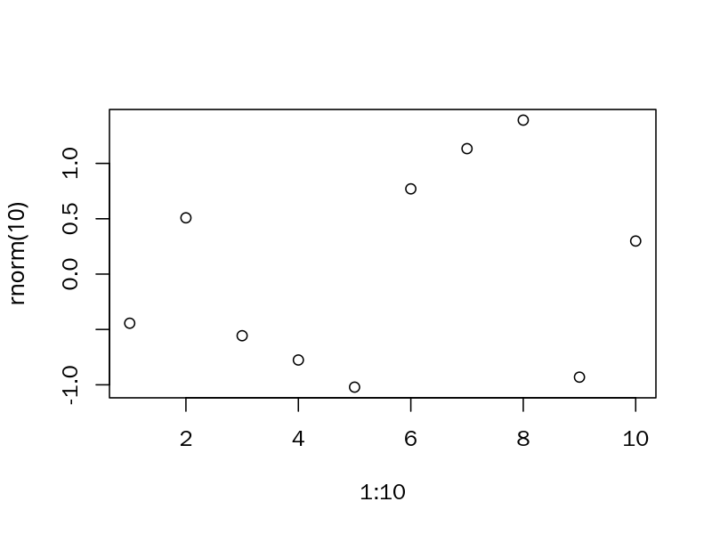

# 19.5 R

R is a programming language and free software environment for statistical computing and graphics visualization, released in 1993 by Ross Ihaka and Robert Gentleman of the Department of Statistics at the University of Auckland, and currently maintained by the R Core Team.

Its name is both a combination of the first letters of its two authors' names and a tribute to the S language from Bell Labs: R comes from S and is an open-source (GPL) derivative of the S programming language; most code written in S can run in R without modification.

R is widely used in statistics, data science, bioinformatics, econometrics, and social sciences. Its ecosystem includes tens of thousands of extension packages, which are published through the Comprehensive R Archive Network (CRAN).

FreeBSD provides R through both Ports and pkg. In Ports, the R language package is located under the `math/R` category.

## Installing R

Install using pkg:

```sh
# pkg install R
```

Or install using Ports:

```sh
# cd /usr/ports/math/R/
# make install clean
```

After installation, verify the version with the following command:

```sh
$ R --version
R version 4.6.0 (2026-04-24) -- "Because it was There"
Copyright (C) 2026 The R Foundation for Statistical Computing
Platform: amd64-portbld-freebsd16.0

R is free software and comes with ABSOLUTELY NO WARRANTY.
You are welcome to redistribute it under the terms of the
GNU General Public License versions 2 or 3.
For more information about these matters see
https://www.gnu.org/licenses/.
```

Enter an interactive session:

```r
$ R
R version 4.6.0 (2026-04-24) -- "Because it was There"
Copyright (C) 2026 The R Foundation for Statistical Computing
Platform: amd64-portbld-freebsd16.0

R is free software and comes with ABSOLUTELY NO WARRANTY.
You are welcome to redistribute it under certain conditions.
Type 'license()' or 'licence()' for distribution details.

R is a collaborative project with many contributors.
Type 'contributors()' for more information.
Type 'citation()' on how to cite R or R packages in publications.

Type 'demo()' for some demos, 'help()' for on-line help, or
'help.start()' for an HTML browser interface to help.
Type 'q()' to quit R.

> q()
Save workspace image? [y/n/c]: n # Whether to save the workspace image
```

In the interactive session, use `q()` to exit.

## CRAN Mirrors and Package Management

CRAN is the official distribution network for R extension packages, with dozens of mirror sites worldwide. When using `install.packages()` for the first time, R prompts the user to select a mirror. You can explicitly specify a mirror in the R session as follows (using the Tsinghua University TUNA mirror as an example):

```r
options(repos = c(CRAN = "https://mirrors.tuna.tsinghua.edu.cn/CRAN/"))
install.packages("ggplot2")
```

>**Tip**
>
> Since building R packages is not easy (similar to Python), FreeBSD Port developers maintain a large number of R packages, most of which are named `R-cran-*`. Taking `ggplot2` as an example, it is **graphics/R-cran-ggplot2** in Ports.

You can also create an `~/.Rprofile` configuration file in the user's home directory to make the mirror settings take effect automatically every time R starts:

```r
options(repos = c(CRAN = "https://mirrors.tuna.tsinghua.edu.cn/CRAN/"))
```

Common package management commands include:

```r
install.packages("package")   # Install an extension package
update.packages()             # Update installed extension packages
library(package)              # Load an extension package
installed.packages()          # List all installed extension packages
remove.packages("package")    # Remove an extension package
```

## Basic Usage Examples

The following examples demonstrate R's basic arithmetic operations, vector operations, and simple plotting capabilities. Start R and execute them in sequence. Please install the Port **graphics/R-cran-ggplot2** first.

Basic arithmetic operations:

```r
> x <- c(1, 2, 3, 4, 5)
> mean(x)    # Arithmetic mean
> sd(x)      # Sample standard deviation
> sum(x)     # Sum
[1] 3
[1] 1.581139
[1] 15
```

Vector operations:

```r
> y <- x^2 + rnorm(5, mean = 0, sd = 1)  # Add normal distribution noise
> y
[1]  3.015682  2.941824  8.242497 16.696599 24.355322
```

Simple linear regression

```r
> fit <- lm(y ~ x)
> summary(fit)
Call:
lm(formula = y ~ x)

Residuals:
        1         2         3         4         5
 3.252108 -2.465155 -2.807887  0.002809  2.018126

Coefficients:
            Estimate Std. Error t value Pr(>|t|)
(Intercept)  -5.8798     3.2389  -1.815   0.1671
x             5.6434     0.9766   5.779   0.0103 *
---
Signif. codes:  0 '***' 0.001 '**' 0.01 '*' 0.05 '.' 0.1 ' ' 1

Residual standard error: 3.088 on 3 degrees of freedom
Multiple R-squared:  0.9176,    Adjusted R-squared:  0.8901
F-statistic:  33.4 on 1 and 3 DF,  p-value: 0.0103
```

Plotting a scatter plot with regression line

```r
> plot(x, y, main = "Scatter Plot with Regression Line", xlab = "x", ylab = "y")
> abline(fit, col = "red")
```

This will output the following figure:


## RStudio IDE

RStudio is one of the most popular integrated development environments (IDE) for R. It provides syntax highlighting, code completion, a plot viewer, a data browser, and version control features.

Install the RStudio desktop client using pkg (the server version is **RStudio-server**):

```sh
# pkg install RStudio
```

Or install using Ports:

```sh
# cd /usr/ports/devel/RStudio/
# make install clean
```

After installation, launch RStudio from the application menu in the desktop environment, or run in the terminal:

```sh
$ rstudio
```

## Data Import and Export

R supports reading and writing multiple data formats. Common examples are as follows:

```r
# Read a CSV file
dat <- read.csv("data.csv")

# Write a CSV file
write.csv(dat, "output.csv", row.names = FALSE)

# Read an Excel file (requires the readxl package)
library(readxl)
dat <- read_excel("data.xlsx", sheet = 1)

# Read SAS, SPSS, Stata files (requires the haven package)
library(haven)
dat_sas   <- read_sas("data.sas7bdat")
dat_spss  <- read_sav("data.sav")
dat_stata <- read_dta("data.dta")
```

## Statistical Modeling and Graphics Visualization

The following examples demonstrate common usage of linear models and ggplot2 plotting:

```r
> library(ggplot2)
# Use the built-in mtcars dataset
> data(mtcars)
> head(mtcars)
                   mpg cyl disp  hp drat    wt  qsec vs am gear carb
Mazda RX4         21.0   6  160 110 3.90 2.620 16.46  0  1    4    4
Mazda RX4 Wag     21.0   6  160 110 3.90 2.875 17.02  0  1    4    4
Datsun 710        22.8   4  108  93 3.85 2.320 18.61  1  1    4    1
Hornet 4 Drive    21.4   6  258 110 3.08 3.215 19.44  1  0    3    1
Hornet Sportabout 18.7   8  360 175 3.15 3.440 17.02  0  0    3    2
Valiant           18.1   6  225 105 2.76 3.460 20.22  1  0    3    1

# Predict miles per gallon (mpg) from horsepower (hp)
> fit2 <- lm(mpg ~ hp, data = mtcars)
> summary(fit2)
Call:
lm(formula = mpg ~ hp, data = mtcars)

Residuals:
    Min      1Q  Median      3Q     Max
-5.7121 -2.1122 -0.8854  1.5819  8.2360

Coefficients:
            Estimate Std. Error t value Pr(>|t|)
(Intercept) 30.09886    1.63392  18.421  < 2e-16 ***
hp          -0.06823    0.01012  -6.742 1.79e-07 ***
---
Signif. codes:  0 '***' 0.001 '**' 0.01 '*' 0.05 '.' 0.1 ' ' 1

Residual standard error: 3.863 on 30 degrees of freedom
Multiple R-squared:  0.6024,    Adjusted R-squared:  0.5892
F-statistic: 45.46 on 1 and 30 DF,  p-value: 1.788e-07


# Plot a scatter plot with fitted curve
> ggplot(mtcars, aes(x = hp, y = mpg)) +
>   geom_point(color = "steelblue", size = 2) +
>   geom_smooth(method = "lm", se = TRUE, color = "red") +
>   labs(
>     title = "Relationship between mpg and hp",
>     x     = "Horsepower (hp)",
>     y     = "Miles per gallon (mpg)"
>   ) +
>   theme_bw()
```

This will output the following figure:



## Recommended Packages

| Category | Package/Port | Purpose |
| -------- | ------------ | ------- |
| Data processing | dplyr (**databases/R-cran-dtplyr**), tidyr (**devel/R-cran-tidyr**), data.table (**devel/R-cran-data.table**) | Data cleaning, filtering, reshaping, and summarization |
| Graphics visualization | ggplot2 (**graphics/R-cran-ggplot2**) | Static and interactive plotting |
| Time series | tseries (**finance/R-cran-tseries**) | Time series modeling and forecasting |
| Machine learning | caret (**devel/R-cran-caret**) | Classification and regression model training |
| Parallel computing | future (**devel/R-cran-future**), doParallel (**devel/R-cran-doParallel**) | Multi-core and distributed computing |

## Interoperability with Other Languages

R can interoperate with multiple programming languages. Common scenarios are as follows:

### Calling C/C++ Code

The `Rcpp` package (Port **devel/R-cran-Rcpp**) allows embedding C++ code directly in R:

```r
> library(Rcpp)
> cppFunction('
>   double my_mean(NumericVector x) {
>     int n = x.size();
>     double total = 0;
>     for (int i = 0; i < n; i++) {
>       total += x[i];
>     }
>     return total / n;
>   }
> ')
> my_mean(c(1, 2, 3, 4, 5))
[1] 3
```

### Calling Python Code from R

The `reticulate` package allows calling Python from within an R session:

```r
> install.packages("reticulate") # Install the R package
> library(reticulate)
> use_python("/usr/local/bin/python3")  # Replace with the actual path
> py_run_string("
> import numpy as np
> a = np.array([1, 2, 3, 4, 5])
> print('Mean computed in Python:', a.mean())
> ")
Mean computed in Python: 3.0
```

### Calling R from Python

The `rpy2` package (**math/py-rpy2**) for Python allows calling R from Python:

```python
$ python3
Python 3.11.15 (main, May 12 2026, 01:16:18) [Clang 21.1.8 (https://github.com/llvm/llvm-project.git llvmorg-21.1.8-0-g2078da on freebsd16
Type "help", "copyright", "credits" or "license" for more information.
>>> import rpy2.robjects as robjects
>>> from rpy2.robjects.packages import importr
>>>
>>> stats = importr("stats")
>>> r_mean = robjects.r("mean")
>>> result = r_mean(robjects.FloatVector([1, 2, 3, 4, 5]))
>>> print("Mean computed in R:", result[0])
Mean computed in R: 3.0
```

Press **Ctrl** + **D** to exit the above interface.

## Command-Line Batch Processing Mode

R supports running scripts in batch mode. Create a script `analysis.R` with the following content:

```r
x <- rnorm(100, mean = 0, sd = 1)
cat("Sample mean:", mean(x), "\n")
cat("Sample standard deviation:", sd(x), "\n")
```

Execute in the terminal:

```sh
$ Rscript analysis.R
Sample mean: 0.1388172
Sample standard deviation: 1.032565
```

This mode is suitable for integrating R into shell scripts, cron jobs, or batch processing workflows.

## Troubleshooting

### Extension Package Compilation Failure

Some extension packages require C/C++/Fortran compilers. Ensure that `devel/gmake`, `lang/gcc` (including gfortran), and related dependencies are installed. You can install the common compilation toolchain at once using the following command:

```sh
# pkg install gmake gcc pkgconf
```

### Chinese Character Garbled Display

First, properly set the `LANG`, `LC_ALL`, and other locale environment variables as described in other chapters. In R, you can additionally set:

```r
options(encoding = "UTF-8")
Sys.setlocale("LC_CTYPE", "zh_CN.UTF-8")
```

### Graphics Device Fails to Start

In a server environment without a graphical interface, you need to output plots to file devices (png, pdf, svg, etc.):

```r
> png("plot.png", width = 800, height = 600, res = 150)
> plot(1:10, rnorm(10))
> dev.off()
> null device
> getwd() # Get the output image path
[1] "/home/ykla"
```

View the image:



## References

- R CORE TEAM. R: The R Project for Statistical Computing[EB/OL]. [2026-06-09]. <https://www.r-project.org/>. R official website
- COMPREHENSIVE R ARCHIVE NETWORK. CRAN mirrors[EB/OL]. [2026-06-09]. <https://cran.r-project.org/mirrors.html>. CRAN mirror list
- R CORE TEAM. An Introduction to R[EB/OL]. [2026-06-09]. <https://cran.r-project.org/manuals.html>. An Introduction to R.
- Wickham H, Çetinkaya-Rundel M, Grolemund G. R for Data Science: Import, Tidy, Transform, Visualize, and Model Data[M]. 2nd ed. Sebastopol: O'Reilly Media, 2023. ISBN: 978-1-492-09740-2.
