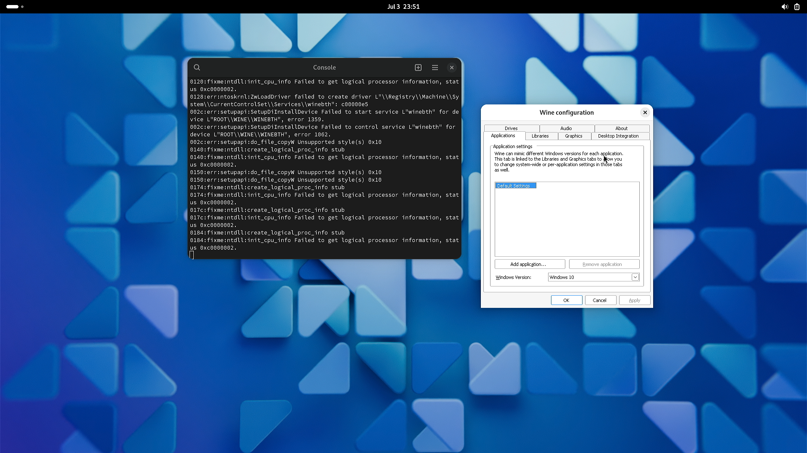
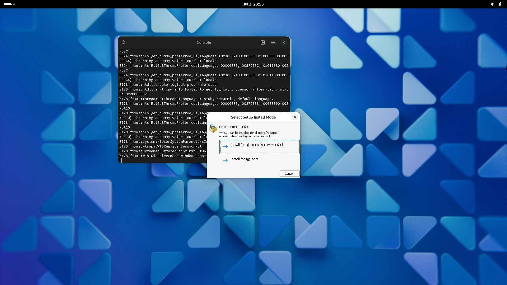
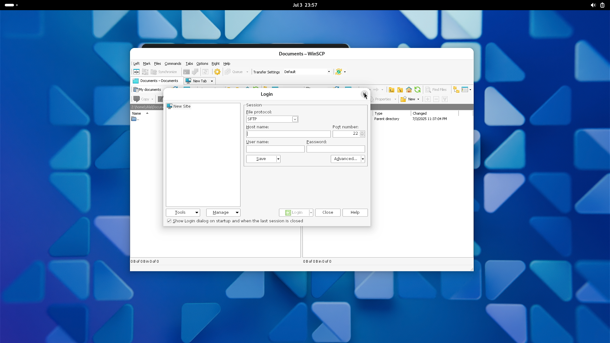
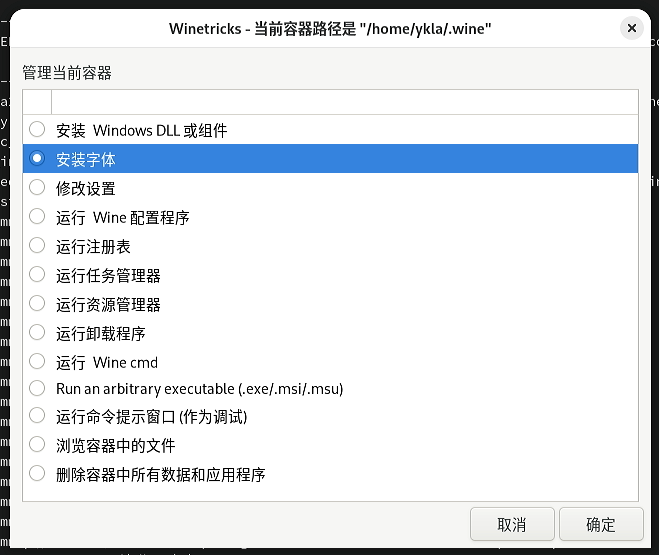
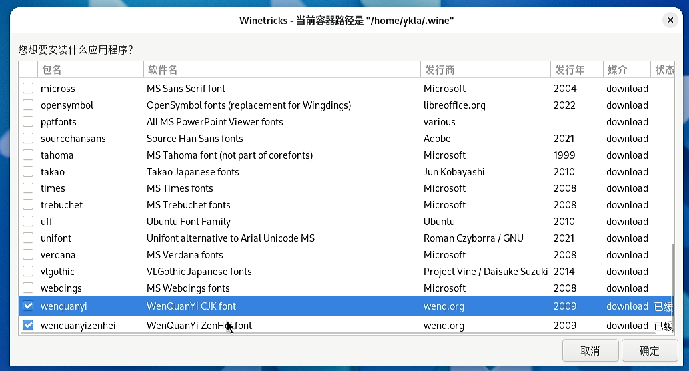

# 19.6 Wine

Wine, which stands for Wine Is Not an Emulator, is strictly speaking a software translation layer. It allows you to install and run software written for Windows on FreeBSD (and other systems).

Wine works by intercepting Windows API calls — that is, the requests that applications make to the Windows operating system interface — and translating these calls from the Windows format into a format that FreeBSD can understand. If necessary, it also translates system responses back into the format expected by Windows software. Wine provides many of the resources that Windows applications expect, and in some respects, it can be said to emulate a Windows environment.

However, Wine is not an emulator in the traditional sense. Many such solutions work by software-emulating an entire independent computer to replace actual hardware. Virtualization (such as that provided by the Port emulators/qemu) is exactly this approach. One advantage of this method is that a complete target operating system can be installed in the virtual machine, and for the application, the environment is indistinguishable from a physical host, so most software runs normally. The downside of this approach is that emulating hardware in software is inherently slower than real hardware. The software-constructed computer (called the guest system) needs to occupy the resources of the real host (called the host system) and continues to occupy those resources during operation.

When Wine runs a Windows executable, the following two processes are involved:

- First, Wine implements an environment that emulates multiple versions of Windows. For example, if an application requests access to resources such as memory, Wine provides a memory interface that (from the application's perspective) is consistent with Windows.
- Second, when the application uses this interface, Wine translates the requested memory space into a form compatible with the host system. When the application retrieves that data, Wine obtains it from the host system and returns it to the Windows application.

By comparison, Wine consumes far fewer system resources. It can translate API calls on the fly at runtime; while it may be difficult to match the speed of a native Windows environment, it can come very close. On the other hand, Wine must constantly chase a moving target — the ever-evolving Windows API and feature support. As a result, some applications may run abnormally, fail to run, or even fail to install under Wine.

Overall, Wine is an alternative option for running specific Windows programs on FreeBSD. If it runs successfully, Wine can serve as the preferred solution, providing a good experience without additionally consuming the resources of the host FreeBSD system.

The following content has only been tested on physical machines. Wine depends on DRM drivers for graphics hardware acceleration, and may not function properly in virtual machine environments, typically displaying errors about unsupported 3D acceleration. Additionally, virtual machines may not fully support certain CPU instruction sets, which can also cause program startup failures.

## Installing Wine

Install Wine and related components using the pkg package manager:

```sh
# pkg install wine wine-gecko wine-mono
```

> **Note**
>
> Whether installing Wine via pkg or Ports, only the 64-bit version is installed. To support 32-bit Windows programs, you also need to run the `pkg32.sh` script to install 32-bit components (see below). Installing via pkg is recommended to save compilation time.

> **Note**
>
> It is recommended to install wine-gecko; otherwise, running `winecfg` for the first time will prompt you to install the Gecko engine. wine-gecko provides support for Windows programs that depend on Internet Explorer or HTML rendering.

Switch to a regular user, then use the pkg32 script to install 32-bit Wine and Mesa DRI graphics driver support:

```sh
$ /usr/local/share/wine/pkg32.sh install wine mesa-dri
```

### Package Descriptions

| Program | Description |
| ------- | ----------- |
| wine | Wine main program |
| wine-gecko | Internet Explorer component implemented by the Wine project based on Mozilla's Gecko layout engine |
| wine-mono | Mono provides support for .NET Framework 4.8 and earlier versions |

> **Note**
>
> If you skip this step, 32-bit Windows programs will not be supported. Among these, mesa-dri provides graphics card hardware acceleration support.

## Configuring Graphics Hardware Acceleration

Please refer to the graphics card-related chapters to configure hardware acceleration.

## Configuring Wine

All the following operations should be performed under regular user privileges.

Launch the `winecfg` configuration tool with the specified `WINEPREFIX` directory:

```sh
$ WINEPREFIX=$HOME/test wine winecfg
```

> **Tip**
>
> `WINEPREFIX` is a directory collection that stores Wine's configuration files and emulated Windows system files. Setting different `WINEPREFIX` values allows multiple configuration environments to coexist.



If you encounter error messages or the command produces no response, you can delete the default Wine configuration directory to reset the Wine environment:

```sh
$ rm -rf ~/.wine
```

Then run the following command to launch the Wine configuration tool using the default `WINEPREFIX`:

```sh
$ wine winecfg
```

Or run the following command:

```sh
$ rm -rf $HOME/test                          # Delete the specified WINEPREFIX directory to reset the environment
$ WINEPREFIX=$HOME/test wine winecfg         # Launch winecfg with a new WINEPREFIX directory
```

Directory structure:

```sh
~/
├── .wine/ # Default Wine configuration directory
└── test/ # Custom Wine configuration directory (WINEPREFIX)
```

## Test Running WinSCP (32-bit Windows Program)

> **Tip**
>
> You do not need to create a separate WINEPREFIX for 32-bit programs. Currently, 32-bit and 64-bit programs can coexist in the same WINEPREFIX.

Since most users need to run 32-bit Windows programs, the following example program checks whether this requirement is met:

```sh
$ file winscp.exe  # View the file type of winscp.exe
winscp.exe: PE32 executable for MS Windows 6.01 (GUI), Intel i386, 11 sections
```

Use Wine to install and run the executable file `winscp.exe`:

```sh
$ wine /home/ykla/winscp.exe
```

> **Tip**
>
> The `/home/ykla` path shown in this section's example is for demonstration purposes; please replace it with your actual home directory.






> **Tip**
>
> After successful installation, a corresponding icon will be generated. Testing shows that double-clicking the icon runs the program normally.

## Winetricks

Winetricks is a script (approximately 20,000 lines of code) that wraps many Wine-related utility functions, such as installing and uninstalling software, installing fonts, and more, which can circumvent many common Wine issues.

### Installing Winetricks

Install using pkg:

```sh
# pkg install winetricks
```

Install using Ports:

```sh
# cd /usr/ports/emulators/winetricks/
# make install clean
```

### Installing Chinese Fonts with Winetricks

> **Note**
>
> Downloading fonts may require connecting to GitHub; please ensure your network connection is working.

Launch the Winetricks tool for installing and configuring Wine dependency components:

```sh
$ winetricks
```

> **Tip**
>
> You can ignore the warning about 64-bit and 32-bit Wine in the terminal output:
>
> `warning: You are using a 64-bit WINEPREFIX. Note that many verbs only install 32-bit versions of packages. If you encounter problems, please retest in a clean 32-bit WINEPREFIX before reporting a bug.`






Here you can install the last two Chinese fonts in the list. After installation, most programs can display Chinese normally.

## Troubleshooting and Unresolved Issues

### Setting Chinese for the Wine Interface

This issue awaits further verification and resolution.
