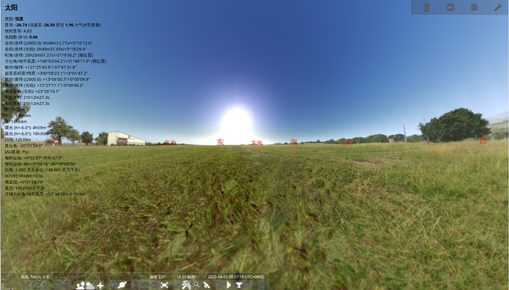
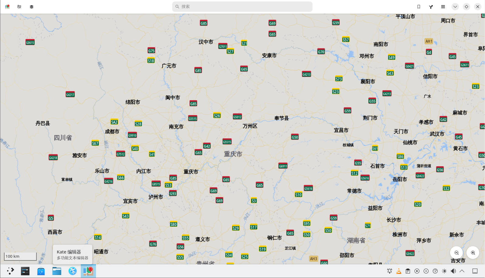

# 19.7 Scientific Research and Professional Computing

Scientific research tools that can run on FreeBSD include mathematics (GeoGebra), astronomy (Stellarium), and others. This section lists the installation methods and basic purposes of each software by category.

## Algebra

The FreeBSD base system includes two calculator tools: bc uses infix notation, and dc uses postfix notation (Reverse Polish Notation).

`dc` is an open-source arbitrary-precision calculator using postfix notation. In traditional Unix systems, `bc` was implemented as a preprocessor for `dc` — first converting infix expressions to postfix expressions, then passing them to `dc` for computation.

Its source code is located in the FreeBSD official source code repository at <https://github.com/freebsd/freebsd-src/tree/main/contrib/bc>, available for study and learning. Users can view the manual pages using the `man bc` or `man dc` commands for more usage details.

### bc (Basic Calculator)

bc is an interactive arbitrary-precision calculator using infix notation, supporting basic arithmetic operations and function calculations.

```sh
$ bc # Enter the bc calculator
1+15 # Addition
16
sqrt(256) # Square root
16
5^3	 # Cube
125
90/3 # Division
30
10%4 # Modulo
2
quit # Exit the program
```

## Geometry

### Geometry Drawing Software GeoGebra

GeoGebra is dynamic geometry software that supports visualization and computation in geometry, algebra, and calculus.

Install using pkg:

```sh
# pkg install geogebra
```

Or install using Ports:

```sh
# cd /usr/ports/math/geogebra/
# make install clean
```


## Linear Programming

This section covers the usage of the linear programming software GLPK. Linear programming is an important branch of operations research, widely applied in resource optimization, production planning, and financial risk management.

### GLPK

GLPK (GNU Linear Programming Kit) is an open-source linear programming toolkit developed by the GNU Project.

Install GLPK using pkg:

```sh
# pkg install glpk
```

Or install GLPK using Ports:

```sh
# cd /usr/ports/math/glpk/
# make install clean
```

Linear programming commonly uses the simplex method. On computers, various software can assist in solving linear programming problems, such as Microsoft Excel's Solver feature.

### Computer Algebra System wxMaxima

wxMaxima is a graphical user interface for the Maxima computer algebra system, providing an intuitive interactive environment and powerful mathematical computation capabilities.

Install using pkg:

```sh
# pkg install wxmaxima
```

Or install using Ports:

```sh
# cd /usr/ports/math/wxmaxima/
# make install clean
```

wxMaxima supports not only numerical computation but also symbolic computation and formula derivation. The code examples are for reference only; for details, see the [official documentation](https://maxima.sourceforge.io/documentation.html).

## Physics and Chemistry

### Periodic Table `GPeriodic`

GPeriodic is a periodic table viewer that provides basic information and physical-chemical properties of elements.

Install using pkg:

```sh
# pkg install gperiodic
```

Or install using Ports:

```sh
# cd /usr/ports/biology/gperiodic/
# make install clean
```


## Astronomy and Geography

### Star Chart Software Stellarium

Stellarium is an open-source planetarium software that simulates realistic starry sky observations.

Install using pkg:

```sh
# pkg install stellarium
```

Or install using Ports:

```sh
# cd /usr/ports/astro/stellarium/
# make install clean
```




> **Tip**
>
> It enters full-screen mode by default; press **F11** to toggle full-screen mode.

### GNOME Maps

GNOME Maps is a map viewer that provides map browsing and location search functionality.

Install using pkg:

```sh
# pkg install gnome-maps
```

Or install using Ports:

```sh
# cd /usr/ports/deskutils/gnome-maps/
# make install clean
```



The map data is based on OpenStreetMap and is relatively up-to-date, but lacks detailed point-of-interest information and navigation features, making it less detailed than commercial map services.

## Tools and Software

### Scientific Computing Software GNU Octave

GNU Octave is an open-source scientific computing software compatible with the MATLAB language, used for numerical computation and data visualization.

Install using pkg:

```sh
# pkg install octave
```

Or install using Ports:

```sh
# cd /usr/ports/math/octave/
# make install clean
```

## References

- Howard G D. bc — An arbitrary precision calculator language[EB/OL]. [2026-04-17]. <https://github.com/gavinhoward/bc>. Gavin D. Howard's bc/dc implementation.
- FreeBSD Project. Differential Revision D19982[EB/OL]. (2019-05-23)[2026-04-17]. <https://reviews.freebsd.org/D19982>. FreeBSD [since 13.0](https://github.com/freebsd/freebsd-src/commit/252884ae7e4760f0e3cb45fdc2fff8fb952251ae) incorporated Gavin D. Howard's bc/dc implementation into the base system (`contrib/bc`), with bc and dc integrated in the same binary.
- FreeBSD Project. bc(1) -- an arbitrary precision calculator language[EB/OL]. [2026-04-17]. <https://man.freebsd.org/cgi/man.cgi?query=bc&sektion=1>. Manual page for the arbitrary precision calculator language.
- FreeBSD Project. dc(1) -- an arbitrary precision calculator[EB/OL]. [2026-04-17]. <https://man.freebsd.org/cgi/man.cgi?query=dc&sektion=1>. Manual page for the arbitrary precision calculator.
