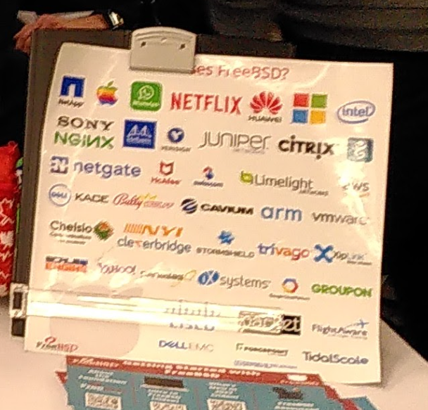

# 2.1 FreeBSD: Ideals, Reality, and the Middle Way

## Who Uses FreeBSD

The following are some typical use cases.

Image source [FreeBSD Foundation promotional image](https://i.imgur.com/qW0IePB.png).

- Warner Bros. The Matrix[EB/OL]. [2026-03-26]. <https://movie.douban.com/subject/1291843/>. The visual effects of The Matrix were produced on a FreeBSD cluster. See also Urban M, Tiemann B. FreeBSD Internals[M]. Wisdom East Studio, trans. Beijing: China Machine Press, 2002: 2. ISBN: 978-7-111-10201-4, FreeBSD Project. FreeBSD Press Release: April 22, 1999[EB/OL]. (1999-04-22)[2026-03-26]. <https://www.freebsd.org/press/press-rel-1/>.
- The New Stack. Apple's Open Source Roots: The BSD Heritage Behind macOS and iOS[EB/OL]. [2026-03-26]. <https://thenewstack.io/apples-open-source-roots-the-bsd-heritage-behind-macos-and-ios/>. Apple's operating systems such as macOS and iOS extensively reuse BSD (not limited to FreeBSD) technology stacks. BSD can be regarded as the open source cornerstone of macOS.
- Sony. FreeBSD Kernel[EB/OL]. [2026-03-26]. <https://www.playstation.com/en-us/oss/ps4/freebsd-kernel/>. Sony's game consoles PlayStation 4 (PS4) and PlayStation 5 (PS5) run operating systems based on FreeBSD. The CellOS of PlayStation 3 (PS3) and the operating system of PlayStation Vita (PSV) are also built on FreeBSD and NetBSD.
- FreeBSD Foundation. Netflix Case Study[EB/OL]. [2026-03-26]. <https://freebsdfoundation.org/netflix-case-study/>. Netflix runs nearly all of its network activities (content caching/CDN) on FreeBSD-based devices.
- QNX. Search Results[EB/OL]. [2026-03-26]. <https://www.qnx.com/developers/docs/8.0/search.html?searchQuery=freebsd>. QNX operating system. QNX is a microkernel real-time operating system (RTOS) whose kernel is self-developed and not based on FreeBSD. QNX was formerly the operating system for BlackBerry phones. QNX is now widely used as an automotive safety operating system — in mainstream cockpit architectures, the QNX Hypervisor manages safety-critical domains (such as instrument clusters and ADAS), while running Android Automotive as a guest operating system in a virtual machine to provide infotainment functions (see: BlackBerry QNX. QNX Hypervisor 8.0[EB/OL]. [2026-04-17]. <https://blackberry.qnx.com/en/products/foundation-software/qnx-hypervisor>). Domestic new energy vehicles widely adopt the QNX operating system, and QNX holds a significant market share in automotive safety-critical systems. QNX reuses FreeBSD code in its new-generation network stack io-sock (from QNX 8.0) and some userspace components (the older network stack io-pkt reused NetBSD code).
- Dell. PowerScale OneFS: Understanding Source-Based Routing[EB/OL]. (2024-05-28)[2026-03-26]. <https://www.dell.com/support/kbdoc/zh-cn/000020056/isilon-onefs-understanding-source-based-routing-sbr-in-isilon?lang=zh>. Dell EMC Isilon, Dell's Isilon (enterprise-oriented NAS storage devices) runs the OneFS operating system based on FreeBSD (OneFS 8.2 is based on FreeBSD 11; the FreeBSD version underlying OneFS 9.x is not publicly disclosed).
- Beckhoff. TwinCAT/BSD: operating system for Industrial PCs[EB/OL]. [2026-03-26]. <https://www.beckhoff.com/en-en/products/ipc/software-and-tools/twincat-bsd/>. TwinCAT/BSD, the operating system for Beckhoff's automation control system, combines the TwinCAT real-time core with FreeBSD for industrial PC platforms.
- OpenHarmony. kernel_liteos_a[EB/OL]. [2026-03-26]. <https://gitee.com/openharmony/kernel_liteos_a/tree/master>. The OpenHarmony LiteOS kernel incorporates FreeBSD code for drivers and other purposes.

### References

- FreeBSD Foundation. Read how organisations are using FreeBSD across the globe[EB/OL]. [2026-03-25]. <https://freebsdfoundation.org/end-user-stories/>. A compilation of typical FreeBSD use cases across various fields, curated by the FreeBSD Foundation.

## Why Choose FreeBSD

### Core Reason: FreeBSD Seeks the Ideal Middle Way in an Ever-Changing World

Compared to most mainstream operating systems or kernels, FreeBSD maintains ABI stability within STABLE branches, while kernel API compatibility across versions is not guaranteed.

The FreeBSD project as a whole tends to be conservative, adhering to the Principle of Least Astonishment (POLA), which means that design must conform to users' habits, expectations, and mental capabilities. Its configuration files and system components do not change frequently, and migration between major versions is particularly cautious. FreeBSD also carefully handles breaking changes, requiring ABI stability within a major version.

FreeBSD not only maintains stability throughout its lifecycle, but major version updates are also coherent and stable, enabling convenient migration between major versions. Software versions on FreeBSD can be updated on a rolling basis without being locked to specific versions (such as Python, etc.).

### General Reasons for Choosing FreeBSD

- Pursuing both stability and novelty in software, requiring both binary packages and support for compilation-based installation. Few open source systems besides FreeBSD combine these characteristics (~~Void Linux doesn't really count~~).
- BSD grants a purer freedom: it does not restrict freedom to guarantee freedom, but achieves true freedom through trust and openness.
- FreeBSD is the product of academic engineering practice and the modern continuation of the UNIX philosophy.
- Other operating system ecosystems are becoming increasingly fragmented, while FreeBSD's integrated design avoids the constant dilemma of choice, though this is not a restriction — it can also be freely modified as needed.
- BSD is a complete operating system, not merely a kernel. The kernel and base system are maintained as a unified project. The lack of a base system concept leads to persistent confusion and counter-intuitive user experiences.
- The FreeBSD project is led by a Core Team.
- Both the FreeBSD community and developers uphold the philosophy that "slow is fast, fast is slow." ~~We do need to take some time to slow down and examine everything about ourselves, whether knowledge or self. Spending time on roadside flowers and pebbles may not be a waste of time or doing nothing.~~

- Education and Research: The FreeBSD project integrates the kernel and userspace in the same code repository, greatly facilitating research and learning, with clear and abundant code comments for easy reference on how specific features are implemented.

> **Tip**
>
> You can also examine the reasons for choosing FreeBSD from more perspectives:
>
> - From the Buddhist perspective, it is due to karma. All things arise from dependent origination and are empty in nature; those who meet will inevitably part. All phenomena are like this.
>
> - From the Christian perspective, this is God's guidance. God created the world in the eternal present. Just like the Exodus, what appears to be one's own choice is actually the Lord's arrangement.
> - From Hegel's perspective, it is due to dialectical negation. FreeBSD is a direct descendant of UNIX, and many protocols originated from UNIX, so it is destined to arrive here.

### Technical Reasons for Choosing FreeBSD

- FreeBSD separates base system configuration files from third-party software configuration files, and system-level configuration files from user configuration files. FreeBSD's filesystem hierarchy follows clear organizational principles. ~~No more using the `find` command everywhere to locate where a `.conf` file is installed.~~
- Due to the existence of the base system, third-party software rarely affects system stability. FreeBSD maintains a balance between software updates and system stability.
- Through BSD Ports, software can be compiled and installed with custom configurations.
- Software versions are not locked. For example, common system dependency software such as Python and GCC. However, all FreeBSD releases share the same Ports tree; regardless of whether the system is old or new, the versions of third-party software are identical. Only a very few software packages are hard-bound to specific system versions; all other software can be updated on a rolling basis.
- Due to the Ports system, older FreeBSD systems can still fetch and compile software, rather than being unable to receive software updates after reaching end-of-life (EoL).
- In the FreeBSD project, documentation is not an afterthought. The FreeBSD doc project holds equal status with the src project, with no hierarchy between them.
- The root partition (**/**) can conveniently be configured to use the ZFS filesystem. ZFS is widely recognized as one of the most feature-complete filesystems.
- A major version release cycle of every 2 years and a maintenance period of 4 years (adjusted from the previous 5 years starting from FreeBSD 15) ensure FreeBSD's stability.
- Jail does not require additional installation and maintenance of an underlying virtualization stack, nor does it need to boot a complete operating system kernel and userspace for each instance, saving system resources; bhyve virtualization is also built into the base system, but as a hypervisor, each instance needs to run a complete guest operating system.
- Traditional BSD init booting, returning to simplicity and the visibility of plain text.
- DTrace framework and GEOM storage framework.
- The Linux binary compatibility layer can run Linux software, with minor performance overhead under syscall-intensive workloads and near-native performance for compute-intensive tasks.
- FreeBSD drivers exist as kernel modules that can be dynamically loaded and unloaded, facilitating on-demand hardware management.
- FreeBSD embraces the philosophy of free development for all — you can directly [submit code](https://github.com/freebsd/freebsd-src/pulls) on GitHub, or register an account to submit large-scale changes at <https://reviews.freebsd.org/>.
- FreeBSD's code style is BSD KNF (Kernel Normal Form), based on CSRG's KNF specification, with a brace layout that is a variant of the K&R style (the opening brace of a function occupies its own line, while the opening brace of a control statement shares the line with the statement), consistent with the K&R style used in Kernighan & Ritchie's classic work "The C Programming Language" (Chinese translation: Kernighan B W, Ritchie D M. The C Programming Language[M]. Xu Baowen, Li Zhi, trans. 2nd ed. Beijing: China Machine Press, 2019. ISBN: 978-7-111-61794-5.).

#### References

- FreeBSD Foundation. Submitting GitHub Pull Requests to FreeBSD[EB/OL]. [2026-03-25]. <https://freebsdfoundation.org/our-work/journal/browser-based-edition/configuration-management-2/submitting-github-pull-requests-to-freebsd/>. Details the process and norms for FreeBSD accepting contributions via GitHub.
- FreeBSD Project. Contribution Guidelines for GitHub[EB/OL]. [2026-03-25]. <https://github.com/freebsd/freebsd-src/blob/main/CONTRIBUTING.md>. Official guidelines and requirements for contributing to FreeBSD source code.
- Linux Kernel Documentation. Linus Torvalds is the final arbiter of whether changes can enter the Linux kernel[EB/OL]. [2026-03-25]. <https://www.kernel.org/doc/html/latest/translations/zh_CN/process/submitting-patches.html>. Demonstrates the centralized decision-making model of Linux kernel development.
- Linux Kernel Documentation. Linux kernel coding style[EB/OL]. [2026-03-25]. <https://www.kernel.org/doc/html/latest/process/coding-style.html>. Specifies Linux kernel code style and formatting requirements.
- Linux Kernel Documentation. Linux kernel development is a relatively closed process[EB/OL]. [2026-03-25]. <https://www.kernel.org/doc/html/latest/process/submitting-patches.html>. Describes the participation barriers and processes for Linux kernel development.
- Cdaemon. Sandbox Your Program Using FreeBSD's Capsicum[EB/OL]. [2026-03-25]. <https://cdaemon.com/posts/capsicum>. Basic principles and usage of FreeBSD's security sandbox framework.

### The Social Significance of Choosing FreeBSD

#### Red Hat's Influence on the Linux Ecosystem Bias

Mainstream Linux projects such as GNOME, Xorg (X11), D-Bus, systemd, PulseAudio, Wayland, and PipeWire are in fact significantly influenced by Red Hat, and most of them are difficult to fully adapt to other UNIX-like operating systems.

The current lack of desktop components for FreeBSD largely stems from strong dependencies on Linux-specific libraries, such as the `iproute2` package that includes the `ip` command. A more important reason is that these desktop components have deep entanglement or mandatory dependencies with systemd, such as `NetworkManager`. Meanwhile, projects like Samba are developed with a Linux-centric approach, with insufficient attention to compatibility with non-Linux platforms. The FreeBSD community refers to this phenomenon as "Linuxism."

The consequences of this behavior remain unclear, but such programs are becoming increasingly numerous and show a trend toward becoming mainstream. Many developers no longer consider compatibility with traditional init systems when developing programs (such as `todesk`). Java programs are also gradually losing portability; due to such bundling issues, Eclipse updates on FreeBSD were long delayed. If this trend continues, the portability of programs that run on Linux may further decline.

The difficulties FreeBSD currently faces may also be encountered by other systems in the future.

- Choosing FreeBSD means choosing to preserve the foundation of free software.
- Choosing FreeBSD means choosing to preserve a truly free operating system. This can sustain the open source movement and practice the true UNIX philosophy.

##### References

- D'Pong P. Bug 562443 - SWT spams temp folder with innumerable folders[EB/OL]. (2020-05-26)[2026-04-05]. <https://gitlab.simantics.org/simantics/eclipse/eclipse.platform.swt/-/commit/19153b908d6d4cedcbd59824686717502cfde4f7>.
- FreshPorts. java/eclipse[EB/OL]. [2026-06-06]. <https://www.freshports.org/java/eclipse/>. As of 2026, Port **java/eclipse** has resumed active maintenance.
- FreeBSD Forums. Are Linuxisms impossible to overcome when porting?[EB/OL]. [2026-06-07]. <https://forums.freebsd.org/threads/are-linuxisms-impossible-to-overcome-when-porting.45805/>.

#### Major Donation Events to the FreeBSD Foundation

> Last week, I donated $1 million to the FreeBSD Foundation, which supports the open source operating system FreeBSD. FreeBSD has helped millions of programmers pursue their passions and realize their ideas. I am myself a beneficiary. In the late 1990s, I started using FreeBSD when I was financially strapped and living in government housing. In a way, FreeBSD helped me escape poverty — the important reason I was able to get a job at Yahoo! was that they used FreeBSD, which was my preferred operating system. Years later, when Brian and I started creating WhatsApp, we still used FreeBSD to support our server operations, and we continue to do so today.
>
> I am announcing this donation in the hope that more people will see the beneficial work the FreeBSD Foundation does, and inspire others to support FreeBSD as well. We all benefit if FreeBSD can continue to provide opportunities for people like me, helping more children of immigrants escape poverty, helping more startups succeed, and even achieving transformative outcomes.
>
> — Jan Koum, former CEO and founder of WhatsApp (FreeBSD Foundation. Updated! – FreeBSD Foundation Announces Generous Donation and Fundraising Milestone[EB/OL]. (2014-11-17)[2026-04-05]. <https://freebsdfoundation.org/blog/updated-freebsd-foundation-announces-generous-donation-and-fundraising-milestone/>.)

#### Honesty and Credibility

A system like FreeBSD that runs silently in the background, barely noticed by users, can be called time-tested. If blue screen errors, kernel panics, "internal errors," `You are in emergency mode`, `BusyBox (initramfs)`, or `grub rescue>` prompts appear daily, they would at least remind users of the system's existence.

Currently, some companies that use Linux as the operating system for dedicated devices, or build commercial products based on other GPL software, do not strictly comply with the GPL by releasing their modified code. Some domestic enterprises have insufficient understanding of what GPL means, considering "free" as the only factor. The compliance and technical credibility of enterprise products that take evasive measures to circumvent GPL's mandatory open source requirements are both questionable. The phenomenon of preemptively registering trademarks of open source software is also not uncommon. In contrast, companies that adopt FreeBSD are more standardized and reliable in terms of license compliance, and they have genuinely promoted the widespread reuse of BSD code. Even though some may consider FreeBSD to be in decline, in reality, a large number of users may always benefit from FreeBSD technology underpinnings.

##### References

- Wang Bo. The Future of FreeBSD in China[M]//Wang Bo. The Complete Guide to FreeBSD. 2nd ed. Beijing: China Machine Press, 2002: Foreword. ISBN: 978-7-111-10286-1. Discusses the development and application prospects of FreeBSD in China.

## Current Technical Limitations of FreeBSD

FreeBSD has many advantages, but it also faces real challenges.

- Large technology companies provide insufficient support for FreeBSD; for example, GitHub Actions requires third-party tools (such as `vmactions/freebsd-vm`) for CI/CD, and NVIDIA CUDA is not supported, lagging behind in the AI and LLM era.
- The FreeBSD project lacks attention and investment for regions outside Europe and North America.
- Compared to the "Benevolent Dictator for Life" model in other open source projects, collective leadership has not shown clear advantages in the FreeBSD project, and may sometimes lead to diffused responsibility and inefficiency (i.e., the "collective action problem"). Some Core Team members overseeing FreeBSD sub-projects have insufficient understanding of and attention to the projects themselves, and have difficulty making effective decisions and taking responsibility for certain issues.
- The FreeBSD project as a whole tends to be conservative; the introduction of new technologies often takes years, spanning multiple major versions before completion. Typically, existing technologies must go through one or two generations of replacement before being introduced; after introduction, they often lack subsequent attention and maintenance development.
- FreeBSD is still lacking in modernization in some aspects, missing certain features common in contemporary operating systems. There is particularly significant room for improvement in embedded applications.
- FreeBSD does not provide a pre-configured desktop environment in the base system.
- FreeBSD has relatively limited hardware driver support.
- Learning resources about FreeBSD are relatively scarce.
- FreeBSD has a small number of developers, and feedback to external contributors is often untimely.
- The FreeBSD Foundation, journal, and bug reporting system also frequently have delays in responding to external contributors.
- The FreeBSD documentation project was stagnant for many years; submissions from individual contributors other than quarterly reports were in practice difficult to accept; the src and Ports projects also face similar difficulties in onboarding new individual contributors.
- Secure Boot is not fully supported; manual signing of EFI binaries is required.
- TPM support is limited.
- Due to dependencies on Linux-specific features (Linuxism) in some software, certain programs cannot be directly ported.
- The two main filesystems supported by FreeBSD, ZFS and UFS, typically can only expand their storage space, not directly shrink it (ZFS can remove mirrored or non-redundant top-level vdevs via `zpool remove` since FreeBSD 13.0, but cannot remove raidz vdevs, and requires the `device_removal` feature flag to be enabled; UFS does not support shrinking).
- FreeBSD is lacking in end-user-facing upper-layer application ecosystems, and the virtualization technology bhyve also needs improvement.

### References

- FreeBSD Foundation. FreeBSD UEFI Secure Boot[EB/OL]. [2026-06-06]. <https://freebsdfoundation.org/freebsd-uefi-secure-boot/>.
- OpenZFS. zpool-remove(8)[EB/OL]. [2026-06-07]. <https://openzfs.github.io/openzfs-docs/man/v2.2/8/zpool-remove.8.html>. Mirrored or non-redundant top-level vdevs can be removed via zpool remove, but raidz vdevs cannot be removed.

## Exercises

1. Look around and analyze which products around you are built on the FreeBSD operating system.
