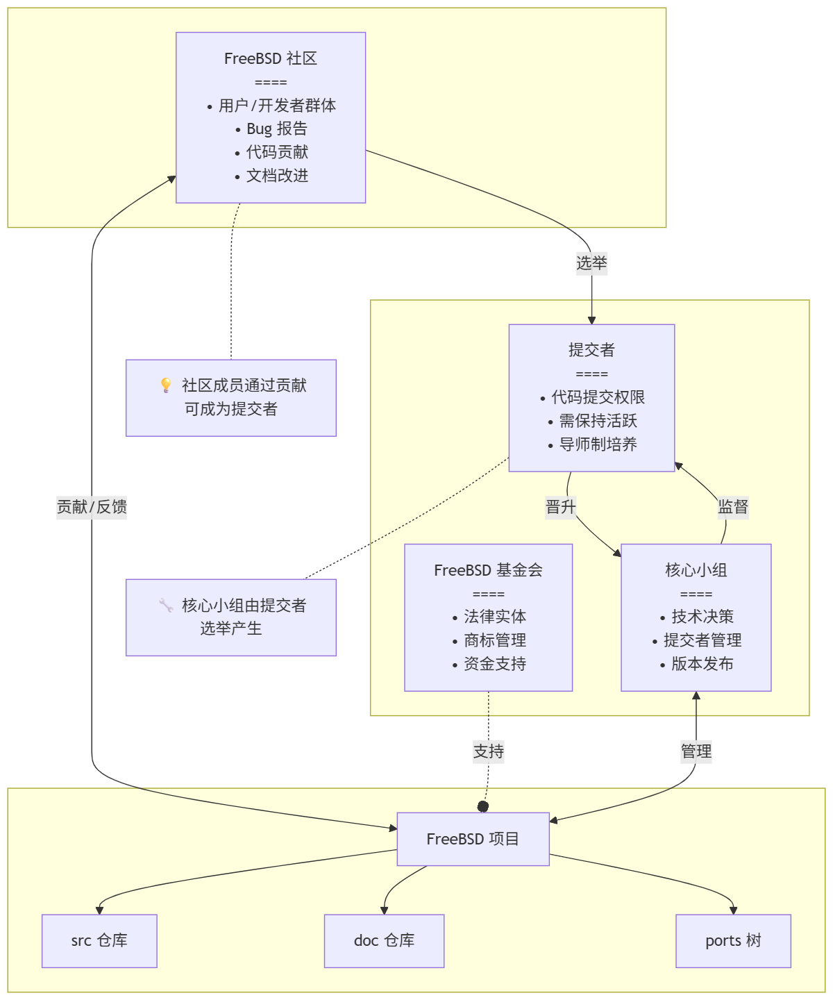

# 2.2 About the FreeBSD Project

## FreeBSD Project Mission

The mission of the FreeBSD project is: to enable the widest possible utilization of FreeBSD code, allowing everyone, regardless of their purpose, to benefit from it. This mission can be summarized as the open sharing philosophy of "seeking only to serve others, not demanding others serve me."

The FreeBSD project's source code includes some software licensed under the GNU General Public License (GPL) and the GNU Lesser General Public License (LGPL), and the project is continuously working to reduce their proportion. Although these licenses require open source rather than closed source, they still bring certain legal challenges and additional complexity. To fully realize FreeBSD's mission — providing software with as few additional conditions as possible to reduce complexity in commercial use — the FreeBSD project prefers the less restrictive BSD license where possible.

> **Discussion Questions**
>
>> Excerpt from the BSD 2-Clause License: "Redistribution and use in source and binary forms, with or without modification, are permitted provided that the following conditions are met"
>>
>> "You can continue to obtain the original BSD-licensed source code from upstream, but if you use a version based on BSD-derived code that has been relicensed under GPL, you must still comply with the GPL. This creates a one-way path from BSD to GPL: once BSD source code is incorporated into a GPL project, it is like entering a 'black hole' — the **GPL-ification of BSD code** is irreversible. The BSD world is gradually being encroached upon by GPL. But in fact, BSD code has achieved the greatest reuse in both open source and closed source worlds."
>
> 1. Besides being able to convert BSD-licensed software into proprietary software, how else can this "redistribution" be understood? After meeting the conditions (mainly some disclaimers and copyright notices), under what licenses can it be redistributed and relicensed?
>
> 2. Why does the Free Software Foundation consider the BSD 2-Clause License compatible with GPLv2/GPLv3? If BSD-licensed software A enters GPLv2 project B and becomes part of it. When downstream users redistribute, under what conditions is software A required to comply with GPLv2 rather than being converted to proprietary software through the BSD license? Why?
>
> 3. From the perspective of license infectivity, reconsider the GNU-ification of the Linux kernel and the de-GNU-ification of the FreeBSD base system.
>
> 4. How can the successful achievement of this code reuse purpose be understood?

## FreeBSD Governance Structure

FreeBSD's governance structure includes repositories, the Foundation, the community, committers, and the Core Team.

### Source Code Repository

The FreeBSD project has a long history, with version control tools evolving through CVS, SVN, and Git. For many years, FreeBSD's central source tree was maintained by CVS (Concurrent Versions System). CVS is free software that provides source code control functionality. As the source tree rapidly expanded and the volume of stored history increased, CVS's technical limitations became increasingly apparent. The migration timeline for each repository is as follows:

| Time | Repository | Event |
| ---- | ---------- | ----- |
| May 2008 | src | Migrated from CVS to SVN |
| May 2012 | doc | Migrated from CVS to SVN |
| July 2012 | ports | Migrated from CVS to SVN (CVS and SVN dual-track operation) |
| February 2013 | ports | CVS access officially closed |
| December 2020 | src | Migrated to Git |
| December 2020 | doc | Migrated to Git |
| April 2021 | ports | Migrated to Git |

Collaborative development is currently conducted using Git.

The FreeBSD project's repositories are divided into three: freebsd-src (source code), freebsd-ports (Ports software porting), and freebsd-doc (documentation). The three projects hold equal status.

### FreeBSD Foundation

The FreeBSD Foundation is a 501(c)(3) non-profit organization based in Boulder, Colorado, USA, dedicated to supporting and promoting the FreeBSD project and community worldwide. The Foundation funds software development through project grants and employs dedicated staff to respond promptly to urgent issues and implement new features. The Foundation purchases hardware to improve and maintain FreeBSD infrastructure, and funds personnel to increase test coverage, continuous integration, and automation. The Foundation promotes FreeBSD at global technology conferences and events. The Foundation also provides workshops, educational materials, and demonstrations to recruit more users and contributors to FreeBSD. Additionally, the Foundation enters into contracts, license agreements, and other legal arrangements requiring a recognized legal entity on behalf of the FreeBSD project. All powers of the Foundation are vested in the Board of Directors, whose directors are elected by existing board members (new directors can only be nominated by current directors), with terms specified in the bylaws.

In most countries, the FreeBSD trademark is held by the FreeBSD Foundation.

### FreeBSD Community

The FreeBSD project conducts development remotely via the internet.

The FreeBSD community consists of developers and users from around the world. The FreeBSD community is not a legal entity and has no fixed office. The FreeBSD community is not only an English-speaking community; there are also Chinese, Russian, Korean, Japanese, and other communities.

### Committers

Committers are individuals who have direct write access to the FreeBSD repositories. To become a committer, one must go through a mentorship mechanism and be recommended by an existing committer. To guard against potential security risks, committer status is not lifelong. The inactivity periods for each repository are as follows:

| Repository | Inactivity Period |
| ---------- | ----------------- |
| freebsd-src | At least one commit within 18 months |
| freebsd-doc | At least one commit within 18 months |
| freebsd-ports | At least one commit within 12 months |

Inactive committers will have their privileges suspended, but can apply for reinstatement.

### FreeBSD Core Team

The FreeBSD Core Team is the highest governing body of the FreeBSD project, consisting of 9 members as specified in the bylaws, operating under a collective leadership system where each member oversees different sub-projects. The FreeBSD Core Team is responsible for granting or revoking committer privileges and accounts, enforcing the Code of Conduct (CoC), and managing project sub-teams.

Core Team elections are held every two years, and members may be re-elected. Only committers who have made commits in the past 12 months (considered active committers) have the right to vote and stand for election.

Historically, the Core Team has never experienced a complete turnover; a Core Team member typically serves two or more consecutive terms in practice. There is often cross-membership between Core Team members and the FreeBSD Foundation Board.

FreeBSD Core Team members do not directly derive any personal benefit from their positions; they are all volunteers. Some members may receive employment or sponsorship from the FreeBSD Foundation to participate in the development of specific projects.

## Exercises

1. Analyze FreeBSD's Committer mechanism and Core Team election system, select another open source project (such as the Linux kernel or OpenBSD), and compare them across three dimensions: governance structure, code review process, and decision-making mechanism.
