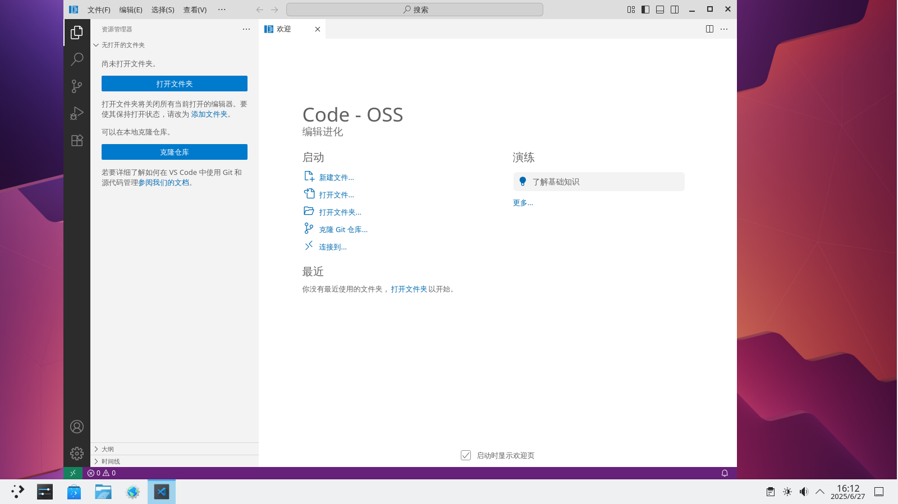
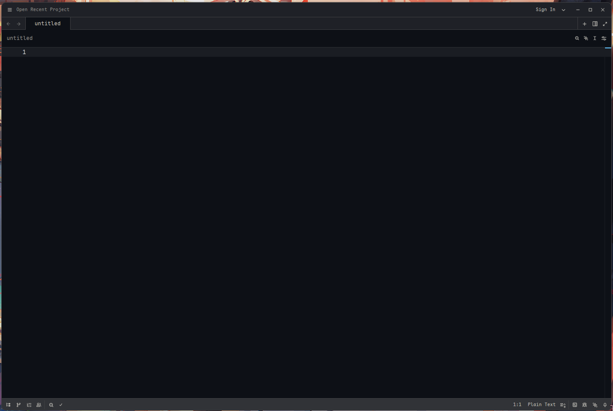

# 21.1 C/C++ Development Environment

## C/C++ Overview

C and C++ are widely used in systems programming, high-performance computing, embedded development, and other fields.

The FreeBSD kernel and a large number of userland utilities are written in C.

## LLVM / Clang Overview

The FreeBSD base system includes the Clang compiler, but does not include other LLVM components such as clangd (a language server for code completion, compilation error diagnostics, and go-to-definition), Clang-Tidy (a code style diagnostic tool), and clang-format (for formatting C/C++ code).

To install LLVM, any version of LLVM may be used, but the version should not be lower than the system's built-in Clang.

Check the Clang compiler version in FreeBSD 16:

```sh
$ clang -v
FreeBSD clang version 21.1.8 (https://github.com/llvm/llvm-project.git llvmorg-21.1.8-0-g2078da43e25a)
Target: x86_64-unknown-freebsd16.0
Thread model: posix
InstalledDir: /usr/bin
Build config: +assertions
```

The following uses LLVM 22 (the version at the time of writing). After installation, the corresponding programs are named `clang22`, `clang++22`, `clangd22`, and `clang-format22`. The system's built-in Clang program is named `clang`. If using a different version, note the corresponding program names.

### LLVM Version Numbers in the LLVM Project Upstream

In the LLVM project upstream source code, the version number for LLVM 19 was defined by the file **llvm/CMakeLists.txt**. After [this commit](https://github.com/llvm/llvm-project/commit/81e20472a0c5a4a8edc5ec38dc345d580681af81), the version number is instead defined by the source file [cmake/Modules/LLVMVersion.cmake](https://github.com/llvm/llvm-project/blob/main/cmake/Modules/LLVMVersion.cmake).

```cmake
# The LLVM Version number information
# LLVM version number information

if(NOT DEFINED LLVM_VERSION_MAJOR)
  set(LLVM_VERSION_MAJOR 23) # Indicates that at the time of writing, the mainline version is LLVM 23

...other content omitted...
```

### LLVM Version Numbers in the FreeBSD Base System

FreeBSD imports LLVM into the base system source code, but not directly—it is processed first. At the time of writing, the LLVM included in FreeBSD src is still LLVM 21. The source file specifying the version number is located at **lib/clang/include/clang/Basic/Version.inc**:

```c
#define	CLANG_VERSION			21.1.8
#define	CLANG_VERSION_STRING		"21.1.8"
#define	CLANG_VERSION_MAJOR		21
#define	CLANG_VERSION_MAJOR_STRING	"21"
#define	CLANG_VERSION_MINOR		1
#define	CLANG_VERSION_PATCHLEVEL	8
#define MAX_CLANG_ABI_COMPAT_VERSION	21

#define	CLANG_VENDOR			"FreeBSD "
```

### Installing Clang from Ports

The Clang version included in the base system may be too old to meet daily needs, so a newer version of Clang needs to be installed from Ports.

- Install using pkg:

```sh
# pkg install llvm22 cmake git
```

- Or install using Ports:

```sh
# cd /usr/ports/devel/llvm22/ && make install clean
# cd /usr/ports/devel/cmake/ && make install clean
# cd /usr/ports/devel/git/ && make install clean
```

## Overview of Some C/C++ Development Tools on FreeBSD

| Tool | Description | Primary Language | Editor Type |
| ---- | ----------- | ---------------- | ----------- |
| [Code-OSS](https://github.com/microsoft/vscode) | The open-source version of Visual Studio Code, with Microsoft's proprietary components and telemetry removed; a full-featured extensible code editor | TypeScript / JavaScript (Electron framework) | Light to medium (approaches IDE functionality through extensions) |
| [JetBrains CLion](https://www.jetbrains.com/clion/) | A cross-platform integrated development environment (IDE) designed for C/C++ development, providing intelligent code assistance, refactoring, and deep debugging integration; suitable for large projects | Java (based on IntelliJ platform) | Full IDE |
| [Zed](https://zed.dev/) | A high-performance modern code editor created by the makers of Atom and Tree-sitter, focused on speed and fluidity with built-in collaboration features | Rust | Light to medium (high native performance, but focused on editing) |

### References

- Jianping-Duan. algcl[EB/OL]. [2026-03-26]. <https://github.com/Jianping-Duan/algcl>. Provides C language algorithm and data structure programming examples that can run directly on FreeBSD.
- Zed Industries. Zed[EB/OL]. [2026-04-17]. <https://zed.dev/>. A high-performance code editor developed by the creators of Atom and Tree-sitter.

## Developing C/C++ with VSCode (Code-OSS)

C and C++ share high similarity in syntax, toolchains, and compilation processes. This section uses C as an example to introduce development environment configuration; C++ development can be configured similarly.

Visual Studio Code is a tool that combines the simplicity of a code editor with core development features (editing, building, debugging), providing comprehensive editing and debugging support, an extensibility model, and lightweight integration with existing tools.

### Installing VS Code

- Install using pkg:

```sh
# pkg install vscode
```

- Or install using Ports:

```sh
# cd /usr/ports/editors/vscode/
# make install clean
```

VS Code installed this way is actually [Code-OSS](https://github.com/microsoft/vscode). The main differences between Code-OSS and VS Code are the license and the available proprietary resources, similar to the relationship between Chromium and Chrome. See the [original text](https://github.com/microsoft/vscode/wiki/Differences-between-the-repository-and-Visual-Studio-Code) for details on the differences.

Currently, Microsoft's Python extension and LLVM's clangd extension can run directly on Code-OSS, but the settings sync service is temporarily unavailable.

### Setting Up Chinese Language Environment




### Installing Required Software

Install the relevant tools so that they can run and debug properly in the editor.

- Install using pkg:

```sh
# pkg install llvm lldb-mi cmake meson ninja ccls
```

- Install using Ports:

```sh
# cd /usr/ports/devel/llvm/ && make install clean # Meta port for the default LLVM version toolchain
# cd /usr/ports/devel/lldb-mi/ && make install clean # Machine interface driver for the LLDB debugger
# cd /usr/ports/devel/cmake/ && make install clean # Meta port for connecting all CMake components
# cd /usr/ports/devel/meson/ && make install clean # High-performance build system
# cd /usr/ports/devel/ccls/ && make install clean # C/C++/ObjC language server
```

Optional: Install the GNU toolchain `gcc` and `gdb`.

### Installing Required Extensions

The VS Code in FreeBSD Ports is actually the open-source version Code-OSS of Visual Studio Code. This version has removed Microsoft's proprietary components and telemetry features, so it cannot directly access Microsoft's official extension marketplace, nor can it install or use the official C/C++ extension that depends on Microsoft's proprietary libraries.

Please follow these steps to install the required extensions:

1. Open the VS Code Extensions view (Ctrl+Shift+X).
2. Search for and install the following three extensions:
   - `llvm-vs-code-extensions.vscode-clangd`: A Clang-based language server providing code completion, syntax checking, go-to-definition, and other features.
   - `webfreak.debug`: A debug adapter client that supports integration with multiple debugger backends (such as lldb-mi).
   - `KylinIdeTeam.cppdebug`: A debugging extension designed for C/C++, working with debuggers like lldb-mi to enable breakpoints, variable watching, and other debugging capabilities.

This section selects three typical combinations as examples, corresponding to the debug adapter `lldb-mi`, and the build systems `CMake + Ninja` and `Meson + Ninja`. This section uses Visual Studio Code as the frontend development environment to illustrate how to integrate these underlying tools in the editor.

### Debugger Integration: Configuration Based on lldb-mi

First, navigate to the project root directory (i.e., the `test` folder), which contains the `main.c` file. There should be a hidden folder `.vscode` in this directory (create it manually if it does not exist).

File structure:

```sh
project/                   ← Parent path
└── test/                  ← Enter this directory (create it yourself), assuming this is the project root directory
    ├── main.c
    └── .vscode/           ← Create here (hidden folder)
```

Then, create two VS Code configuration files in the `.vscode` folder: `launch.json` for defining the debugger startup parameters and behavior, and `tasks.json` for configuring the build task execution flow.

Related file structure:

```sh
project/                          ← Assume this is the root directory
└── test/                         ← Project root directory
    ├── main.c
    └── .vscode/                  ← VS Code configuration directory (hidden)
        ├── launch.json           ← Debug configuration file
        └── tasks.json            ← Build task configuration file
```

Once ready, write the following in the `launch.json` file:

```json
{
    "version": "0.2.0",                                     // launch.json file format version
    "configurations": [                                     // List of all debug/run configurations
        {                                                   // Configuration 1: with debugging mode
            "name": "Debug with LLDB-MI",                   // Configuration name, displayed in the dropdown menu
            "type": "cppdbg",                               // Use cppdbg debug adapter
            "request": "launch",                            // Request type: launch a new program
            "program": "${workspaceFolder}/test",           // Path to the executable to debug
            "cwd": "${workspaceFolder}",                    // Working directory when the program runs
            "MIMode": "lldb",                               // Use LLDB as the MI debug backend
            "miDebuggerPath": "/usr/local/bin/lldb-mi",     // Path to the LLDB-MI executable
            "stopAtEntry": true,                            // Pause immediately at the main entry point after launch
            "preLaunchTask": "Build with Clang"             // Run the build task before starting debugging
        },
        {                                                   // Configuration 2: run without debugging
            "name": "Run without Debugging",                // Configuration name
            "type": "cppdbg",                               // Also use the cppdbg adapter
            "request": "launch",                            // Launch the program
            "program": "${workspaceFolder}/test",           // Executable to run
            "cwd": "${workspaceFolder}",                    // Working directory at runtime
            "stopAtEntry": false,                           // Do not pause, run directly until the program ends
            "preLaunchTask": "Build with Clang"             // Build first, then run
        }
    ]
}
```

Write the following in the `tasks.json` file:

```json
{
    "version": "2.0.0",                         // tasks.json file format version
    "tasks": [                                  // Array of all tasks
        {                                       // The only build task
            "label": "Build with Clang",        // Task name, displayed in the VS Code task list
            "type": "shell",                    // Task type: execute in a shell/terminal
            "command": "clang",                 // Main command: compile using clang
            "args": [                           // Arguments passed to clang
                "-g",                           // Generate debug symbols (debug info)
                "-o",                           // Specify output file name
                "test",                         // Output executable file name is test
                "main.c"                        // Source file to compile
            ],
            "group": {                          // Task group settings
                "kind": "build",                // This is a build task
                "isDefault": true               // Default task when pressing Ctrl+Shift+B
            },
        }
    ]
}
```

After that, you can use VS Code's Run and Debug feature.

### Build System Integration: CMake + Ninja

CMake is needed, so create a `CMakeLists.txt` file in the project root directory.

```sh
project/
└── test/                          ← Project root directory
    ├── main.c
    └── CMakeLists.txt             ← CMake build script, create manually
```

Write the following content in the `CMakeLists.txt` file:

```cmake
cmake_minimum_required(VERSION 3.10)          # Specify the minimum required CMake version (3.10 or higher)
project(test C)                               # Project name is test, using C language
add_executable(test main.c)                   # Create executable test, source file is main.c
```

> **Tip**
>
> This is the simplest CMake configuration and should be adjusted according to actual needs.

Similarly, create `launch.json` and `tasks.json` files in the `.vscode` directory.

```sh
project/
└── test/                          ← Project root directory
    ├── main.c
    ├── CMakeLists.txt             ← CMake build script, create manually
    └── .vscode/
        ├── launch.json
        └── tasks.json
```

Write the following in the `launch.json` file:

```json
{
    "version": "0.2.0",                                                 // launch.json file format version
    "configurations": [                                                 // Debug/run configuration list
        {                                                               // Configuration 1: with debugging (using LLDB-MI)
            "name": "Debug with LLDB-MI (CMake)",                       // Configuration name (displayed in dropdown menu)
            "type": "cppdbg",                                           // Debugger type: cppdbg
            "request": "launch",                                        // Launch a new program
            "program": "${workspaceFolder}/build/test",                 // Path to the executable to debug
            "cwd": "${workspaceFolder}",                                // Working directory when the program runs
            "MIMode": "lldb",                                           // MI mode uses LLDB
            "miDebuggerPath": "/usr/local/bin/lldb-mi",                 // Path to LLDB-MI
            "stopAtEntry": true,                                        // Pause immediately at the main entry point after launch
            "preLaunchTask": "CMake Build",                             // Run the build task before debugging
            "setupCommands": [                                          // Additional commands when starting LLDB
                {
                    "description": "Enable pretty-printing for lldb",   // Description
                    "text": "-enable-pretty-printing",                  // Enable LLDB pretty output
                    "ignoreFailures": true                              // Ignore failures
                }
            ]
        },
        {                                                               // Configuration 2: run without debugging
            "name": "Run without Debugging (CMake)",                    // Configuration name
            "type": "cppdbg",                                           // Still use the cppdbg adapter
            "request": "launch",                                        // Launch the program
            "program": "${workspaceFolder}/build/test",                 // Executable file path
            "cwd": "${workspaceFolder}",                                // Working directory
            "stopAtEntry": false,                                       // Do not pause, run directly to the end
            "preLaunchTask": "CMake Build",                             // Build first
            "console": "integratedTerminal"                             // Output uses VS Code's built-in terminal
        }
    ]
}
```

Write the following in the `tasks.json` file:

```json
{
    "version": "2.0.0",                         // tasks.json file format version
    "tasks": [                                  // Array of all tasks
        {                                       // Task 1: CMake configure phase
            "label": "CMake Configure",         // Task name
            "type": "shell",                    // Execute in a shell/terminal
            "command": "cmake",                 // Main command: cmake
            "args": [                           // Arguments passed to cmake
                "-S", ".",                      // Source directory: current directory (.)
                "-B", "build",                  // Build directory: build folder
                "-G", "Ninja",                  // Generator: use Ninja (faster than make)
                "-DCMAKE_BUILD_TYPE=Debug"      // Set build type to Debug (with debug symbols)
            ],
            "group": "build"                    // Classified as build group
        },
        {                                       // Task 2: actual compilation phase
            "label": "CMake Build",             // Task name
            "type": "shell",                    // Shell type
            "command": "ninja",                 // Use ninja for building
            "args": [                           // Arguments
                "-C", "build"                   // Run ninja in the build directory
            ],
            "dependsOn": "CMake Configure",     // Dependency: CMake Configure must complete first
            "group": {                          // Group settings
                "kind": "build",                // Belongs to build tasks
                "isDefault": true               // Default task when pressing Ctrl+Shift+B
            },
        }
    ]
}
```

### Build System Integration: Meson + Ninja

The Meson build system uses `meson.build` as its core configuration file for defining project build rules.

```sh
project/
└── test/                         ← Project root directory
    ├── main.c
    └── meson.build               ← Meson build description file, create manually
```

Create a `meson.build` file in the project root directory and write:

```cmake
project('myapp', 'c')          # Project name can be specified freely, does not affect compilation
executable('hello', 'main.c')  # Executable hello
```

> **Tip**
>
> This is the simplest Meson configuration and should be adjusted according to actual needs.

Then, create `launch.json` and `tasks.json` files in the `.vscode` directory.

```sh
project/
└── test/
    ├── main.c
    ├── meson.build               ← Meson build description file, create manually
    └── .vscode/
        ├── launch.json           ← Debug configuration file
        └── tasks.json            ← Build task configuration file
```

Write the following in the `launch.json` file:

```json
{
    "version": "0.2.0",                                     // launch.json file format version
    "configurations": [                                     // Array of all debug/run configurations
        {                                                   // Configuration 1: Meson project to be debugged
            "name": "Debug with LLDB-MI (Meson)",           // Configuration name, displayed in the dropdown menu
            "type": "cppdbg",                               // Use cppdbg debugger adapter
            "request": "launch",                            // Request type: launch a new program
            "program": "${workspaceFolder}/build/hello",    // Full path to the executable to debug
            "cwd": "${workspaceFolder}",                    // Working directory when the program runs
            "MIMode": "lldb",                               // Use LLDB as the MI debugger backend
            "miDebuggerPath": "/usr/local/bin/lldb-mi",     // Path to the LLDB-MI executable
            "stopAtEntry": true,                            // Pause immediately at the main function entry point after launch
            "preLaunchTask": "Meson Build"                  // Build task to run before starting debugging
        },
        {                                                   // Configuration 2: run without debugging
            "name": "Run without Debugging (Meson)",        // Configuration name
            "type": "cppdbg",                               // Also use the cppdbg adapter
            "request": "launch",                            // Launch the program
            "program": "${workspaceFolder}/build/hello",    // Executable to run
            "cwd": "${workspaceFolder}",                    // Working directory at runtime
            "preLaunchTask": "Meson Build",                 // Build first, then run
            "stopAtEntry": false,                           // No need to pause at entry, run directly to the end
            "externalConsole": false                        // Output uses VS Code's built-in terminal
        }
    ]
}
```

Write the following in the `tasks.json` file:

```json
{
    "version": "2.0.0",                         // tasks.json file format version
    "tasks": [                                  // Array of all task definitions
        {                                       // First task: configure the Meson project
            "label": "Meson Configure",         // Task name, displayed in the VS Code task list
            "type": "shell",                    // Task type: execute command in terminal
            "command": "meson",                 // Main command to execute: meson
            "args": [                           // List of arguments passed to meson
                "setup",                        // Subcommand: initialize/configure the build directory
                "build",                        // Build directory name (here, the build folder)
                "--buildtype=debug"             // Set build type to debug (with debug symbols)
            ],
            "group": "build"                    // Classified as build group
        },
        {                                       // Second task: actual project compilation
            "label": "Meson Build",             // Task name
            "type": "shell",                    // Also a shell type
            "command": "ninja",                 // Use ninja as the build tool
            "args": [                           // Arguments passed to ninja
                "-C",                           // Specify working directory
                "build"                         // ninja executes in the build directory
            ],
            "dependsOn": "Meson Configure",     // Dependency: the "Meson Configure" task must run first
            "group": {                          // Task group settings
                "kind": "build",                // This is a build task
                "isDefault": true               // Default task when pressing Ctrl+Shift+B
            },
        }
    ]
}
```

## Developing C/C++ with CLion

### Installing CLion

Install using pkg:

```sh
# pkg install jetbrains-clion
```

Or build using Ports:

```sh
# cd /usr/ports/devel/jetbrains-clion/
# make install clean
```

### File Structure

```sh
/usr/
├── ports/
│   └── devel/
│       └── jetbrains-clion/ # CLion IDE Port
└── local/
    ├── bin/
    │   └── lldb-mi # Machine interface driver for the LLDB debugger
    └── share/
        └── jetbrains/
            └── clion/
                └── plugins/
                    └── plugin-classpath.txt # CLion plugin classpath configuration file
```

### Configuring CLion

CLion uses CMake, so the setup is simpler than VS Code—just configure the `CMakeLists.txt` file correctly (refer to the VS Code configuration above), which will not be repeated here.

> **Note**
>
> When developing C/C++ projects with CLion on FreeBSD, unless there are special circumstances, it is recommended to prioritize the `gcc` and `gdb` toolchain to avoid potential errors.

### Troubleshooting

CLion obtained from FreeBSD package sources may fail to start properly and display the following error:

```text
java.lang.IllegalArgumentException: Missing extension point: com.intellij.flsConfigurationProvider
Caused by: java.lang.ClassNotFoundException: com.jetbrains.rider.protocol.ProtocolManagerInitializer
    [Plugin: org.jetbrains.plugins.clion.radler]
```

To fix this issue, edit CLion's **/usr/local/share/jetbrains/clion/plugins/plugin-classpath.txt** file, remove any garbled characters (delete up to `<idea-plugin>`), and restart CLion to launch normally.


#### References

- FreeBSD Bugzilla. Bug 290663 - devel/jetbrains-clion: fails to start[EB/OL]. [2026-03-26]. <https://bugs.freebsd.org/bugzilla/show_bug.cgi?id=290663>. This bug documents the CLion startup issue on FreeBSD and its solution.

## Developing C/C++ with Zed

### Installing Zed

Install using pkg:

```sh
# pkg install zed-editor
```

Or build using Ports:

```sh
# cd /usr/ports/editors/zed
# make install clean
```

### Configuring Zed

Zed's debugging functionality is primarily implemented through the Debug Adapter Protocol (DAP) and relies by default on specific debug adapters such as `CodeLLDB` (for the LLDB backend) or `GDB` to support debugging in multiple languages including Rust and C/C++. CodeLLDB, as the primary LLDB DAP adapter, officially supports only Linux, macOS, and Windows—FreeBSD and other BSD variants are not included. This means that in the FreeBSD environment, the CodeLLDB debug path is unavailable by default, limiting Zed's built-in debugging functionality.

Zed itself supports LLDB as a debugging backend (for example, when debugging Zed's own source code, it can be done via `rust-lldb`), but its general debugging system strictly depends on the DAP protocol rather than LLDB's Machine Interface (MI) (such as `LLDB-MI`). Therefore, directly integrating `LLDB-MI` is not a standard approach supported by Zed. If LLDB is needed, it must be implemented through a compatible DAP adapter (such as `CodeLLDB` or the official `lldb-dap`), and these adapters either lack official support or have compatibility issues on FreeBSD.

Theoretically, one could try configuring other DAP adapters through Zed's extension system to achieve debugging support, but FreeBSD is not an officially supported platform for Zed. Therefore, even if GDB debugging can run in Zed on FreeBSD, its behavior is essentially the same as using GDB directly in a terminal—only wrapped in Zed's graphical interface—still requiring manual command input.

Given the above, at the current stage Zed can be positioned as a pure code editor for coding and text editing, while delegating program building, running, and debugging to command-line tools (such as `clang`, `ninja`, `lldb`, `gdb`) or other debugging frontends.



## Troubleshooting and Unfinished Business

> **Discussion Questions**
>
> The development methods introduced in this section primarily focus on compilers, debuggers, and basic build tools, and do not include highly customizable editors such as Neovim and Emacs as core recommendations.
>
> The functionality and configuration of these tools have been briefly described in other chapters of this book.
>
> However, every developer's learning habits and goals are different:
>
> - Do you believe that investing significant time in configuring and beautifying an editor can substantially improve your coding ability or learning efficiency?
> - At the beginner stage, how do you weigh focusing on understanding language features, system interfaces, and debugging techniques versus immersing yourself in tool customization?
> - Some view deep toolchain customization as a form of "philosophy of suffering" (taking pride in complex configurations). Do you think this perspective applies to the learning path?
>
> Please carefully choose a development environment and workflow that suits your actual needs and long-term goals.
