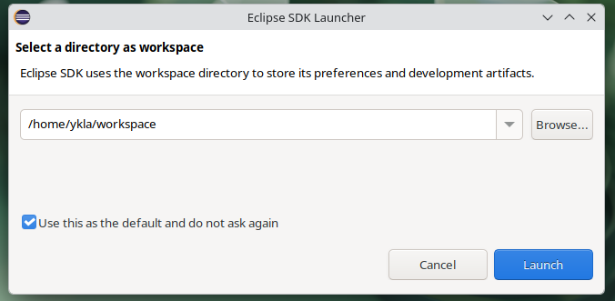
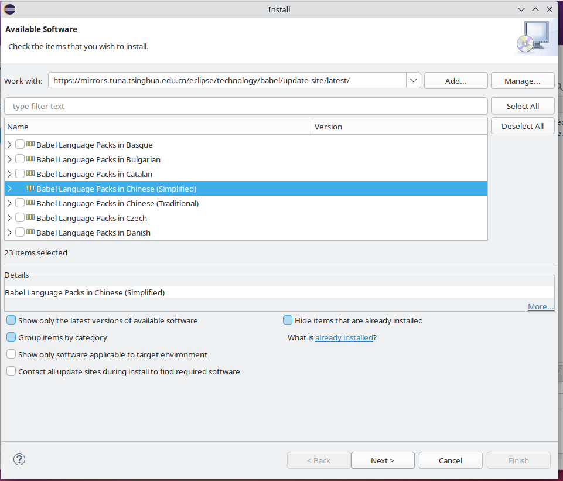
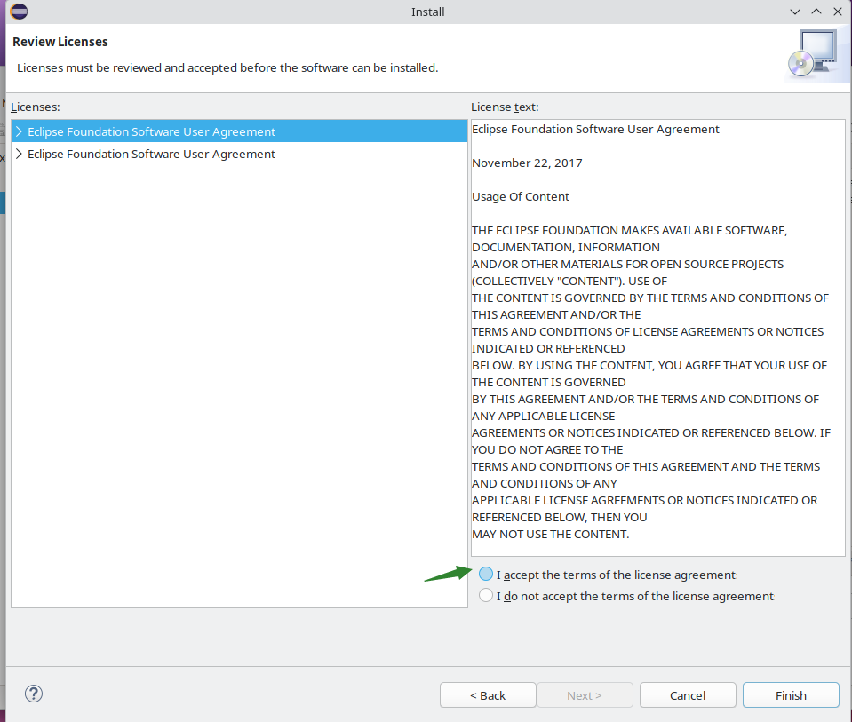
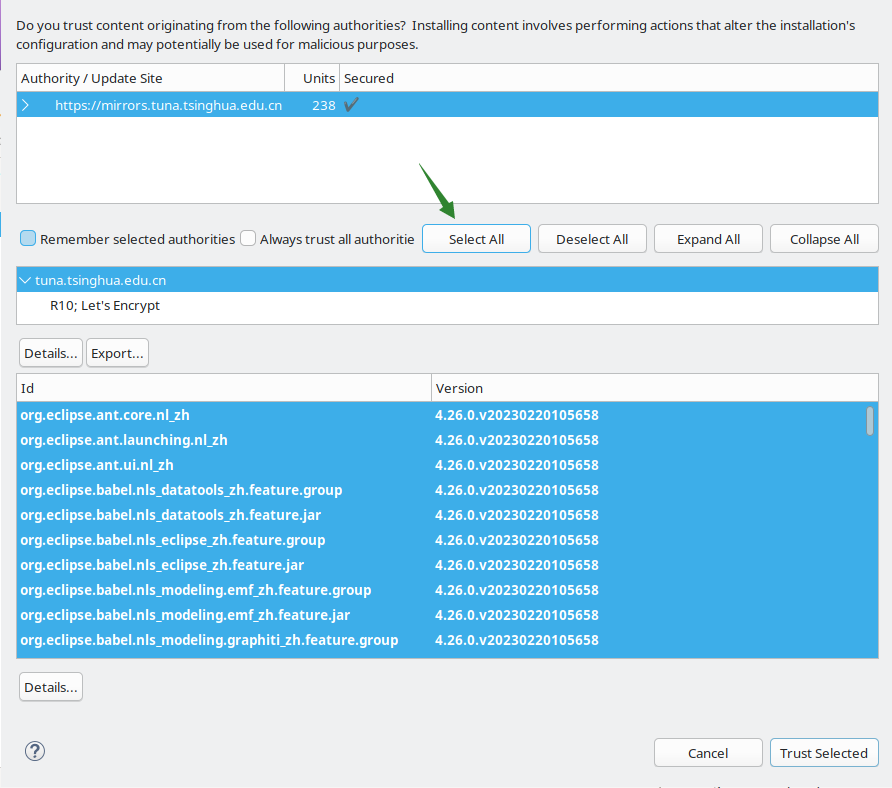
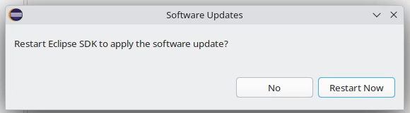
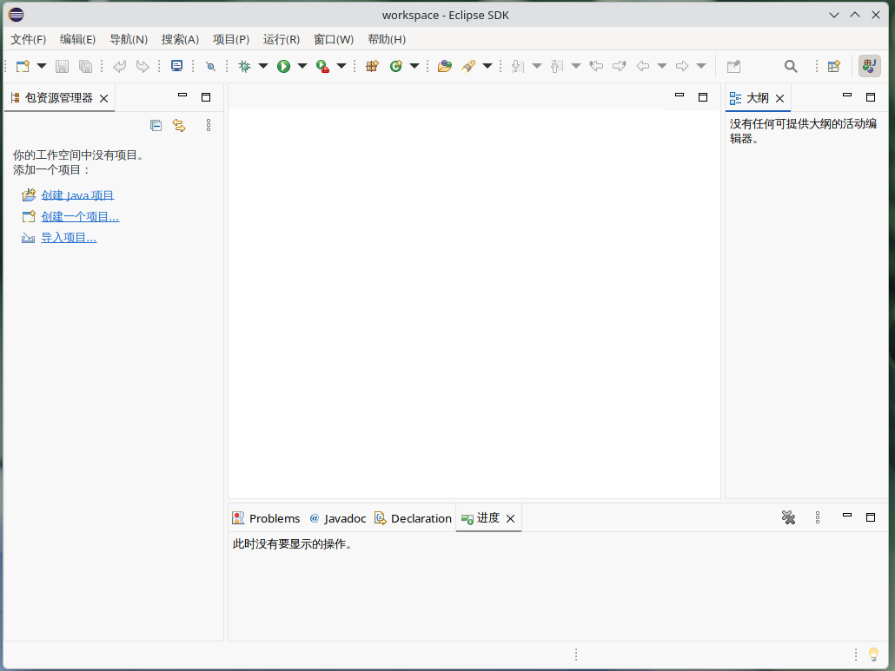
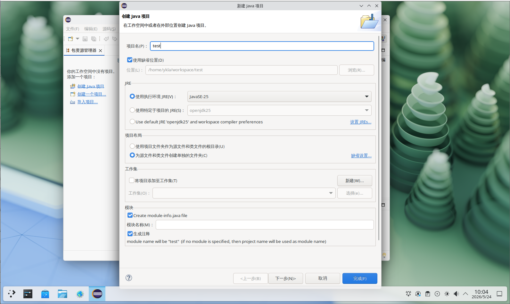
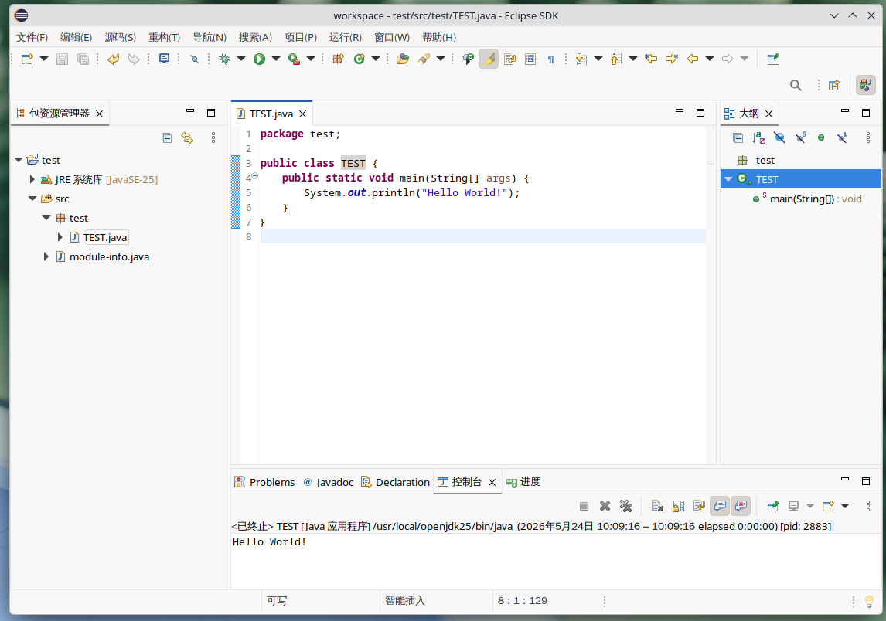
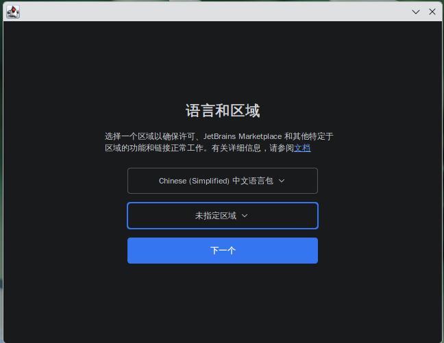
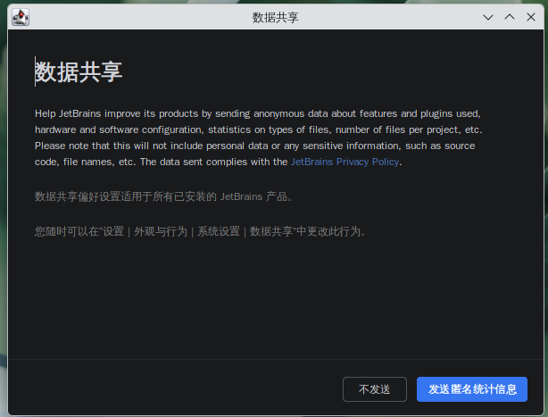

# 21.2 Java Development Environment

FreeBSD Ports controls the default JDK version through `JAVA_DEFAULT` in **Mk/bsd.default-versions.mk**. The current default for AMD64 architecture is OpenJDK 25 (LTS).

The support plan for each Java version can be found at [Oracle Java SE Support Roadmap](https://www.oracle.com/java/technologies/java-se-support-roadmap.html).

## JDK

See: FreeBSD Project. java[EB/OL]. [2026-03-26]. <https://www.freebsd.org/java/>. This is the official FreeBSD Java development environment configuration guide. The default Java version in FreeBSD Ports is controlled by the `JAVA_DEFAULT` variable in the Ports **Mk/bsd.default-versions.mk** file. The current default for AMD64 architecture is OpenJDK 25:

```makefile
# Possible values: 8, 11, 17, 21, 23, 24, 25
.  if ${ARCH:Marmv*} || ${ARCH} == powerpc	# ARMv series and PowerPC architectures use Java 11
JAVA_DEFAULT?=		11
.  elif ${ARCH:Mi386}
JAVA_DEFAULT?=		21	# i386 architecture uses Java 21
.  else
JAVA_DEFAULT?=		25	# Other architectures use Java 25
.  endif
```

## OpenJDK

Search for packages with "jdk" in their name or description:

```sh
# pkg search -o jdk
ykla@ykla:~ $ pkg search -o jdk
java/bootstrap-openjdk11       Java Development Kit 11
java/bootstrap-openjdk17       Java Development Kit 17
java/bootstrap-openjdk8        Java Development Kit 8
java/openjdk11                 Java Development Kit 11
java/openjdk11-jre             Java Runtime Environment 11
java/openjdk17                 Java Development Kit 17
java/openjdk17-jre             Java Runtime Environment 17
java/openjdk21                 Java Development Kit 21
java/openjdk21-jre             Java Runtime Environment 21
java/openjdk24                 Java Development Kit 24
java/openjdk25                 Java Development Kit 25
java/openjdk25                 Java Development Kit (headless version) 25
java/openjdk25                 Java Runtime Environment 25
java/openjdk25                 Java Runtime Environment (headless version) 25
java/openjdk26                 Java Development Kit 26
java/openjdk26                 Java Development Kit (headless version) 26
java/openjdk26                 Java Runtime Environment 26
java/openjdk26                 Java Runtime Environment (headless version) 26
java/openjdk8                  Java Development Kit 8
java/openjdk8-jre              Java Runtime Environment 8
comms/rxtx                     Native interface to serial ports in Java
```

This section uses `java/openjdk25` as an example.

## Installing OpenJDK 25

Install OpenJDK 25 using pkg:

```sh
# pkg install openjdk25
```

Or install using Ports:

```sh
# cd /usr/ports/java/openjdk25
# make install clean
```

Display the version information of the installed Java:

```sh
# java -version
openjdk version "25.0.3" 2026-04-21
OpenJDK Runtime Environment (build 25.0.3+9-freebsd-1)
OpenJDK 64-Bit Server VM (build 25.0.3+9-freebsd-1, mixed mode, sharing)
```

After installation, the `$JAVA_HOME` environment variable has not been configured yet. Use the following command to check its current value:

```sh
# echo $JAVA_HOME

```

Check the OpenJDK 25 installation path:

```sh
# ls /usr/local/openjdk25/
bin	conf	demo	include	jmods	legal	lib	release
```

Related file structure:

```sh
/usr/local/
└── openjdk25/
    ├── bin/ # Java executables
    ├── include/ # C/C++ header files
    ├── lib/ # Java library files
    ├── conf/ # Configuration files
    ├── jmods/ # JMOD module files
    ├── demo/ # Demo programs
    ├── legal/ # License files
    └── release # Release information file
```

## Configuring Environment Variables

### Shell Configuration Files

Please select the appropriate path based on your shell.

```sh
~/
├── .bashrc # Bash configuration file
├── .profile # General configuration file
├── .shrc # FreeBSD default sh configuration file
└── .zshrc # Zsh configuration file
```

Write the following content to the corresponding shell configuration file path:

```ini
export JAVA_HOME="/usr/local/openjdk25"          # Set JAVA_HOME environment variable to the OpenJDK 25 installation path
export PATH=$JAVA_HOME/bin:$PATH                # Add JAVA_HOME/bin to PATH, ensuring the java command is available
```

### Reloading Shell Environment Variables

Reload the `~/.shrc` configuration file (note the leading dot `.` which means source):

```sh
# . ~/.shrc
```

Display the current JAVA_HOME environment variable value:

```sh
# echo $JAVA_HOME
/usr/local/openjdk25
```

Display the current PATH environment variable value (including JAVA_HOME/bin):

```sh
# echo $PATH
/usr/local/openjdk25/bin:/sbin:/bin:/usr/sbin:/usr/bin:/usr/local/sbin:/usr/local/bin:/home/ykla/bin
```

## Eclipse

Eclipse is an open and extensible integrated development environment (IDE) suitable for various development scenarios. It provides the foundational modules and platform for building and running integrated software development tools, supporting tool developers to work independently and integrate with other tools.

### Installing Eclipse

Install using pkg:

```sh
# pkg install eclipse
```

Or install using Ports:

```sh
# cd /usr/ports/java/eclipse
# make install clean
```

### Launching Eclipse

Click the "Eclipse" entry in the menu to launch Eclipse:


Set the default workspace:



### Chinese Language Environment

Click the `Help` menu, then select `Install New Software`.


Uncheck `Contact all update sites during install to find required software`:


Then click `Add`: clear the existing content in `Location` and enter <https://mirrors.tuna.tsinghua.edu.cn/eclipse/technology/babel/update-site/latest/>. Then click `Add`:


Loading:


Check `Babel Language Packs in Chinese (Simplified)`. Click `Next`.



Click `Next`.


Accept the agreement:



It is recommended to click anywhere at the bottom of the interface first, then select all, otherwise the interface may become unresponsive.



Restart to apply changes:





### A Blessing for a Beautiful World

Click "Create Java project", with the project name test.



Right-click to create a new package, then create a new Java class named `TEST`.


Write the following code in the class file:

```java
package test;

public class TEST {
	  public static void main(String[] args) {
		    System.out.println("Hello World!");
		  }
}
```

Click the run button to view the output.



### References

- xxhxs-21. Eclipse usage and configuration comprehensive guide[EB/OL]. [2026-03-26]. <https://www.cnblogs.com/xxhxs-21/articles/16417603.html>. Introduces common configurations and development tips for the Eclipse IDE.
- ittel. Eclipse 2024.03 installation tutorial (with Chinese language setup guide)[EB/OL]. [2026-03-26]. <https://www.ittel.cn/archives/35394.html>. Provides detailed steps for Eclipse IDE installation and Chinese localization.

## IntelliJ IDEA

Starting from 2025.3, IntelliJ IDEA no longer distinguishes between Community Edition and Ultimate Edition, merging into a unified product. The `intellij-ultimate` in FreeBSD Ports is currently version 2025.3, synchronized with upstream.

### Installing IntelliJ IDEA

Install using pkg:

```sh
# pkg install intellij-ultimate
```

Or install using Ports:

```sh
# cd /usr/ports/java/intellij-ultimate
# make install clean
```

## Launching IntelliJ IDEA

Click the "IntelliJ IDEA Ultimate Edition" entry in the menu to launch IntelliJ IDEA:


Set language and region:



Accept the user agreement:


Choose whether to send anonymous usage statistics as needed:



IntelliJ IDEA main interface:


### A Blessing for a Beautiful World

Click "New Project", enter "HelloWorld" in the "Name" field:


The IDE will automatically fill in some code. Click the run button in the top toolbar to run:


You can change the theme in "Settings" → "Theme...":


