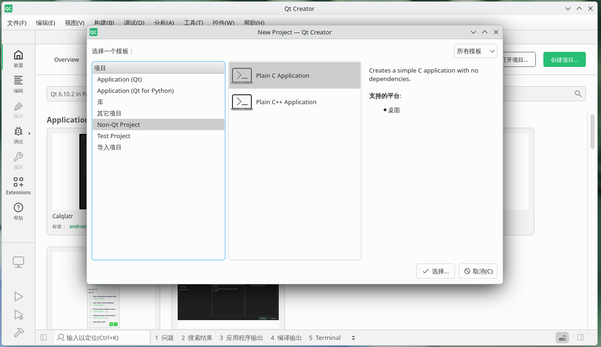
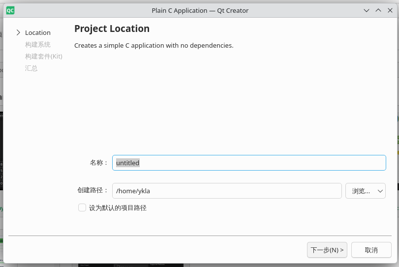
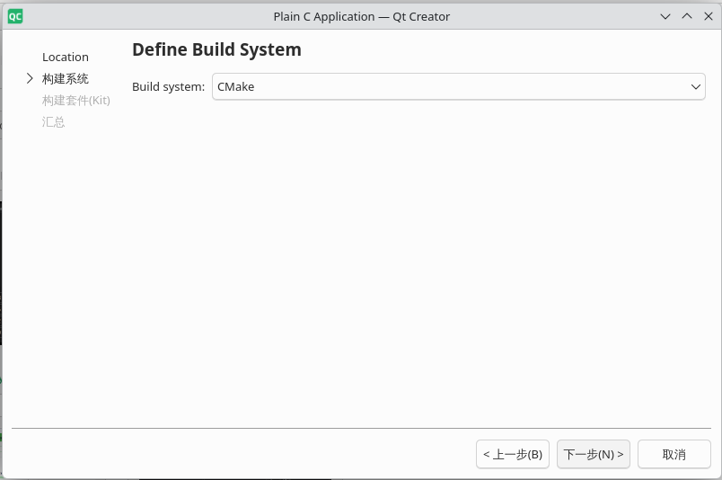
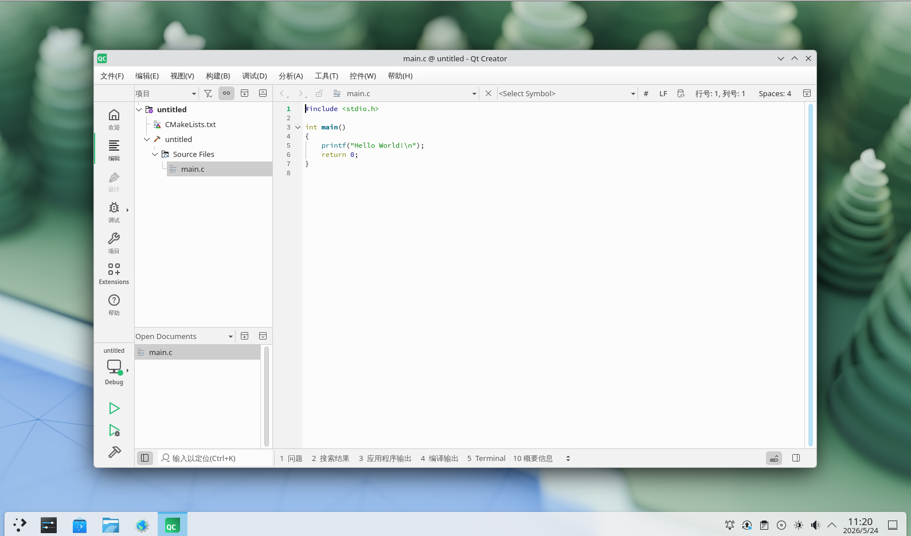

# 21.3 Qt Development Environment

This section installs Qt Creator (devel/qtcreator) and CMake dependencies through Ports to complete the basic configuration of the Qt development environment.

Qt Creator is a cross-platform integrated development environment (IDE) designed specifically for Qt development. Its main features include:

- Code editor supporting C++, QML, and ECMAScript;
- Fast code navigation tools;
- Static code checking and style hints while typing;
- Context-sensitive help;
- Visual debugger;
- Integrated GUI layout and form designer.

## Installing Qt Creator

Install using Ports (using the Qt Creator binary package is not recommended due to potential compatibility and localization issues):

```sh
# cd /usr/ports/devel/qtcreator/
# make install clean # Install Qt Creator itself
```

## Qt Creator Chinese Language Support

### Chinese Interface

Qt Creator's interface language follows the system by default. If the interface language does not change with the system settings, manually set it by selecting `Edit` -> `Preferences` -> `Environment` -> `Interface` -> `Language` from the menu.

The compiler and debugger usually do not require manual configuration.

### Chinese Input in Programs

Programs developed in Qt Creator may not support Chinese input because Qt's input method support relies on a plugin mechanism. Qt integrates with the system input method framework through Platform Input Context plugins. Common plugins include IBus and Fcitx 5.

List the files in the Qt6 Platform Input Context plugin directory:

```sh
# ls /usr/local/lib/qt6/plugins/platforminputcontexts/

```

The following output can be seen:

```sh
libfcitx5platforminputcontextplugin.so   # fcitx 5 input method platform plugin
libibusplatforminputcontextplugin.so     # IBus input method platform plugin
```

Related file structure:

```sh
/usr/local/
└──lib/
     └──qt6/
         └──plugins/
             └──platforminputcontexts/
                  ├── libfcitx5platforminputcontextplugin.so # fcitx 5 input method platform plugin
                  └── libibusplatforminputcontextplugin.so # IBus input method platform plugin
```

These plugins correspond to IBus and Fcitx 5 (Port textproc/fcitx5-qt) respectively. The inability to input Chinese may be due to library version incompatibilities that these plugins depend on.

To resolve the above issues, it is recommended to install Qt Creator by compiling from Ports rather than using the binary package installed via pkg.

### Incomplete Chinese Interface Translation

Readers interested in contributing to Qt translation can refer to the following resources:

- FreeBSD Bugzilla. Bug 236518 - devel/qtcreator unsupported other languages[EB/OL]. [2026-03-26]. <https://bugs.freebsd.org/bugzilla/show_bug.cgi?id=236518>. Documents the multilingual support issue of Qt Creator on FreeBSD.
- Qt Project. Qt Localization[EB/OL]. [2026-03-26]. <https://wiki.qt.io/Qt_Localization>. Official Qt localization work guide and resource summary.
- Qt Project. qttranslations[EB/OL]. [2026-03-26]. <https://invent.kde.org/qt/qt/qttranslations>. Qt framework multilingual translation file repository.

## A Blessing for a Beautiful World (Example Program)

> **Note**
>
> Please install the CMake tool yourself: Port **devel/cmake** and Python PIP Port **devel/py-pip**.

The following are the steps to create and run a Qt application in Qt Creator, for demonstration purposes only.

Click "Create Project":


Select "Non-Qt Project", then choose "Plain C Application".



Set the project path. The "Name" field can be filled in freely. Adjust the "Create in" field as needed. Then click "Next".



Select "CMake" as the build system, then click "Next".



Select the build kit. If it is empty, follow the prompts to check the required software packages for the development environment. Then click "Next".


Configure project management, then click "Finish".


The initial interface is as follows:



Click the green triangle in the left sidebar to run the code, and observe the "Application Output":


## Output in Terminal

Besides graphical interface programs, Qt Creator can also be used for developing command-line programs. For applications that do not require a graphical interface, you can run and view the output directly in a terminal.

Click "Projects" in the left sidebar, select "Desktop" in the "Build & Run" section, and check "Run in terminal" in the "Run Settings".


Click Settings, uncheck "Use Internal terminal" in "Terminal", then click "OK".


The following is an example of output in the terminal:


Chinese character display in the terminal is abnormal and needs to be resolved.
