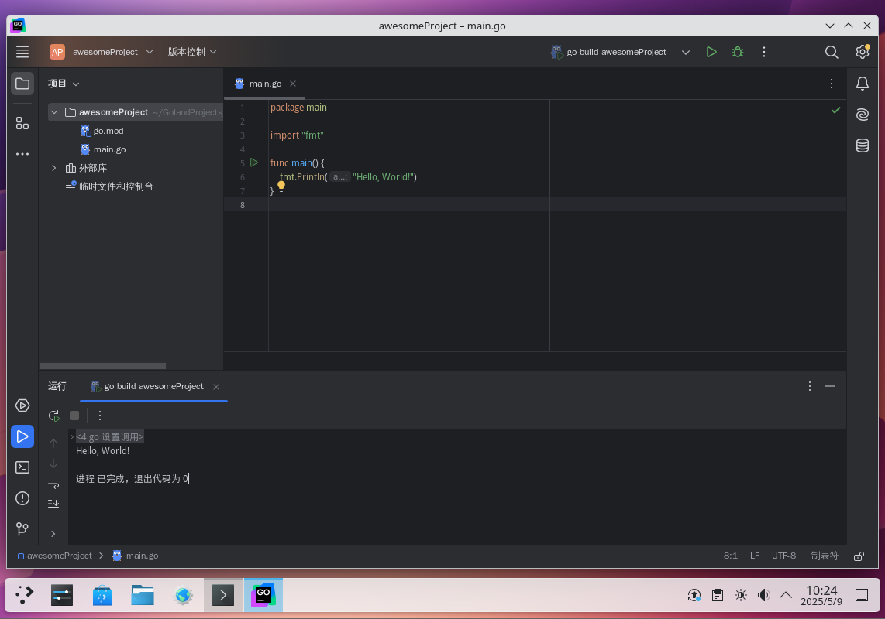

# 21.6 Go Development Environment

The Go language was developed by Google and is a programming language with native concurrency support.

This section configures the Go language development environment on FreeBSD, including toolchain installation and version settings.

## Installing Go

Install using pkg:

```sh
# pkg install go
```

Or install using Ports:

```sh
# cd /usr/ports/lang/go/
# make install clean
```

> **Note**
>
> The Go version number `go1.25.10` in this section is the Ports version at the time of writing. Please adjust according to the latest Go version available in FreeBSD Ports, which can be queried with `pkg search go`.

After successful installation, check the installed Go language version information:

```sh
$ go version
go version go1.25.10 freebsd/amd64
```

## A Blessing for a Beautiful World

Create a new text file `helloWorld.go` and add the following content:

```go
package main // Declare the main package; the program entry package must be main

import "fmt" // Import the fmt package for formatted output

func main() { // Main function, program entry
	fmt.Println("Hello, World!") // Print "Hello, World!" to the console
}
```

After saving, run the following command in the terminal to execute the program:

```sh
$ go run helloWorld.go
Hello, World!
```

## JetBrains GoLand IDE

Install JetBrains GoLand IDE using pkg:

```sh
# pkg install jetbrains-goland
```

Or install using Ports:

```sh
# cd /usr/ports/devel/jetbrains-goland/
# make install clean
```



## References

- Go Project. Effective Go[EB/OL]. [2026-04-17]. <https://go.dev/doc/effective_go>. Official Go language best practices document, introducing idiomatic patterns and concurrency models.
